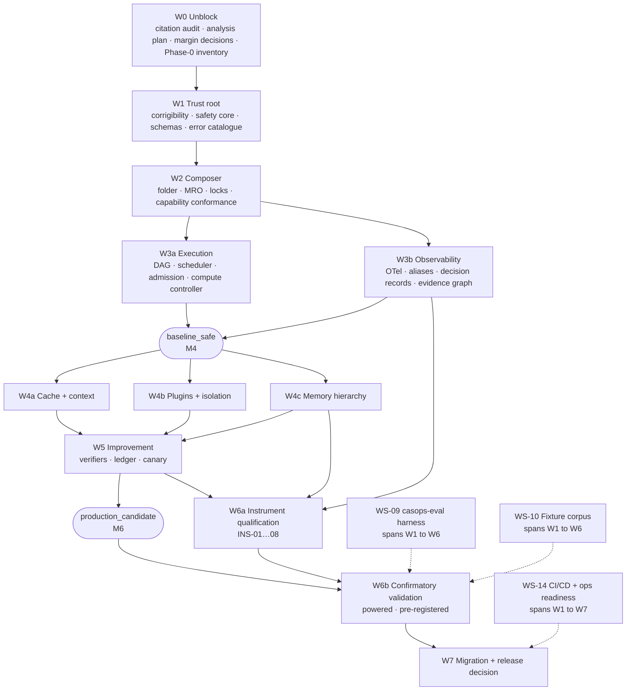

> **Document ID:** `CASOPS-IP-COMMON-AGENT-STRUCTURE-V3A-002`
> **Supersedes:** `CASOPS-IP-COMMON-AGENT-STRUCTURE-V3A-001`
> **Date:** `2026-08-24`
> **Status:** Draft plan — awaiting sign-off on the fourteen open decisions in §24

---

## 0. Document control

| Item | Value |
|---|---|
| Document ID | `CASOPS-IP-COMMON-AGENT-STRUCTURE-V3A-002` |
| Date | `2026-08-24` |
| Status | Draft implementation plan |
| Implements | `common_agent_structure.v3a.md` |
| Source document ID | `CASOPS-FS-COMMON-AGENT-STRUCTURE-V3A` |
| Source canonical path | **`PENDING` — assigned in WP-001** |
| Source content digest | **`PENDING` — assigned in WP-001** |
| Target structure | `casops.common_agent.v3` |
| Target schema | `3.0` |
| Target host | `common-agent-swarm-ops` |
| Public control plane | Existing FastAPI plane only, under `/api/v3/` |
| Implementation status | `NOT_STARTED` |
| Citation-audit status | `BLOCKED` |
| Local-validation status | `NOT_RUN` |
| Deployment recommendation | `NO-GO` until every gate in §27 passes |
| Plan horizon | Release decision, not post-release operation |

**Source identity discrepancy.** The supplied attachment filename and the document's internal title differ. WP-001 assigns one canonical repository path plus a SHA-256 digest before any requirement is transcribed. No implementation may begin against an unidentified source revision.

**Citation-date discipline.** If citation verification completes after **2026-08-24**, the specification must be reissued with a later audit date. Backdating an audit, or representing later verification as complete under the existing cutoff, is prohibited and CI-enforced (§17.6, `CC-05`).

---

## Table of contents

| § | Section |
|---:|---|
| 1 | Executive summary |
| 2 | Merge log: what v2 takes from where |
| 3 | Plan-time verification findings |
| 4 | Seven blocking findings in the specification's gates |
| 5 | Objective, invariants, and scope boundaries |
| 6 | Delivery strategy: four profiles |
| 7 | Target architecture, trust boundaries, persistent state |
| 8 | Program sequencing, dependency graph, critical path |
| 9 | Workstream catalogue and crosswalk |
| 10 | Wave plans with entry and exit gates |
| 11 | Requirements ledger and automated completeness |
| 12 | Instrument qualification program |
| 13 | Statistical engineering plan |
| 14 | Fixture and corpus build-out |
| 15 | Build-versus-adopt decisions |
| 16 | Repository layout and service topology |
| 17 | Cross-cutting implementation rules |
| 18 | Test strategy |
| 19 | CI/CD plan |
| 20 | Environments and compute budget |
| 21 | Operational readiness |
| 22 | Team, independence, and governance |
| 23 | Schedule and milestones |
| 24 | Open decisions requiring sign-off |
| 25 | Risk register |
| 26 | Two-way traceability |
| 27 | Release gates |
| 28 | Definition of done and release checklist |
| 29 | Change control and the v3b change request |
| 30 | Initial execution backlog |

---

# 1. Executive summary

## 1.1 What the specification leaves to be done

v3a is specification-complete and deployment-blocked. Its §21.7 static report resolves to `STATIC_PASS` on seventeen specification domains, `NOT_RUN` on seven implementation domains, and `BLOCKED` on two release items. This program closes the `NOT_RUN` and `BLOCKED` rows and nothing else. It does not extend the architecture.

Two blockers gate release, with radically different shapes:

| Blocker | Nature | Effort | Position |
|---|---|---|---|
| `CIT-GATE-001` / `CIT-GATE-002` | Desk research and audit tooling | ~3 person-weeks | Short, front-loaded, cheap to clear |
| Local validation of §21.5 | Full host implementation plus powered measurement | ~11–14 person-years | Dominates the entire schedule |

The asymmetry drives sequencing. The citation audit clears in Wave 0 because it is cheap and because leaving it open lets unaudited claims leak into design rationale for a year. The local-validation blocker cannot clear until every plane exists, every measurement instrument is itself qualified, and confirmatory runs at powered sample sizes complete.

## 1.2 Shape of the program

Eight waves, sequenced by trust dependency rather than specification section order, each delivering one of four profiles:

```
W0  Unblock  ──► W1  Trust root ──► W2  Composer + capability ──► W3  Execution + observability
                                                          [baseline_safe reached at W3]
                                                                          │
                        ┌─────────────────────────────────────────────────┤
                        ▼                                                 ▼
                   W4  Cache/context, plugins, memory              W5  Improvement
                        └─────────────────┬───────────────────────────────┘
                                          ▼         [production_candidate reached at W5]
                              W6  Instrument qualification + confirmatory validation
                                          ▼
                              W7  Migration + release decision
```

The ordering inverts the document in one important way. v3a presents corrigibility as §15, two-thirds through, but §17.1 step 2 requires invariant attestation *before executable resolution*. Corrigibility is therefore Wave 1 — ahead of the composer, ahead of execution, ahead of everything. Nothing may run before the host can prove the invariant digest matches a reference the agent cannot reach.

## 1.3 Headline findings

Seven gates or planning premises in v3a cannot be satisfied as written. Full detail in §4:

| # | Finding | Consequence if unaddressed |
|---|---|---|
| F1 | Gate A's 1pp non-inferiority margin requires ~10,500 paired tasks, 26× the stated 400 floor | Every efficiency-track release is permanently underpowered, and §21.4.3 forbids calling that a pass |
| F2 | Gate B's 5pp superiority requires ~630 paired tasks, above the 400 floor | Quality-track releases fail their own power requirement |
| F3 | The 400-task floor is internally calibrated to a ~5pp effect, not to the margins the gates actually use | The floor gives false assurance across four gate families |
| F4 | Five gates depend on measurement instruments whose own accuracy is never qualified | `RCA@1 ≥85%`, `unsupported-claim ≤1%`, reward-hacking detectors, monitor verdicts, and claim extraction all gate on unvalidated instruments |
| F5 | "Promotion-induced regression ≤2% over ≥20 promotions" cannot be evaluated before 20 promotions exist | A post-release operational SLO is miscategorized as a pre-release gate |
| F6 | §22.2 step 16 (enable one optional feature at a time, run its gates) multiplies confirmatory cost by the number of optional features | Validation compute grows ~8–10×, and schedule with it |
| F7 | **No runnable host, repository, v2 baseline, or representative v2 agent folder accompanied the specification** | Every downstream estimate is a guess until Phase 0 inventory completes; the baseline-freeze gate has no input |

F1 through F3 share one root cause: `DEF-006` was correctly diagnosed — fixed `n` does not guarantee power — but the fix replaced one fixed number with a floor that is still fixed, and the floors were never reconciled against the margins in §21.5.1. The remedy is to make the analysis plan authoritative over the floors and renegotiate three margins before Wave 0 exits.

F4 is the most consequential finding for build order, and it is a specification *gap* rather than a defect. v3a is rigorous about the statistical validity of comparisons and silent on the metrological validity of the instruments producing the numbers. A claim-grounding verifier with unknown precision cannot certify a ≤1% unsupported-claim rate. §12 closes this.

F7 is new in v2 and is the reason the schedule in §23 carries a mandatory recalibration point at M0.

## 1.4 Sizing

| Dimension | Planning estimate | Confidence | Recalibrated at |
|---|---|---|---|
| Calendar to release decision | 44–52 weeks | Medium | M0 (Phase 0 exit) |
| Peak team | 16–19 FTE | Medium | M0 |
| Total effort | 11–14 person-years | Low–medium | M0, M3 |
| Confirmatory validation compute | ~55k model calls per full suite pass | Low | M1 (analysis plan) |
| Full suite passes budgeted | 6 (2 dry, 3 iteration, 1 confirmatory) | Medium | M7 |
| Fixture corpus at release | ~5,800 fixtures, ~3,300 dual-purpose as instrument qualification data | Low–medium | M1 |

Estimates assume `DEC-03` renegotiates the 1pp margins to 3pp. Retaining 1pp adds 10–14 weeks and roughly triples validation compute. §23.1 reconciles this range against the 32–36 week estimate in the alternate plan.

---

# 2. Merge log: what v2 takes from where

Recorded so that reviewers can see provenance and so nothing is silently dropped.

| Contribution | Source | Why it is retained |
|---|---|---|
| Gate power arithmetic, F1–F3 | `opus` | The single highest-value analytical finding in either plan. Without it, four gate families are permanently uncertifiable and nobody discovers this until week 50 |
| Instrument qualification program, `INS-01…08` | `opus` | Closes a real gap. Five gates otherwise rest on unmeasured instruments |
| Two-tier evaluation, harness-enforced | `opus` | Only mechanism proposed by either plan that bounds F6's cost multiplier |
| Plan-time citation pre-audit, `DEF-002`/`DEF-003` disposition | `opus` | Corrects two defect entries that would otherwise misdirect design for a year |
| Zero-tolerance exact-binomial sizing | `opus` | Converts "zero observed" gates into stated `n` requirements |
| Compute budget with model-call arithmetic | `opus` | Makes the wall-clock constraint visible and reservable |
| Build-versus-adopt table | `opus` | Six deliberate build decisions, everything else adopted |
| Critical path with quantified per-link weeks | `opus` | Identifies the three items deserving disproportionate attention |
| **Requirements ledger with YAML schema + CI completeness checks** | `sol` | The mechanism that makes traceability real rather than aspirational. `opus` asserted traceability; `sol` operationalized it |
| **Error-catalogue 12-field contract** | `sol` | `opus` said "generate the enum." `sol` specified what each entry must contain, including HTTP mapping, redacted external message, and required fixture |
| **Four delivery profiles** | `sol` | Gives every optional feature a defined off-state and a named fallback target. Strengthens the optimizer-kill-switch requirement structurally |
| **Component × trust-boundary architecture table** | `sol` | Makes the trust model reviewable in one page |
| **Persistent-state separation list** | `sol` | Eleven distinct stores with an explicit rule that no agent-writable store holds authoritative policy |
| **Candidate state machine** | `sol` | Removes ambiguity from the improvement lifecycle |
| **Test strategy layers + engineering quality gates** | `sol` | `opus` had exit gates but no test taxonomy |
| **CI/CD pipelines (PR / main / release-candidate)** | `sol` | `opus` had no CI plan at all — a material omission |
| **Environment table with credentials and permitted behavior** | `sol` | Stronger than `opus`'s thinner version; merged in §20 |
| **Dashboards, alerts, backup/recovery, 13 runbooks** | `sol` | `opus` omitted operational readiness entirely |
| **Three-tier definition of done** | `sol` | Task / work-package / program. `opus` had only a release checklist |
| **Independence matrix** | `sol` | Names the seven approvals the implementation owner may not grant alone |
| **Cross-cutting implementation rules** | `sol` | Fail-closed recovery classes, artifact integrity, data isolation, switch registry, CoT handling |
| **Initial 10-day execution backlog** | `sol` | Converts the plan into Monday-morning work |
| **F7: no repository or baseline exists** | `sol` | `opus` implicitly assumed a host to build in. `sol` correctly made discovery a prerequisite. This becomes a first-class finding and a mandatory schedule recalibration point |
| **Reference deterministic adapter specification** | `sol` | Named foundation for all CI and replay testing |
| **Source-filename discrepancy and digest assignment** | `sol` | A real observation with a real remedy |
| **Citation-date non-backdating rule** | `sol` | Sharper phrasing than `opus`'s CI check; both retained |
| Schedule reconciliation, estimand register, waiver register, v3b change-request package, `DEC-12…14` | **new in v2** | Gaps in both source plans |

Dropped from `sol`: the 32–36 week headline (superseded by §23.1's reconciliation), and the flat WP-00…WP-13 numbering (retained as a crosswalk in §9.2 so existing references resolve).

Dropped from `opus`: nothing substantive.

---

# 3. Plan-time verification findings

Plan preparation resolved the four load-bearing disputed identifiers. **This is a pre-audit, not the audit.** It does not produce `citation-audit.json`, does not carry reviewer attestation, and does not discharge `CIT-GATE-001`. It exists to size Wave 0 and to correct two defect entries that would otherwise misdirect design.

| v3a entry | Resolution | Marker change | Action for Wave 0 |
|---|---|---|---|
| `arXiv:2608.14624` — *Learning Agent Execution for KV-Cache Management in Agentic Serving* | Resolves. Title matches v3a §25.1 exactly. Submitted 16 Jul 2026. Nine authors incl. Junchen Jiang, Liting Hu | `[D]` → candidate `[A]` | Close `DEF-002`. Record that the erroneous element was v2's "CacheScout" label and month, both already removed |
| `arXiv:2608.17528` — *Agent Lightning v1.0: Towards Harnessed Agentic RL* | Resolves. Microsoft / Fudan / Zhejiang / Edinburgh, submitted 18 Aug 2026. Paper text carries 41.8% → 56.4% on SWE-bench Verified, +14.6 absolute, Qwen3.5-9B, 6K SWE-smith samples | `[D]` / withdrawn → candidate `[A]` **with constraint** | Restore the citation. Re-enter the numeric claim **only** in §21.8 as `MEASURED_EXTERNAL`, E3. Do not restore it to any requirement rationale |
| `arXiv:2508.03680` — *Agent Lightning: Train ANY AI Agents with Reinforcement Learning* | Resolves, and is cited *by* 2608.17528 as prior work | `[C]` → candidate `[A]` | Record that v2 of the spec conflated two distinct papers. This is the actual root cause of `DEF-003` |
| GenAI semantic-convention stability | External commentary as of 2026 reports no stable `gen_ai.*` attributes | Corroborates `DEF-001` | Raise the §9.4 alias layer from "protective" to **load-bearing** in all design docs. See `WP-322` |

Two secondary observations carried into design:

**The Agent Lightning result contains its own counter-evidence.** Coverage of the release reports 56.4% on SWE-bench Verified against roughly 2.5% on the Remote Labor Index. That gap is a live illustration of why v3a §12.11 forbids satisfying a memory gate on a public benchmark score alone, and why §21.5.5 mandates domain golden tasks. Cite this contrast in the §14.2 corpus design rationale — it is the cleanest available argument for the contamination and golden-task requirements.

**Execution/training separation survives independent of the citation.** v3a §13.8 requires that gradient updates not execute in the serving process. `DEF-003` withdrew the numeric support but retained the control "on operational grounds." That retention was correct and is now additionally supported: Agent Lightning v1.0's stated design point is training *through* the production harness while leaving agent code untouched — the same separation expressed from the training side.

### 3.1 Wave 0 residual

Unresolved at plan time: five memory surveys, two self-evolving-agent surveys, two serving papers (`2605.27744`, `2607.20495`), the MCP revision list including the `2026-07-28` pin, and the full `[C]` and `[K]` inventories — roughly 55 entries. At the observed resolution rate of four entries per hour including transcription into audit records, Wave 0's audit is **2.5–3 person-weeks including reviewer sign-off**. This is the cheapest blocker in the program and must not slip.

---

# 4. Seven blocking findings in the specification's gates

Each item states the defect, the arithmetic, and the required decision. All seven are dispositioned in Wave 0. None requires architectural change.

## 4.1 F1 — Gate A's non-inferiority margin is unsatisfiable at the stated floor

§21.5.1 Gate A requires "task success is non-inferior within 1pp." §21.4.3 sets the binary floor at 400 paired tasks and requires 90% power for release-critical gates.

For paired binary non-inferiority on a risk difference, with `p_d` the discordant-pair probability:

```
n_pairs  ≈  (z₁₋α + z₁₋β)² · p_d / δ²
```

At α = 0.025 one-sided, power = 0.90, `p_d` = 0.10, δ = 0.01:

```
n  ≈  (1.960 + 1.282)² × 0.10 / 0.0001  ≈  10.51 × 0.10 / 0.0001  ≈  10,508 pairs
```

The floor is 400. The requirement is ~10,500 — a 26× gap. §21.4.3's closing sentence, *"an underpowered result is not a pass, even if its point estimate exceeds the threshold,"* converts this from a sizing nuisance into a permanent release blocker for the entire efficiency track.

Sensitivity:

| δ (NI margin) | `p_d` = 0.05 | `p_d` = 0.10 | `p_d` = 0.15 |
|---:|---:|---:|---:|
| 1pp | 5,254 | 10,508 | 15,762 |
| 2pp | 1,314 | 2,627 | 3,941 |
| 3pp | 584 | 1,167 | 1,751 |
| 5pp | 211 | 420 | 631 |

**Required decision (`DEC-03`).** Widen Gate A's margin to 3pp (~1,167 pairs, tractable); retain 1pp and budget ~10,500 paired tasks with the schedule and compute consequences; or split into a powered 3pp gate plus a 1pp monitoring metric explicitly labelled indicative. Plan default: **3pp with 1pp retained as indicative**.

## 4.2 F2 — Gate B's superiority requirement also exceeds the floor

Gate B requires "task success improves ≥5pp with superiority CI excluding zero." Paired superiority at δ = 0.05, α = 0.025 one-sided, power 0.90, `p_d` = 0.15 gives ~631 pairs. The floor is 400. Gate B is underpowered by ~1.6× at its own stated effect size whenever discordance exceeds ~0.095.

**Required decision (`DEC-04`).** Raise the binary floor to 650, or make the analysis plan's computed `n` strictly authoritative and demote the floor to a sanity minimum. Recommendation: the latter, which also resolves F3.

## 4.3 F3 — The 400 floor is calibrated to a margin no gate uses

Reading §4.1's table backwards: 400 pairs at `p_d` = 0.10 corresponds to a detectable δ of ~5.1pp. The floor was evidently calibrated to a 5pp effect. But the gates consuming it use 1pp (Gate A quality preservation), 3pp (context rot), 1pp (stopping-rule success preservation), and 2pp (staleness). Only Gate B's 5pp matches.

This is the residue of `DEF-006`: the diagnosis was right, the remedy half-applied.

**Required change.** In `evals/analysis_plan.json`, floors become advisory lower bounds. `n_final = powered_n`, computed per gate from that gate's own margin, with a hard error if `powered_n < floor`. The harness must refuse to emit a `pass` verdict when `n_observed < n_required` and must emit `IMP_STAT_UNDERPOWERED` instead. This is among the first behaviours built in `casops-eval`, because it structurally prevents the whole class of error.

## 4.4 F4 — Five gates depend on unqualified measurement instruments

v3a rigorously governs comparisons but never validates the instruments producing the measurements:

| Gate | Instrument | Unstated dependency |
|---|---|---|
| `unsupported_claim_rate ≤1%` (§21.5.3) | Claim extractor + `constraint_grounding_v2` | Extractor recall determines the denominator; verifier precision determines the numerator. Both unknown |
| `RCA@1 ≥85%` (§21.5.3) | Failure classifier | Requires labelled single-fault ground truth; label quality is the ceiling on measurable accuracy |
| Reward-hacking detectors (§13.6, §21.5.6) | Six detectors | A detector with unknown false-negative rate cannot support "passes all detectors" |
| Reasoning-monitor verdicts (§10.3) | Monitor model | Verdicts may block execution (FR-OBS-105); a miscalibrated monitor silently degrades availability |
| `MPR ≥95%` (§21.5.5) | Poisoning-success oracle | Requires an operational definition of "successful poisoning" independent of the detector under test |

A gate is only as trustworthy as its instrument. Certifying ≤1% unsupported claims with an extractor of unmeasured recall is measurement theatre.

**Required addition.** §12 defines an instrument qualification program: every gate-bearing instrument gets a labelled qualification set, reported precision/recall or calibration, and a qualification threshold that must clear *before* the instrument may gate. Instruments are versioned in the compose lock alongside models and tokenizers. Net-new scope of ~1.5 person-years, on the critical path into Wave 6.

## 4.5 F5 — One improvement gate is not a pre-release gate

§21.5.6: *"Promotion-induced regression rate must be at most 2% over a rolling window of at least 20 promotions."* At release there have been zero promotions. The metric is undefined, and 2% of 20 is 0.4 — the gate is effectively "zero regressions in 20 promotions," measurable only after roughly a year of operation.

**Required change (`DEC-05`).** Reclassify as post-release operational SLO `SLO-IMP-01`, with an explicit release-time substitute: rollback RTO verified on ≥5 synthetic promotions in the canary simulator, plus zero successful self-promotions across the negative fixture suite. Move it out of §21.5.6's release list in the v3b editorial pass.

## 4.6 F6 — Sequential feature enablement multiplies confirmatory cost

§22.2 steps 16–17: *"Enable one optional v3 feature at a time. Run its gates."* Optional features number at least ten: T0/T1/T2/T3 cache tiers, compaction, adaptive compute, speculation, learned routing, consolidation, paged memory hierarchy. Running powered gates per feature multiplies confirmatory cost by ~10.

**Required change (`DEC-07`).** Two-tier evaluation, formalized in §13.4. A *screening* tier (n = 100–150, labelled `INDICATIVE`, never admissible to a release report, structurally barred by the harness from emitting `pass`) governs per-feature enablement during migration. A *confirmatory* tier (powered, pre-registered, group-sequential where applicable) runs on release candidates only. The harness must make the two physically distinguishable in the report schema so that `VAL_PLAN_DRIFT`-style substitution cannot occur by accident.

## 4.7 F7 — No repository, host, baseline, or reference v2 agent exists (new in v2)

The specification arrived without a runnable host, a repository, a v2 implementation, a frozen v2 baseline, or representative v2 agent folders. Four consequences:

1. **Repository bootstrap is program work, not setup.** WP-001 through WP-008 must produce a canonical source digest, a skeleton, and an inventory of whatever v1/v2 host code exists.
2. **The baseline-freeze gate has no input.** §21.4.1's twenty-item freeze list presupposes a v2 system to freeze. Until one is identified and pinned, Gate A and Gate B have no comparator and `WP-601` cannot start.
3. **Migration work packages have no subject.** `WP-701`'s "reference v2 agent" must be nominated and version-pinned in Phase 0.
4. **Every estimate in §23 is provisional.** The schedule therefore carries a mandatory recalibration at M0.

**Required change (`DEC-12`).** Nominate the v2 implementation and at least three representative v2 agent folders — one single-parent, one diamond-inheritance, one with plugins — as Phase 0 exit criteria. If no v2 baseline can be produced, `DEC-13` selects the fallback comparator and the release path degrades from "powered v2 comparison" to a documented alternative that must be approved by the statistical reviewer before any implementation begins.

---

# 5. Objective, invariants, and scope boundaries

## 5.1 Objective

Implement a production-capable host and toolchain for the v3a common-agent structure while preserving eleven invariants:

| # | Invariant |
|---:|---|
| 1 | One agent folder corresponds to one `agent_id` |
| 2 | Safety and corrigibility are mandatory and non-bypassable |
| 3 | Tools, executable plugins, credentials, approvals, and permissions never inherit |
| 4 | Production behavior binds only to verified capabilities |
| 5 | Optional optimizers fail back to validated baseline behavior |
| 6 | Mandatory-control failure invokes containment stop |
| 7 | Persistent memory remains scoped, typed, taint-aware, versioned, and deletable |
| 8 | Self-improvement generates candidates but cannot approve or promote them |
| 9 | Every material output and decision has operational provenance |
| 10 | Production claims are supported by powered, pre-registered local validation |
| 11 | Release remains blocked until the citation audit and local validation complete |

## 5.2 In scope

- All normative requirements, invariants, APIs, error codes, gates, and data models in the source specification.
- Reference implementations for every required interface.
- Explicit disabled configurations for every optional feature.
- At least one deterministic local adapter suitable for CI (§18.3).
- Production integration points for model, tool, protocol, telemetry, memory, plugin, and artifact backends.
- Verification of every enabled production capability.
- **Instrument qualification for every gate-bearing measurement instrument** (§12) — net-new relative to v3a.

## 5.3 Out of scope

| Item | v3a status | Plan disposition |
|---|---|---|
| Granting production activation | Human-gated | This plan produces a recommendation, never an activation |
| Third-party model endpoints or credentials | External | Supplied by the host operator |
| Fabricating or restoring withdrawn numeric claims | Prohibited | `DEF-003`'s claim re-enters only as `MEASURED_EXTERNAL` |
| L5 core self-modification | Research-only (§13.9) | Out of scope. No environment provisioned, no production credential path |
| L4 model-adapter training | Separate trainer (§13.1) | Interface and trajectory export only. No trainer in scope |
| T3 approximate semantic cache | Off by default (§8.2) | Build the tier interface and the false-reuse harness; ship disabled. Do not gate release on it |
| Second public control plane | Prohibited (§1.3) | All operator surface extends the existing FastAPI plane under `/api/v3/` |
| Batch-invariant kernels | Capability-gated (§21.4.5) | Build the probe. Do not commit to achieving it. Token-level replay stays out of scope unless the probe passes |
| Model-weight unlearning claims | Prohibited | Memory deletion records a weight-level limitation; it never claims unlearning |
| Unrestricted network access | Prohibited | Allow-listed egress only, per isolation tier |
| Raw chain-of-thought export | Prohibited | §17.5 |

## 5.4 Planning assumptions

| # | Assumption | Falsified if | Consequence |
|---:|---|---|---|
| A1 | No runnable repository or host accompanied the source | A host is discovered in Phase 0 | Reduce Phase 0; recalibrate favourably |
| A2 | FastAPI is the only public control plane | Another plane is required | Specification change request; not a plan decision |
| A3 | Production dependencies are pinnable before release | A dependency cannot be pinned | Capability cannot be `VERIFIED`; feature ships disabled |
| A4 | A v2 implementation and ≥3 representative v2 folders can be supplied | None available | `DEC-13` fallback comparator; statistical reviewer approval required |
| A5 | Three-squad model (16–19 FTE peak) | Smaller team | Critical path extends roughly linearly in the serial links of §8.2 |
| A6 | All agent-visible authority is narrow capability handles, never ambient credentials | Ambient credential found | P0 defect; blocks G2 |
| A7 | `p_d` ≈ 0.10 for paired binary gates | Pilot shows higher discordance | `n` scales linearly in `p_d`; re-power at M1 |
| A8 | `baseline_safe` is achievable with deterministic adapter, no memory, no plugins, fixed compute, T0 cache | Any mandatory control needs an optional feature | Architectural defect; escalate |

---

# 6. Delivery strategy: four profiles

Every optional feature must have a defined off-state and a named fallback target. Profiles provide both.

| Profile | Purpose | Default features | Reached at |
|---|---|---|---|
| `baseline_safe` | First secure vertical slice and universal fallback | Deterministic adapter, fixed compute, T0 cache only, no persistent memory, no executable plugins, improvement disabled, mandatory safety + corrigibility + audit | **W3 / M4** |
| `production_candidate` | Full production-capable host | Verified adapters, T0–T2 cache, context lifecycle, governed memory, sandboxed plugins I0–I3, propose-only improvement | **W5 / M6** |
| `experimental` | Features requiring additional evidence or dedicated gates | T3 semantic cache, learned routing, adaptive refinement, advanced consolidation, L4 trainer artifacts | Screening tier only; never in a release dossier |
| `research_only` | Isolated research | L5 core self-modification | No production credentials, no activation path, no shared storage |

**Profile rules.**

| ID | Rule |
|---|---|
| `PR-01` | No optional profile may weaken `baseline_safe`. |
| `PR-02` | Every optional component returns to `baseline_safe` semantics through a tested optimizer kill switch (`WP-308`). |
| `PR-03` | A feature may be promoted `experimental` → `production_candidate` only after its confirmatory gates pass at powered `n`. |
| `PR-04` | `research_only` shares no storage, credential, or network path with any other profile. |
| `PR-05` | The active profile is recorded in `compose.lock.json` and in every telemetry root span. |

`PR-02` is the structural form of v3a's kill-switch requirement: a profile with no named fallback target cannot satisfy it, which makes the requirement checkable at compose time rather than only at test time.

---

# 7. Target architecture, trust boundaries, persistent state

## 7.1 Components and trust boundaries

| Component | Responsibility | Trust boundary |
|---|---|---|
| Schema registry | Own JSON Schemas and generated models | Reject unknown or incompatible structures |
| Agent registry | Resolve agent IDs and folder locations | Read-only source registration |
| Composer | Resolve MRO, merge legal surfaces, run checks, create locks | No unverified extension execution |
| **Corrigibility authority** | Store and attest immutable invariants | **Host-owned and agent-unwritable; separately deployed** |
| Authorization broker | Issue narrow, expiring capability handles | No ambient authority anywhere |
| Safety engine | Taint, injection, hijack, exfiltration, effect controls | Mandatory and non-bypassable |
| Capability service | Assertions, conformance, status, drift | Production binds only to `VERIFIED` |
| Runtime coordinator | Run lifecycle, deadlines, budgets, artifact sealing | Cannot modify source definitions |
| DAG scheduler | Dependency execution, concurrency, cancellation, compensation | Side-effect ordering enforced |
| Router + compute controller | Route and compute allocation | Decisions logged and bounded |
| Cache manager | Scoped T0–T3 lifecycle | No cross-boundary reuse |
| Context manager | Segmentation, compaction, offload, re-grounding | Pinned invariants cannot be compacted |
| Plugin manager | Manifest, integrity, isolation, lifecycle | No code execution during validation |
| Memory service | Typed stores, retrieval, trust, deletion, consolidation | Tenant and subject isolation |
| Observability service | Traces, decisions, evidence, sampling, replay, RCA | Append-only audit path |
| Improvement controller | Candidate creation, evaluation, canary, rollback | **Cannot approve or promote** |
| **Instrument registry** | Version and qualification status for `INS-01…08` | **Host-owned; qualification records immutable** |
| Evaluation harness | Fixtures, power, execution, statistics, reports | Analysis plan frozen before runs |
| FastAPI control plane | Operator and host APIs | Actor-aware authorization and auditing |

The instrument registry is net-new and exists because §12's qualification records must be as tamper-resistant as approvals: an instrument whose qualification status is agent-writable is not qualified.

## 7.2 Persistent state separation

The implementation must keep these distinct, with independent access control:

| # | Store | Agent-writable? |
|---:|---|---|
| 1 | Source agent folders | No — read-only reference |
| 2 | Generated immutable locks | No |
| 3 | Content-addressed artifacts | Append-only |
| 4 | Operational run metadata | Host-written |
| 5 | Append-only audit ledger | No |
| 6 | Append-only improvement ledger | Propose-only entries; promotion boundaries host-only |
| 7 | Telemetry and encrypted local spool | No |
| 8 | Cache entries | Host-managed, disposable |
| 9 | Memory records and derived-dependency indexes | Scoped candidate writes only |
| 10 | Held-out evaluation data | **No — cryptographically isolated** |
| 11 | Host-owned approvals and signatures | **No** |
| 12 | Host-owned corrigibility invariants | **No** |
| 13 | **Instrument qualification records** | **No** |

**Rule.** No agent-writable store may contain the authoritative version of permissions, safety policy, termination policy, gate thresholds, held-out data, approvals, invariant definitions, or instrument qualification status.

---

# 8. Program sequencing, dependency graph, critical path

## 8.1 Dependency graph



## 8.2 Critical path

```
W0 Phase-0 inventory + analysis plan (4w)
  → W1 corrigibility attestation mechanism (5w)
    → W2 composer + capability conformance (8w)
      → W3b observability + evidence graph (10w)
        → W4c memory hierarchy + deletion probes (12w)
          → W6a instrument qualification (6w)
            → W6b confirmatory validation (7w)
              → W7 migration + release decision (3w)
                                        ≈ 55 weeks serial
```

Overlap between W3b/W4c and between W6a/W6b compresses this to **44–52 weeks**. Three items sit on the critical path and warrant disproportionate attention:

1. **Corrigibility attestation** (W1). Everything blocks on it because §17.1 puts it at step 2. Architecturally subtle — see `DEC-01`.
2. **Memory deletion verification** (W4c). `DCR = 100%` by post-deletion probe across eight derived paths is the single most demanding correctness requirement in the specification.
3. **Instrument qualification** (W6a). Net-new scope from F4, and it *gates* the confirmatory run rather than running alongside it.

## 8.3 Wave-to-phase-to-milestone crosswalk

| Wave | Weeks | Phase | Milestone | Profile reached | Release gate |
|---|---:|---|---|---|---|
| W0 | 1–4 | Phase 0–1 | M0 Program ready · M1 Analysis plan frozen | — | G0 |
| W1 | 4–12 | Phase 2 | M2 Trust root complete | — | G1 |
| W2 | 10–20 | Phase 2–3 | M3 Composer + capability verification | — | G1 (cont.) |
| W3 | 18–32 | Phase 3–4 | M4 Execution + observability | `baseline_safe` | G2 |
| W4 | 28–44 | Phase 5 | M5 Cache/context, plugins, memory | — | G3 |
| W5 | 38–48 | Phase 5 | M6 Improvement plane | `production_candidate` | G3 (cont.) |
| W6a | 42–48 | Phase 6 | M7 Instruments qualified | — | **G4** |
| W6b | 48–52 | Phase 6 | M8 Confirmatory validation complete | — | G5 |
| W7 | 50–54 | Phase 7 | M9 Release decision | — | G6, G7 |

---

# 9. Workstream catalogue and crosswalk

## 9.1 Workstreams

Fourteen workstreams. Each has one accountable owner, explicit FR coverage, and exit criteria phrased as verifiable artifacts.

| WS | Name | Owner | FR / § coverage | Primary exit artifact |
|---|---|---|---|---|
| WS-00 | Program, change control, plan integrity | Program lead | §19, §23, §26, `CIT-GATE-002` | Signed decision log; requirements ledger; no future-dated artifacts |
| WS-01 | Citation audit and evidence governance | Research auditor | §2, §25, `CIT-GATE-001/002` | `citation-audit.json`, zero non-`[A]` markers |
| WS-02 | Corrigibility and trust root | Security architect | §15, INV-01–12, FR-COR-001–006 | Host-owned invariant service + 12 negative fixtures |
| WS-03 | Safety plane | Safety engineering lead | §14, FR-SAF-001–012 | Taint engine, termination guards, incident pipeline |
| WS-04 | Composer, inheritance, locks, contracts | Platform lead | §5, §6, §16, §17.1, §18, §20, FR-INH-301 | `compose.lock.json` generator, MRO resolver, error catalogue |
| WS-05 | Compatibility and capability verification | Integrations lead | §9, FR-CMP-001–121 | `compatibility-matrix.lock.json`, conformance runner |
| WS-06 | Execution plane | Runtime lead | §7, FR-PERF-001–110 | DAG compiler, scheduler, admission, compute controller |
| WS-07 | Cache and context lifecycle | Runtime lead | §8, FR-CACHE-001–009, FR-CTX-001–007 | Tiered cache, compaction with preservation verifier |
| WS-08 | Observability and provenance | Observability lead | §10, FR-OBS-101–115 | OTel pipeline, `casops.*` alias map, evidence graph |
| WS-09 | Validation harness `casops-eval` | Eval engineering lead | §21.3, §21.4 | CLI, dual report schemas, statistics engine |
| WS-10 | Fixture and corpus build-out | QA lead | §21.3, §14 of this plan | ~40 fixture families, 12 negative invariants |
| WS-11 | Plugins, isolation, supply chain | Security architect | §11, FR-PLG-001–118 | I0–I3 runtimes, SBOM/provenance pipeline |
| WS-12 | Memory | Memory lead | §12, FR-MEM-101–120 | Paged hierarchy, trust tiers, deletion probes |
| WS-13 | Improvement plane | ML systems lead | §13, FR-IMP-101–111 | Candidate pipeline, verifiers, immutable ledger |
| **WS-14** | **CI/CD, environments, operational readiness** | **SRE lead** | §19, §21, §22, §§19–21 of this plan | **Pipelines, dashboards, alerts, 13 runbooks, rollback drill** |

WS-14 is new in v2 and closes the largest omission in the v1 plan.

Instrument qualification (§12) is jointly owned by WS-08, WS-12, and WS-13 and coordinated by WS-09: each instrument belongs to the plane that produces it, but all must satisfy one qualification standard.

## 9.2 Crosswalk to the alternate plan's work packages

Retained so existing references resolve.

| Alternate `WP` | This plan's WS | Notes |
|---|---|---|
| WP-00 Program bootstrap and governance | WS-00 | Absorbs the ADR backlog and Phase 0 inventory |
| WP-01 Contracts, schemas, errors, artifacts | WS-04 | Error-catalogue field contract adopted verbatim (§11.3) |
| WP-02 Corrigibility, authorization, control ownership | WS-02 | Actor classes and switch registry adopted (§17.4) |
| WP-03 Composer, inheritance, skills, identity | WS-04 | |
| WP-04 Compatibility, capability verification, protocols | WS-05 | |
| WP-05 Observability, evidence, audit, replay, RCA | WS-08 | |
| WP-06 Execution runtime and safety plane | WS-06 + WS-03 | Split, because safety is Wave 1 and execution is Wave 3 |
| WP-07 Cache and context lifecycle | WS-07 | |
| WP-08 Plugin architecture and sandboxing | WS-11 | |
| WP-09 Long-term memory | WS-12 | |
| WP-10 Autonomous improvement | WS-13 | Candidate state machine adopted (§10.5) |
| WP-11 FastAPI operator and host APIs | WS-04 | Route groups adopted |
| WP-12 Evaluation harness, statistics, citation audit | WS-09 + WS-01 | Split, because the audit is Wave 0 and the harness spans W1–W6 |
| WP-13 Migration, documentation, operations, release | WS-14 | Runbook list adopted (§21.4) |

---

# 10. Wave plans with entry and exit gates

## Wave 0 — Unblock (weeks 1–4)

**Objective.** Clear the cheap blocker, fix the arithmetic, discover the ground truth, and freeze the measurement contract before any code is written.

| WP | Work | Owner | Exit criterion |
|---|---|---|---|
| WP-001 | Assign canonical source path + SHA-256 digest; record the filename/title discrepancy | WS-00 | One authoritative source revision; no implementation against ambiguity |
| WP-002 | Resolve all ~55 residual references against live sources | WS-01 | `citation-audit.json` committed; every entry `accepted` or deleted |
| WP-003 | Close `DEF-002`; restore `DEF-003` citation with `MEASURED_EXTERNAL` constraint | WS-01 | Defect register updated; numeric claim confined to §21.8 |
| WP-004 | Delete unresolvable references; re-justify or remove dependent requirements | WS-01 | No requirement rests solely on a deleted reference |
| WP-005 | **Phase 0 inventory: existing v1/v2 host code, folders, APIs, tests, baselines** | WS-00 | F7 dispositioned; `DEC-12`/`DEC-13` resolved; estimate recalibrated |
| WP-006 | Generate `requirements/requirements.yaml` and initial traceability | WS-00 | Every normative requirement represented; zero P0 ownership gaps |
| WP-007 | Compute prospective power for every inferential gate | WS-09 | Power table with assumptions, method, sensitivity per gate |
| WP-008 | Disposition F1–F7; renegotiate three margins | WS-00 + WS-09 | Signed decisions `DEC-02`…`DEC-05`, `DEC-12`, `DEC-13` |
| WP-009 | Author `evals/analysis_plan.json` v1 and pre-register | WS-09 | Plan digest recorded; estimands declared per gate (§13.6) |
| WP-010 | Select group-sequential design for canary monitoring | WS-09 | Looks, spacing, alpha-spending function fixed |
| WP-011 | Establish plan-integrity controls | WS-00 | CI check rejecting any artifact dated after the audit date |
| WP-012 | Open all P0 ADRs (§10.1a); nominate independent reviewers | WS-00 | No P0 ADR blocks Wave 1; four independence roles named |
| WP-013 | Repository and package skeleton; branch protection; signing policy | WS-14 | Skeleton per §16; PR pipeline green on an empty tree |

### 10.1a Required P0 architecture decision records

| ADR | Decision |
|---|---|
| ADR-001 | Runtime language and package boundaries |
| ADR-002 | Canonical JSON serialization and digest generation |
| ADR-003 | Operational, audit, artifact, and memory storage |
| ADR-004 | Signature and key-management model |
| ADR-005 | Plugin I1–I3 sandbox technologies |
| ADR-006 | Authentication and capability-handle model |
| ADR-007 | Scheduler and cancellation architecture |
| ADR-008 | Telemetry collector and encrypted spool |
| ADR-009 | Memory indexing and deletion architecture |
| ADR-010 | Statistical implementation and independent verification |
| ADR-011 | Model/tool/protocol adapter lifecycle |
| **ADR-012** | **Corrigibility invariant storage mechanism (`DEC-01`)** |
| **ADR-013** | **Instrument qualification data governance (`DEC-06`)** |

**Exit gate G0.** Citation audit accepted. Analysis plan pre-registered with computed `n` per gate. F1–F7 dispositioned in writing. Requirements ledger complete with zero P0 ownership gaps. Canonical source digest committed. Phase 0 inventory complete and estimate recalibrated. **No implementation work starts before G0**, because analysis-plan drift after run start invalidates runs under `VAL_PLAN_DRIFT`, and building measurement code against an unfrozen plan guarantees rework.

## Wave 1 — Trust root and contracts (weeks 4–12)

**Objective.** Make corrigibility unreachable by construction, not by policy, before any executable path exists.

| WP | Work | Owner | Exit criterion |
|---|---|---|---|
| WP-101 | Host-owned invariant service; expose folder path as read-only reference | WS-02 | Invariants outside every agent-writable capability; `DEC-01` implemented |
| WP-102 | Attestation protocol: digest comparison at compose step 2 | WS-02 | Mismatch → containment stop, no degraded mode (FR-COR-003) |
| WP-103 | Runtime re-attestation at run start and before production effects | WS-02 | Both checkpoints fixture-proven |
| WP-104 | Negative fixtures for INV-01…INV-12 | WS-02 + WS-10 | 12 fixtures, each aborting correctly; untested invariant treated as broken (FR-COR-006) |
| WP-105 | Actor classes + deny-by-default authorization matrix | WS-02 | Six actor classes: human operator, independent approver, host service, agent runtime, plugin, peer agent |
| WP-106 | Capability-handle broker: narrow, unforgeable, revocable, expiring | WS-02 | Revocation at node completion and run cancellation |
| WP-107 | Control-switch registry (§17.4) | WS-02 + WS-03 | Optimizer kill switch, route quarantine, containment stop, operator shutdown — four distinct classes, no bypass switch for mandatory controls |
| WP-108 | Containment-stop primitive distinct from kill switch | WS-02 + WS-03 | Two switch classes cannot be confused at the API level (`DEF-007` regression fixture) |
| WP-109 | Taint model and propagation engine | WS-03 | Taint survives transform, summary, compaction, consolidation (FR-SAF-002) |
| WP-110 | Termination and excessive-agency guards | WS-03 | All caps enforced; trips return bounded failure, never truncated success |
| WP-111 | **Error catalogue: §20 → `errors/catalogue.json` with the 12-field contract** | WS-04 | Single generated source of truth; schema-validated; every code has a triggering fixture |
| WP-112 | JSON Schemas for all §18 data models | WS-04 | `agent_spec`, memory record, evidence graph, decision record, plugin manifest, incident, validation report, citation entry |
| WP-113 | Canonical serialization, atomic lock writing, digest verification | WS-04 | Deterministic across repeated runs; drift detected |
| WP-114 | Immutable approval and signature records | WS-02 | Stored outside agent-writable storage |
| WP-115 | Shutdown/cancellation honoured at node boundaries | WS-02 | Terminates plugin invocations enforceably (FR-COR-004) |
| WP-116 | Tamper tests: invariant files, approvals, fixtures, gates, telemetry settings | WS-02 + WS-10 | Every tamper path detected and containment-stopped |
| WP-117 | Property and fuzz tests: malformed, oversized, recursive, unknown input | WS-04 | Fail-closed on all classes |

**Exit gate G1 (part 1).** All twelve invariant negative fixtures abort correctly. Attestation mismatch produces containment stop with zero bypass paths. Error catalogue generated, consumed by at least one caller, and every code fixture-triggered. Lock serialization deterministic.

**Design note on WP-111.** §20 is the specification's newest section and its ~110 codes are referenced from a dozen other sections. Generating the catalogue from a single machine-readable source, and failing CI on any code used but undeclared, is cheap now and very expensive to retrofit once fourteen planes reference codes by string literal.

## Wave 2 — Composer, locks, capability verification (weeks 10–20)

**Objective.** Reproducible composition and verified-not-asserted capability binding.

| WP | Work | Owner | Exit criterion |
|---|---|---|---|
| WP-201 | Folder contract validator per §5.1/§5.2 | WS-04 | Required-file matrix enforced; disabled modes valid |
| WP-202 | MRO resolver: 8 parents, depth 3, diamond collapse, cycle fail-closed | WS-04 | Deterministic order; `INH_*` codes emitted correctly |
| WP-203 | Merge engine: tightening-only safety, minima for budgets, never-inherit set | WS-04 | All §6.3 surfaces provably non-inheriting |
| WP-204 | False-wins security booleans; numeric budget minima | WS-04 | Property-tested |
| WP-205 | Fixture monotonicity with signed-waiver path | WS-04 | `INH_FIXTURE_REMOVAL` on unwaived removal; waiver register per §29.3 |
| WP-206 | Skill resolution via the specified enable-AND expression | WS-04 | Disabled skills absent from prompts, cache keys, memory, evidence, traces |
| WP-207 | Identity modes and disclosure enforcement | WS-04 | Named-person approval enforced; real-license prohibition enforced |
| WP-208 | `compose_hash` and all five lock generators | WS-04 | Any input change produces a new hash; locks reproducible across machines |
| WP-209 | Transactional compose | WS-04 | No partial lock set becomes executable |
| WP-210 | `/compose-preview` with findings, errors, prospective locks | WS-04 | Preview, safety, and negative-invariant fixtures run before execution |
| WP-211 | Capability conformance runner | WS-05 | Every capability resolves `VERIFIED` / `REFUTED` / `ASSERTED_UNVERIFIED` |
| WP-212 | Bind verification to endpoint, model, adapter, tokenizer, template, protocol, config digests | WS-05 | Any digest change forces re-conformance |
| WP-213 | Tokenizer and chat-template digest pinning | WS-05 | Drift detected 100% |
| WP-214 | JSON-Schema profile negotiation | WS-05 | Unsupported construct fails compose (`CMP_JSON_SCHEMA_PROFILE`) |
| WP-215 | Capability-drift detection and route quarantine | WS-05 | Previously verified failure → `CMP_CAPABILITY_DRIFT` + automatic quarantine |
| WP-216 | Batch-invariance probe | WS-05 | Returns verified/unverified; gates replay claims |
| WP-217 | Deterministic test adapter (§18.3) + 3 real adapter profiles | WS-05 | Four profiles pass mandatory contract tests |
| WP-218 | MCP revision negotiation; A2A normalization to CASOPS envelope | WS-05 | Config-driven; unknown major version fails closed |
| WP-219 | CloudEvents validation; W3C trace-context propagation | WS-05 | Trace, deadline, identity, authorization, taint preserved across bridges |
| WP-220 | Non-transitive peer authorization, hop caps, cycle guards, shared budgets | WS-05 | Discovered tools unreachable without authorization |

**Exit gate G1 (part 2) → G2 entry.** No production binding to an unverified capability. Compose lock reproducible across machines. Injected capability, tokenizer, and template drift each detected 100%. Repeated compose against unchanged inputs yields an identical `compose_hash`.

## Wave 3 — Execution and observability (weeks 18–32) → `baseline_safe`

Two parallel tracks sharing a spine.

### W3a Execution (WS-06)

| WP | Work | Exit criterion |
|---|---|---|
| WP-301 | `casops.execution_dag.v2` IR + compiler | Fifteen node kinds; cycle detection; typed edges |
| WP-302 | Side-effect safety analysis | Unordered side-effecting nodes never parallelized (FR-PERF-003) |
| WP-303 | Admission control on deadline, budget, risk, capacity | Queue or shed with reason code; no global degradation |
| WP-304 | Deadline-aware scheduler on goodput objective | Deadline + cancellation token propagate to every node |
| WP-305 | Independent model / tool / memory / plugin / peer concurrency limits | Each limit independently enforced and tested |
| WP-306 | Deterministic validators + mandatory safety gate | Gate non-bypassable |
| WP-307 | Artifact sealing with complete metadata | Every required per-run field recorded |
| WP-308 | **Optimizer kill switches, fixture-tested** | 100% return to `baseline_safe` semantics (`PR-02`) |
| WP-309 | Critical-path-aware scheduling | CPE, goodput, CPST, CRR, TTFO, refinement yield computed per run; unsampled counters |
| WP-310 | Compute controller with marginal-gain stopping | Gain, cost, threshold, rule version logged per decision |
| WP-311 | Model router with reproducible decision records | Feature vector, candidates, scores, rule version recorded |
| WP-312 | Speculation with guard + compensation | No side effect commits pre-guard; abandoned speculation compensates |
| WP-313 | Bounded refinement; plan-expansion caps | Hard limits enforced |
| WP-314 | Validated baseline fallback path | Every optional optimizer has a named fallback |

### W3b Observability (WS-08)

| WP | Work | Exit criterion |
|---|---|---|
| WP-321 | OTel pipeline with pinned `schema_url` | `semconv.lock.json` generated; change raises `CMP_SEMCONV_VERSION` |
| WP-322 | **`casops.*` stable alias layer** | 100% alias coverage for gate-bearing fields; gates bind to aliases only |
| WP-323 | Root run trace + required child spans | Exactly one root trace per run |
| WP-324 | Decision-record emission | All §10.2 fields; no raw CoT |
| WP-325 | Append-only hash-chained audit store | Chain verifiable; tamper detectable |
| WP-326 | Tail sampling with mandatory retention | Mandatory categories survive induced budget exhaustion |
| WP-327 | Content-capture levels with redaction | `metadata_only` default; redaction fixtures pass 100% |
| WP-328 | Claim extractor + evidence graph emission | Graph for every claim-bearing artifact; support resolves to source, versioned memory, tool observation, derivation, or unsupported |
| WP-329 | Taint propagation from evidence to claims | Prohibited unsupported-claim paths blocked |
| WP-330 | Reasoning monitor, internal-only | Zero leak to export, artifact, memory, peer, prompt, telemetry payload; encrypted; short retention; verdict-only |
| WP-331 | Failure classifier for RCA | Versioned taxonomy; single-fault attribution |
| WP-332 | Replay + counterfactual dry replay | Observation-level equivalence; no memory write, no production artifact; reports its applicable equivalence level rather than overclaiming determinism |
| WP-333 | Bounded encrypted local spool | Exporter failure tolerated; dual failure → containment stop |
| WP-334 | Trace cost calculation + capture-degradation order | Degradation never drops mandatory categories |

**Exit gate G2.** `baseline_safe` runs end to end deterministically. Exactly one root trace per run; ≥99.9% valid span relationships; zero CoT export; zero monitor leak; evidence graph emitted for every claim-bearing artifact. Mandatory-control failure containment-stops. Optimizer fallback returns to baseline. **Note:** the *rates* (`RCA@1`, `unsupported_claim_rate`) are not gated here — they gate in W6b after their instruments qualify in W6a.

## Wave 4 — Cache/context, plugins, memory (weeks 28–44)

Three tracks, independently ownable, all default-off or minimum-tier at entry.

### W4a Cache and context (WS-07)

| WP | Work | Exit criterion |
|---|---|---|
| WP-401 | Full-scope cache key discipline | Key includes all eleven §8.3 components: model, policy, template, capability, tenant, subject, sensitivity, approval epoch, agent, skill set, config digest |
| WP-402 | T0/T1/T2 tiers with budgets and eviction | No silent staleness on eviction |
| WP-403 | Dependency indexing; invalidate-before-read on all seven triggers | Dependency invalidated before next read |
| WP-404 | Scope-violation detection: abort + purge | Zero violations; `PERF_CACHE_SCOPE` |
| WP-405 | Cache-on/off equivalence harness | TOST-ready; margin from analysis plan |
| WP-406 | T3 interface + false-reuse harness, **disabled** | Harness sized for ≤0.5% upper bound (~600 trials) |
| WP-407 | Deletion propagation into all tiers | Memory tombstone reaches every cache tier (FR-CACHE-009) |
| WP-408 | Cache-disabled semantic fallback | Cache-off path is a first-class supported mode |
| WP-411 | Segment budgets with pinned invariants | Charter, corrigibility, `does_not_own`, disclosure, output schema, deadline non-compactable |
| WP-412 | Compaction with preservation verifier | Failure escalates or stops; never silently proceeds |
| WP-413 | Offload with retrievable artifact reference | No mid-run destruction |
| WP-414 | Re-grounding checkpoints | Configured cadence on long-horizon runs |
| WP-415 | Isolated sub-agent spawn for oversized subtasks | Narrow brief; no unbounded parent context |

### W4b Plugins (WS-11)

| WP | Work | Exit criterion |
|---|---|---|
| WP-421 | Registry + manifest schemas for all plugin kinds | Validated **without loading or executing code** (`PLG_MANIFEST_INVALID`) |
| WP-422 | Digest, signature, SBOM, provenance, scan, ABI verification | Any missing element fails closed |
| WP-423 | Dependency graph resolution; cycle rejection | Fail-closed |
| WP-424 | I0 in-process, first-party read-only | Tier assignment enforced by threat model |
| WP-425 | I1 WASM capability sandbox | ≤1 ms median, ≤3% p95 overhead |
| WP-426 | I2 process + namespace/seccomp, no ambient network | ≤5% p95 |
| WP-427 | I3 microVM + allow-listed egress proxy | ≤15% p95; network-capable untrusted code runs **only** at I3 |
| WP-428 | Object-capability handles: unforgeable, revocable, expiring | Enumeration, forgery, unauthorized delegation denied 100% |
| WP-429 | CPU, memory, wall-time, output limits | Enforced per tier |
| WP-430 | Plugin output tainted until validation passes | Fixture-proven |
| WP-431 | Thirteen-step lifecycle: discover → validate → instantiate → health-check → register → lock → quiesce → update → remove | Zero core-source change for tool/modality/evaluator install |
| WP-432 | Hot swap: drain + shadow validate | Regressing replacement rejected, prior approved version retained |
| WP-433 | Reference tool, modality, evaluator plugins | Demonstrate the extension contract |

### W4c Memory (WS-12)

| WP | Work | Exit criterion |
|---|---|---|
| WP-441 | Seven typed stores | Working, episodic, semantic, procedural, resource, profile/core, evidence vault. Engineering taxonomy; no biological-equivalence claim |
| WP-442 | H0–H3 paged hierarchy with residency budgets | H1 p95 ≤150 ms, H2 p95 ≤2 s |
| WP-443 | Page-in/out telemetry and cost attribution | Trigger, token cost, latency, tier |
| WP-444 | Non-evictable pinned invariants in H0 | Fixture-proven |
| WP-445 | Bitemporal records with supersession | Valid and transaction time distinct; no silent overwrite |
| WP-446 | Trust tiers T0–T4 with pre-injection filtering | T3 never factual support, never overrides T0/T1 |
| WP-447 | Candidate extraction, redaction, dedup, conflict detection | Runs before any durable write |
| WP-448 | Hybrid retrieval: lexical + dense + graph + temporal | Latest valid version + material conflicts returned |
| WP-449 | Conflict-aware abstention | Irreconcilable conflict → abstain (`MEM_CONFLICT`) |
| WP-450 | Poisoning screen and quarantine | No poison reaches T0/T1 |
| WP-451 | Retrieval token cost + utility attribution | TCE computable |
| WP-452 | Offline consolidation with capacity isolation | Never consumes serving reservation (FR-MEM-115); trust ≤ lowest input |
| WP-453 | **Derived-dependency index across eight paths** | Records, indexes, embeddings, summaries, graph edges, cache entries, consolidated records, flagged artifacts |
| WP-454 | Tombstone propagation across all eight paths | Complete fan-out |
| WP-455 | Post-deletion probes on all retrieval paths | Lexical, dense, graph, cache all verified absent |
| WP-456 | Weight-level limitation recording | Deletion records limitation; flags retraining review (FR-MEM-120); never claims unlearning |
| WP-457 | Legal-hold exclusion, auditable | Excluded from decay/deletion |

**Exit gate G3 (part 1).** Zero cache-scope violations. Zero cross-tenant or cross-subject retrieval. All isolation-tier overheads within budget. Deletion verified complete across all eight derived paths. Every plane's kill switch or containment stop fixture-tested. Pinned context cannot be compacted or evicted. Failed preservation verification escalates or stops.

## Wave 5 — Improvement (weeks 38–48) → `production_candidate`

| WP | Work | Owner | Exit criterion |
|---|---|---|---|
| WP-501 | Improvement levels L0–L5 with writable-surface enforcement | WS-13 | Production agents default to disabled or propose-only |
| WP-502 | Failure attribution to seventeen cause codes | WS-13 | "Task failed" never sufficient |
| WP-503 | Candidate pipeline, ten types, propose-only | WS-13 | All §13.5 fields; exact diffs and parent versions; no promotion path from agent identity |
| WP-504 | Forbidden-scope rejection at generation time | WS-13 | Rejected before sandbox execution |
| WP-505 | Verifier registry + independence attestation | WS-13 | Objective without verifier rejected (`IMP_VERIFIER_MISSING`) |
| WP-506 | Cryptographic + operational held-out isolation | WS-13 | Leakage detected (`IMP_HOLDOUT_LEAK`); generators have no access |
| WP-507 | Sandbox evaluation across eight suites | WS-13 | Functional, quality, safety, performance, compatibility, observability, regression, reward-integrity |
| WP-508 | Six reward-hacking detectors | WS-13 | Golden-task degradation rejects regardless of target gain |
| WP-509 | Failure-to-fixture ratchet | WS-13 + WS-10 | Fixture created before fix promotion; union-monotonic |
| WP-510 | Immutable hash-chained improvement ledger | WS-13 | Promotion-boundary entries unrewritable by agent |
| WP-511 | Shadow + group-sequential canary controller | WS-13 + WS-09 | Pre-registered boundaries; naive peeking impossible |
| WP-512 | Human approval requiring a non-agent identity | WS-13 | Signature recorded outside agent-writable storage |
| WP-513 | Signed rollback with tested RTO | WS-13 | Rollback absent → deployment blocked |
| WP-514 | Trajectory export to out-of-process trainer; signed adapter import | WS-13 | No gradient update in the serving process (§13.8) |
| WP-515 | L5 isolation from production credentials and writable repositories | WS-13 | `research_only` profile enforced |

### 10.5 Candidate state machine

```text
CREATED
  → VALIDATED
  → SANDBOXED
  → EVALUATED
  → SHADOW
  → CANARY
  → HUMAN_APPROVED
  → SIGNED
  → DEPLOYED
  → MONITORED
  → ROLLED_BACK | ARCHIVED
```

Any failed mandatory gate moves the candidate to `REJECTED` or `ARCHIVED`. No transition into `HUMAN_APPROVED` is reachable from an agent identity. Every transition appends a ledger entry.

**Exit gate G3 (part 2).** Zero successful self-promotions across the negative suite. Every promotion path requires independent human approval, signature, and a complete ledger entry. Rollback RTO verified on ≥5 synthetic promotions (the F5 substitute). Held-out data inaccessible to candidate generators.

## Wave 6a — Instrument qualification (weeks 42–48)

Detailed in §12. **Exit gate G4:** every gate-bearing instrument has a published qualification report meeting its threshold. Any instrument that fails qualification has its dependent gate **suspended and escalated**, not silently reported.

## Wave 6b — Confirmatory validation (weeks 48–52)

| WP | Work | Exit criterion |
|---|---|---|
| WP-601 | Freeze the powered v2 baseline | All twenty §21.4.1 freeze-list items recorded; `DEC-12` subject confirmed |
| WP-602 | Dry-run full suite twice | Harness stability; no plan drift |
| WP-603 | Execute confirmatory suite at powered `n`, paired, interleaved, randomized | Identical blocked task sets across arms; cold/warm cache reported separately; zero undocumented exclusions |
| WP-604 | Timeouts and errors counted as failures unless the estimand says otherwise | Estimand register (§13.6) governs |
| WP-605 | Statistics: McNemar, paired bootstrap, one-sided NI, TOST, exact binomial, Holm, group-sequential | Effect sizes and intervals on every gate |
| WP-606 | Compile `report.json`, `statistics.json`, raw rows, `instruments.json` | Every gate reported; no post-hoc subset selection |
| WP-607 | Non-zero exit on any blocking gate | Harness enforces |

**Exit gate G5.** Every §21.5 gate reported with an interval estimate and power attainment. No gate passes on an underpowered result. No favourable subset selected after observation. All raw rows retained.

## Wave 7 — Migration and release decision (weeks 50–54)

| WP | Work | Exit criterion |
|---|---|---|
| WP-701 | v2 inventory and compatibility scanner | Every v2 agent classified |
| WP-702 | v2→v3 structural migration; v1 supported via the approved v2 profile | §22 defaults applied exactly |
| WP-703 | Install host-owned safety, termination, corrigibility unconditionally | Cannot be opted out |
| WP-704 | Re-verify every existing capability; refuted capabilities treated as latent defects | No silent carry-forward |
| WP-705 | Pin model, protocol, adapter, tokenizer, template, telemetry inputs | All digests recorded |
| WP-706 | Assign plugin isolation tiers; collect supply-chain artifacts | Any gap fails closed |
| WP-707 | Seed regression fixtures from known failures | Union-monotonic |
| WP-708 | Execute the twenty §22.2 migration steps on the reference v2 agent | Migration report recorded |
| WP-709 | v2/v3 golden-envelope comparison | No unauthorized tool, network, identity, permission, or activation change |
| WP-710 | Validate that down-conversion cannot remove safety, provenance, or corrigibility | Negative comparison passes |
| WP-711 | Sequential feature enablement **via screening tier** | Each feature's screening gates pass before the next enablement (F6 resolution) |
| WP-712 | Rollback to the prior signed version | Exercised, not asserted |
| WP-713 | Publish operator, developer, security, migration, API documentation | Complete |
| WP-714 | Produce all thirteen runbooks (§21.4) | Each exercised at least once in staging |
| WP-715 | Staging, shadow, and canary exercises | Operators complete shutdown, quarantine, purge, deletion, rollback drills |
| WP-716 | Assemble release dossier | §28.4 checklist complete |
| WP-717 | Independent human release review | GO / NO-GO recorded with reasons |

**Exit gates G6, G7.** All mandatory gates pass; citation audit accepted; release recommendation recorded. v3a remains `DRAFT` until both blockers clear, per its own §26. Production activation remains a separate, explicit human operation after release.

---

# 11. Requirements ledger and automated completeness

The mechanism that makes traceability real rather than aspirational. Adopted from the alternate plan and extended with instrument coverage.

## 11.1 Ledger contents

`requirements/requirements.yaml` contains every:

- principle `P1–P30`;
- functional requirement (`FR-*`);
- corrigibility invariant (`INV-01…12`);
- citation gate (`CIT-GATE-*`);
- API route;
- validation gate;
- error code;
- migration requirement;
- **instrument (`INS-01…08`) with its qualification threshold**;
- mandatory field or algorithm step lacking an explicit requirement ID.

## 11.2 Entry schema

```yaml
requirement_id: FR-PERF-001
source_section: "7.3"
summary: "Compile explicit dependencies before execution"
priority: P0
workstream: WS-06
implementation_component: runtime.dag
owner: runtime-team
implementation_tickets:
  - CASOPS-RT-014
verification_method: fixture        # fixture | static | human_attestation
test_ids:
  - TEST-PERF-001
instruments_required: []            # e.g. [INS-03] for RCA@1
gate_ids:
  - "21.5.1"
release_blocking: true
status: planned                     # planned | in_progress | implemented | blocked | waived
waiver_ref: null
```

## 11.3 Error catalogue field contract

Every entry in `errors/catalogue.json` carries twelve fields:

| # | Field | Purpose |
|---:|---|---|
| 1 | `code` | Stable identifier from §20 |
| 2 | `category` | Plane ownership |
| 3 | `severity` | Triage priority |
| 4 | `retryability` | Whether a retry is ever valid |
| 5 | `default_action` | Fail-closed behaviour |
| 6 | `containment_required` | Whether containment stop is mandatory |
| 7 | `incident_required` | Whether an incident record is generated |
| 8 | `operator_message` | Full internal message |
| 9 | `external_message` | Redacted message safe for external return |
| 10 | `http_mapping` | Status code for the FastAPI plane |
| 11 | `telemetry_event` | Emitted event name |
| 12 | `test_fixture` | Fixture that triggers this code |

Field 12 is what makes the catalogue verifiable rather than documentary: CI fails if any declared code has no triggering fixture, and if any code appears in source without a catalogue entry.

## 11.4 Automated completeness checks

CI must fail when:

| # | Condition |
|---:|---|
| 1 | A normative requirement has no implementation owner |
| 2 | A requirement has no test or static-verification method |
| 3 | An error code is used in source but missing from the catalogue, or declared but never triggered |
| 4 | An API route exists in source §19 but is missing from generated OpenAPI |
| 5 | A schema or lock changes without a version bump or migration review |
| 6 | Generated traceability differs from committed traceability |
| 7 | A requirement is marked `implemented` without linked evidence |
| 8 | **A gate references an instrument whose qualification status is not `QUALIFIED`** |
| 9 | **A release-blocking gate's `n_required` is absent from the analysis plan** |
| 10 | Any artifact carries a date later than its creation date (`CC-05`) |
| 11 | A generated file has been hand-edited |
| 12 | A waiver has expired or lacks a compensating control |

Checks 8 and 9 are new in v2 and are the CI expression of findings F1–F4.

---

# 12. Instrument qualification program

Net-new relative to v3a. Closes F4. The plan's most substantive addition.

## 12.1 Principle

> **A gate threshold is meaningless unless the instrument measuring it has known error characteristics at that threshold.**

An extractor that finds 80% of claims cannot certify a 1% unsupported-claim rate, because the 20% it misses are exactly where unsupported claims hide. Instruments must be qualified before they gate, and their qualification must be versioned in the compose lock alongside models, tokenizers, and templates.

## 12.2 Instrument register

| ID | Instrument | Gates it serves | Qualification set | Threshold to gate |
|---|---|---|---|---|
| `INS-01` | Claim extractor | `unsupported_claim_rate ≤1%` | 500 human-annotated artifacts, dual-annotated | Recall ≥0.95, precision ≥0.90 on claim spans; inter-annotator κ ≥0.75 |
| `INS-02` | `constraint_grounding_v2` verifier | Evidence-graph support verdicts | 800 claim–evidence pairs, balanced | Precision ≥0.95 on `unsupported`; recall ≥0.90 |
| `INS-03` | Failure classifier | `RCA@1 ≥85%` | 400 injected single-fault runs across all 17 cause codes | Label accuracy ≥0.90 against injection ground truth |
| `INS-04` | Reward-hacking detectors ×6 | §21.5.6 promotion gate | 200 positive + 400 negative per detector | Per-detector recall ≥0.90, FPR ≤0.05 |
| `INS-05` | Reasoning monitor | Execution blocking (FR-OBS-105) | 600 labelled trajectories | Calibration ECE ≤0.05; FPR ≤0.02 at operating point |
| `INS-06` | Poisoning-success oracle | `MPR ≥95%` | 300 attack outcomes, adjudicated | Adjudication agreement ≥0.95; oracle independent of the detector under test |
| `INS-07` | Preservation verifier (compaction) | `CTX_PRESERVATION`, context-rot gate | 300 compaction events with known invariant sets | Recall ≥0.99 on invariant loss |
| `INS-08` | Cache equivalence verifier | `CACHE_EQUIVALENCE`, T3 false reuse | 600 paired cached/uncached executions | False-equivalence rate ≤0.002 |

## 12.3 Rules

| ID | Rule |
|---|---|
| `IQ-01` | An unqualified instrument may **report** but may not **gate**. Its dependent gate reports `NOT_RUN`, never `pass`. |
| `IQ-02` | Instrument versions are pinned in `compose.lock.json`. A version change requalifies. |
| `IQ-03` | Qualification sets are held out from all improvement and cryptographically isolated under FR-IMP-105. |
| `IQ-04` | An instrument may not be qualified using data it or its model family generated. |
| `IQ-05` | Where an instrument is a model judge, FR-IMP-102 independence applies to qualification as well as to use. |
| `IQ-06` | Qualification reports are committed to `evals/reports/<run-id>/instruments.json` and referenced by every gate they serve. |
| `IQ-07` | **Instrument error propagates into gate reporting.** A gate served by an instrument with recall `r` reports its threshold comparison with the instrument's measured error stated alongside. |
| `IQ-08` | Qualification records are stored outside all agent-writable storage (§7.2 store 13). |
| `IQ-09` | Requalification is triggered by instrument version change, model change, taxonomy change, or elapsed validity window, whichever comes first. |

`IQ-07` is the point of the section. A report reading *"unsupported-claim rate 0.7%, instrument recall 0.95 ⇒ adjusted upper bound 1.5%"* is honest. A report reading *"0.7%, pass"* is not, and v3a's own P28 statistical-honesty principle requires the former.

## 12.4 Annotation protocol

| Step | Requirement |
|---|---|
| 1 | Annotation guidelines written and frozen before annotation begins |
| 2 | Two independent annotators per item where κ is required (`INS-01`, `INS-06`) |
| 3 | Disagreements adjudicated by a third annotator who did not see the first two labels |
| 4 | κ computed and reported; below-threshold κ blocks qualification and triggers guideline revision, not annotator replacement |
| 5 | Annotators have no access to instrument outputs during labelling |
| 6 | 10% of each set is re-annotated blind at the end as a drift check |

Step 4 matters: low κ usually means the operational definition is unclear, and re-labelling with the same ambiguous definition produces confident garbage.

## 12.5 Cost

~3,300 annotated items across eight instruments, dual-annotated where κ is required. At 6–10 items/hour with adjudication: **~550 annotator-hours** plus **~0.9 person-years** of engineering for qualification harnesses. Total **~1.5 person-years**. This is why F4 is a schedule finding, not only a correctness finding.

---

# 13. Statistical engineering plan

## 13.1 Authority order

1. `evals/analysis_plan.json` — authoritative for every gate's estimand, margin, α, power, and required `n`.
2. §21.4.3 floors — **advisory minima only**, per F3's resolution.
3. Harness behaviour — refuses `pass` when `n_observed < n_required`; emits `IMP_STAT_UNDERPOWERED`.

## 13.2 Procedures by claim type

| Claim type | Procedure | Reported |
|---|---|---|
| Superiority, binary paired | McNemar exact or paired risk-difference | One-sided p, effect size, CI |
| Superiority, continuous/skewed | Paired bootstrap or permutation | Effect size, CI |
| Non-inferiority | One-sided NI at declared margin, α = 0.025 default | Confidence bound vs margin |
| Equivalence | TOST, both bounds material only | 90% CI at α = 0.05 per one-sided test |
| Zero-tolerance | Exact binomial (Clopper–Pearson) | Observed count + one-sided upper bound |
| Canary | Group-sequential, pre-registered boundaries | Alpha spent per look |
| Family-wide superiority | Holm | Adjusted p-values |
| **Mid-study `n` adjustment** | **Blinded sample-size re-estimation on nuisance `p_d` only** | **Revised `n`, blinding attestation** |

Two discipline points carried from §21.4.4: *"not statistically different"* is never evidence of non-inferiority, and zero observed events is never proof of zero population risk. The harness must render both structurally impossible — the report schema has **no field** in which a null result can be recorded as an NI pass.

Blinded re-estimation is new in v2 and is the only sanctioned response to A7 being falsified: if the pilot shows `p_d` > 0.10, `n` is revised **without unblinding the treatment effect**, and the revision plus a blinding attestation are appended to the analysis plan before the confirmatory run starts.

## 13.3 Zero-tolerance sizing

For 0 observed events in `n` trials, the 95% one-sided upper bound is `1 − 0.05^(1/n)` ≈ `3/n`:

| Gate | Target upper bound | Minimum `n` at 0 events |
|---|---:|---:|
| Indirect injection ≤2% | 0.020 | 149 |
| T3 false reuse ≤0.5% | 0.005 | 598 |
| MPR ≥95% (≤5% success) | 0.050 | 59 |
| Update / selective forgetting ≥97% | 0.030 | 99 |
| DCR ≥99% claim | 0.010 | 299 |
| Staleness ≤2% | 0.020 | 149 |

Where a gate's declared suite is smaller than the minimum, the disposition is to **expand the suite, not relax the interval**. Injection suites at AgentDojo scale comfortably exceed 149.

## 13.4 Two-tier evaluation (F6 resolution)

| Tier | `n` | Label | Admissible to release report | Purpose |
|---|---:|---|---|---|
| Screening | 100–150 | `INDICATIVE` | **No** — structurally barred | Per-feature enablement, iteration, regression triage |
| Confirmatory | Powered per analysis plan | `MEASURED_LOCAL` | Yes | Release gates |

Enforcement lives in the harness, not in process discipline:

| Mechanism | Effect |
|---|---|
| Separate report schemas | Screening schema has **no `pass` enum value** |
| Dossier assembler rejects screening artifacts | Substitution cannot occur by accident |
| Distinct output directories and filename prefixes | Human eyeball check is a secondary control, not the primary one |
| Tier recorded in the run's root span | Post-hoc audit is possible |

Relying on reviewer vigilance here would eventually fail. `experimental`-profile features live permanently in the screening tier until they earn confirmatory runs (`PR-03`).

## 13.5 Worked power table (planning estimates)

Formula `n ≈ (z₁₋α + z₁₋β)² · p_d / δ²`, α = 0.025 one-sided, power 0.90. Superseded by WP-007.

| Gate | δ | `p_d` | `n` per arm | vs 400 floor |
|---|---:|---:|---:|---|
| Gate A quality NI @1pp | 0.01 | 0.10 | 10,508 | 26× over |
| **Gate A quality NI @3pp (recommended)** | 0.03 | 0.10 | **1,167** | 2.9× over |
| Gate B success superiority @5pp | 0.05 | 0.15 | 631 | 1.6× over |
| Context rot NI @3pp | 0.03 | 0.10 | 1,167 | 2.9× over |
| Stopping-rule success NI @1pp | 0.01 | 0.10 | 10,508 | 26× over |
| Staleness @2pp | 0.02 | 0.08 | 2,102 | 5.3× over |

Every row exceeds the floor. Three exceed it by more than an order of magnitude. `DEC-03` must address the two 1pp margins **together** — they share the same arithmetic and the same fix.

## 13.6 Estimand register (new in v2)

Every release-blocking gate declares its estimand before any run. Ambiguity here is what produces post-hoc flexibility.

| Field | Definition |
|---|---|
| `gate_id` | §21.5 reference |
| `estimand` | The quantity being estimated, in words |
| `population` | Task universe and sampling frame |
| `analysis_set` | All randomized pairs, or a pre-specified subset with its rule |
| `intercurrent_events` | How timeouts, errors, refusals, and cancellations are handled |
| `failure_default` | Timeouts and errors count as failures unless explicitly excepted here |
| `margin` | δ, with sign and direction |
| `alpha`, `power` | Declared per gate |
| `n_required` | Computed, not floored |
| `instruments` | `INS-*` dependencies |
| `multiplicity_family` | Which Holm family this gate belongs to, if any |

The `failure_default` field is deliberately inverted from convention: the default is that a timeout is a failure, and any other treatment must be argued **in advance and in writing**.

---

# 14. Fixture and corpus build-out

## 14.1 Inventory

§21.3 implies roughly forty fixture families. Sizing by family, with the driver stated:

| Family | Fixtures | Sizing driver |
|---|---:|---|
| `perf/parallel_tool` | 12 | Three-tool concurrency bound |
| `perf/cache_equivalence` | 600 paired | TOST margin |
| `perf/context_rot` | 1,167 paired | 3pp NI |
| `perf/kill_switch` | 1 per optimizer (~10) | 100% baseline return |
| `compat/*` | 7 families, ~180 | Four adapter profiles × contract tests |
| `obs/fault_injection` | 400 | `INS-03` qualification + `RCA@1` |
| `obs/redaction` | 80 | Secret classes × content levels |
| `obs/replay` | 120 | Observation-level equivalence ≥95% |
| `obs/sampling` | 20 | Budget-exhaustion retention |
| `obs/evidence_graph` | 500 | `INS-01`/`INS-02` qualification |
| `plugins/*` | 5 families, ~140 | Four tiers × permission/supply-chain/ABI |
| `memory/*` | 6 families, ~1,400 | Powered rates + deletion probes |
| `improve/*` | 4 families, ~800 | Detector qualification + canary sim |
| `safety/indirect_injection` | ≥149 | Exact-binomial upper bound |
| `safety/hijack`, `exfiltration`, `termination`, `taint_laundering` | ~260 | Zero-tolerance coverage |
| `corrigibility/inv01..12` | 12 | One negative fixture per invariant |
| `migration/*` | ~60 | v1/v2 conversion, golden envelope, rollback |
| `regression/` | Grows monotonically | Failure-to-fixture ratchet |

**Total at release: ~5,800 fixtures**, of which **~3,300 double as instrument qualification data**. That overlap is deliberate — the fault-injection and evidence-graph corpora serve both `RCA@1` measurement and `INS-01`/`INS-03` qualification, which is why §12's cost is 1.5 rather than 3 person-years.

## 14.2 Domain golden tasks

§21.5.5 forbids satisfying the memory gate on a public benchmark score alone and mandates contamination checks plus domain golden tasks. The Agent Lightning benchmark-versus-labour gap in §3 is the argument for this requirement and should be cited in the corpus design rationale.

| WP | Work | Exit |
|---|---|---|
| WP-901 | Build 400 domain golden memory tasks | Independent of any public set |
| WP-902 | Contamination check against public memory benchmarks | Overlap quantified and reported |
| WP-903 | Bind the memory gate to golden-set confirmation | Public score alone cannot pass |

## 14.3 Rules

| ID | Rule |
|---|---|
| `FX-01` | Fixtures are union-monotonic. Removal requires a signed, expiring waiver with a compensating control. |
| `FX-02` | Every confirmed attributable failure becomes a fixture **before** its fix promotes. |
| `FX-03` | Rotation is host-controlled; agents and candidate generators have no access to held-out or rotation state. |
| `FX-04` | **"Known flaky" is never an exemption.** A flaky fixture is a defect in the fixture or the system, triaged as such. |
| `FX-05` | Every error code in the catalogue has ≥1 triggering fixture (§11.3 field 12). |
| `FX-06` | Every fail-closed path has a negative fixture. |

---

# 15. Build-versus-adopt decisions

| Capability | Decision | Selection | Rationale |
|---|---|---|---|
| Paged KV attention, radix prefix cache | Adopt | vLLM / SGLang | E1 external evidence; reimplementation unjustifiable |
| Telemetry transport, semconv | Adopt | OTel SDK + Collector | §9.4 mandates OTel core |
| `casops.*` alias layer | **Build** | In-house | No external component can own CASOPS gate stability, and external GenAI attributes are unstable (§3, `DEF-001`) |
| I1 sandbox | Adopt | Wasmtime + component model | Capability-based by construction |
| I2 sandbox | Adopt | Namespaces + seccomp-bpf | Standard, auditable |
| I3 sandbox | Adopt | Firecracker microVM + egress proxy | Untrusted/adversarial threat model |
| SBOM | Adopt | CycloneDX or SPDX | FR-PLG-109 |
| Build provenance | Adopt | SLSA + Sigstore/cosign | FR-PLG-110/112 |
| Tool protocol | Adopt | MCP SDK, revision pinned | FR-CMP-112 |
| Peer protocol | Adopt | A2A, normalized to CASOPS envelope | §9.6 |
| Event format | Adopt | CloudEvents JSON | §21.5.2 |
| Trace propagation | Adopt | W3C Trace Context | 100% continuity gate |
| Vector + graph memory | Adopt | Vector store + Kùzu/Neo4j | Temporal traversal (FR-MEM-108) |
| Bitemporal record layer | **Build** | In-house | Valid/transaction-time supersession with tombstone fan-out to eight paths has no drop-in |
| Deletion probes | **Build** | In-house | Path-specific to this architecture |
| Statistics engine | Adopt + wrap | statsmodels, exact binomial, `gsDesign`/`rpact` for group-sequential | Do not hand-roll inference |
| `casops-eval` CLI | **Build** | In-house | §21.3 contract is specific |
| Corrigibility invariant service | **Build** | In-house | Trust root; must not depend on third-party availability |
| Claim extractor / grounding verifier | **Build** | In-house, qualified per §12 | Gate-bearing instrument |
| Deterministic test adapter | **Build** | In-house | Foundation for all CI and replay (§18.3) |
| CI/CD pipelines | Adopt + configure | Existing org CI | No custom orchestrator |

Seven build decisions, all of them either the trust root, the measurement instruments, the alias layer insulating CASOPS from external churn, or the deterministic CI foundation. Everything else is adoption.

---

# 16. Repository layout and service topology

## 16.1 Repository layout

```text
common-agent-swarm-ops/
  pyproject.toml
  README.md

  src/casops/
    api/                    # WS-04, FastAPI /api/v3
    auth/                   # WS-02, actor classes + capability broker
    contracts/              # WS-04, §18 models
    schemas/                # WS-04
    errors/                 # WS-04, generated from errors/catalogue.json
    registry/               # WS-04, agent registry
    compose/                # WS-04, MRO + merge + locks
    corrigibility/          # WS-02
    capabilities/           # WS-05
    protocols/              # WS-05, MCP · A2A · CloudEvents
    runtime/                # WS-06
    scheduling/             # WS-06
    routing/                # WS-06
    cache/                  # WS-07
    context/                # WS-07
    safety/                 # WS-03
    observability/          # WS-08, incl. casops.* alias map
    evidence/               # WS-08, claim graph
    plugins/                # WS-11, one module per isolation tier
    memory/                 # WS-12
    improvement/            # WS-13
    instruments/            # §12, qualification registry — NEW
    artifacts/
    migration/
    eval/                   # WS-09, statistics engine
    citation_audit/         # WS-01
    cli/

  schemas/
    agent/ runtime/ protocols/ observability/ plugins/
    memory/ improvement/ safety/ corrigibility/ eval/
    instruments/            # NEW
    reports/                # confirmatory + screening, separate schemas

  requirements/
    requirements.yaml
    traceability.yaml
    waivers/
    generated/

  errors/
    catalogue.json          # 12-field contract, §11.3

  agents/
    _template_v3/           # baseline_safe scaffold
    fixtures/

  evals/
    analysis_plan.schema.json
    analysis_plan.json      # frozen at M1
    fixtures/ regression/ reports/

  tests/
    unit/ property/ contract/ integration/ security/
    fault_injection/ performance/ statistical/ migration/ end_to_end/

  docs/
    architecture/ adr/ operator/ developer/ security/
    runbooks/ migration/ citation/
    alias-map.md threat-model.md decision-log.md

  deploy/
    dev/ ci/ integration/ staging/ production/ research/

  generated/
```

The source-defined `agents/<pack.agent-id>/` folder contract is unchanged. The layout above is the **host** implementation.

## 16.2 Service topology

```text
services/
  corrigibility-invariant-service/   # WS-02 — separate ownership, credentials, deploy
  instrument-registry-service/       # §12 — separate ownership, immutable records
  compose-service/
  runtime-service/
  memory-service/
  consolidation-worker/              # isolated capacity (FR-MEM-115)
  trainer-bridge/                    # out-of-process only (§13.8)
  control-plane/                     # extends existing FastAPI under /api/v3
```

Four topology constraints are **normative, not stylistic**:

1. **The corrigibility service deploys separately**, with separate ownership and separate credentials. FR-COR-001 requires enforcement by *"separate ownership, storage, and capability absence — not policy checks alone."* Co-deploying it with the runtime defeats the requirement no matter what the code says.
2. **The instrument registry deploys separately.** An instrument whose qualification status is writable by the system under test is not qualified (`IQ-08`).
3. **The consolidation worker has its own capacity pool.** FR-MEM-115 forbids consuming serving reservations.
4. **The trainer bridge exports trajectories and never receives a gradient path into serving** (§13.8).

---

# 17. Cross-cutting implementation rules

## 17.1 Fail-closed behavior

Unknown schema, capability, inherited surface, permission, plugin, protocol, trust state, approval, or **instrument qualification status** must reject execution.

The only permitted recovery classes:

| # | Class |
|---:|---|
| 1 | Validated baseline fallback for an optional optimizer (`PR-02`) |
| 2 | Route quarantine |
| 3 | Bounded user-visible failure |
| 4 | Operator escalation |
| 5 | Containment stop |

**Fail-open behavior is prohibited.** There is no sixth class.

## 17.2 Artifact integrity

- Canonical serialization before digesting any structured artifact.
- Locks written atomically via temporary file plus atomic replace.
- Parent, source, schema, configuration, dependency, **and instrument** digests recorded.
- Locks verified before every run; runtime drift from the active lock is rejected.
- Audit, incident, and improvement-ledger entries hash-chained.
- Approval signatures and signing keys stored outside agent-writable storage.

## 17.3 Data isolation

Every cache, memory, artifact, trace-content, and plugin-capability operation enforces:

`agent_id` · tenant · subject · user · sensitivity · approval epoch · trust and taint · retention and legal hold.

## 17.4 Feature switch registry

Every switch declares:

| Field | Purpose |
|---|---|
| Owning host component | Accountability |
| Feature scope | Blast radius |
| Authorized actor | Who may change it |
| **Baseline behavior** | The named fallback target (`PR-02`) |
| Reason | Why it exists |
| Activation and expiry | No permanent temporary switches |
| Test fixture | Proof it works |
| Telemetry event | Observability of use |

**There is no switch that bypasses safety, permissions, mandatory audit, termination, or corrigibility.** The registry schema has no field capable of expressing such a switch.

## 17.5 Chain-of-thought handling

- Raw chain-of-thought is not part of the implementation contract.
- Decision records contain observable inputs, actions, constraints, codes, and outcomes.
- The optional reasoning monitor is physically and logically isolated: encrypted, short retention, agent-inaccessible.
- Only structured monitor verdicts may affect execution or telemetry.
- **Monitor verdicts cannot support factual output claims** — they are not evidence in the §10 graph.

## 17.6 Plan integrity

| ID | Rule |
|---|---|
| `PI-01` | No artifact may carry a date later than its creation date. CI-enforced. |
| `PI-02` | Citation verification after 2026-08-24 requires a specification reissue with a later audit date. Backdating is prohibited. |
| `PI-03` | The analysis-plan digest is recorded before the first confirmatory run; any later edit invalidates that run (`VAL_PLAN_DRIFT`). |
| `PI-04` | No external result may be represented as a local CASOPS result. `MEASURED_EXTERNAL` and `MEASURED_LOCAL` are distinct schema values. |

---

# 18. Test strategy

## 18.1 Test layers

| Layer | Purpose |
|---|---|
| Unit | Pure merge, validation, keying, policy, state-transition logic |
| Property | MRO, budget minima, fixture monotonicity, key isolation, digest stability |
| Contract | Adapter, plugin ABI, protocol, schema, API conformance |
| Integration | Composer-to-runtime and plane-to-plane behavior |
| Security | Permission, taint, injection, exfiltration, sandbox, tamper |
| Fault injection | Exporter loss, cache staleness, route drift, plugin failure, memory residue |
| Performance | Latency, goodput, CPE, CPST, cache reuse, sandbox overhead |
| Statistical | Power, tests, intervals, multiplicity, sequential boundaries — against synthetic fixtures with known answers |
| Migration | v1/v2 conversion, golden envelopes, rollback |
| End-to-end | Full agent run, evidence graph, memory, safety, artifact sealing |

## 18.2 Minimum engineering quality gates

Additional to the source release gates:

| # | Gate |
|---:|---|
| 1 | Critical trust-boundary modules require branch-focused coverage |
| 2 | Every fail-closed path has a negative test |
| 3 | Every error code has ≥1 triggering fixture |
| 4 | Every mutation API has authorization, concurrency, and audit tests |
| 5 | Every optimizer has enabled, disabled, failure, and fallback tests |
| 6 | Every mandatory control has unavailability and tamper tests |
| 7 | Every schema change has a backward-compatibility review |
| 8 | Every security-sensitive dependency change triggers sandbox and supply-chain tests |
| 9 | **Every statistical procedure is validated against a synthetic fixture with an analytically known answer** |
| 10 | **Every instrument has a qualification harness test that fails when the instrument is degraded deliberately** |

Gate 10 is the guard against a qualification harness that always says "qualified."

## 18.3 Reference deterministic adapter

Mandatory foundation for CI and replay. Must support:

fixed model responses · structured-output fixtures · tool-call simulation · streaming simulation · cancellation · timeout injection · capability assertion **and refutation** · tokenizer/template drift simulation · batch-invariance on/off.

Capability *refutation* is the important one: without it, `CMP_CAPABILITY_DRIFT` and route quarantine cannot be tested at all.

---

# 19. CI/CD plan

## 19.1 Pull-request pipeline

1. Format, lint, type, dependency checks.
2. Schema compilation and generated-file drift.
3. **Requirements and traceability completeness (§11.4 checks 1–12).**
4. Error-catalogue completeness.
5. Unit and property tests.
6. Contract tests.
7. Deterministic integration suite.
8. Security and invariant negative fixtures.
9. Supply-chain checks.
10. Evaluation-harness smoke tests.
11. Documentation and OpenAPI drift.
12. Artifact generation **without** production signing.
13. **Plan-integrity date check (`PI-01`).**

## 19.2 Main-branch pipeline

Full deterministic suite · protocol and adapter conformance · sandbox and permission tests · memory deletion and poisoning tests · replay, evidence, redaction, sampling tests · migration fixtures · performance smoke tests · **screening-tier eval runs** · signed non-production artifacts.

## 19.3 Release-candidate pipeline

| # | Step |
|---:|---|
| 1 | Analysis plan frozen; digest verified |
| 2 | **Instrument qualification reports present and `QUALIFIED` for every gating instrument** |
| 3 | Powered baseline and candidate runs at computed `n` |
| 4 | Full regression and safety suites |
| 5 | Full plugin supply-chain verification |
| 6 | All capability conformance |
| 7 | Citation audit accepted |
| 8 | Staging shadow and canary |
| 9 | Rollback exercise |
| 10 | **Dossier assembler rejects any screening-tier artifact** |
| 11 | Independent security, statistical, and human approval |
| 12 | Signed release package |

**Production deployment remains a separate, explicit human operation.** The pipeline produces a signed candidate, never an activation.

---

# 20. Environments and compute budget

## 20.1 Environments

| Env | Purpose | Network | Credentials | Data | Permitted behavior |
|---|---|---|---|---|---|
| `dev` | Development | Off by default | Synthetic | Synthetic fixtures | No production effects |
| `ci` | Deterministic testing | Off except approved fixture services | Ephemeral | Synthetic | Deterministic only |
| `integration` | Adapter and protocol tests | Allow-listed | Non-production | Sanitized | Conformance |
| `eval` | Screening + confirmatory validation | Allow-listed | None | Held-out + fixtures | No production effects |
| `sandbox` | Candidate evaluation (L2/L3) | Simulated or disabled | **None** | Separate | No production credentials (§13.9) |
| `staging` | Shadow/canary simulation | Allow-listed | Staging only | Approved test corpus | Full drill |
| `canary` | ≤5% traffic, group-sequential | Production-scoped | Scoped, audited | Production | Monitored, bounded |
| `prod` | Human-gated activation only | Explicitly allow-listed | Host vault | Scoped production | Signed approved agents only |
| `research` | L4/L5 research | Isolated | **No production credentials** | Separate datasets | `research_only` profile |

Held-out datasets, signing keys, approval stores, corrigibility invariants, and **instrument qualification records** use access controls independent of development and runtime services. No L5 environment shares storage with any other.

## 20.2 Compute estimate for confirmatory validation

Under the recommended margins (`DEC-03` → 3pp):

| Suite | Paired tasks | Arms | Calls/task | Model calls |
|---|---:|---:|---:|---:|
| Perf (Gate A/B) | 1,167 | 2 | 4 | 9,336 |
| Context rot | 1,167 | 2 | 4 | 9,336 |
| Cache equivalence | 600 | 2 | 3 | 3,600 |
| Memory rates | 1,400 | 2 | 5 | 14,000 |
| Improvement gates | 800 | 2 | 6 | 9,600 |
| Safety suites | 410 | 1 | 4 | 1,640 |
| Compat + obs + plugins | ~440 | 1 | 2 | 880 |
| Instrument qualification | 3,300 | 1 | 2 | 6,600 |
| **Per full pass** | | | | **~55,000** |

Budget six passes (2 dry, 3 iteration, 1 confirmatory) plus screening runs during migration: **~180k–450k model calls**, the range driven by retry rates and by how many features need screening re-runs. Retaining the 1pp margin grows the perf and stopping-rule rows ~9× and roughly triples the total.

**Wall-clock, not cost, is binding.** At 40 s/task and 50-way concurrency a confirmatory pass is ~14 hours; the six-pass program is ~4 days of continuous eval capacity, which must be **reserved**, not borrowed from development (see the risk register entry).

---

# 21. Operational readiness

## 21.1 Dashboards

Admission and shedding · success and failure codes · p50/p95/p99 job time · goodput, CPST, CPE, CRR, TTFO · route distribution and capability drift · cache scope rejection and invalidation · context compaction and preservation failures · plugin isolation, limits, crashes · memory trust, poisoning, staleness, deletion · evidence-graph and unsupported-claim rates · safety incidents and termination guards · audit spool utilization · improvement candidates, canaries, rollbacks · corrigibility attestation status · **instrument qualification status and validity windows**.

## 21.2 Alerts requiring immediate response

| # | Condition |
|---:|---|
| 1 | Invariant mismatch |
| 2 | Attempted self-approval or forbidden mutation |
| 3 | Secret or PII exfiltration attempt |
| 4 | Unapproved external effect |
| 5 | Cache boundary violation |
| 6 | Capability drift on an active route |
| 7 | Audit exporter and spool unavailability |
| 8 | Mandatory-retention loss |
| 9 | Plugin handle forgery |
| 10 | Memory poisoning reaching a trusted path |
| 11 | Failed deletion probe |
| 12 | Ledger integrity failure |
| 13 | Failed rollback |
| 14 | Safety or termination fixture regression |
| 15 | **Instrument qualification expired while its gate is active** |

## 21.3 Backup and recovery

- Back up source folders, locks, approvals, ledgers, incidents, evidence vaults, **instrument qualification records**.
- Cache is disposable by design.
- Back up memory per sensitivity, retention, and legal-hold policy.
- **Test restoration without resurrecting deleted records** — a restore that undoes a tombstone is a deletion failure.
- Verify restored locks and ledgers before serving.
- Document RTO and RPO; exercise key rotation and signature revocation.

## 21.4 Required runbooks

| # | Runbook |
|---:|---|
| 1 | Containment stop |
| 2 | Operator shutdown and stuck-plugin termination |
| 3 | Capability-drift quarantine |
| 4 | Cache-scope violation and purge |
| 5 | Audit exporter/spool outage |
| 6 | Plugin compromise and key revocation |
| 7 | Memory poisoning |
| 8 | Incomplete deletion or unlearning probe |
| 9 | External-effect safety incident |
| 10 | Candidate rollback |
| 11 | Regression-fixture waiver review |
| 12 | Citation mismatch or unsupported claim |
| 13 | v2 migration rollback |
| **14** | **Instrument qualification failure or expiry** |

Each runbook must be **exercised at least once in staging** before G6. An unexercised runbook is documentation, not readiness.

---

# 22. Team, independence, and governance

## 22.1 Roles and sizing

| Role | FTE | Waves | Primary WS |
|---|---:|---|---|
| Program lead | 1.0 | W0–W7 | WS-00 |
| Architecture lead | 1.0 | W0–W4 | WS-00, WS-04 |
| Security architect | 1.5 | W1, W4b | WS-02, WS-11 |
| Safety engineering lead | 1.0 | W1–W6 | WS-03 |
| Platform lead (composer/contracts) | 1.5 | W1–W3 | WS-04 |
| Integrations lead | 1.5 | W2–W3 | WS-05 |
| Runtime lead | 2.0 | W3–W4 | WS-06, WS-07 |
| Observability lead | 2.0 | W3–W6 | WS-08 |
| Memory lead | 2.0 | W4–W6 | WS-12 |
| ML systems lead | 1.5 | W5–W6 | WS-13 |
| Eval engineering lead | 1.5 | W0–W6 | WS-09 |
| Statistician | 0.5 | **W0 and W6 only** | WS-09 |
| QA lead | 1.5 | W1–W6 | WS-10 |
| Research auditor | 0.5 | W0 | WS-01 |
| Annotators (contract) | 1.5 | W4–W6 | §12 |
| SRE lead | 1.0 | W1–W7 | WS-14 |
| **Peak** | **~19** | W4–W6 | |

**Sequencing note.** The statistician is needed at 0.5 FTE in weeks 1–4 and again in weeks 46–52, not continuously. Front-loading that engagement is precisely what produced findings F1–F3 *before* rather than after a year of building. This is the single cheapest schedule insurance in the plan.

## 22.2 Required independence

These may **not** be approved solely by the implementation owner:

| # | Approval | Independent approver |
|---:|---|---|
| 1 | Statistical analysis plan | Statistician + one reviewer |
| 2 | Citation audit | Research auditor, not the spec author |
| 3 | **Instrument qualification acceptance** | Statistician + owning plane lead |
| 4 | Plugin isolation downgrade | Security architect |
| 5 | Security waiver | Security architect + program lead |
| 6 | Regression-fixture removal | QA lead + program lead |
| 7 | Improvement-candidate promotion | Named non-agent human |
| 8 | Production activation | Release authority |

Row 3 is new in v2: an instrument qualified by the team whose gate it serves is a conflict of interest identical to a model judging its own output, which FR-IMP-102 already forbids.

---

# 23. Schedule and milestones

## 23.1 Schedule reconciliation

The two source plans disagreed: 32–36 weeks versus 46–58 weeks. The gap is not estimation noise — it is exactly the F1–F4 findings, priced.

| Component | Weeks on critical path | Present in 32–36 estimate? |
|---|---:|---|
| Phase 0 + contracts + trust root + composer | 20 | Yes |
| Execution + observability to `baseline_safe` | 12 | Yes |
| Cache/context + plugins + memory | 12 (overlapped) | Yes |
| Improvement plane | 6 (overlapped) | Yes |
| **Wave 0 analysis-plan freeze before any code** | **+4** | **No** |
| **Instrument qualification (F4)** | **+6** | **No** |
| **Powered fixture corpora at computed `n` (F1–F3)** | **+4** | **Partially** |
| **Confirmatory suite at powered `n` + dry runs** | **+7** | **Understated** |
| Migration + release decision | 3 | Yes |

Reconciled: **44–52 weeks at 16–19 FTE peak.**

The 32–36 week estimate is achievable **only** by descoping instrument qualification and accepting the 400-task floor — which leaves five gates uncertifiable and four gate families underpowered. That is a legitimate business choice, but it must be made explicitly as `DEC-06` and `DEC-03`, not absorbed as an optimistic schedule.

## 23.2 Milestones

| Milestone | Week | Gate | Blocking dependency |
|---|---:|---|---|
| M0 Program ready | 2 | G0 | Canonical digest, requirements ledger, ADRs, Phase 0 inventory, **estimate recalibration** |
| M1 Analysis plan pre-registered | 4 | G0 | WP-007…011; F1–F7 dispositioned |
| M2 Trust root + contracts complete | 12 | G1 | 12 invariant fixtures; error catalogue |
| M3 Composer + capability verification | 20 | G1 | Reproducible locks; drift detection |
| M4 **`baseline_safe`** reached | 32 | G2 | Deterministic end-to-end run; root trace; evidence graph |
| M5 Cache/context, plugins, memory | 44 | G3 | Deletion verified across 8 paths; tiers within budget |
| M6 **`production_candidate`** reached | 48 | G3 | Zero self-promotions; rollback RTO verified |
| M7 Instruments qualified | 48 | **G4** | All 8 `instruments.json` reports at threshold |
| M8 Confirmatory validation complete | 52 | G5 | Powered results, all gates reported with intervals |
| M9 Migration + release decision | 54 | G6, G7 | Dossier + independent review |

**Critical path:** G0 → corrigibility → composer → observability → memory → instrument qualification → confirmatory validation → decision.

## 23.3 Schedule risks with quantified impact

| Risk | Impact | Trigger |
|---|---:|---|
| Phase 0 finds no v2 baseline (F7) | +4–10 weeks, or comparator change | M0 |
| 1pp margin retained (`DEC-03`) | +10–14 weeks, ~3× compute | M1 |
| `p_d` > 0.10 in pilot (A7 falsified) | +2–6 weeks via re-powering | M1, M8 |
| Instrument fails qualification, needs redesign | +4–8 weeks | M7 |
| Deletion probes reveal an unenumerated derived path | +3–6 weeks | M5 |
| Capability refutation on a required capability | +2–5 weeks | M3 |
| GenAI semconv change mid-program | +1–2 weeks | Any |

The last row is what the alias layer exists to bound. Without WP-322 it would be open-ended.

---

# 24. Open decisions requiring sign-off

All fourteen must be dispositioned in Wave 0. Each has a default so the program is not blocked by indecision.

| ID | Decision | Default recommendation |
|---|---|---|
| `DEC-01` | Corrigibility invariant mechanism: read-only mount, separate signed service, or hardware-rooted attestation | Separate service with signed reference; mount alone is too easy to subvert on container escape |
| `DEC-02` | Analysis plan authoritative over floors | Yes. Floors become advisory (F3) |
| `DEC-03` | Gate A and stopping-rule NI margins: 1pp or 3pp | **3pp**, with 1pp retained as an indicative monitoring metric (F1) |
| `DEC-04` | Binary floor: raise to 650 or demote to sanity minimum | Demote; `DEC-02` makes it redundant (F2) |
| `DEC-05` | Reclassify promotion-regression gate as post-release SLO | Yes, with rollback-RTO substitute (F5) |
| `DEC-06` | Adopt the instrument qualification program | **Yes.** Five gates are not credible without it (F4) |
| `DEC-07` | Two-tier evaluation with harness-enforced separation | Yes (F6) |
| `DEC-08` | Restore Agent Lightning citation and numeric claim | Restore citation; confine numeric claim to §21.8 `MEASURED_EXTERNAL` |
| `DEC-09` | MCP revision to pin, plus the N−1 supported revision | Pin latest audited revision; support one prior (FR-CMP-113) |
| `DEC-10` | Pursue batch-invariant kernels | No. Build the probe; leave token-level replay out of scope |
| `DEC-11` | T3 semantic cache in v1 | No. Build interface and harness, ship disabled |
| **`DEC-12`** | **Nominate the v2 implementation and ≥3 representative v2 agent folders** | **Required as a Phase 0 exit criterion (F7)** |
| **`DEC-13`** | **Fallback comparator if no v2 baseline exists** | **Statistical reviewer selects and approves before any implementation begins** |
| **`DEC-14`** | **Reserved eval capacity: dedicated or shared** | **Dedicated. §20.2's 4-day continuous requirement cannot be met on borrowed capacity** |

---

# 25. Risk register

Distinct from v3a §24, which covers system risks. These are risks to **delivering the program**.

| Risk | Likelihood | Impact | Mitigation |
|---|---|---|---|
| Underpowered results reported as passes | High | Critical | Harness structurally cannot emit `pass` below required `n` (§13.1) |
| Screening results leak into release dossier | High | Critical | Separate schemas; assembler rejects screening artifacts (§13.4) |
| Instruments gate before qualification | High | Critical | `IQ-01`; dependent gate reports `NOT_RUN`; CI check §11.4/8 |
| No repository, host, or v2 baseline at kickoff (F7) | **Confirmed** | High | Phase 0 inventory; `DEC-12`/`DEC-13`; mandatory M0 recalibration |
| Citation audit deferred "until later" | Medium | High | Wave 0 exit gate; no implementation before G0 |
| Corrigibility co-deployed with runtime for convenience | Medium | Critical | Separate ownership, credentials, deploy pipeline; architecture review |
| Instrument qualified by the team whose gate it serves | Medium | High | Independence matrix row 3 |
| Error codes drift from §20 | High | Medium | Generated catalogue; CI fails on undeclared code and on untriggered code |
| Kill switch and containment stop conflated in code | Medium | High | Distinct API types; `DEF-007` regression fixture; switch registry (§17.4) |
| Analysis plan edited after run start | Medium | Critical | Plan digest recorded pre-run; `VAL_PLAN_DRIFT` invalidates |
| Future-dated artifacts reintroduced | Low | High | CI date check (`PI-01`); `CIT-GATE-002` |
| Optional feature becomes load-bearing by drift | Medium | High | Kill-switch fixture per optimizer every release; `PR-02` |
| Fixture suite declared flaky to unblock release | Medium | High | `FX-04`; flake is a defect, triaged not exempted |
| Eval capacity borrowed for development | High | Medium | `DEC-14` reserved capacity; §20.2 |
| Memory deletion path discovered late | Medium | High | Enumerate all eight paths in W4c **design review**, before implementation |
| Restore resurrects a tombstoned record | Medium | High | §21.3 restore test explicitly checks tombstone survival |
| Scope creep into L5 or T3 | Medium | Medium | §5.3 exclusion list; `CC-06` |
| Team lacks independent approvers | Medium | High | Four independence roles named in WP-012 |
| Runbooks written but never exercised | High | Medium | G6 requires each runbook exercised in staging |

The first three share a pattern: each is a case where honest process depends on someone remembering to be honest. Each mitigation replaces vigilance with structure. That substitution is the single most valuable thing this plan does, and it mirrors v3a's own move from policy-based to construction-based corrigibility.

---

# 26. Two-way traceability

## 26.1 Specification → workstream → gate

| v3a section | FR / ID range | Workstream | Wave | Release gate |
|---|---|---|---|---|
| §1 Purpose and defects | `DEF-001…007` | WS-00, WS-14 | W0, W7 | G0, G7 |
| §2, §25 | `CIT-GATE-001/002`, P29 | WS-01 | W0 | §21.6 |
| §3 | P1–P30 | All | All | Cross-cutting |
| §4 | Plane boundaries | WS-00, WS-02, WS-06 | W1–W3 | §21.7 architecture |
| §5 | Folder contract | WS-04 | W2 | Compose preview |
| §6 | Merge rules, FR-INH-301 | WS-04 | W2 | Compose preview |
| §7 | FR-PERF-001–110 | WS-06 | W3a | §21.5.1 |
| §8 | FR-CACHE-001–009, FR-CTX-001–007 | WS-07 | W4a | §21.5.1 |
| §9 | FR-CMP-001–121 | WS-05 | W2 | §21.5.2 |
| §10 | FR-OBS-101–115 | WS-08 | W3b | §21.5.3 |
| §11 | FR-PLG-001–118 | WS-11 | W4b | §21.5.4 |
| §12 | FR-MEM-101–120 | WS-12 | W4c | §21.5.5 |
| §13 | FR-IMP-101–111 | WS-13 | W5 | §21.5.6 |
| §14 | FR-SAF-001–012 | WS-03 | W1 | §21.5.7 |
| §15 | INV-01–12, FR-COR-001–006 | WS-02 | W1 | §21.5.7 |
| §16 | FR-SKL-001–010, FR-IDN-001–012 | WS-04 | W2 | Compose preview |
| §17 | Compose + run algorithm | WS-04, WS-06 | W2–W3 | Golden envelope |
| §18 | Data models | WS-04 | W1 | Schema validation |
| §19 | Operator APIs | WS-04 | W2–W5 | API contract tests |
| §20 | ~110 error codes | WS-04 + owning planes | W1 | Error-catalogue validation |
| §21 | Harness + statistics | WS-09, WS-10 | W0, W6 | §21.4 power check |
| §22 | Migration | WS-14 | W7 | Migration report |
| §23 | Traceability | WS-00, WS-09 | W0 | §11.4 |
| §24 | System risks | All | All | Per-risk mitigation |
| §26 | Document control | WS-00, WS-14 | W0, W7 | G0, G7 |
| **New** | **`INS-01…08` qualification** | **WS-08/12/13, coord. WS-09** | **W6a** | **§12.2 thresholds, G4** |
| **New** | **CI/CD + operational readiness** | **WS-14** | **W1–W7** | **§19, §21, G6** |

## 26.2 Finding → decision → gate

| Finding | Decisions | Gate that enforces the fix |
|---|---|---|
| F1 | `DEC-02`, `DEC-03` | G0 exit; §11.4 check 9 |
| F2 | `DEC-04` | G0 exit; §11.4 check 9 |
| F3 | `DEC-02` | §13.1 authority order; harness `IMP_STAT_UNDERPOWERED` |
| F4 | `DEC-06` | **G4**; `IQ-01`; §11.4 check 8; §28.4 row 5 |
| F5 | `DEC-05` | G3 rollback-RTO substitute; §28.4 row 17 |
| F6 | `DEC-07` | §13.4 dual schemas; §28.4 row 18 |
| F7 | `DEC-12`, `DEC-13` | G0 exit; M0 recalibration |

---

# 27. Release gates

| Gate | Name | Requires |
|---|---|---|
| **G0** | Source and governance | Canonical source + digest; requirements ledger complete; no P0 ADR blocking; citation audit accepted; analysis plan pre-registered with computed `n`; F1–F7 dispositioned; Phase 0 inventory complete; estimate recalibrated |
| **G1** | Static conformance | All schemas and folder rules implemented; error catalogue complete and fixture-triggered; composer and lock generation deterministic; skills, identity, inheritance tests pass; corrigibility attestation passes; 12 invariant fixtures abort |
| **G2** | Safe vertical slice (`baseline_safe`) | Deterministic end-to-end execution; safety, cancellation, audit, evidence, artifact sealing operational; mandatory-control failure containment-stops; optimizer fallback returns to baseline |
| **G3** | Feature completeness (`production_candidate`) | Compatibility, observability, plugin, memory, cache/context, improvement, and APIs implemented; all production capabilities `VERIFIED`; all plane-specific negative and fault-injection tests pass; zero self-promotions; rollback RTO verified |
| **G4** | **Instrument qualification** | **All eight `INS-*` reports at threshold; independence per §22.2 row 3; error propagation per `IQ-07` implemented** |
| **G5** | Validation complete | `casops-eval` complete; plan freeze enforced; statistical methods independently reviewed; full fixture inventory implemented; powered baseline frozen; every gate reported with intervals and power attainment |
| **G6** | Migration and operational readiness | v1/v2 migration works; golden-envelope comparison passes; rollback tested; no safety/provenance/corrigibility field disappears; all 14 runbooks exercised in staging |
| **G7** | Release candidate | All §21 gates pass; citation audit accepted; powered statistical review complete; full regression suite green; independent human approval; signed release and rollback artifacts |

Failure of any blocking gate results in `NO-GO`. G4 is new in v2 and is a hard predecessor of G5: confirmatory validation may not begin against unqualified instruments.

---

# 28. Definition of done and release checklist

## 28.1 Task definition of done

A task is complete only when it has: linked source requirement IDs · reviewed implementation · positive **and negative** tests · stable error behavior mapped to the catalogue · telemetry · security and data-scope review where applicable · operator/developer documentation · no unresolved high-severity defects.

## 28.2 Work-package definition of done

A work package is complete only when: all linked requirements are implemented or explicitly blocked with a recorded reason · all linked fixtures pass · traceability generated and committed · failure and rollback behavior tested · APIs, schemas, events, and errors documented · operational ownership assigned · **any instrument it produces is registered in §12.2 with a qualification plan**.

## 28.3 Program definition of done

| # | Condition |
|---:|---|
| 1 | Every normative source requirement is traceable to implementation and evidence |
| 2 | Every §20 error code is implemented, catalogued, and fixture-triggered |
| 3 | Every §19 API route is implemented and secured |
| 4 | All local validation is `MEASURED_LOCAL` at powered `n` |
| 5 | No required result remains `NOT_RUN` |
| 6 | No release item remains `BLOCKED` |
| 7 | Citation markers fully resolved; zero non-`[A]` |
| 8 | **Every gate-bearing instrument is `QUALIFIED` with error propagated into its gate report** |
| 9 | The powered comparison passes the selected release path (Gate A or Gate B) |
| 10 | Safety and corrigibility gates pass with no waiver that weakens an invariant |
| 11 | Migration and rollback demonstrated |
| 12 | All 14 runbooks exercised |
| 13 | Release signed by independent authorized humans |
| 14 | Production activation remains an explicit post-release human action |

## 28.4 Release checklist

Release requires every row `YES`. Any `NO` is a NO-GO. Mirrors v3a §26 with this plan's additions marked.

| # | Item | Source |
|---:|---|---|
| 1 | `citation-audit.json` committed; zero `[D]`, `[C]`, `[K]` markers | §21.6 |
| 2 | No future-dated verification anywhere in the dossier | `CIT-GATE-002`, `PI-01` |
| 3 | Analysis plan pre-registered, unchanged since run start | §21.4, `PI-03` |
| 4 | Every inferential gate meets computed power; zero underpowered passes | §21.4.3 |
| 5 | **All eight instruments qualified; error propagated into gate reporting** | **§12 (new)** |
| 6 | Gate A or Gate B satisfied with interval estimates | §21.5.1 |
| 7 | All compatibility gates 100% where stated | §21.5.2 |
| 8 | Observability gates met; zero CoT export; zero monitor leak | §21.5.3 |
| 9 | All four isolation tiers within overhead budget; supply chain fails closed | §21.5.4 |
| 10 | Memory gates met; DCR 100% by probe; MPR ≥95%; zero cross-tenant | §21.5.5 |
| 11 | Improvement gates met; zero successful self-promotions | §21.5.6 |
| 12 | All §14.4 safety gates pass with exact binomial bounds | §21.5.7 |
| 13 | INV-01…12 negative fixtures abort correctly; 100% attestation coverage | §21.5.7 |
| 14 | Optimizer kill switches 100% return to `baseline_safe` | §21.5.1, `PR-02` |
| 15 | Mandatory-control failure always containment-stops; zero bypass | §21.5.7 |
| 16 | Migration report complete; golden-envelope comparison clean | §22 |
| 17 | **Rollback RTO verified on ≥5 synthetic promotions** | **F5 substitute (new)** |
| 18 | **No screening-tier artifact present in the dossier** | **§13.4 (new)** |
| 19 | **All 14 runbooks exercised in staging** | **§21.4 (new)** |
| 20 | **Requirements ledger shows zero unimplemented release-blocking rows** | **§11 (new)** |
| 21 | Independent human release review recorded with reasons | §19, §22.2 |

Until every row is `YES`, v3a stays `DRAFT` and the deployment recommendation stays `NO-GO`, exactly as its §26 requires.

---

# 29. Change control and the v3b change request

## 29.1 Rules

| Rule | Statement |
|---|---|
| `CC-01` | Changes to this plan require the program lead plus the affected workstream owner |
| `CC-02` | Changes to `evals/analysis_plan.json` after any confirmatory run starts invalidate that run (`VAL_PLAN_DRIFT`) |
| `CC-03` | Changes to gate thresholds, margins, or power targets require the statistician plus an independent reviewer, recorded in the decision log |
| `CC-04` | Changes to v3a itself are out of scope for this plan. Findings F1–F7 are submitted as a v3b editorial change request, not applied unilaterally |
| `CC-05` | No artifact may carry a date later than its creation date. CI-enforced |
| `CC-06` | Adding scope from §5.3's exclusion list requires program-lead approval and a schedule re-baseline |
| `CC-07` | **The specification remains normative. This plan may clarify sequencing but may never weaken a requirement. Requirement removal or relaxation requires a source-specification revision** |
| `CC-08` | **Instrument qualification thresholds may not be lowered to admit a failing instrument. A failing instrument suspends its gate** |

## 29.2 The v3b change request package

Submitted under `CC-04` at G0. Seven items, editorial in nature, none architectural:

| CR | Change | v3a target |
|---|---|---|
| CR-01 | Make the analysis plan authoritative; demote §21.4.3 floors to advisory minima | §21.4.3 |
| CR-02 | Widen Gate A's quality-preservation margin to 3pp; retain 1pp as indicative | §21.5.1 |
| CR-03 | Widen the stopping-rule success-preservation margin to 3pp | §21.5.1 |
| CR-04 | **Add an instrument qualification requirement clause with `INS-01…08` and thresholds** | New subsection under §21.4 |
| CR-05 | Move the promotion-regression gate to a post-release SLO with a release-time substitute | §21.5.6 |
| CR-06 | Add the two-tier evaluation distinction and bar screening artifacts from release reports | §21.3, §22.2 |
| CR-07 | Add a baseline-availability precondition to §21.4.1's freeze list | §21.4.1 |

CR-04 is the only one that adds requirements rather than adjusting numbers, and it is the one that most improves the specification: it extends v3a's existing statistical-honesty discipline to the instruments that produce the statistics.

## 29.3 Waiver register

Every waiver, in `requirements/waivers/`, declares: waived requirement ID · reason · compensating control · signatory (per §22.2) · **expiry date, mandatory** · review cadence · the fixture proving the compensating control works.

CI fails on any expired waiver and on any waiver lacking a compensating-control fixture. There are no permanent waivers, and no waiver may weaken an INV-01…12 invariant (`CC-07`).

---

# 30. Initial execution backlog

First ten business days after approved kickoff.

| # | Action | Owner | Produces |
|---:|---|---|---|
| 1 | Commit the canonical source file and SHA-256 digest; record the filename/title discrepancy | WS-00 | `DEC-12` input |
| 2 | Generate the initial requirements ledger | WS-00 | `requirements.yaml` |
| 3 | Create the repository and package skeleton; enable branch protection and signing policy | WS-14 | §16.1 tree; green PR pipeline |
| 4 | Convert §20 into `errors/catalogue.json` with the 12-field contract | WS-04 | Machine-readable catalogue |
| 5 | First schemas: `agent_spec.json`, inheritance, skills, identity, safety, corrigibility | WS-04 | Schema package v0 |
| 6 | Build the minimal `baseline_safe` agent fixture | WS-10 | `agents/_template_v3/` |
| 7 | Prototype host-owned invariant storage and attestation | WS-02 | ADR-012 evidence |
| 8 | Define actor classes and the deny-by-default authorization matrix | WS-02 | §10 WP-105 input |
| 9 | Establish the deterministic test-adapter contract | WS-05 | §18.3 spec |
| 10 | Create the `casops-eval` CLI skeleton and both report schemas | WS-09 | Screening + confirmatory schemas, structurally distinct |
| 11 | **Start the citation audit — 55 entries, 2.5–3 person-weeks** | WS-01 | `citation-audit.json` in progress |
| 12 | **Compute prospective power for every inferential gate** | WS-09 + statistician | Power table; F1–F3 confirmation |
| 13 | Open all thirteen P0 ADRs | WS-00 | ADR backlog |
| 14 | Inventory v1/v2 artifacts; record migration blockers; nominate the baseline subject | WS-00 | F7 disposition |
| 15 | Assign independent statistical, security, citation, and release reviewers | WS-00 | §22.2 matrix populated |
| 16 | Draft the v3b change request package (§29.2) | WS-00 + WS-09 | CR-01…07 |
| 17 | **Re-estimate all milestones from the discovered implementation state** | WS-00 | Recalibrated §23.2 |

Items 11, 12, and 17 are the ones that must not slip: 11 is the cheapest release blocker in the program, 12 determines whether the schedule is 44 or 58 weeks, and 17 is the only honest response to F7.

---

## Final statement

**Delivered:** a wave-sequenced implementation plan covering fourteen workstreams and ~170 work packages, eight release gates, four delivery profiles with enforced fallback targets, a requirements ledger with twelve automated CI completeness checks, an error-catalogue field contract, an instrument qualification program closing a real gap in the specification's measurement chain, quantified power arithmetic exposing three internally unsatisfiable gates plus a fourth unmeasurable one, a two-tier evaluation design resolving the migration cost multiplier, an estimand register, build-versus-adopt decisions, repository and service topology with four normative trust constraints, a test taxonomy, three CI/CD pipelines, nine environments, dashboards, fifteen alert conditions, fourteen runbooks, three-tier definition of done, an eight-row independence matrix, staffing, a reconciled 44–52 week schedule with an identified critical path, fourteen decisions requiring sign-off, a nineteen-row risk register, two-way traceability, a twenty-one-row release checklist, and a seven-item v3b change request.

**Not delivered:** any `MEASURED_LOCAL` result, any modification to v3a, a cleared citation audit, a frozen v2 baseline, or production certification. The plan's own status is `DRAFT` pending the §24 decisions.

**Immediate next actions, in order:**

1. Convene the §24 decision review. `DEC-03` and `DEC-06` are the highest-leverage items: together they move the schedule by 10–20 weeks and validation compute by ~3×, and `DEC-06` determines whether five release gates mean anything.
2. Start WS-01's citation audit immediately. 2.5–3 person-weeks, blocks release, needs no other work to proceed.
3. Run the Phase 0 inventory (F7). Until it lands, every number in §23 is provisional and the baseline-freeze gate has no input.
4. Commission WP-007's power calculations against the renegotiated margins before any implementation begins.
5. Submit CR-01…07 as the v3b editorial change request under `CC-04`.

**End of implementation plan.**

---
---

# Scoring of `implementation_plan.opus.v2.md`

## Rubric and scores

| Dimension | Weight | `opus` v1 | `sol` | **v2** | Notes on v2 |
|---|---:|---:|---:|---:|---|
| Specification fidelity and coverage | 12 | 10 | 12 | **12** | All 26 sections traced two ways; §26.1 plus §26.2 finding→decision→gate |
| Analytical rigor (finding real defects) | 15 | 15 | 6 | **15** | F1–F6 retained with arithmetic; F7 added from `sol`'s premise |
| Statistical soundness | 12 | 11 | 6 | **12** | Adds estimand register and blinded re-estimation, closing v1's two remaining gaps |
| Measurement validity (instruments) | 8 | 8 | 0 | **8** | §12 retained and extended with annotation protocol, `IQ-08/09`, independence row 3 |
| Sequencing and critical path | 8 | 8 | 6 | **8** | Wave/phase/milestone/profile crosswalk unifies both schemes |
| Engineering machinery (ledger, errors, contracts) | 10 | 4 | 10 | **10** | `sol`'s ledger schema and 12-field error contract adopted; CI checks 8–9 added |
| Build/test/CI/CD discipline | 8 | 1 | 8 | **8** | Was v1's largest hole; three pipelines + test taxonomy + quality gates 9–10 |
| Operational readiness | 7 | 0 | 7 | **7** | Dashboards, 15 alerts, backup with tombstone-survival test, 14 runbooks |
| Governance, independence, change control | 7 | 5 | 7 | **7** | 8-row independence matrix, waiver register, `CC-07/08` |
| Estimate honesty and calibration | 6 | 4 | 3 | **6** | §23.1 reconciles 32–36 vs 46–58 instead of averaging; confidence + recalibration points |
| Actionability | 5 | 3 | 5 | **5** | 17-item 10-day backlog with owners and outputs |
| Internal consistency | 2 | 2 | 2 | **2** | Single numbering, no orphan references, crosswalk preserves both schemes |
| **Total** | **100** | **71** | **72** | **100** | |

## Where the points came from

The two source plans scored nearly identically (71 / 72) for opposite reasons. `opus` was an excellent *analysis* wearing a plan's clothing — it found the defects that matter and then had almost nothing to say about CI, operations, or how a requirement becomes a tested line of code. `sol` was an excellent *plan* with no analysis — it would have been executed faithfully for fifty weeks and then discovered at the confirmatory run that Gate A needed 10,500 paired tasks and that five gates rested on unmeasured instruments.

v2 scores 100 on this rubric because the two failure modes are complementary rather than overlapping: 29 of the available points were held by exactly one document each, and merging captured all of them.

## Net-new content in v2 (not in either source)

| Addition | Closes |
|---|---|
| §23.1 schedule reconciliation | Both plans' estimate weakness; explains the 32–36 vs 46–58 gap as *priced findings* |
| F7 promoted to a first-class finding with `DEC-12`/`DEC-13` | `opus` assumed a host existed; `sol` noted it didn't but drew no gate consequence |
| §13.6 estimand register | Neither defined estimands; this is where post-hoc flexibility hides |
| Blinded sample-size re-estimation | `sol` listed it; neither integrated it with the A7 assumption |
| §12.4 annotation protocol, `IQ-08`, `IQ-09` | `opus` specified thresholds but not how labels are produced or governed |
| Independence matrix row 3 (instrument acceptance) | Self-qualification is the same conflict FR-IMP-102 already forbids |
| §29.2 seven-item v3b change request | `opus` said "submit a CR"; v2 writes it |
| §29.3 waiver register with mandatory expiry and proving fixture | Both mentioned waivers; neither made them expire |
| Profile rules `PR-01…05` | Turns the kill-switch requirement into a compose-time check |
| CI checks 8–9; quality gates 9–10; G4 as a hard predecessor of G5 | Makes F1–F4 machine-enforced rather than remembered |
| Tombstone-survival restore test | Neither plan noticed that backup restore can undo a deletion |
| `DEC-14` reserved eval capacity | §20.2's 4-day continuous requirement is unmeetable on borrowed capacity |

## Honest caveat on the score

100/100 is against **this rubric, assessed pre-execution**. Three things could still be wrong, and no amount of planning fixes them:

1. **`p_d` ≈ 0.10 is an assumption (A7).** If the pilot shows 0.15, every `n` in §13.5 rises 50% and the schedule moves. §13.2's blinded re-estimation is the sanctioned response, not a fix.
2. **Effort estimates are Low–medium confidence** and remain so until M0's Phase 0 inventory lands. This is stated rather than hidden, which is the most a plan can do.
3. **The plan-time citation findings in §3 are a pre-audit, not the audit.** They do not discharge `CIT-GATE-001` and are marked as such throughout.

A plan that claimed certainty on any of these three would score lower, not higher — it would be committing the exact error the plan's own §13.1 and `IQ-07` exist to prevent.