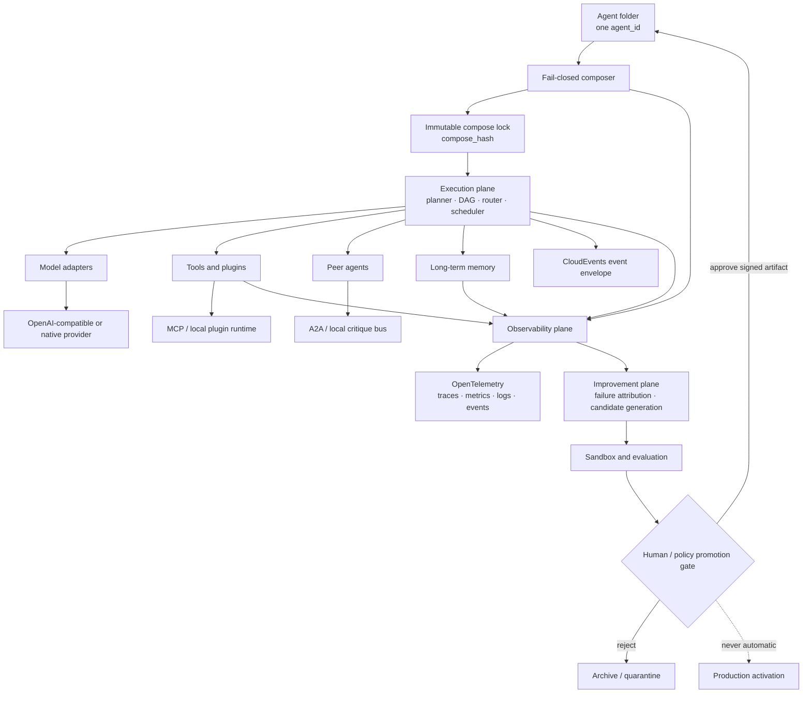
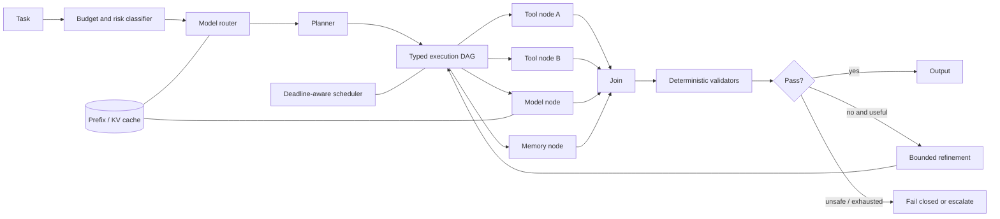
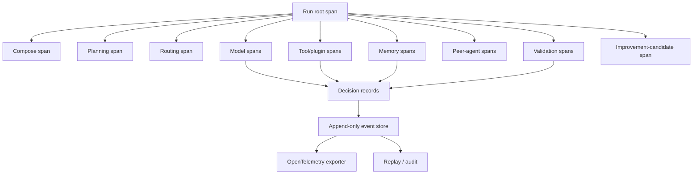
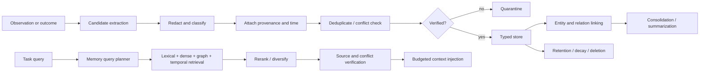
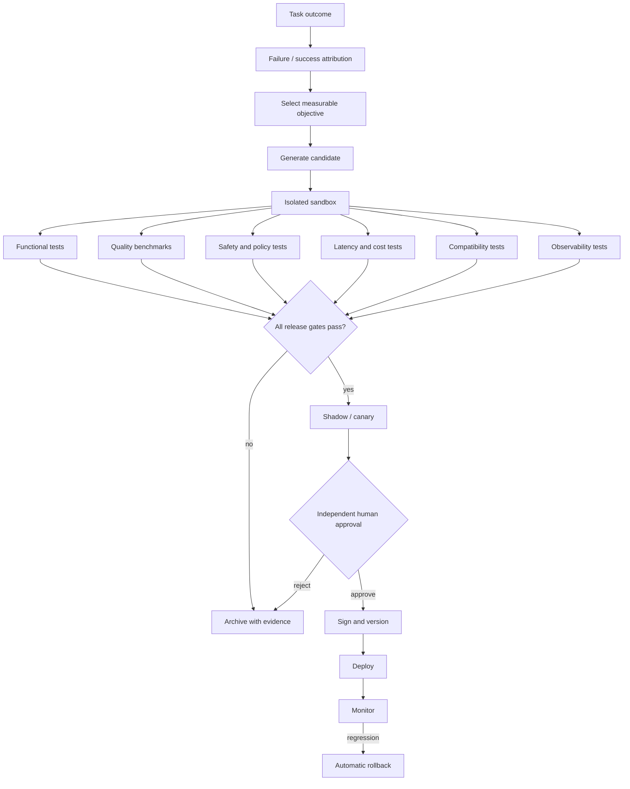

# `common_agent_structure.v2.md`

> **Validation note:** The source attachment contains a specification, not a runnable repository, benchmark harness, model endpoint, or hardware environment. Accordingly, this document is a **production-ready implementation specification**, but it does **not fabricate CASOPS runtime results**. Section 19 separates:
>
> 1. published external research results;
> 2. completed static specification validation; and
> 3. mandatory CASOPS implementation benchmarks that remain a release gate.

---

# Common Agent Structure v2
## Production Implementation Specification

**Document ID:** `CASOPS-FS-COMMON-AGENT-STRUCTURE-V2`  
**Date:** 2026-08-24  
**Status:** Production implementation specification — deployment and self-improvement activation remain human-gated  
**Supersedes:** `common_agent_structure.v1.md`, dated 2026-08-17  
**Host:** `common-agent-swarm-ops`  
**Structure family:** `casops.common_agent.v2`  
**Compatibility mode:** `casops.common_agent` v1 folders MAY load through the migration profile in §20  
**Research cutoff:** 2026-08-24

A v2 common agent remains **one self-contained folder and one `agent_id`**. Version 2 adds six first-class technical planes:

1. performance-aware execution;
2. protocol and model interoperability;
3. operational observability and decision provenance;
4. sandboxed plugins;
5. typed, persistent long-term memory; and
6. gated autonomous improvement.

Production activation, new network access, tool grants, model-weight promotion, and core self-modification remain outside the agent’s authority.

---

## Table of contents

1. Purpose and v2 changes  
2. Research basis and evidence policy  
3. Core principles  
4. Normative architecture  
5. Folder contract  
6. Composition and inheritance  
7. Performance execution plane  
8. Compatibility and protocol plane  
9. Observability and decision provenance  
10. Extensible plugin architecture  
11. Long-term memory architecture  
12. Autonomous self-improvement  
13. Skills, identity, and persona isolation  
14. Compose and runtime algorithm  
15. Data models  
16. Operator and host APIs  
17. Security and fail-closed rules  
18. Error catalogue  
19. Validation specification and report  
20. Migration from v1  
21. Traceability  
22. Open risks  
23. Research references  
24. Document control

---

# 1. Purpose and v2 changes

## 1.1 Purpose

Version 2 preserves the v1 identity, inheritance, skill, disclosure, and fail-closed contracts while introducing measurable production requirements for:

- task-completion latency;
- task accuracy;
- cost and accelerator utilization;
- model and protocol portability;
- end-to-end tracing;
- plugin installation without core rewrites;
- long-term memory retrieval and controlled forgetting;
- task-outcome-driven improvement;
- reproducibility and rollback.

## 1.2 Material changes from v1

| Domain | v1 | v2 |
|---|---|---|
| Execution | Mostly sequential Plan → Act → Review | Compiled execution DAG, safe parallelism, deadlines, routing, caching |
| Model integration | Host-local model policy | Capability-negotiated provider adapters |
| Tool integration | Local skills and host tools | Typed plugins plus MCP adapters |
| Agent communication | Critique edges | Canonical peer envelope plus A2A adapter |
| Observability | Artifact metadata | OpenTelemetry traces, metrics, events, decision records, replay |
| Memory | Parent knowledge references | Working, episodic, semantic, procedural, resource, profile, and evidence memory |
| Improvement | Bounded per-run Self-Refine | Gated candidate generation, offline optimization, canarying, promotion, rollback |
| Validation | Structural acceptance tests | Statistical performance, compatibility, memory, telemetry, and improvement gates |

## 1.3 Non-goals

This specification does not:

- authorize production activation;
- authorize unrestricted network access;
- expose or require private model chain-of-thought;
- permit an agent to rewrite production code directly;
- allow memory to bypass source, privacy, retention, or deletion controls;
- require one inference framework or vendor;
- create a second public control plane.

---

# 2. Research basis and evidence policy

## 2.1 Search scope

The design was informed by primary sources from arXiv, NeurIPS proceedings, PMLR/ICML, OpenReview/ICLR, ACL Anthology, W3C, CNCF, Linux Foundation, and official protocol specifications.

Peer-reviewed work and stable standards form the production baseline. Recent 2025–2026 preprints are included only behind explicit experimental flags.

## 2.2 Evidence maturity

| Grade | Meaning | Production treatment |
|---|---|---|
| E1 | Stable standard or peer-reviewed result with released evaluation | MAY be enabled by default after local validation |
| E2 | Peer-reviewed but highly workload- or hardware-dependent | Feature-gated until CASOPS benchmark passes |
| E3 | Recent preprint or early implementation | Experimental only; no automatic production promotion |
| E4 | Open-ended self-modification or insufficiently bounded mechanism | Research-only and disabled by default |

## 2.3 Adopted research patterns

### Performance

- PagedAttention demonstrated 2–4× serving-throughput improvement at comparable latency in evaluated workloads by reducing KV-cache fragmentation and enabling cache sharing. SGLang’s RadixAttention and structured-generation runtime reported up to 6.4× higher throughput across language-model-program workloads. ([arxiv.org](https://arxiv.org/abs/2309.06180?utm_source=openai))
- LLMCompiler reported up to 3.7× latency speedup, 6.7× cost savings, and approximately 9% accuracy improvement over sequential ReAct-style function calling on its evaluated tasks. ([arxiv.org](https://arxiv.org/abs/2312.04511?utm_source=openai))
- RouteLLM showed that learned model routing could reduce model cost by more than 2× in some settings without reducing evaluated response quality. ([arxiv.org](https://arxiv.org/abs/2406.18665?utm_source=openai))
- AFlow reported a 5.7% average improvement over its workflow baselines and showed that searched workflows could let smaller models outperform a larger model on selected tasks at substantially lower inference cost. ([openreview.net](https://openreview.net/pdf?id=z5uVAKwmjf&utm_source=openai))
- System-level analysis of agentic test-time compute found diminishing returns, growing latency variance, and high resource use from unconditional reflection and parallel reasoning. V2 therefore makes refinement and search adaptive rather than unconditional. ([arxiv.org](https://arxiv.org/abs/2506.04301?utm_source=openai))
- CacheScout is treated as E3: its July 2026 preprint reported 18–45% lower mean time to first token, 29–38% lower per-turn latency, and up to 57% higher throughput through agent-aware cache reuse. ([arxiv.org](https://arxiv.org/abs/2608.14624?utm_source=openai))

### Memory

- HippoRAG combined graph structure and Personalized PageRank, reporting up to 20% improvement on multi-hop QA while using much less time and cost than iterative retrieval. HippoRAG 2 subsequently reported a 7% gain on associative-memory tasks while preserving factual and sense-making performance. ([proceedings.neurips.cc](https://proceedings.neurips.cc/paper_files/paper/2024/hash/6ddc001d07ca4f319af96a3024f6dbd1-Abstract.html?utm_source=openai))
- LongMemEval established evaluation around extraction, multi-session reasoning, temporal reasoning, knowledge updates, and abstention. Time-aware query expansion improved temporal recall by 6.8–11.3% in its experiments. ([openreview.net](https://openreview.net/pdf?id=pZiyCaVuti&utm_source=openai))
- Mem0 reported a 26% relative quality improvement over one compared memory system, 91% lower p95 latency than full-context processing, and over 90% token savings on its evaluated conversational-memory workload. These are E3 external results, not CASOPS measurements. ([arxiv.org](https://arxiv.org/abs/2504.19413?utm_source=openai))
- A-MEM supports dynamically linked and evolving memory notes; MIRIX separates six memory categories; MemGAS adds adaptive multi-granularity retrieval. V2 adopts these as modular patterns rather than a mandatory implementation. ([arxiv.org](https://arxiv.org/abs/2502.12110?utm_source=openai))

### Improvement

- Self-Refine reported an average absolute improvement of roughly 20% across its evaluated tasks without model training. Reflexion demonstrated that task feedback stored as episodic reflection can improve later attempts. ([papers.neurips.cc](https://papers.neurips.cc/paper_files/paper/2023/hash/91edff07232fb1b55a505a9e9f6c0ff3-Abstract-Conference.html?utm_source=openai))
- Automated Design of Agentic Systems and AFlow show that workflow and agent designs can be searched and evaluated rather than manually fixed. Promptbreeder similarly evolves prompts through measured fitness. ([openreview.net](https://openreview.net/pdf?id=t9U3LW7JVX&utm_source=openai))
- Agent Lightning separates agent execution from RL training and provides trajectory-level credit assignment. Its August 2026 v1.0 preprint reported a 14.6-point SWE-bench Verified gain in one coding-agent setup; it remains E3 pending broader independent validation. ([arxiv.org](https://arxiv.org/abs/2508.03680?utm_source=openai))
- Self-editing systems such as SICA and the Darwin Gödel Machine demonstrated substantial coding-benchmark gains, but they are classified E4 because unrestricted self-editing presents significantly greater operational risk. ([arxiv.org](https://arxiv.org/abs/2504.15228?utm_source=openai))

### Observability and interoperability

- V2 uses W3C Trace Context for cross-service trace propagation and OpenTelemetry semantic conventions for vendor-neutral traces, metrics, logs, and events. ([w3.org](https://www.w3.org/TR/trace-context/?utm_source=openai))
- Raw chain-of-thought is not treated as reliable operational provenance: research shows generated reasoning explanations can be unfaithful or rationalize biased answers. V2 records evidence, state transitions, selected actions, constraints, and validator outcomes instead. ([proceedings.neurips.cc](https://proceedings.neurips.cc/paper_files/paper/2023/hash/ed3fea9033a80fea1376299fa7863f4a-Abstract.html?utm_source=openai))
- MCP’s 2026-07-28 specification adds a stateless core, explicit routing, cacheable capability lists, authorization hardening, and an extension framework. A2A defines capability discovery and task-oriented communication between otherwise opaque agents. ([blog.modelcontextprotocol.io](https://blog.modelcontextprotocol.io/posts/2026-07-28/?utm_source=openai))

---

# 3. Core principles

| ID | Principle | Normative meaning |
|---|---|---|
| P1 | One identity | One folder remains one `agent_id`. |
| P2 | Child owns mission | Parent content supports but never replaces the child mission. |
| P3 | Safety tightens | Deny lists union; budget caps take minima; false safety booleans win. |
| P4 | Tools never inherit | Tools and executable plugins require child declaration and host approval. |
| P5 | Disabled means absent | Disabled skills and plugins do not enter prompts, tools, memory, traces, or critique. |
| P6 | Persona is presentation | Persona cannot mint knowledge, permissions, memory confidence, or credentials. |
| P7 | Evidence over narrative | Operational provenance records observable evidence and actions, not claimed private thought. |
| P8 | Optimize job completion | Primary performance metric is successful task completion per time and cost, not raw token speed. |
| P9 | Capability negotiation | Runtime behavior depends on declared adapter capabilities, not vendor assumptions. |
| P10 | Typed extensibility | Every executable extension has a manifest, schemas, integrity digest, permissions, and limits. |
| P11 | Memory is governed data | Every persistent memory has source, time, scope, sensitivity, retention, and deletion semantics. |
| P12 | Improvement proposes | An agent may generate candidates; only an external gate promotes them. |
| P13 | Reproducible composition | Every run references an immutable `compose_hash`. |
| P14 | Fail closed at trust boundaries | Unknown code, protocol drift, invalid memory, broken provenance, or unauthorized mutation aborts. |
| P15 | Fail safely for optional acceleration | Cache or speculative-decoding failure MAY fall back to the validated baseline without changing permissions or semantics. |
| P16 | No floating production dependencies | Protocol, adapter, plugin, model, prompt, and schema versions are pinned by digest. |
| P17 | Independent validation | Self-generated candidates cannot be promoted using only their own self-score. |
| P18 | Rollback is mandatory | Every promoted mutable artifact has a previous signed version and tested rollback path. |

---

# 4. Normative architecture

## 4.1 System planes



## 4.2 Control boundaries

| Plane | May read | May write | Cannot do |
|---|---|---|---|
| Composer | Folder, parent metadata, manifests | Generated lock files | Execute unverified plugin code |
| Execution | Composed envelope, approved memory, approved capabilities | Run artifacts and candidate memories | Modify its own production definition |
| Memory | Approved observations and outcomes | Versioned memory records | Grant tools or alter policy |
| Observability | Operational events and configured content | Append-only telemetry | Change run behavior |
| Improvement | Traces, outcomes, benchmark fixtures | Candidate artifacts | Promote its own candidate |
| Human gate | Candidate and validation report | Approval record | Bypass immutable audit |

---

# 5. Folder contract

## 5.1 Complete v2 tree

```text
agents/<pack.agent-id>/
  README.md
  SPEC.md
  agent_spec.json

  prompts/
  rubrics/
  sources/
    PROVENANCE.json
    MAPPING.md
    excerpts/
  docs/
    user_guide.md

  inheritance/
    parents.json
    resolved.json
    conflicts.json

  skills/
    SKILL.md
    bindings.json
    integration.json
    toggles.json

  identity/
    persona.json
    background.json
    DISCLOSURE.md

  runtime/
    execution.json
    backends.json
    routing.json
    cache.json

  protocols/
    compatibility.json
    schemas/
      agent_message.schema.json
      event.schema.json

  observability/
    telemetry.json
    redaction.json
    slo.json
    decision_record.schema.json

  plugins/
    registry.json
    lock.json
    manifests/

  memory/
    policy.json
    stores.json
    retention.json
    schemas/
      memory_record.schema.json
    migrations/

  improvement/
    policy.json
    objectives.json
    candidates/
    approvals/
    rollback/

  evals/
    benchmarks.json
    baselines.json
    fixtures/
    reports/

  generated/
    compose.lock.json
    capabilities.lock.json
    benchmark-baseline.json
```

## 5.2 Required files

| Path | Requirement |
|---|---|
| All v1 required paths | Continue to be required |
| `runtime/execution.json` | Required |
| `runtime/backends.json` | Required; may declare only `local_deterministic` |
| `protocols/compatibility.json` | Required; protocols may all be disabled |
| `observability/telemetry.json` | Required |
| `observability/redaction.json` | Required |
| `plugins/registry.json` | Required; may contain an empty plugin list |
| `plugins/lock.json` | Generated after successful compose |
| `memory/policy.json` | Required; `mode: none` is valid |
| `memory/retention.json` | Required when persistent memory is enabled |
| `improvement/policy.json` | Required; defaults to `mode: disabled` |
| `evals/benchmarks.json` | Required |
| `generated/compose.lock.json` | Generated only |
| `generated/capabilities.lock.json` | Generated only |

## 5.3 Self-contained meaning

The child folder must be independently readable and must fully describe:

- its mission;
- boundaries;
- expected inputs and outputs;
- required capabilities;
- memory policy;
- telemetry policy;
- improvement policy;
- protocol compatibility;
- validation requirements.

Parent folders, remote tool catalogs, and model endpoints are resolved only during compose.

---

# 6. Composition and inheritance

## 6.1 Preserved v1 rules

The v1 MRO, parent count, depth limits, child-wins merge semantics, safety tightening, cycle checks, and parent hash checks remain normative.

- Maximum declared parents: 8.
- Maximum depth: child plus three ancestor levels.
- Child is first in MRO.
- Parent priorities are ascending.
- Ties use ascending `agent_id`.
- Each parent appears at most once.
- `does_not_own` is a union.
- Numeric budgets use the minimum.
- `network_access` and production activation are false-wins.
- `allowed_tools` is never inherited.

## 6.2 New non-inherited surfaces

The following never inherit:

- model endpoint credentials;
- provider API keys;
- protocol authorization;
- plugin executable grants;
- plugin signatures and approvals;
- actual memory records;
- memory tenant or user scope;
- telemetry content-capture approval;
- improvement approval;
- candidate promotion rights;
- canary allocation;
- production activation;
- cache contents;
- named-person identity approval.

## 6.3 New legal inherited surfaces

| Surface | Behavior |
|---|---|
| `runtime_hints` | Non-binding hints; child and host may reject |
| `memory_schema_refs` | Schema union only; no parent records |
| `evaluation_dimensions` | Union by dimension ID |
| `observability_labels` | Namespaced union |
| `plugin_requirements` | Dependency declaration only; does not grant execution |
| `protocol_preferences` | Preference union; host compatibility and child policy win |

## 6.4 Compose lock

`generated/compose.lock.json` contains:

- child and parent hashes;
- MRO;
- prompt and rubric hashes;
- skill resolution;
- plugin digests;
- protocol versions;
- adapter versions;
- memory-policy hash;
- telemetry-policy hash;
- improvement-policy hash;
- model and tokenizer revisions;
- capability matrix;
- `compose_hash`.

Any runtime artifact with a different composition must receive a new `compose_hash`.

---

# 7. Performance execution plane

## 7.1 Normative runtime design



## 7.2 Execution IR

The composer compiles each runnable task into `casops.execution_dag.v1`.

Node kinds:

- `model`;
- `tool`;
- `plugin`;
- `memory_read`;
- `memory_write`;
- `peer_agent`;
- `validator`;
- `branch`;
- `join`;
- `transform`;
- `human_gate`.

Every node declares:

- stable `node_id`;
- dependencies;
- typed input and output schemas;
- timeout;
- retry policy;
- side-effect class;
- idempotency;
- cacheability;
- required capabilities;
- resource budget;
- failure action.

## 7.3 Functional requirements

| ID | Requirement |
|---|---|
| FR-PERF-001 | The host MUST compile explicit dependencies before execution. |
| FR-PERF-002 | Independent read-only or idempotent nodes SHOULD run concurrently. |
| FR-PERF-003 | Nodes with unordered side effects MUST NOT be parallelized. |
| FR-PERF-004 | The scheduler MUST optimize end-to-end critical-path time, not individual model-call time alone. |
| FR-PERF-005 | Every run SHALL propagate a deadline and cancellation token. |
| FR-PERF-006 | The model router SHALL optimize a declared quality–latency–cost objective. |
| FR-PERF-007 | Route decisions MUST be reproducible from logged features or explicitly marked stochastic. |
| FR-PERF-008 | Structured output SHALL use grammar- or schema-constrained decoding when supported. |
| FR-PERF-009 | Prefix and KV caches MUST be keyed by model, tokenizer, prompt hash, capability scope, tenant, and privacy boundary. |
| FR-PERF-010 | Cache data MUST NOT cross agent, user, tenant, or approval boundaries unless explicitly shareable. |
| FR-PERF-011 | Context allocation MUST reserve separate budgets for policy, task, memory, tools, evidence, and output. |
| FR-PERF-012 | Reflection SHALL be triggered by uncertainty, validator failure, risk class, or expected utility—not a fixed unconditional loop. |
| FR-PERF-013 | Speculative decoding is optional and MUST preserve output distribution or deterministic semantics claimed by the backend. |
| FR-PERF-014 | Failure of an optional optimizer MAY fall back only to a validated baseline route. |
| FR-PERF-015 | Each fallback SHALL emit a telemetry event and reason code. |
| FR-PERF-016 | Model, tool, memory, and peer concurrency MUST each have independent limits. |
| FR-PERF-017 | Performance acceptance MUST use cost per successful task, p50/p95 job time, and task success. |

## 7.4 Example `runtime/execution.json`

```json
{
  "schema_version": "2.0",
  "agent_id": "video.showrunner",
  "execution_ir": "casops.execution_dag.v1",
  "planner": {
    "mode": "typed_dag",
    "max_nodes": 32,
    "max_dynamic_expansions": 8
  },
  "parallelism": {
    "max_model_calls": 2,
    "max_tool_calls": 4,
    "max_memory_reads": 4,
    "max_peer_calls": 2
  },
  "deadlines": {
    "run_ms": 45000,
    "model_node_ms": 15000,
    "tool_node_ms": 10000
  },
  "refinement": {
    "policy": "adaptive",
    "max_count": 3,
    "minimum_expected_gain": 0.05
  },
  "structured_output": {
    "required_when_schema_exists": true
  }
}
```

## 7.5 Model routing

The router inputs MAY include:

- task family;
- modality;
- estimated difficulty;
- required context;
- required structured-output capability;
- latency deadline;
- cost cap;
- risk class;
- prior success by route;
- current queue or capacity signal.

The router MUST NOT use:

- protected user attributes unless expressly required and approved;
- persona confidence;
- hidden parent permissions;
- unsupported guesses about model capabilities.

## 7.6 Performance metrics

Every artifact records:

- `job_completion_ms`;
- `time_to_first_output_ms`;
- `critical_path_ms`;
- `queue_ms`;
- `model_ms`;
- `tool_wait_ms`;
- `memory_ms`;
- `validation_ms`;
- input and output tokens;
- model-call count;
- retry count;
- cache-hit status;
- accelerator memory where available;
- cost estimate;
- success or failure code.

---

# 8. Compatibility and protocol plane

## 8.1 Canonical interfaces

| Interface | Purpose |
|---|---|
| `ModelAdapter` | Generation, streaming, embedding, scoring, token counting |
| `ToolAdapter` | Tool discovery and invocation |
| `PeerAdapter` | Agent discovery, messaging, task lifecycle |
| `MemoryAdapter` | Search, read, write, update, delete |
| `TelemetryAdapter` | Traces, metrics, logs, events |
| `PluginRuntime` | Executable extension lifecycle |
| `EventAdapter` | Asynchronous event exchange |

## 8.2 Model compatibility

At least the following adapter profiles SHALL be supported by the host implementation:

1. OpenAI-compatible HTTP;
2. in-process or local Transformers-style generation;
3. one high-throughput serving engine, such as vLLM or SGLang;
4. a deterministic test adapter.

vLLM officially exposes an OpenAI-compatible server; compatibility nevertheless remains capability-based because OpenAI-compatible implementations can differ in extensions and behavior. ([docs.vllm.ai](https://docs.vllm.ai/en/latest/serving/online_serving/openai_compatible_server/?utm_source=openai))

## 8.3 Capability declaration

Each adapter declares support for:

```text
chat
text_generation
streaming
tool_calls
parallel_tool_calls
structured_output
json_schema
embeddings
reranking
vision
audio_input
audio_output
logprobs
seed
token_count
prefix_cache
speculative_decoding
batching
cancellation
```

Missing mandatory capabilities abort compose with `CMP_CAPABILITY_MISSING`.

## 8.4 Tool protocol

MCP is the preferred external tool and context protocol. Production deployments MUST pin an exact MCP protocol revision and SDK digest. The current 2026-07-28 revision introduces a stateless core and formal extension mechanism, but no deployment may float automatically to that or a future revision. ([blog.modelcontextprotocol.io](https://blog.modelcontextprotocol.io/posts/2026-07-28/?utm_source=openai))

MCP tool discovery does not imply tool authorization.

## 8.5 Agent protocol

A2A is the preferred external peer-agent adapter. It supports capability discovery, modality negotiation, and task-oriented communication without requiring access to another agent’s internal memory or tools. ([linuxfoundation.org](https://www.linuxfoundation.org/press/linux-foundation-launches-the-agent2agent-protocol-project-to-enable-secure-intelligent-communication-between-ai-agents?utm_source=openai))

The host MUST normalize A2A messages into the canonical CASOPS peer envelope before delivery.

## 8.6 Event and trace protocols

- W3C `traceparent` and `tracestate` propagate trace identity. ([w3.org](https://www.w3.org/TR/trace-context/?utm_source=openai))
- CloudEvents structured JSON is used for asynchronous, protocol-neutral events. ([github.com](https://github.com/cloudevents/spec/blob/main/cloudevents/formats/cloudevents.json?utm_source=openai))
- OpenTelemetry carries traces, metrics, logs, and GenAI events. ([opentelemetry.io](https://opentelemetry.io/docs/concepts/semantic-conventions/?utm_source=openai))

## 8.7 Canonical peer envelope

```json
{
  "schema_version": "2.0",
  "message_id": "msg_01",
  "conversation_id": "conv_01",
  "task_id": "task_01",
  "from_agent": "video.showrunner",
  "to_agent": "video.editor",
  "message_type": "handoff",
  "parts": [
    {
      "kind": "data",
      "schema": "video.cut_brief.v2",
      "content_ref": "artifact://cut-brief/123"
    }
  ],
  "traceparent": "00-...-...-01",
  "deadline": "2026-08-24T20:00:00Z",
  "auth_scope": ["artifact:read:cut-brief"],
  "provenance": {
    "compose_hash": "sha256:...",
    "artifact_hash": "sha256:..."
  }
}
```

Private reasoning, unrestricted memory, credentials, and undeclared tool handles MUST NOT be transmitted.

## 8.8 Compatibility requirements

| ID | Requirement |
|---|---|
| FR-CMP-001 | All protocol and adapter versions MUST be pinned. |
| FR-CMP-002 | Every adapter MUST publish a machine-readable capability matrix. |
| FR-CMP-003 | Unknown capabilities fail closed. |
| FR-CMP-004 | Vendor-specific fields remain under `vendor_extensions`. |
| FR-CMP-005 | Vendor extensions MUST NOT override host gates. |
| FR-CMP-006 | Message payloads MUST have JSON Schema or an approved binary schema. |
| FR-CMP-007 | Schema negotiation MUST reject incompatible major versions. |
| FR-CMP-008 | Protocol bridges MUST preserve trace, deadline, identity, and authorization scope. |
| FR-CMP-009 | MCP and A2A discovery results MUST be cached only within their advertised validity. |
| FR-CMP-010 | Protocol adapters MUST pass conformance fixtures before production use. |

---

# 9. Observability and decision provenance

## 9.1 Observability model



## 9.2 No raw chain-of-thought contract

“Transparent reasoning logs” means transparent **operational decision provenance**, not disclosure of private hidden reasoning.

The following MUST be recorded:

- observable inputs or hashes;
- task objective;
- available actions;
- selected action;
- machine-readable rejection codes for material alternatives;
- evidence and memory references;
- tool observations;
- policy checks;
- validators;
- confidence when calibrated;
- outcome.

Raw hidden chain-of-thought MUST NOT be required, treated as authoritative, or exported. This avoids relying on reasoning narratives that can be unfaithful. ([proceedings.neurips.cc](https://proceedings.neurips.cc/paper_files/paper/2023/hash/ed3fea9033a80fea1376299fa7863f4a-Abstract.html?utm_source=openai))

## 9.3 Decision record

```json
{
  "decision_id": "dec_01",
  "trace_id": "4bf92f3577b34da6a3ce929d0e0e4736",
  "span_id": "00f067aa0ba902b7",
  "agent_id": "video.showrunner",
  "objective": "select coverage plan",
  "observable_input_refs": [
    "artifact://brief/91",
    "memory://episodic/44"
  ],
  "available_actions": [
    "request_more_information",
    "produce_plan",
    "handoff"
  ],
  "selected_action": "produce_plan",
  "selection_codes": [
    "INPUTS_SUFFICIENT",
    "WITHIN_CHILD_RESPONSIBILITY",
    "DEADLINE_FAVORS_DIRECT_PLAN"
  ],
  "evidence_refs": [
    "source://director-spec/sha256:...",
    "memory://semantic/17"
  ],
  "policy_results": [
    {
      "policy": "rights_gate",
      "result": "pass"
    }
  ],
  "validator_results": [],
  "confidence": {
    "value": 0.78,
    "method": "calibrated_route_model"
  },
  "compose_hash": "sha256:...",
  "prompt_hash": "sha256:...",
  "created_at": "2026-08-24T12:00:00Z"
}
```

## 9.4 Required telemetry events

```text
agent.run.started
agent.compose.completed
agent.route.selected
agent.plan.created
agent.node.started
agent.model.request
agent.model.response
agent.tool.request
agent.tool.response
agent.memory.query
agent.memory.result
agent.memory.write.proposed
agent.memory.write.committed
agent.peer.message.sent
agent.peer.message.received
agent.policy.decision
agent.validation.completed
agent.refinement.started
agent.improvement.candidate_created
agent.run.completed
agent.run.failed
```

## 9.5 Mandatory attributes

- `agent_id`;
- `trace_id`;
- `span_id`;
- `correlation_id`;
- `compose_hash`;
- `mro`;
- `model_adapter`;
- `model_revision`;
- `prompt_hash`;
- `skill_ids`;
- `plugin_digests`;
- `memory_record_ids`;
- `tool_id`;
- `peer_agent_id`;
- timings;
- token counts;
- cost;
- outcome;
- error code;
- expertise mode and disclosure ID.

## 9.6 Content capture

| Level | Behavior |
|---|---|
| `metadata_only` | Default; hashes, sizes, schemas, IDs |
| `redacted` | Approved fields after PII/secret redaction |
| `encrypted_full` | Explicit approval, encryption, limited retention |
| `disabled` | Permitted only if local mandatory audit still records action metadata |

Prompts, outputs, memory contents, tool arguments, and peer messages default to `metadata_only`.

## 9.7 Integrity and replay

- Events are append-only.
- Each local audit event SHOULD include the previous event hash.
- Deterministic runs record random seed, model revision, tokenizer revision, tool fixtures, and environment digest.
- Non-deterministic runs record enough information to replay the external observations even when exact token reproduction is impossible.
- Exporter failure writes to a bounded encrypted local spool.
- High-risk runs fail closed if both exporter and local audit storage are unavailable.

---

# 10. Extensible plugin architecture

## 10.1 Plugin kinds

```text
tool
skill_runtime
model_adapter
memory_backend
modality_handler
evaluator
protocol_adapter
validator
router
scheduler_policy
```

Skills remain declarative prompt or capability bundles. Plugins are executable extensions. Enabling a skill cannot install or authorize a plugin.

## 10.2 Plugin lifecycle

1. Discover manifest.
2. Validate schema.
3. Verify digest and signature.
4. Resolve dependencies.
5. Compare host and structure compatibility.
6. Evaluate permissions.
7. Instantiate in an isolated runtime.
8. Perform health check.
9. Register typed capabilities.
10. Add digest to `plugins/lock.json`.
11. Emit load event.
12. Quiesce before upgrade or removal.

## 10.3 Plugin manifest

```json
{
  "schema_version": "2.0",
  "plugin_id": "video.frame-inspector",
  "version": "2.1.0",
  "kind": "modality_handler",
  "entrypoint": {
    "runtime": "isolated_process",
    "path": "plugins/frame-inspector/main"
  },
  "interfaces": [
    {
      "name": "inspect_frame",
      "input_schema": "schemas/frame-request.json",
      "output_schema": "schemas/frame-result.json"
    }
  ],
  "permissions": {
    "network": false,
    "filesystem_read": ["artifact://frames/*"],
    "filesystem_write": [],
    "tools": [],
    "memory_read": ["resource"],
    "memory_write": []
  },
  "side_effect_class": "read_only",
  "resource_limits": {
    "cpu_ms": 5000,
    "memory_mb": 512,
    "output_bytes": 1048576
  },
  "compatibility": {
    "agent_structure": ">=2.0 <3.0",
    "host_api": ">=4.0 <5.0"
  },
  "integrity": {
    "sha256": "sha256:...",
    "signature_ref": "approval://plugin-signature/123"
  }
}
```

## 10.4 Requirements

| ID | Requirement |
|---|---|
| FR-PLG-001 | Plugin installation MUST require zero changes to composer core source. |
| FR-PLG-002 | Every interface MUST be typed. |
| FR-PLG-003 | Every plugin MUST declare permissions and resource limits. |
| FR-PLG-004 | Undeclared network, filesystem, memory, tool, or peer access MUST be blocked. |
| FR-PLG-005 | Plugin code MUST NOT run during manifest validation. |
| FR-PLG-006 | Unknown or unsigned production plugins fail closed. |
| FR-PLG-007 | Plugin dependency cycles fail closed. |
| FR-PLG-008 | Hot reload requires a quiescent point or stateless declaration. |
| FR-PLG-009 | Plugin output is untrusted until schema and policy validation pass. |
| FR-PLG-010 | Tool-use plugins SHALL be evaluated on BFCL and ToolSandbox-style fixtures. |

BFCL evaluates function-calling behavior including multi-turn and hallucination cases, while ToolSandbox evaluates stateful, conversational tool interaction and intermediate milestones. ([gorilla.cs.berkeley.edu](https://gorilla.cs.berkeley.edu/leaderboard?utm_source=openai))

---

# 11. Long-term memory architecture

## 11.1 Memory stores

| Store | Purpose | Default duration |
|---|---|---|
| Working | Current task state and temporary observations | Run |
| Episodic | Completed attempts, outcomes, reflections | Configured |
| Semantic | Verified facts, concepts, relationships | Configured |
| Procedural | Reusable methods, plans, successful workflows | Configured |
| Resource | Documents, artifacts, multimodal references | Configured |
| Profile/core | Explicit preferences and durable identity facts | Until changed or deleted |
| Evidence vault | Immutable source excerpts, approvals, validation evidence | Policy-controlled |

The separation draws on multi-store agent-memory work but is an engineering taxonomy, not a claim of biological equivalence. MIRIX’s six-store design and A-MEM’s dynamically linked memories provide relevant empirical patterns. ([arxiv.org](https://arxiv.org/abs/2507.07957?utm_source=openai))

## 11.2 Memory lifecycle



## 11.3 Memory record

```json
{
  "schema_version": "2.0",
  "memory_id": "mem_01",
  "agent_id": "video.showrunner",
  "tenant_scope": "project:series-a",
  "subject_scope": "user:hashed-id",
  "memory_type": "semantic",
  "status": "verified",
  "content_ref": "encrypted://memory/mem_01",
  "summary": "Approved exterior-shoot curfew is 22:00 local time.",
  "entities": ["location:lot-a", "policy:curfew"],
  "relations": [
    {
      "subject": "location:lot-a",
      "predicate": "has_curfew",
      "object": "22:00"
    }
  ],
  "valid_time": {
    "from": "2026-08-01T00:00:00Z",
    "to": null
  },
  "transaction_time": "2026-08-24T12:00:00Z",
  "source_refs": [
    "artifact://approval/curfew-2026"
  ],
  "confidence": {
    "value": 1.0,
    "basis": "human_approval"
  },
  "sensitivity": "internal",
  "retention_class": "project_lifetime",
  "supersedes": [],
  "conflicts_with": [],
  "created_by_trace": "trace_01"
}
```

## 11.4 Retrieval strategy

Production retrieval SHALL support:

1. metadata and tenant filtering;
2. lexical retrieval;
3. dense-vector retrieval;
4. optional knowledge-graph traversal;
5. temporal filtering and query expansion;
6. learned or deterministic reranking;
7. diversity and redundancy control;
8. explicit token budgeting;
9. source verification;
10. abstention when memories conflict or are insufficient.

Hybrid graph retrieval is supported because HippoRAG and HippoRAG 2 showed benefits for associative and multi-hop memory. Time-aware retrieval is required because LongMemEval identified temporal reasoning and knowledge updates as distinct failure modes. ([proceedings.neurips.cc](https://proceedings.neurips.cc/paper_files/paper/2024/hash/6ddc001d07ca4f319af96a3024f6dbd1-Abstract.html?utm_source=openai))

## 11.5 Memory-write policy

Allowed memory writes include:

- explicit user preferences;
- verified facts with source references;
- successful task outcomes;
- approved procedural summaries;
- validator-confirmed failure lessons;
- human corrections;
- versioned task state.

The following MUST NOT be committed directly:

- raw chain-of-thought;
- unsupported persona claims;
- untrusted tool text;
- retrieved content with no provenance;
- secrets outside an approved vault;
- inferred sensitive traits;
- another tenant’s data;
- transient errors mistaken for durable rules.

## 11.6 Conflict and update handling

- A changed fact creates a new version.
- Previous records are marked superseded, not silently overwritten.
- Valid time and transaction time remain distinct.
- Contradictions are retained until resolved or policy expires them.
- Retrieval returns the latest valid version plus material unresolved conflicts.
- An agent must not silently choose the most convenient conflicting memory.

## 11.7 Forgetting and deletion

MemoryAgentBench identifies selective forgetting alongside retrieval, test-time learning, and long-range understanding as a core memory competency. ([arxiv.org](https://arxiv.org/abs/2507.05257?utm_source=openai))

V2 therefore requires:

- retention classes;
- expiration;
- usage-based decay where approved;
- explicit deletion;
- tombstones for distributed deletion propagation;
- index and cache invalidation;
- audit of deletion completion;
- legal hold support;
- separation between forgetting and evidence destruction.

## 11.8 Memory evaluation

Required benchmark categories:

- LongMemEval: extraction, multi-session, temporal, update, abstention;
- LoCoMo: long-form conversational and multimodal memory;
- MemoryAgentBench: retrieval, learning, long-range understanding, forgetting;
- Mem2ActBench-style tests: using memory to select tools and parameters;
- streaming experience-reuse tests inspired by Evo-Memory. ([openreview.net](https://openreview.net/pdf?id=pZiyCaVuti&utm_source=openai))

---

# 12. Autonomous self-improvement

## 12.1 Improvement levels

| Level | Scope | Default |
|---|---|---|
| L0 | Disabled | Production default |
| L1 | Per-run retry, reflection, search | Allowed within run budget |
| L2 | Candidate memory, prompt, rubric, router parameters | Propose-only |
| L3 | Candidate workflow or plugin | Sandbox only |
| L4 | Model adapter or LoRA-style weight update | Separate trainer and human promotion |
| L5 | Core source or self-rewriting architecture | Research-only; prohibited in production |

## 12.2 Improvement loop



## 12.3 Outcome attribution

Improvement may be proposed only after identifying an attributable cause, such as:

- model route failure;
- missing or incorrect memory;
- bad retrieval granularity;
- malformed tool call;
- plugin defect;
- workflow dependency error;
- inadequate validation;
- prompt ambiguity;
- protocol incompatibility;
- budget exhaustion.

“Task failed” alone is not an adequate mutation reason.

## 12.4 Candidate types

```text
memory_correction
prompt_patch
rubric_patch
router_update
workflow_patch
plugin_patch
protocol_mapping
model_adapter
evaluation_fixture
```

## 12.5 Candidate requirements

Every candidate contains:

- candidate ID and parent version;
- mutation scope;
- generating trace IDs;
- attributable failure codes;
- exact diff or artifact;
- expected benefit;
- risk assessment;
- training and evaluation data hashes;
- holdout data hash;
- model and tool revisions;
- benchmark results;
- safety results;
- cost and latency results;
- rollback artifact;
- signature status.

## 12.6 Learning separation

Agent Lightning’s execution/training separation motivates a strict split between production execution and model optimization. Trajectories MAY be exported to a trainer, but gradient updates MUST NOT execute in the serving process. ([arxiv.org](https://arxiv.org/abs/2508.03680?utm_source=openai))

Online production updates MAY include:

- bounded router statistics;
- cache TTL estimates;
- quarantined episodic reflections;
- memory index updates;
- non-executable task statistics.

Online production updates MUST NOT include:

- base-model weight changes;
- unsigned adapter promotion;
- executable plugin replacement;
- core source changes;
- permission changes;
- network or tool grants.

## 12.7 Workflow and prompt improvement

ADAS, AFlow, and Promptbreeder support searching over workflows or prompts, but v2 requires:

- held-out tests;
- multi-objective fitness;
- complexity penalties;
- cost penalties;
- safety and compatibility objectives;
- independent evaluators;
- archive diversity;
- no automatic production promotion. ([openreview.net](https://openreview.net/pdf?id=t9U3LW7JVX&utm_source=openai))

## 12.8 Core self-modification

DGM- or SICA-style self-editing may be studied only when:

- the environment is isolated;
- no production credentials are present;
- outbound network is disabled or tightly simulated;
- only approved repositories are writable;
- evaluation sets are separated;
- a human approves every promotion;
- signed rollback is available.

Core self-modification is never a standard common-agent capability. ([arxiv.org](https://arxiv.org/abs/2505.22954?utm_source=openai))

---

# 13. Skills, identity, and persona isolation

## 13.1 Skills

The v1 AND-gate remains:

```text
resolved_enabled =
    declared_or_inherited
AND author_enabled
AND inherited_enabled
AND operator_toggle
AND host_permission
```

A skill may reference an approved plugin, but cannot install, sign, or grant it.

## 13.2 Identity

The existing modes remain:

- `grounded`;
- `persona_overlay`;
- `mixed`.

Additional v2 invariants:

- persona must not affect route quality labels;
- persona content cannot become durable memory unless separately verified;
- persona cannot alter telemetry redaction;
- persona cannot select improvement scope;
- persona cannot authorize a plugin or peer;
- `persona_claim` remains invalid as factual evidence;
- disclosure must be present on all non-grounded artifacts.

## 13.3 Inherited identity

Parent persona defaults may be inherited only when the child has no local identity files. Named-person approvals never inherit.

---

# 14. Compose and runtime algorithm

## 14.1 Compose sequence

1. Validate folder and JSON Schemas.
2. Validate child identity and disclosure.
3. Resolve inheritance MRO and parent hashes.
4. Merge content and safety fields.
5. Resolve skills.
6. Discover plugin manifests without executing them.
7. Verify plugin signatures, digests, permissions, and dependencies.
8. Resolve model and protocol adapters.
9. Negotiate capabilities.
10. Bind memory stores and retention policy.
11. Bind telemetry, redaction, and local audit spool.
12. Compile the execution DAG.
13. Apply host tools, network, budget, tenant, and production gates.
14. Generate locks and `compose_hash`.
15. Run compose-preview validation.
16. Permit execution only if all mandatory checks pass.

## 14.2 Run sequence

1. Start W3C/OpenTelemetry root trace.
2. Classify risk, modality, deadline, and budget.
3. Query applicable working and long-term memory.
4. Select model route.
5. Build or load execution DAG.
6. Execute safe nodes concurrently.
7. Validate every external result.
8. Apply adaptive refinement if expected utility is positive.
9. Produce output with provenance and disclosure.
10. Commit only verified memory writes.
11. Record outcome and metrics.
12. Optionally create improvement candidates.
13. Close trace and artifact.
14. Never promote a candidate within the same run.

## 14.3 Prompt-envelope order

1. Host safety charter.
2. Protocol and permission constraints.
3. Disclosure.
4. Persona voice.
5. Child mission and `does_not_own`.
6. Inherited support fragments.
7. Verified memory excerpts with provenance.
8. Enabled skill instructions.
9. Child primary prompt.
10. Labelled inherited prompts.
11. Tool and plugin schemas.
12. Output schema.
13. Rubric and validator requirements.

---

# 15. Data models

## 15.1 `agent_spec.json`

```json
{
  "schema_version": "2.0",
  "structure_id": "casops.common_agent.v2",
  "agent_id": "video.showrunner",
  "status": "registered",
  "role": "ShowrunnerAgent (VA Domain Pack)",
  "allowed_tools": [],
  "allowed_plugins": [],
  "model_policy": {
    "provider": "local_deterministic",
    "model_id": "local-video-config",
    "network_access": false,
    "routing_allowed": true
  },
  "budget_policy": {
    "max_input_tokens": 4096,
    "max_output_tokens": 1536,
    "max_model_calls": 4,
    "max_tool_requests": 0,
    "max_job_ms": 45000
  },
  "prompt_reference": "video.prompt.showrunner.v2",
  "rubric_reference": "video.rubric.showrunner.v2",
  "critique_edges": {
    "inputs": ["video.critic"],
    "outputs": ["video.judge"]
  },
  "max_refinement_count": 3,
  "production_activation_requested": false,
  "does_not_own": [
    "Credentials",
    "Silent production activation",
    "Another agent's exclusive craft output without handoff",
    "Automatic promotion of self-generated code or model weights"
  ],
  "inheritance_ref": "inheritance/parents.json",
  "identity_ref": "identity/",
  "skills_ref": "skills/bindings.json",
  "toggles_ref": "skills/toggles.json",
  "runtime_ref": "runtime/execution.json",
  "backends_ref": "runtime/backends.json",
  "protocols_ref": "protocols/compatibility.json",
  "observability_ref": "observability/telemetry.json",
  "plugins_ref": "plugins/registry.json",
  "memory_ref": "memory/policy.json",
  "improvement_ref": "improvement/policy.json",
  "evals_ref": "evals/benchmarks.json"
}
```

## 15.2 Artifact metadata

Every output includes:

```text
agent_id
structure_id
compose_hash
mro
parent_hashes
skills_loaded
skills_disabled
plugins_loaded
plugin_digests
model_adapter
model_revision
route_id
plan_id
memory_reads
memory_writes
decision_record_ids
trace_id
correlation_id
expertise_mode
disclosure_id
persona_claim_count
job_completion_ms
token_usage
cost_estimate
validation_results
```

## 15.3 Protocol compatibility file

```json
{
  "schema_version": "2.0",
  "agent_id": "video.showrunner",
  "model_interfaces": [
    "casops.model.openai_compatible.v1",
    "casops.model.local_transformers.v1"
  ],
  "tool_protocols": [
    {
      "protocol": "mcp",
      "enabled": false,
      "version": "2026-07-28"
    }
  ],
  "peer_protocols": [
    {
      "protocol": "a2a",
      "enabled": false,
      "version_ref": "host-pinned:a2a"
    }
  ],
  "event_format": "cloudevents-json-1.0",
  "trace_context": "w3c-trace-context"
}
```

## 15.4 Improvement policy

```json
{
  "schema_version": "2.0",
  "agent_id": "video.showrunner",
  "mode": "propose",
  "allowed_scopes": [
    "memory_correction",
    "prompt_patch",
    "evaluation_fixture"
  ],
  "forbidden_scopes": [
    "production_activation",
    "permission_change",
    "credential_change",
    "core_source",
    "base_model_weights"
  ],
  "auto_promote": false,
  "requires_independent_evaluator": true,
  "requires_human_approval": true,
  "rollback_required": true
}
```

---

# 16. Operator and host APIs

| Method | Path | Purpose |
|---|---|---|
| GET | `/api/v2/agents/{id}/structure` | Structure and schema versions |
| GET | `/api/v2/agents/{id}/resolved` | MRO, capabilities, locks |
| POST | `/api/v2/agents/{id}/compose-preview` | Full dry-run compose |
| GET | `/api/v2/agents/{id}/runtime/plan` | Compiled execution DAG |
| GET | `/api/v2/agents/{id}/runtime/capabilities` | Adapter capability matrix |
| GET | `/api/v2/agents/{id}/protocols` | Protocol versions and state |
| GET | `/api/v2/agents/{id}/plugins` | Resolved plugin registry |
| POST | `/api/v2/agents/{id}/plugins/validate` | Validate without loading |
| GET | `/api/v2/agents/{id}/memory/policy` | Memory configuration |
| POST | `/api/v2/agents/{id}/memory/query` | Audited memory query |
| POST | `/api/v2/agents/{id}/memory/write-candidate` | Propose a memory write |
| DELETE | `/api/v2/agents/{id}/memory/{memory_id}` | Controlled deletion |
| GET | `/api/v2/traces/{trace_id}` | Operational trace |
| POST | `/api/v2/traces/{trace_id}/replay` | Dry-run replay |
| GET | `/api/v2/agents/{id}/improvement/candidates` | Candidate list |
| POST | `/api/v2/agents/{id}/improvement/candidates/{cid}/evaluate` | Sandbox evaluation |
| POST | `/api/v2/agents/{id}/improvement/candidates/{cid}/approve` | Human approval |
| POST | `/api/v2/agents/{id}/improvement/rollback/{version}` | Rollback |
| GET | `/api/v2/agents/{id}/validation/latest` | Latest validation report |

All mutations require:

- authenticated actor;
- reason;
- append-only audit event;
- expected parent version;
- dry-run response;
- explicit approval for production-affecting changes.

---

# 17. Security and fail-closed rules

## 17.1 Tools and plugins

- Discovery is not authorization.
- A plugin cannot grant itself permissions.
- Plugin output is tainted until validated.
- Tool instructions from retrieved documents are untrusted data.
- Child `allowed_tools` and `allowed_plugins` remain the maximum agent-level set.
- Host policy may reduce that set further.

## 17.2 Protocols

- Protocol messages are authenticated and schema-validated.
- Authorization scope is explicit and non-transitive.
- Peer agents receive no direct memory-store access.
- Deadlines and trace identity must survive protocol translation.
- Floating protocol revisions are forbidden.

## 17.3 Memory

- Memory writes require source and scope.
- Untrusted observations enter quarantine.
- Cross-tenant retrieval is forbidden.
- Deletion invalidates indexes, caches, summaries, and derived records where policy requires.
- Memory cannot override current policy or a newer human approval.
- Prompt injection stored in memory remains untrusted text.

## 17.4 Observability

- Raw chain-of-thought export is prohibited.
- Secrets and credentials are redacted before export.
- Telemetry content capture defaults to metadata only.
- Audit storage is append-only.
- Exporter failure cannot erase the local audit trail.

## 17.5 Improvement

- No self-generated artifact promotes itself.
- No evaluation uses only candidate-generated judges.
- Safety, compatibility, and observability tests are mandatory.
- Production model weights are immutable during serving.
- Core-source mutation is research-only.
- Rollback is tested before deployment.
- `production_activation_requested` remains false unless an external human gate changes the child specification.

---

# 18. Error catalogue

| Code | Condition | Default action |
|---|---|---|
| `PERF_PLAN_CYCLE` | Execution DAG contains a cycle | Abort |
| `PERF_UNSAFE_PARALLELISM` | Side-effecting nodes scheduled unsafely | Abort |
| `PERF_BUDGET_EXCEEDED` | Compile-time budget cannot be met | Abort or escalate |
| `PERF_DEADLINE` | Run deadline exceeded | Cancel and return bounded failure |
| `PERF_CACHE_SCOPE` | Cache key crosses privacy boundary | Abort and purge entry |
| `PERF_ROUTE_UNAVAILABLE` | Selected route unavailable | Approved fallback only |
| `CMP_PROTOCOL_VERSION` | Unsupported protocol revision | Abort |
| `CMP_CAPABILITY_MISSING` | Mandatory capability absent | Abort |
| `CMP_SCHEMA_INCOMPATIBLE` | Payload schema major mismatch | Abort |
| `CMP_TRACE_CONTEXT` | Trace identity cannot be preserved | Abort high-risk exchange |
| `OBS_TRACE_BROKEN` | Missing root or parent span | Abort high-risk run |
| `OBS_REDACTION` | Content cannot be safely redacted | Store metadata only or abort |
| `OBS_COT_EXPORT` | Raw hidden reasoning targeted for export | Block export |
| `OBS_AUDIT_UNAVAILABLE` | Exporter and local audit both unavailable | Abort |
| `PLG_MANIFEST_INVALID` | Invalid plugin manifest | Abort load |
| `PLG_SIGNATURE` | Missing or bad signature | Abort load |
| `PLG_PERMISSION` | Undeclared access attempted | Kill plugin and abort node |
| `PLG_ABI` | Interface incompatibility | Abort load |
| `PLG_DEPENDENCY_CYCLE` | Plugin dependency cycle | Abort load |
| `MEM_PROVENANCE` | Persistent write lacks provenance | Quarantine |
| `MEM_SCOPE` | Tenant or subject mismatch | Abort |
| `MEM_CONFLICT` | Unresolved conflicting memory | Abstain or escalate |
| `MEM_POISON` | Suspected injected memory instruction | Quarantine |
| `MEM_DELETE_INCOMPLETE` | Derived copy not deleted | Fail deletion SLA |
| `IMP_SCOPE` | Candidate modifies forbidden scope | Reject |
| `IMP_HOLDOUT_LEAK` | Evaluation leakage detected | Reject |
| `IMP_REGRESSION` | Release metric regression | Reject or rollback |
| `IMP_UNSIGNED` | Candidate lacks approved signature | Reject |
| `IMP_SELF_APPROVAL` | Candidate attempted self-promotion | Reject and alert |
| `IMP_ROLLBACK` | Rollback unavailable or untested | Block deployment |

All v1 inheritance, skill, identity, network, and activation errors remain valid.

---

# 19. Validation specification and report

## 19.1 Validation honesty classification

| Class | Meaning |
|---|---|
| `MEASURED_LOCAL` | Executed on the CASOPS implementation |
| `MEASURED_EXTERNAL` | Reported by cited research |
| `STATIC_PASS` | Specification or schema property verified by document analysis |
| `NOT_RUN` | Requires implementation or runtime not supplied |
| `BLOCKED` | Production release cannot proceed |

## 19.2 Benchmark protocol

Every performance comparison must freeze:

- task dataset and hash;
- child and parent folder hashes;
- model revision;
- tokenizer;
- quantization;
- hardware;
- framework and adapter version;
- tool fixtures;
- memory seed;
- cache mode;
- random seed where supported;
- retry and timeout policy;
- network conditions;
- evaluator version.

Reports SHALL include:

- cold-cache and warm-cache results;
- at least 30 latency observations per scenario where practical;
- p50, p95, mean, and confidence intervals;
- task-success confidence interval;
- cost per successful task;
- failure-code distribution;
- raw per-task results;
- no excluded failures without documented justification.

## 19.3 Production release gates

### Performance

A v2 implementation must satisfy either Gate A or Gate B against the same v1 task baseline.

| Gate | Requirement |
|---|---|
| A: efficiency | p95 job time improves by at least 25%; cost per successful task improves by at least 20%; success decreases by no more than 1 percentage point |
| B: quality | Task success improves by at least 5 percentage points; p95 job time and cost regress by no more than 10% unless separately approved |

Additional requirements:

- parallelizable three-tool fixture completes within `max(tool durations) + 20%`, not their sum;
- warm-cache TTFT improves by at least 20%;
- cache-enabled and cache-disabled outputs have equivalent correctness;
- optional optimizer failure returns to the baseline path;
- no cache-scope violations.

### Compatibility

- 100% pass on mandatory `ModelAdapter` contract tests.
- Successful execution against at least three adapter profiles.
- MCP tool discovery and invocation conformance passes.
- A2A discovery, message, artifact, and task lifecycle fixtures pass.
- 100% CloudEvents schema validation.
- 100% W3C trace-context continuity across protocol bridges.
- Unknown major protocol versions fail closed.

### Observability

- 100% of runs have one root trace.
- At least 99.9% valid parent/child span relationships.
- 100% of tool, plugin, memory-write, peer, policy, and promotion actions are represented.
- Zero raw chain-of-thought exports.
- 100% secret-redaction fixtures pass.
- At least 80% exact root-cause attribution on injected single-fault scenarios.
- At least 95% replay equivalence for deterministic local runs.

### Extensibility

- Install and execute one tool, one modality, and one evaluator plugin with zero composer-core source changes.
- 100% denial of undeclared permission tests.
- No-op plugin overhead below 5% of median job time.
- Plugin removal leaves no unresolved capability or dependency.
- Invalid digest, signature, ABI, and schema fixtures all fail closed.

### Long-term memory

Compared with a no-persistent-memory or v1-equivalent baseline:

- at least 10-point macro improvement, or 20% relative improvement, across the selected LongMemEval/LoCoMo/MemoryAgentBench profile;
- at least 50% reduction in memory-related prompt tokens;
- no more than 2% unsupported-memory answer rate;
- at least 95% correct update and selective-forgetting behavior;
- 100% source provenance for injected memories;
- p95 retrieval latency within deployment SLO;
- deletion completes within the configured retention SLA;
- no cross-tenant retrieval.

### Autonomous improvement

A promoted candidate must:

- improve held-out task success by at least 5 points, or reduce cost by at least 10% with no significant quality loss;
- pass every existing safety and policy test;
- introduce no compatibility regression;
- preserve mandatory telemetry;
- use a held-out set not available to candidate generation;
- receive an independent evaluator result;
- receive human approval;
- have a signed artifact;
- complete rollback within the deployment recovery-time objective.

## 19.4 Recommended evaluation suites

- GAIA for multi-tool, multimodal general-assistant tasks. ([openreview.net](https://openreview.net/pdf?id=fibxvahvs3&utm_source=openai))
- BFCL and ToolSandbox for tool selection, invocation, state, and abstention. ([gorilla.cs.berkeley.edu](https://gorilla.cs.berkeley.edu/leaderboard?utm_source=openai))
- SWE-bench or a domain-equivalent repository benchmark for long-horizon software agents. ([proceedings.iclr.cc](https://proceedings.iclr.cc/paper_files/paper/2024/hash/edac78c3e300629acfe6cbe9ca88fb84-Abstract-Conference.html?utm_source=openai))
- LongMemEval, LoCoMo, MemoryAgentBench, and Mem2ActBench for memory. ([openreview.net](https://openreview.net/pdf?id=pZiyCaVuti&utm_source=openai))
- Domain-pack golden tasks and adversarial safety fixtures remain mandatory even when public benchmarks pass.

## 19.5 Published external evidence

These figures demonstrate that the selected architectural patterns can produce measurable improvements. They are not additive and are not CASOPS results.

| Pattern | External result | Evidence |
|---|---|---|
| PagedAttention | 2–4× serving throughput at comparable latency | `MEASURED_EXTERNAL` ([arxiv.org](https://arxiv.org/abs/2309.06180?utm_source=openai)) |
| SGLang | Up to 6.4× higher throughput | `MEASURED_EXTERNAL` ([arxiv.org](https://arxiv.org/abs/2312.07104?utm_source=openai)) |
| Parallel function DAG | Up to 3.7× latency, 6.7× cost, ~9% accuracy improvement | `MEASURED_EXTERNAL` ([arxiv.org](https://arxiv.org/abs/2312.04511?utm_source=openai)) |
| Learned model routing | More than 2× cost reduction in some settings without quality loss | `MEASURED_EXTERNAL` ([arxiv.org](https://arxiv.org/abs/2406.18665?utm_source=openai)) |
| AFlow workflow search | 5.7% average improvement over evaluated baselines | `MEASURED_EXTERNAL` ([openreview.net](https://openreview.net/pdf?id=z5uVAKwmjf&utm_source=openai)) |
| HippoRAG | Up to 20% multi-hop improvement; 6–13× faster than compared iterative retrieval | `MEASURED_EXTERNAL` ([proceedings.neurips.cc](https://proceedings.neurips.cc/paper_files/paper/2024/hash/6ddc001d07ca4f319af96a3024f6dbd1-Abstract.html?utm_source=openai)) |
| HippoRAG 2 | 7% associative-memory improvement | `MEASURED_EXTERNAL` ([proceedings.mlr.press](https://proceedings.mlr.press/v267/gutierrez25a.html?utm_source=openai)) |
| Mem0 | 91% lower p95 latency and >90% token savings versus full context in its study | `MEASURED_EXTERNAL`, E3 ([arxiv.org](https://arxiv.org/abs/2504.19413?utm_source=openai)) |
| Self-Refine | ~20% average absolute task improvement | `MEASURED_EXTERNAL` ([papers.neurips.cc](https://papers.neurips.cc/paper_files/paper/2023/hash/91edff07232fb1b55a505a9e9f6c0ff3-Abstract-Conference.html?utm_source=openai)) |
| DGM | SWE-bench 20% → 50%; Polyglot 14.2% → 30.7% | `MEASURED_EXTERNAL`, E4 ([arxiv.org](https://arxiv.org/abs/2505.22954?utm_source=openai)) |
| Agent Lightning v1.0 | SWE-bench Verified 41.8% → 56.4% in reported setup | `MEASURED_EXTERNAL`, E3 ([arxiv.org](https://arxiv.org/abs/2608.17528?utm_source=openai)) |

## 19.6 Static v2 validation report

| Domain | Static finding | Status |
|---|---|---|
| Performance | DAG, routing, cache, budgets, fallback, deadlines, and quantitative gates specified | `STATIC_PASS` |
| Compatibility | Model, MCP, A2A, CloudEvents, W3C, and OpenTelemetry contracts defined | `STATIC_PASS` |
| Observability | Root trace, event taxonomy, decision record, replay, redaction, and integrity specified | `STATIC_PASS` |
| Extensibility | Typed manifest, permission model, lifecycle, digest, ABI, and sandbox requirements specified | `STATIC_PASS` |
| Memory | Typed stores, bitemporal records, hybrid retrieval, update, conflict, retention, and deletion specified | `STATIC_PASS` |
| Self-improvement | Mutation levels, sandbox, holdout, independent evaluation, approval, signing, and rollback specified | `STATIC_PASS` |
| v1 safety | Tool non-inheritance, false-wins gates, persona disclosure, and production isolation retained | `STATIC_PASS` |
| Executed CASOPS performance | No repository, runtime, or hardware supplied | `NOT_RUN` |
| Executed CASOPS compatibility | No adapters supplied | `NOT_RUN` |
| Executed CASOPS memory | No memory implementation supplied | `NOT_RUN` |
| Executed CASOPS improvement | No trainer or candidate environment supplied | `NOT_RUN` |
| Production implementation certification | Requires all mandatory local gates | `BLOCKED` |

## 19.7 Validation conclusion

**Specification readiness:** PASS  
**Research traceability:** PASS  
**Quantitative release criteria:** PASS  
**Executed implementation validation:** NOT RUN  
**Production deployment recommendation:** NO-GO until `MEASURED_LOCAL` reports satisfy §19.3

This distinction prevents paper-reported gains from being misrepresented as gains already achieved by CASOPS.

---

# 20. Migration from v1

## 20.1 Compatibility defaults

A v1 folder migrated without feature enablement receives:

```text
memory.mode = none
improvement.mode = disabled
plugins = []
external protocols = disabled
telemetry.content_capture = metadata_only
execution planner = sequential_compatibility
routing = fixed
cache = disabled
```

This preserves v1 runtime behavior while making v2 policies explicit.

## 20.2 Migration steps

1. Copy v1 folder.
2. Set `schema_version: 2.0`.
3. Set `structure_id: casops.common_agent.v2`.
4. Add required v2 directories and safe defaults.
5. Generate `compose.lock.json`.
6. Run v1/v2 golden-envelope comparison.
7. Verify no tool, network, identity, or production behavior changed.
8. Establish v1 benchmark baseline.
9. Enable one v2 plane at a time.
10. Run the corresponding validation gate.
11. Record migration report.
12. Promote only after all enabled planes pass.

## 20.3 Backward compatibility

- v1 prompts, rubrics, skills, identity files, and parent declarations remain readable.
- v2-only parents MUST NOT be inherited by a v1 child without an explicit down-conversion.
- v1 artifact consumers may ignore namespaced v2 metadata.
- A v2 child MUST NOT silently omit a required v2 safety field when exported to v1.

---

# 21. Traceability

| Need | Requirements | Acceptance |
|---|---|---|
| Latency and utilization | FR-PERF-001–017 | Performance gates |
| Model interoperability | FR-CMP-001–010 | Adapter conformance |
| Tool interoperability | MCP adapter and plugin contract | BFCL/ToolSandbox |
| Agent interoperability | A2A canonical mapping | Peer conformance |
| Structured telemetry | §9 | Observability gates |
| Transparent decisions | Decision records, no raw CoT | Fault and coverage tests |
| Plugin extensibility | FR-PLG-001–010 | Zero-core-change fixture |
| Long-term retention | §11 | Memory benchmark profile |
| Context-aware retrieval | Hybrid/temporal query plan | LongMemEval and LoCoMo |
| Selective forgetting | §11.7 | MemoryAgentBench profile |
| Continuous improvement | §12 | Held-out candidate gate |
| Safe self-modification | L5 prohibition | Mutation-scope tests |
| No tool inheritance | §6.2, §17.1 | Compose preview |
| No silent activation | P12, §17.5 | Security regression suite |
| Reproducibility | Compose lock and trace | Replay tests |

---

# 22. Open risks

| Risk | Required mitigation |
|---|---|
| Optimizers improve latency but reduce task success | Cost-per-success and non-inferiority gates |
| Learned router drifts | Shadow evaluation, bounded update, rollback |
| Cache leaks information | Tenant/privacy keying and scope tests |
| Protocol revisions break semantics | Pinned versions and conformance fixtures |
| Plugin supply-chain compromise | Digests, signatures, sandbox, permission denial |
| Tool output prompt injection | Taint marking and policy validation |
| Telemetry leaks sensitive content | Metadata-only default and redaction |
| Decision summaries are mistaken for true inner reasoning | Explicit non-CoT labeling and evidence-based records |
| Memory accumulates false facts | Quarantine, provenance, source verification |
| Memory becomes stale | Bitemporal records and supersession |
| Memory deletion leaves derived copies | Tombstones and deletion propagation |
| Agent overfits improvement benchmark | Held-out and rotating task sets |
| Self-evaluator rewards its own style | Independent evaluator requirement |
| Workflow search creates excessive complexity | Complexity and cost penalties |
| Online learning destabilizes production | Serving/training separation |
| Self-editing expands permissions | Immutable external permission boundary |
| Multi-agent traces become too expensive | Tail sampling while retaining 100% high-risk and failure traces |
| Parent mixins become a “god agent” | Existing parent and depth caps, child mission, deny-list union |

---

# 23. Research references

## Performance and workflows

- Kwon et al., **Efficient Memory Management for Large Language Model Serving with PagedAttention**, SOSP 2023. ([arxiv.org](https://arxiv.org/abs/2309.06180?utm_source=openai))
- Zheng et al., **SGLang: Efficient Execution of Structured Language Model Programs**, NeurIPS 2024. ([openreview.net](https://openreview.net/pdf?id=VqkAKQibpq&utm_source=openai))
- Kim et al., **An LLM Compiler for Parallel Function Calling**. ([arxiv.org](https://arxiv.org/abs/2312.04511?utm_source=openai))
- Ong et al., **RouteLLM: Learning to Route LLMs with Preference Data**. ([arxiv.org](https://arxiv.org/abs/2406.18665?utm_source=openai))
- Zhang et al., **AFlow: Automating Agentic Workflow Generation**, ICLR 2025. ([openreview.net](https://openreview.net/pdf?id=z5uVAKwmjf&utm_source=openai))
- Hu et al., **Automated Design of Agentic Systems**, ICLR 2025. ([openreview.net](https://openreview.net/pdf?id=t9U3LW7JVX&utm_source=openai))
- Li et al., **EAGLE-3**, 2025. ([arxiv.org](https://arxiv.org/abs/2503.01840?utm_source=openai))
- Zhang et al., **CacheScout**, 2026 preprint. ([arxiv.org](https://arxiv.org/abs/2608.14624?utm_source=openai))

## Memory

- Gutiérrez et al., **HippoRAG**, NeurIPS 2024. ([proceedings.neurips.cc](https://proceedings.neurips.cc/paper_files/paper/2024/hash/6ddc001d07ca4f319af96a3024f6dbd1-Abstract.html?utm_source=openai))
- Gutiérrez et al., **From RAG to Memory: HippoRAG 2**, ICML 2025. ([proceedings.mlr.press](https://proceedings.mlr.press/v267/gutierrez25a.html?utm_source=openai))
- Wu et al., **LongMemEval**, ICLR 2025. ([openreview.net](https://openreview.net/pdf?id=pZiyCaVuti&utm_source=openai))
- Maharana et al., **Evaluating Very Long-Term Conversational Memory of LLM Agents / LoCoMo**. ([arxiv.org](https://arxiv.org/abs/2402.17753?utm_source=openai))
- Xu et al., **A-MEM: Agentic Memory for LLM Agents**. ([arxiv.org](https://arxiv.org/abs/2502.12110?utm_source=openai))
- Wang and Chen, **MIRIX**. ([arxiv.org](https://arxiv.org/abs/2507.07957?utm_source=openai))
- Chhikara et al., **Mem0**. ([arxiv.org](https://arxiv.org/abs/2504.19413?utm_source=openai))
- Hu et al., **MemoryAgentBench**. ([arxiv.org](https://arxiv.org/abs/2507.05257?utm_source=openai))
- Shen et al., **Mem2ActBench**. ([arxiv.org](https://arxiv.org/abs/2601.19935?utm_source=openai))

## Improvement and lifelong learning

- Madaan et al., **Self-Refine**, NeurIPS 2023. ([papers.neurips.cc](https://papers.neurips.cc/paper_files/paper/2023/hash/91edff07232fb1b55a505a9e9f6c0ff3-Abstract-Conference.html?utm_source=openai))
- Shinn et al., **Reflexion**, NeurIPS 2023. ([arxiv.org](https://arxiv.org/abs/2303.11366?utm_source=openai))
- Wang et al., **Voyager**, NeurIPS 2023. ([arxiv.org](https://arxiv.org/abs/2305.16291?utm_source=openai))
- Fernando et al., **Promptbreeder**, ICML 2024. ([proceedings.mlr.press](https://proceedings.mlr.press/v235/fernando24a.html?utm_source=openai))
- Luo et al., **Agent Lightning**. ([arxiv.org](https://arxiv.org/abs/2508.03680?utm_source=openai))
- Zhang et al., **Darwin Gödel Machine**. ([arxiv.org](https://arxiv.org/abs/2505.22954?utm_source=openai))
- Robeyns et al., **A Self-Improving Coding Agent**. ([arxiv.org](https://arxiv.org/abs/2504.15228?utm_source=openai))
- Zweiger et al., **Self-Adapting Language Models**. ([arxiv.org](https://arxiv.org/abs/2506.10943?utm_source=openai))

## Observability, protocols, and evaluation

- W3C, **Trace Context**. ([w3.org](https://www.w3.org/TR/trace-context/?utm_source=openai))
- OpenTelemetry, **Semantic Conventions and Generative AI Instrumentation**. ([opentelemetry.io](https://opentelemetry.io/docs/concepts/semantic-conventions/?utm_source=openai))
- Model Context Protocol, **2026-07-28 Specification**. ([blog.modelcontextprotocol.io](https://blog.modelcontextprotocol.io/posts/2026-07-28/?utm_source=openai))
- Linux Foundation, **Agent2Agent Protocol**. ([linuxfoundation.org](https://www.linuxfoundation.org/press/linux-foundation-launches-the-agent2agent-protocol-project-to-enable-secure-intelligent-communication-between-ai-agents?utm_source=openai))
- CNCF, **CloudEvents JSON Event Format**. ([github.com](https://github.com/cloudevents/spec/blob/main/cloudevents/formats/json-format.md?utm_source=openai))
- Turpin et al., **Language Models Don’t Always Say What They Think**, NeurIPS 2023. ([proceedings.neurips.cc](https://proceedings.neurips.cc/paper_files/paper/2023/hash/ed3fea9033a80fea1376299fa7863f4a-Abstract.html?utm_source=openai))
- Lanham et al., **Measuring Faithfulness in Chain-of-Thought Reasoning**. ([arxiv.org](https://arxiv.org/abs/2307.13702?utm_source=openai))
- Lu et al., **ToolSandbox**, NAACL Findings 2025. ([aclanthology.org](https://aclanthology.org/anthology-files/anthology-files/pdf/naacl/2025.naacl-findings.65.pdf?utm_source=openai))
- Mialon et al., **GAIA**, ICLR 2024. ([openreview.net](https://openreview.net/pdf?id=fibxvahvs3&utm_source=openai))
- Jimenez et al., **SWE-bench**, ICLR 2024. ([proceedings.iclr.cc](https://proceedings.iclr.cc/paper_files/paper/2024/hash/edac78c3e300629acfe6cbe9ca88fb84-Abstract-Conference.html?utm_source=openai))

---

# 24. Document control

| Item | Value |
|---|---|
| Owner | Host architecture, CASOPS |
| Supersedes | `common_agent_structure.v1.md` |
| Production-ready specification | Yes |
| Production implementation certified | No; §19 local benchmarks required |
| Automatic production activation | No |
| Automatic tool or network grant | No |
| Automatic candidate promotion | No |
| Core self-modification | Research-only, disabled |
| Raw chain-of-thought logging | Prohibited |
| Default memory | `none` until explicitly configured |
| Default improvement | `disabled` or `propose` without promotion |
| Public control plane | Existing FastAPI control plane only |
| Normative diagrams | Inline Mermaid diagrams in this document |

**End of specification.**