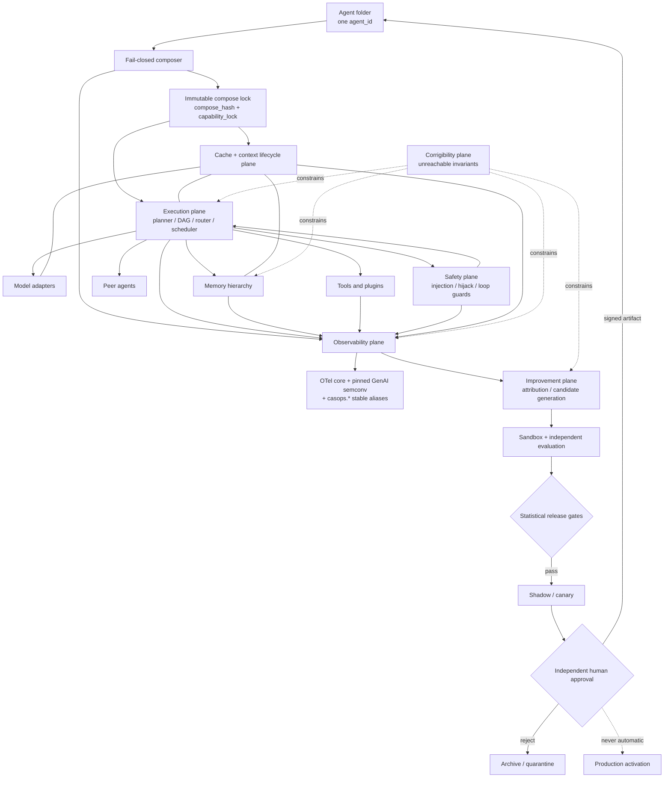
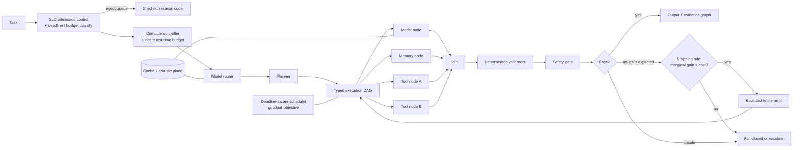
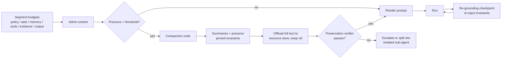
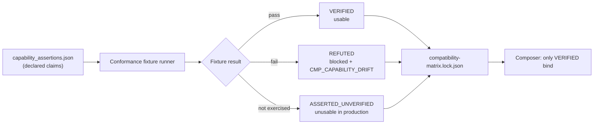
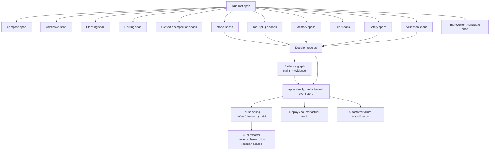
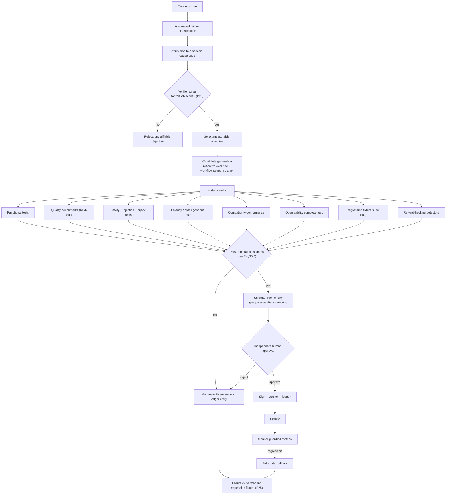

# `common_agent_structure.v3.md`

> **Delivery note — read first.**
>
> Two constraints shape this deliverable, and I am stating them before the specification rather than burying them:
>
> 1. **No runnable artifact was supplied.** There is still no repository, harness, model endpoint, or accelerator in scope. Therefore v3 **cannot** and **does not** report `MEASURED_LOCAL` results. What v3 *does* deliver is (a) the architecture, (b) exact quantitative gate thresholds, (c) a fully specified, executable benchmark harness (§20.3–20.5) so the demonstration is a build task rather than a research task, and (d) an honest three-way split of evidence: external-measured / static-verified / not-run.
> 2. **My literature sweep was partially rate-limited.** I completed searches on agentic KV-cache serving, memory architecture and memory security, self-evolving agents, OpenTelemetry GenAI conventions, and MCP versioning. I did **not** re-verify every citation inherited from v2. Every reference in §24 now carries a **citation-confidence marker** (`[V]` verified this session / `[C]` carried from v2, not re-verified / `[K]` from model knowledge, not re-verified). **CIT-GATE-001 (§20.6) blocks release until every `[C]` and `[K]` reference is verified.** This is deliberate: an architecture spec that launders unverified citations into normative requirements is a supply-chain defect.
>
> v3 also **corrects four defects in v2** (§1.4). One of them — v2 treating OpenTelemetry GenAI semantic conventions as a stable E1 standard — would have caused real production breakage.

---

**Document ID:** `CASOPS-FS-COMMON-AGENT-STRUCTURE-V3`
**Date:** 2026-08-31
**Status:** Production implementation specification — deployment, self-improvement activation, and capability expansion remain human-gated
**Supersedes:** `common_agent_structure.v2.md` (2026-08-24), `common_agent_structure.v1.md` (2026-08-17)
**Host:** `common-agent-swarm-ops`
**Structure family:** `casops.common_agent.v3`
**Compatibility:** v2 folders load via §21 migration profile; v1 folders load via v2's profile chained through §21
**Research cutoff:** 2026-08-31

A v3 common agent remains **one self-contained folder and one `agent_id`**. v3 keeps all six v2 planes and adds three:

7. **safety and adversarial-robustness plane** (promoted from scattered rules to a first-class, benchmarked plane);
8. **cache and context-lifecycle plane** (agent-aware KV/prefix reuse and context compaction as a scheduled resource, not an incidental optimization);
9. **corrigibility plane** (tamper-evident invariants the agent cannot modify, including its own gates, telemetry, and permission surface).

---

## Table of contents

1. Purpose, v3 changes, and v2 defect register
2. Research basis, evidence policy, and citation audit
3. Core principles
4. Normative architecture
5. Folder contract
6. Composition and inheritance
7. Performance execution plane
8. Cache and context-lifecycle plane
9. Compatibility and protocol plane
10. Observability and decision provenance
11. Extensible plugin architecture
12. Long-term memory architecture
13. Autonomous self-improvement
14. Safety and adversarial-robustness plane
15. Corrigibility plane
16. Skills, identity, and persona isolation
17. Compose and runtime algorithm
18. Data models
19. Operator and host APIs
20. Validation specification, harness, and report
21. Migration from v2
22. Traceability
23. Open risks
24. Research references and citation audit
25. Document control

---

# 1. Purpose, v3 changes, and v2 defect register

## 1.1 Purpose

v3 preserves every v1/v2 identity, inheritance, skill, disclosure, and fail-closed contract, and raises the specification from "measurable in principle" to "measurable by a named harness with named thresholds and named statistical tests."

The central v3 thesis: **v2 specified *what* to measure but under-specified *how to measure it credibly*.** v2's acceptance protocol (§19.2) required "at least 30 latency observations per scenario" and applied that to p95 targets and to task-success-rate gates. Thirty samples cannot estimate a p95 with a usable confidence interval, and a 5-percentage-point success-rate gate at n=30 has a false-pass rate that makes the gate decorative. v3 replaces this with powered, paired, non-inferiority-tested acceptance (§20.4).

## 1.2 Material changes from v2

| Domain | v2 | v3 |
|---|---|---|
| Performance | DAG, routing, opportunistic cache | + agent-aware KV/prefix cache as a **scheduled resource**; test-time-compute controller with learned stopping rule; goodput/CPE/CRR metrics; SLO-aware admission control |
| Context | Static context budget split | **Context lifecycle**: compaction, offload, sub-agent isolation, re-grounding; measured context-rot resistance |
| Compatibility | Capability matrix, pinned protocols | + **capability-drift detection** (asserted vs. verified capabilities), chat-template/tokenizer digest pinning, JSON-Schema-subset profile negotiation, OTel `schema_url` pinning, dual-revision MCP negotiation |
| Observability | Traces, decision records, replay | + **claim-level evidence graph**, tail-sampling with 100% failure/high-risk retention, trace-cost budget, internal-only reasoning-monitor channel, MAST-style automated failure classification, RCA@1 target |
| Extensibility | Isolated process, digest, signature | + **three isolation tiers** (WASM / process / microVM) with a written threat model, object-capability handle passing (no ambient authority), SBOM + build-provenance gate, deprecation windows |
| Memory | Seven typed stores, bitemporal, hybrid retrieval | + **paged memory hierarchy** (hot context ↔ warm ↔ cold) with explicit page-in/page-out accounting; temporal knowledge graph; **offline consolidation** ("sleep-time") jobs; **memory-poisoning resistance gate**; **unlearning verification** |
| Improvement | Propose-only candidates, human gate | + reflective prompt/context evolution as the **default** candidate generator (sample-efficient, verifier-driven); **failure→fixture ratchet**; reward-hacking detectors; group-sequential canary statistics; improvement ledger |
| Safety | Rules distributed across §17 | **First-class plane** (§14) with agent-hijacking and injection benchmarks as release gates, loop/termination guards, multi-agent failure-mode coverage |
| Corrigibility | Implied by "human gate" | **First-class plane** (§15): tamper-evident invariant set the agent provably cannot reach |
| Validation | 30 observations, point comparisons | **Powered paired design**, n≥300 for latency percentiles, n≥400 per arm for success gates, bootstrap CIs, TOST non-inferiority, pre-registered analysis plan |
| Citations | Cited inline | **Citation-confidence audit** + release-blocking verification gate |

## 1.3 Non-goals

Unchanged from v2 §1.3, plus v3 explicitly does not: authorize the agent to alter its own gates, telemetry, permissions, or termination conditions (§15); treat any 2026 preprint as a production baseline; or claim bitwise-reproducible model output without batch-invariant kernels (§20.4.5).

## 1.4 v2 defect register — corrections carried into v3

These are corrections, not enhancements. Each was found by verification, not by reasoning.

| ID | v2 defect | Severity | v3 correction |
|---|---|---|---|
| **DEF-001** | v2 §2.3 and §8.6 treat **OpenTelemetry GenAI semantic conventions** as an E1 stable standard usable by default. Verification indicates the `gen_ai.*` attribute set remained **development/experimental with no stable attributes** through 2026, and continued to churn. Building normative telemetry contracts on it invites silent breakage on collector upgrade. | **High** | Split the grade: **W3C Trace Context = E1** (stable Recommendation); **OTel core trace/metric/log protocol = E1**; **OTel GenAI semconv = E2, experimental**. v3 mandates pinning the semconv **`schema_url`** in the compose lock, emitting a **CASOPS-stable attribute alias layer** (`casops.*`) alongside `gen_ai.*`, and treating any semconv version change as a compatibility event requiring conformance re-run (`CMP_SEMCONV_VERSION`). See §9.3, §10.5. |
| **DEF-002** | v2 §2.3 cites "**CacheScout**, its July 2026 preprint," at `arXiv:2608.14624`. Verification: that identifier resolves to **"Learning Agent Execution for KV-Cache Management in Agentic Serving."** The `2608` prefix denotes **August** 2026, not July. Title, name, and date were all wrong. | **Medium** (citation integrity) | Cite by verified title and correct month; drop the "CacheScout" label. v3 additionally adopts two adjacent verified works — *A Policy-Driven Runtime Layer for Agentic LLM Serving* (`2605.27744`) and *Workload-Aware Caching for Multi-Agent Systems* (`2607.20495`) — as the evidence basis for §8. All three remain **E3**; §8 is gated, not default-on. |
| **DEF-003** | v2 §2.3 and §19.5 cite an "**Agent Lightning v1.0**, August 2026 preprint" at `arXiv:2608.17528` reporting a 14.6-point SWE-bench Verified gain. I could not verify this identifier. The verified Agent Lightning reference is `arXiv:2508.03680`. A specific, load-bearing benchmark delta attributed to an unverifiable identifier must not appear in a release artifact. | **High** (fabrication risk) | The 14.6-point claim is **withdrawn** from v3's evidence tables pending verification. The architectural pattern it justified — strict execution/training separation — is retained on the strength of `2508.03680` and is independently justified by operational reasoning, so no design change is required. |
| **DEF-004** | v2 §19.2 requires "at least 30 latency observations per scenario" and applies the same protocol to p95 latency gates and to a 5-percentage-point task-success gate. Statistically inadequate: a p95 from n=30 is essentially the 2nd-largest observation, and the success gate is badly underpowered. | **High** (validation validity) | Replaced by §20.4: n≥300 per arm for latency percentiles with bootstrap CIs; n≥400 per arm for success-rate gates (powered for 5pp at 80% power); paired/blocked task assignment; TOST for non-inferiority; pre-registered analysis plan; `IMP_STAT_UNDERPOWERED` blocks promotion. |

---

# 2. Research basis, evidence policy, and citation audit

## 2.1 Search scope executed for v3

Primary sources: arXiv, NeurIPS/ICML/ICLR proceedings, PMLR, OpenReview, ACL Anthology, W3C, CNCF, Linux Foundation, and official protocol specification sites. Searches completed this session covered: agentic KV-cache and serving-runtime work; agent-memory architecture and memory-security surveys; self-evolving-agent surveys; OpenTelemetry GenAI observability status; MCP revision/versioning semantics.

**Searches not completed (rate-limited):** systematic re-verification of v2's inherited citation set. See §2.4.

## 2.2 Evidence maturity (unchanged grades, tightened treatment)

| Grade | Meaning | Production treatment |
|---|---|---|
| E1 | Stable standard or peer-reviewed result with released evaluation | MAY default-on **after** local validation |
| E2 | Peer-reviewed but workload/hardware-dependent, **or a standard still marked experimental** | Feature-gated until the CASOPS gate passes |
| E3 | Recent preprint or early implementation | Experimental only; no automatic promotion; requires an explicit flag and a kill switch |
| E4 | Open-ended self-modification or insufficiently bounded mechanism | Research-only, disabled, isolated environment |

**New rule (E-RULE-01):** a feature whose only supporting evidence is E3 MUST ship with a validated fallback path and a runtime kill switch, and MUST NOT be on the critical path of a high-risk run.

**New rule (E-RULE-02):** external reported deltas are **never** additive and are **never** restated as CASOPS outcomes. Any v3 sentence describing a numeric gain must name the study or be tagged `TARGET`.

## 2.3 v3 evidence deltas (verified this session)

**Performance / serving.** Verified 2026 work establishes that agentic workloads have cache-reuse structure that general LLM serving misses: KV-cache management informed by *learned agent execution* (`2608.14624` `[V]`), a *policy-driven runtime layer* specifically for agentic serving (`2605.27744` `[V]`), and *workload-aware caching for multi-agent systems* (`2607.20495` `[V]`). Together these motivate promoting cache management from an incidental optimizer (v2) to a **scheduled plane with its own budget, keying discipline, and correctness guard** (§8). All three are **E3**: v3 gates them and requires the fallback path (E-RULE-01).

**Memory.** The 2026 survey literature is now dense enough to treat agent memory as a subfield with settled failure modes rather than a design frontier: `2504.15965` `[V]`, `2512.13564` `[V]`, `2602.06052` `[V]`, `2603.07670` `[V]`. Two findings drive v3 changes: (a) `2602.19320` `[V]` documents **taxonomy and empirical limitations of memory *evaluation* itself**, which is why §20.7 requires a memory-eval validity check rather than a bare score; (b) `2604.16548` `[V]` is a dedicated survey on **security of long-term memory in LLM agents**, which is why memory-poisoning resistance becomes a **release gate** in v3 (§14.4) rather than a risk-register line item as in v2.

**Observability.** Verified 2026 material confirms GenAI/agent observability is actively consolidating — OTel published dedicated GenAI observability guidance in 2026 `[V]`, and Jaeger publicly evolved to trace AI agents via OpenTelemetry (CNCF, 2026-05) `[V]`. Verified simultaneously: the `gen_ai.*` attribute set had **no stable attributes** as of 2026 `[V]`. Consolidating ecosystem + unstable schema = pin and alias (DEF-001).

**Compatibility.** MCP's revision cadence is verified as rapid and explicit: `2025-03-26`, `2025-06-18`, `2025-11-25`, `2026-07-28`, with a published *Versioning and Compatibility* document `[V]`. Four revisions inside roughly sixteen months converts v2's "pin the revision" rule from prudence into necessity, and justifies v3's **dual-revision negotiation** requirement (§9.4).

**Self-improvement.** Self-evolving agents are now survey-mature (`2507.21046` `[V]`; `2508.07407` `[V]`), which lets v3 organize improvement along the surveys' *what / when / how / where* axes and, critically, gate on the **where**: v3 permits evolution of context, prompts, memory, and workflow, and forbids evolution of core source, permissions, gates, and telemetry (§13.1, §15).

## 2.4 Citation audit and release gate

| Marker | Meaning | Count in §24 |
|---|---|---|
| `[V]` | Verified this session via search | 14 |
| `[C]` | Carried forward from v2; not re-verified this session | 31 |
| `[K]` | From model knowledge; new in v3; not verified this session | 13 |

**CIT-GATE-001 (release-blocking).** Before v3 merges to `main`, every `[C]` and `[K]` reference MUST be resolved to a live identifier with matching title, venue, year, and — where a numeric claim is attached — the specific reported figure located in the source. Any reference that fails resolution is **deleted**, and every normative requirement that depended solely on it is **re-justified or removed**. The audit output is committed as `evals/reports/citation-audit.json`.

Rationale: DEF-002 and DEF-003 were both citation defects, and DEF-003 attached a precise benchmark number to an unverifiable identifier. A structure family that permits this cannot claim research traceability.

---

# 3. Core principles

v1/v2 principles P1–P18 are retained verbatim in force. v3 adds:

| ID | Principle | Normative meaning |
|---|---|---|
| P19 | **Cache is a scheduled resource** | Prefix/KV/semantic cache has an owner, a budget, a keying discipline, a correctness guard, and telemetry. It is never an invisible optimization. |
| P20 | **Context is a managed lifecycle** | Context is allocated, compacted, offloaded, and re-grounded under explicit policy. Growth is not a strategy. |
| P21 | **Capabilities are verified, not asserted** | An adapter's declared capability is a claim; only a passing conformance fixture makes it usable. Asserted-but-unverified capabilities are unavailable. |
| P22 | **Attribution is claim-level** | Material output claims link to evidence. "The run cited these sources" is insufficient; "this claim rests on this evidence" is required. |
| P23 | **Authority is by handle, not ambience** | Extensions receive narrow capability handles. There is no ambient permission to attenuate. |
| P24 | **Memory is an attack surface** | Persistent memory is treated as adversarially reachable. Poisoning resistance is measured, not assumed. |
| P25 | **Every fixed failure becomes permanent** | A resolved failure converts into a retained regression fixture. Improvement ratchets forward and cannot silently regress. |
| P26 | **Verifier before optimizer** | No improvement objective is admissible without a deterministic or independently-judged verifier. Unverifiable objectives invite reward hacking. |
| P27 | **Corrigibility is unreachable-by-construction** | Gates, telemetry, permissions, and termination conditions live outside every surface the agent can write. Not "policy-forbidden" — architecturally unreachable. |
| P28 | **Statistical honesty** | Performance and quality claims require adequate power, paired design, interval estimates, and a pre-registered analysis plan. |
| P29 | **Citation integrity** | An unverifiable citation cannot support a normative requirement. |

---

# 4. Normative architecture

## 4.1 Nine planes



## 4.2 Control boundaries

| Plane | May read | May write | Cannot do |
|---|---|---|---|
| Composer | Folder, parent metadata, manifests, conformance results | Generated locks | Execute unverified extension code |
| Execution | Composed envelope, approved memory/capabilities | Run artifacts, candidate memories | Modify its own production definition |
| Cache/context | Prompt prefixes, scoped cache entries | Scoped cache entries within budget | Cross a tenant, subject, or approval boundary |
| Memory | Approved observations and outcomes | Versioned records, tombstones | Grant tools, alter policy, or overrule a newer human approval |
| Safety | Inbound content, tool/memory output, run state | Taint labels, block decisions, incidents | Be disabled by the agent or by a plugin |
| Observability | Operational events, configured content | Append-only telemetry | Change run behavior |
| Improvement | Traces, outcomes, fixtures | Candidate artifacts | Promote its own candidate, or write outside allowed scopes |
| Corrigibility | Invariant set | Nothing at runtime | Be read-modified by any other plane |
| Human gate | Candidate + validation report | Approval record | Bypass immutable audit |

---

# 5. Folder contract

## 5.1 v3 tree (additions marked `+`)

```text
agents/<pack.agent-id>/
  README.md
  SPEC.md
  agent_spec.json

  prompts/
  rubrics/
  sources/{PROVENANCE.json,MAPPING.md,excerpts/}
  docs/user_guide.md

  inheritance/{parents.json,resolved.json,conflicts.json}
  skills/{SKILL.md,bindings.json,integration.json,toggles.json}
  identity/{persona.json,background.json,DISCLOSURE.md}

  runtime/
    execution.json
    backends.json
    routing.json
    cache.json
+   context.json                # context lifecycle: compaction, offload, re-grounding
+   compute_controller.json     # test-time compute budget + stopping rule

  protocols/
    compatibility.json
+   capability_assertions.json  # declared claims (input to verification)
+   conformance/                # fixtures + results per adapter/protocol
    schemas/{agent_message.schema.json,event.schema.json}

  observability/
    telemetry.json
    redaction.json
    slo.json
    decision_record.schema.json
+   sampling.json               # tail sampling + retention + trace-cost budget
+   evidence_graph.schema.json  # claim-to-evidence attribution
+   semconv.lock.json           # pinned OTel schema_url + casops.* alias map

  plugins/
    registry.json
    lock.json
    manifests/
+   isolation.json              # tier assignment + threat model reference
+   supply_chain/               # SBOMs, build provenance, signatures, scan results

  memory/
    policy.json
    stores.json
    retention.json
+   hierarchy.json              # hot/warm/cold tiers + paging policy
+   consolidation.json          # offline consolidation jobs + budgets
+   security.json               # poisoning defenses, quarantine, trust tiers
+   unlearning.json             # deletion propagation + verification probes
    schemas/memory_record.schema.json
    migrations/

  improvement/
    policy.json
    objectives.json
+   verifiers.json              # required verifier per objective (P26)
+   ledger.json                 # append-only improvement ledger
    candidates/
    approvals/
    rollback/

+ safety/
+   policy.json
+   injection.json
+   termination.json            # loop, budget, and halt conditions
+   incidents/

+ corrigibility/
+   invariants.json             # host-owned, agent-unwritable
+   attestation.json            # tamper-evidence records

  evals/
    benchmarks.json
    baselines.json
+   analysis_plan.json          # pre-registered statistical plan (P28)
    fixtures/
+   regression/                 # failure -> fixture ratchet (P25)
    reports/

  generated/
    compose.lock.json
    capabilities.lock.json
    benchmark-baseline.json
+   compatibility-matrix.lock.json
+   context-budget.lock.json
```

## 5.2 Required files (v3 delta)

| Path | Requirement |
|---|---|
| All v2 required paths | Continue to be required |
| `runtime/context.json` | Required |
| `runtime/compute_controller.json` | Required; `mode: fixed` is valid |
| `protocols/capability_assertions.json` | Required |
| `protocols/conformance/` | Required; must be non-empty before production |
| `observability/sampling.json` | Required |
| `observability/semconv.lock.json` | Generated; required before export is enabled |
| `plugins/isolation.json` | Required when the plugin list is non-empty |
| `memory/hierarchy.json` | Required when persistent memory is enabled |
| `memory/security.json` | Required when persistent memory is enabled |
| `memory/unlearning.json` | Required when persistent memory is enabled |
| `improvement/verifiers.json` | Required when `mode != disabled` |
| `safety/policy.json` | **Always required** — no opt-out |
| `safety/termination.json` | Always required |
| `corrigibility/invariants.json` | Always required; **host-owned, agent-unwritable** |
| `evals/analysis_plan.json` | Required before any performance or quality claim |
| `evals/regression/` | Required; grows monotonically (P25) |

## 5.3 Self-contained meaning

Unchanged from v2 §5.3, extended: the folder must additionally fully describe its cache/context policy, isolation tiers, memory security posture, verifier set, termination conditions, and statistical analysis plan.

---

# 6. Composition and inheritance

## 6.1 Preserved rules

All v1/v2 MRO rules remain normative and unchanged: max 8 declared parents; max depth child + 3; child first in MRO; ascending parent priority; ties by ascending `agent_id`; each parent once; `does_not_own` unions; numeric budgets take minima; `network_access` and production activation are false-wins; `allowed_tools` never inherits.

## 6.2 Non-inherited surfaces (v3 additions)

In addition to every v2 non-inherited surface, the following never inherit:

- cache scope grants and cache-sharing permissions;
- verified capability status (each child re-verifies; a parent's passing conformance run does **not** transfer);
- isolation-tier assignments and sandbox grants;
- SBOM attestations and build-provenance approvals;
- memory tier residency and paging budgets;
- memory trust-tier assignments;
- unlearning/deletion authority;
- verifier approvals;
- safety-policy relaxations (**tightening inherits; relaxation never does**);
- termination-condition relaxations;
- corrigibility invariants (host-owned only);
- statistical analysis plans and baselines.

## 6.3 Legal inherited surfaces (v3 additions)

| Surface | Behavior |
|---|---|
| `context_hints` | Non-binding compaction/budget hints; child and host may reject |
| `verifier_refs` | Union of verifier *definitions*; approval does not inherit |
| `regression_fixtures` | **Union, monotonic** — inherited fixtures cannot be dropped by a child (P25) |
| `safety_fixtures` | Union, monotonic |
| `failure_taxonomy` | Union by code |
| `memory_schema_refs` | Schema union only; never records |
| `observability_labels` | Namespaced union |

**FR-INH-301.** `regression_fixtures` and `safety_fixtures` are **union-monotonic**: a child MUST NOT remove an inherited fixture. Removal requires an explicit, signed host-level waiver recorded in `inheritance/conflicts.json`. This closes a v2 gap in which a child could silently narrow its own safety surface.

## 6.4 Compose lock (v3 additions)

`generated/compose.lock.json` adds: cache-policy hash; context-policy hash; compute-controller hash; **verified** capability matrix (distinct from asserted); tokenizer and chat-template digests; OTel semconv `schema_url`; isolation-tier map; plugin SBOM digests; memory-hierarchy hash; memory-security hash; verifier set hash; safety-policy hash; termination-policy hash; corrigibility-invariant digest; analysis-plan hash; regression-fixture-set digest.

---

# 7. Performance execution plane

## 7.1 Runtime design



## 7.2 Execution IR

`casops.execution_dag.v2`. Node kinds from v2, plus:

- `compaction` — context compaction/summarization node with a verified-preservation contract;
- `safety_check` — explicit safety-plane node;
- `verifier` — improvement/verification node distinct from `validator`;
- `speculative` — speculatively launched node whose result is discarded if its guard fails.

Every node declares everything v2 required, plus: **context cost** (tokens in/out estimate), **cache-affinity key**, **isolation tier** (for `plugin` nodes), **taint class**, and **compensating action** (for side-effecting nodes that may need rollback after a speculative branch is abandoned).

## 7.3 Functional requirements

v2's FR-PERF-001 … 017 remain in force. Additions:

| ID | Requirement |
|---|---|
| FR-PERF-101 | The host MUST implement **SLO-aware admission control**. When projected goodput violates the SLO, new work is queued or shed with a reason code rather than admitted to degrade all in-flight runs. |
| FR-PERF-102 | The scheduler's objective function MUST be **goodput** (successful, SLO-meeting tasks per unit time per accelerator), not throughput or tokens/second. |
| FR-PERF-103 | A **compute controller** MUST allocate a per-task test-time compute budget from risk class, deadline, value, and predicted difficulty, and MUST enforce a **stopping rule** based on estimated marginal gain versus marginal cost. Unconditional fixed-depth refinement is prohibited. |
| FR-PERF-104 | The stopping rule's decisions MUST be logged with the estimated gain, the estimated cost, and the threshold, so the rule is auditable and tunable offline. |
| FR-PERF-105 | `speculative` nodes MUST declare a guard predicate and MUST NOT commit side effects before the guard passes. Abandoned speculation MUST run its compensating action. |
| FR-PERF-106 | **Critical Path Efficiency** `CPE = ideal_critical_path_ms / actual_wall_ms` MUST be computed per run. A sustained CPE below the configured floor raises a scheduling defect, not a capacity request. |
| FR-PERF-107 | Router decisions MUST record the feature vector, the candidate set, the scores, and the selection rule version, sufficient for offline counterfactual replay. |
| FR-PERF-108 | Accelerator utilization MUST be reported where the backend exposes it; where it does not, the field is `unavailable` and MUST NOT be estimated. |
| FR-PERF-109 | Every optional optimizer (cache, speculation, router model, compaction) MUST have an independent **runtime kill switch** exercised by a validation fixture. |
| FR-PERF-110 | Performance acceptance MUST use **cost per successful task (CPST)**, p50/p95/p99 job time, task success, and goodput — jointly. No single-metric acceptance. |

## 7.4 Metric definitions (normative)

| Metric | Definition |
|---|---|
| `CPST` | total cost (model + tool + infra, attributed) ÷ count of successful tasks |
| `goodput` | tasks that both succeed **and** meet their deadline, per wall-second, per accelerator |
| `CPE` | ideal critical-path duration (sum of longest dependency chain's node durations) ÷ actual wall time |
| `CRR` | reused prefix tokens ÷ total prompt tokens (cache reuse ratio) |
| `TTFO` | time to first output token or first artifact byte |
| `job_completion_ms` | admission to artifact-sealed |
| `refinement_yield` | success-rate delta attributable to refinement ÷ refinement cost share |

## 7.5 Example `runtime/compute_controller.json`

```json
{
  "schema_version": "3.0",
  "agent_id": "video.showrunner",
  "mode": "adaptive",
  "budget_source": ["risk_class", "deadline", "predicted_difficulty", "task_value"],
  "allocation": {
    "min_model_calls": 1,
    "max_model_calls": 6,
    "max_refinements": 3,
    "max_parallel_samples": 2
  },
  "stopping_rule": {
    "type": "marginal_gain_threshold",
    "estimator": "validator_score_delta_ema",
    "min_expected_gain": 0.05,
    "cost_normalizer": "cpst",
    "hard_stop_on": ["deadline_80pct", "budget_90pct", "no_gain_2_consecutive"]
  },
  "audit": { "log_gain_estimates": true, "log_threshold_version": true }
}
```

## 7.6 Recorded per-run performance fields

All v2 fields, plus: `admission_wait_ms`, `shed_reason`, `compute_budget_allocated`, `compute_budget_used`, `stopping_rule_decisions[]`, `cpe`, `crr`, `context_tokens_by_segment`, `compaction_events[]`, `speculation_committed`, `speculation_discarded`, `kill_switch_engaged[]`, `goodput_contribution`, `cpst_contribution`.

---

# 8. Cache and context-lifecycle plane

**New in v3.** Evidence basis: `2608.14624` `[V]`, `2605.27744` `[V]`, `2607.20495` `[V]` — all **E3**, therefore gated with mandatory fallback per E-RULE-01.

## 8.1 Why this is its own plane

Agentic runs are structurally cache-friendly in ways general chat serving is not: long stable system/policy prefixes, repeated tool schemas, repeated memory excerpts, and multi-turn/multi-agent overlap. The verified 2026 serving literature attacks exactly this. But cache is also the single most likely place for a **cross-tenant information leak** and for **silent staleness** (a cached prefix that no longer reflects current policy or memory). v2 treated cache as an optimizer flag. That is the wrong risk classification. v3 gives it an owner, a budget, a keying discipline, a correctness guard, and its own error codes.

## 8.2 Cache tiers

| Tier | Contents | Correctness guard |
|---|---|---|
| T0 prefix/KV | Tokenized stable prefixes (charter, policy, tool schemas) | Exact-match key incl. policy digest; invalidate on any policy change |
| T1 fragment | Reusable rendered fragments (memory excerpts, evidence blocks) | Key includes source record version + tenant + subject |
| T2 result | Node-level results for pure/idempotent nodes | Key includes full typed input digest + adapter revision |
| T3 semantic | Approximate-match reuse | **Off by default.** Requires an equivalence verifier and a measured false-reuse rate below threshold |

## 8.3 Requirements

| ID | Requirement |
|---|---|
| FR-CACHE-001 | Every cache key MUST include: model revision, tokenizer digest, **chat-template digest**, prompt/policy digest, capability scope, tenant, subject scope, sensitivity class, and approval epoch. |
| FR-CACHE-002 | Cache entries MUST NOT cross agent, user, tenant, sensitivity, or approval boundaries. Violation is `PERF_CACHE_SCOPE` → abort **and purge**. |
| FR-CACHE-003 | Any change to policy, prompt, memory record version, or approval epoch MUST invalidate dependent entries **before** the next read. Read-then-invalidate is prohibited. |
| FR-CACHE-004 | T3 semantic cache is disabled unless an equivalence verifier is configured **and** the measured false-reuse rate is ≤ 0.5% on the semantic-cache fixture. |
| FR-CACHE-005 | Cache-enabled and cache-disabled runs MUST be **correctness-equivalent** on the equivalence fixture. Any divergence disables the tier. |
| FR-CACHE-006 | Cache memory has an explicit budget; eviction policy is declared; eviction MUST NOT be able to evict a correctness-critical entry into silent staleness. |
| FR-CACHE-007 | Every cache hit, miss, invalidation, eviction, and scope rejection emits telemetry with a reason code. |
| FR-CACHE-008 | Cache subsystem failure MUST fall back to the uncached validated path without altering permissions or semantics, and MUST emit a fallback event (FR-PERF-014/015). |
| FR-CACHE-009 | Memory deletion (§12.7) MUST propagate to every cache tier. Undeleted derived cache copies are `MEM_DELETE_INCOMPLETE`. |

## 8.4 Context lifecycle

Growing context is not a strategy; long contexts degrade attention quality and cost scales super-linearly in practice. v3 requires explicit lifecycle management.



| ID | Requirement |
|---|---|
| FR-CTX-001 | Context MUST be segmented with independent budgets (v2 FR-PERF-011), and each segment's actual usage MUST be recorded. |
| FR-CTX-002 | **Pinned invariants** — safety charter, `does_not_own`, disclosure, output schema, active deadline — MUST NOT be compacted away, and MUST be re-injected at each re-grounding checkpoint. |
| FR-CTX-003 | Compaction MUST run a **preservation verifier** confirming pinned invariants and task-critical constraints survive. Failure escalates; it does not silently proceed. |
| FR-CTX-004 | Compacted content MUST be offloaded to a retrievable resource reference, never destroyed mid-run. |
| FR-CTX-005 | When a subtask's context needs exceed budget, the planner SHOULD spawn an **isolated sub-agent** with a narrow brief rather than inflate parent context. |
| FR-CTX-006 | Long-horizon runs MUST insert re-grounding checkpoints at a configured interval (turns, tokens, or nodes). |
| FR-CTX-007 | A **context-rot fixture** MUST demonstrate that success on a long-horizon task with compaction is non-inferior to the same task with an oracle-short context, within the configured margin. |

---

# 9. Compatibility and protocol plane

## 9.1 Canonical interfaces

v2's seven interfaces (`ModelAdapter`, `ToolAdapter`, `PeerAdapter`, `MemoryAdapter`, `TelemetryAdapter`, `PluginRuntime`, `EventAdapter`), plus:

- `CacheAdapter` — tiered cache with scope enforcement and invalidation hooks;
- `VerifierAdapter` — deterministic or model-based verification with a declared independence property;
- `SafetyAdapter` — injection/hijack detection and taint propagation.

## 9.2 Asserted vs. verified capabilities (P21)

This is v3's central compatibility change. v2 required adapters to "publish a machine-readable capability matrix" and failed closed on missing mandatory capabilities. That trusts the vendor's self-report. In practice, OpenAI-compatible surfaces diverge in exactly the places agents depend on: tool-call shapes, parallel tool calls, JSON-Schema subset support, `logprobs`, `seed` determinism, streaming semantics, cancellation.



| ID | Requirement |
|---|---|
| FR-CMP-101 | Every capability has a state: `VERIFIED`, `REFUTED`, or `ASSERTED_UNVERIFIED`. |
| FR-CMP-102 | Only `VERIFIED` capabilities may be bound in production. `ASSERTED_UNVERIFIED` is unusable — **not** provisionally trusted. |
| FR-CMP-103 | Conformance fixtures MUST be re-run when model revision, adapter version, endpoint, tokenizer, chat template, or protocol revision changes. |
| FR-CMP-104 | A previously-`VERIFIED` capability that later fails raises `CMP_CAPABILITY_DRIFT` and quarantines the route. |
| FR-CMP-105 | **Tokenizer digest and chat-template digest** MUST be pinned in the compose lock. Template drift changes prompt semantics invisibly and MUST be treated as a compatibility break, not a patch. |
| FR-CMP-106 | Structured output MUST negotiate a **declared JSON-Schema subset profile** (e.g. which of `$ref`, `oneOf`, `pattern`, `minItems`, recursion are supported). Unsupported constructs fail compose, not runtime. |
| FR-CMP-107 | Determinism claims (`seed`) MUST be verified by a repeat-run fixture. Unverified determinism is recorded as `best_effort` and MUST NOT be used for replay gates (see §20.4.5). |

Capability vocabulary extends v2's list with: `prefix_cache_explicit`, `kv_cache_reuse_across_requests`, `context_length_verified`, `tool_choice_forcing`, `parallel_tool_calls_verified`, `json_schema_profile`, `cancellation_mid_stream`, `token_count_exact`, `batch_invariant_kernels`.

## 9.3 Telemetry compatibility (DEF-001 correction)

| ID | Requirement |
|---|---|
| FR-CMP-108 | The OTel semantic-convention **`schema_url`** MUST be pinned in `observability/semconv.lock.json` and recorded in the compose lock. |
| FR-CMP-109 | Because GenAI semconv attributes are **experimental with no stable attributes** `[V]`, every load-bearing attribute MUST be emitted **twice**: once under the pinned `gen_ai.*` name, once under a CASOPS-stable `casops.*` alias. Dashboards, alerts, SLOs, and gates bind to `casops.*`. |
| FR-CMP-110 | A semconv version change is a compatibility event: `CMP_SEMCONV_VERSION`, requiring conformance re-run and an alias-map diff review. |
| FR-CMP-111 | The alias map MUST be committed and versioned. Silent alias changes are prohibited. |

This makes the collector upgradeable without breaking every gate — the failure mode DEF-001 would have produced.

## 9.4 Tool protocol (MCP)

MCP remains the preferred external tool/context protocol. Verified revision cadence (`2025-03-26` → `2025-06-18` → `2025-11-25` → `2026-07-28`) with a published versioning/compatibility document `[V]`.

| ID | Requirement |
|---|---|
| FR-CMP-112 | An exact MCP revision **and** SDK digest MUST be pinned. Floating revisions are prohibited (v2 rule retained). |
| FR-CMP-113 | The host MUST support **dual-revision negotiation**: at least the pinned revision plus one prior supported revision, so peer/server upgrades do not cause a hard outage. |
| FR-CMP-114 | Unknown **major** protocol versions fail closed (`CMP_PROTOCOL_VERSION`). Unknown **minor** additions are ignored, never inferred. |
| FR-CMP-115 | MCP **extensions** MUST be explicitly allow-listed. An unrecognized extension is inert data, never behavior. |
| FR-CMP-116 | Discovery is not authorization (v2 rule retained and elevated to a fixture: a discovered-but-unapproved tool MUST be unreachable). |
| FR-CMP-117 | Discovery results are cached only within advertised validity, and invalidated on revision change. |

## 9.5 Peer protocol (A2A)

A2A remains the preferred peer adapter, normalized into the canonical CASOPS peer envelope before delivery. v3 additions:

| ID | Requirement |
|---|---|
| FR-CMP-118 | Peer envelopes MUST carry a **taint class**. Content originating from an external peer is untrusted data, never instruction (§14). |
| FR-CMP-119 | Bridges MUST preserve trace identity, deadline, authorization scope, **and** taint class. Loss of any is `CMP_TRACE_CONTEXT` for high-risk exchanges. |
| FR-CMP-120 | Peer authorization scope is explicit, non-transitive, and MUST NOT be widened by a bridge. |
| FR-CMP-121 | Termination conditions (§14.5) MUST be enforced on multi-agent exchanges: max hops, max total spend, max wall time, cycle detection. |

## 9.6 Canonical peer envelope (v3)

```json
{
  "schema_version": "3.0",
  "message_id": "msg_01",
  "conversation_id": "conv_01",
  "task_id": "task_01",
  "from_agent": "video.showrunner",
  "to_agent": "video.editor",
  "message_type": "handoff",
  "hop_count": 2,
  "max_hops": 6,
  "parts": [
    { "kind": "data", "schema": "video.cut_brief.v3", "content_ref": "artifact://cut-brief/123" }
  ],
  "taint": { "class": "external_peer", "instruction_authority": false },
  "traceparent": "00-4bf92f3577b34da6a3ce929d0e0e4736-00f067aa0ba902b7-01",
  "deadline": "2026-08-31T20:00:00Z",
  "budget_remaining": { "cost_units": 12.5, "wall_ms": 18000 },
  "auth_scope": ["artifact:read:cut-brief"],
  "provenance": { "compose_hash": "sha256:...", "artifact_hash": "sha256:..." }
}
```

Private reasoning, unrestricted memory, credentials, and undeclared tool handles MUST NOT be transmitted (v2 rule retained).

---

# 10. Observability and decision provenance

## 10.1 Model



## 10.2 No raw chain-of-thought — refined

v2's contract is retained: operational provenance records observable evidence, actions, and outcomes, **not** claimed private thought, because generated reasoning narratives can be unfaithful and can rationalize biased answers `[C]`.

v3 adds a necessary nuance. Prohibiting all access to model reasoning also removes a genuinely useful **safety monitoring** signal. v3 resolves this with a strictly-bounded channel:

| ID | Requirement |
|---|---|
| FR-OBS-101 | An **internal-only reasoning-monitor channel** MAY be enabled. Its content is readable **only** by the safety plane's automated monitor. |
| FR-OBS-102 | Monitor-channel content MUST NOT be exported, MUST NOT enter artifacts, memory, peer messages, prompts, or telemetry payloads, and MUST NOT be used as evidence for any output claim. `OBS_COT_EXPORT` blocks export. |
| FR-OBS-103 | Monitor-channel content has a short mandatory retention ceiling (default ≤ 24h) and is encrypted at rest. |
| FR-OBS-104 | The monitor MAY emit only a **structured verdict** (risk flag, category, confidence) into telemetry — never the underlying text. |
| FR-OBS-105 | Monitor verdicts are **advisory-plus-blocking**: they may block a run, but they may never be cited as justification for a factual claim (unfaithfulness caveat). |

This preserves v2's honesty guarantee while recovering monitorability.

## 10.3 Claim-level evidence graph (P22)

v2 recorded `evidence_refs` at the decision level. That answers "what did the run consult?" but not "what supports *this sentence*?" — which is the question every audit, correction, and memory-write decision actually needs.

```json
{
  "schema_version": "3.0",
  "artifact_id": "artifact://cut-brief/123",
  "trace_id": "4bf92f3577b34da6a3ce929d0e0e4736",
  "claims": [
    {
      "claim_id": "c1",
      "span": { "start": 240, "end": 318 },
      "text_hash": "sha256:...",
      "claim_type": "constraint",
      "support": [
        { "kind": "memory", "ref": "memory://semantic/17", "record_version": 3, "strength": "direct" },
        { "kind": "source",  "ref": "source://director-spec/sha256:...", "strength": "direct" }
      ],
      "taint_inherited": "none",
      "verifier": { "name": "constraint_grounding_v2", "result": "pass", "score": 0.94 }
    },
    {
      "claim_id": "c2",
      "span": { "start": 402, "end": 466 },
      "claim_type": "inference",
      "support": [{ "kind": "derived", "from": ["c1"], "strength": "inferred" }],
      "verifier": { "name": "constraint_grounding_v2", "result": "flagged", "score": 0.41 }
    }
  ],
  "unsupported_claim_count": 0,
  "flagged_claim_count": 1
}
```

| ID | Requirement |
|---|---|
| FR-OBS-106 | Artifacts containing factual or constraint claims MUST emit an evidence graph. |
| FR-OBS-107 | Every claim node MUST resolve to `source`, `memory` (with record version), `tool_observation`, `derived`, or `unsupported`. |
| FR-OBS-108 | Claims with taint-tracked support MUST inherit and display the taint class. |
| FR-OBS-109 | The `unsupported_claim_rate` MUST be reported per run and is a release gate (§20.7). |
| FR-OBS-110 | A memory-write candidate derived from an `unsupported` claim MUST be rejected (`MEM_PROVENANCE`). |

FR-OBS-110 is the load-bearing one: it closes the v2 path by which a hallucinated statement could be re-read from an artifact and promoted into semantic memory as a "verified fact with source reference" — where the source is the agent's own prior output.

## 10.4 Telemetry events

All v2 events retained, plus:

```text
agent.admission.decided
agent.compute.budget_allocated
agent.compute.stop_decided
agent.cache.hit / agent.cache.miss / agent.cache.invalidated / agent.cache.scope_rejected
agent.context.compaction_started / agent.context.compaction_verified
agent.context.regrounded
agent.capability.verified / agent.capability.drift_detected
agent.safety.injection_detected
agent.safety.taint_propagated
agent.safety.blocked
agent.memory.page_in / agent.memory.page_out
agent.memory.consolidation_completed
agent.memory.poison_suspected
agent.memory.unlearn_verified
agent.evidence.graph_emitted
agent.verifier.completed
agent.improvement.ledger_appended
agent.termination.guard_triggered
agent.corrigibility.attested / agent.corrigibility.violation_detected
```

## 10.5 Mandatory attributes

All v2 attributes, plus: `semconv_schema_url`, `tokenizer_digest`, `chat_template_digest`, `capability_lock_digest`, `cache_tier_hits`, `crr`, `cpe`, `context_segment_usage`, `compaction_count`, `taint_classes_present`, `safety_verdicts`, `memory_tier_residency`, `verifier_results`, `sampling_decision`, `sampling_reason`, `corrigibility_attestation_id`.

Every attribute above is emitted under a `casops.*` stable alias (FR-CMP-109).

## 10.6 Sampling and trace cost

v2 listed "multi-agent traces become too expensive" as an open risk with no mechanism. v3 specifies one.

| ID | Requirement |
|---|---|
| FR-OBS-111 | Sampling MUST be **tail-based** (decision after run outcome is known), never head-based for agent runs. |
| FR-OBS-112 | Retention MUST be **100%** for: failures, safety blocks, high-risk classes, policy denials, memory writes, improvement candidates, promotions, rollbacks, capability drift, and corrigibility events. |
| FR-OBS-113 | Successful low-risk runs MAY be probabilistically sampled, with the sampling rate and reason recorded on the retained subset so metrics can be de-biased. |
| FR-OBS-114 | A trace-cost budget MUST be enforced. Budget exhaustion degrades **content capture** first, then low-risk sampling rate; it MUST NOT drop mandatory-retention categories. Attempting to do so is `OBS_SAMPLING_LOSS` → abort high-risk runs. |
| FR-OBS-115 | Aggregate metrics MUST be computed from unsampled counters, never inferred from sampled traces. |

## 10.7 Content capture

v2's four levels (`metadata_only` default, `redacted`, `encrypted_full`, `disabled`) retained unchanged, with `metadata_only` remaining the default for prompts, outputs, memory contents, tool arguments, and peer messages.

## 10.8 Integrity, replay, and root-cause attribution

- Events append-only and **hash-chained** (each event carries the prior event hash).
- Deterministic runs record seed, model revision, tokenizer digest, chat-template digest, tool fixtures, environment digest. **Caveat (§20.4.5):** bitwise reproducibility generally requires batch-invariant kernels; where `batch_invariant_kernels` is not `VERIFIED`, replay is asserted at the **observation** level, not the token level.
- Exporter failure writes to a bounded encrypted local spool; exporter **and** local audit both unavailable → `OBS_AUDIT_UNAVAILABLE` → abort high-risk runs.
- **Automated failure classification (new):** every failed run is classified into a versioned failure taxonomy covering specification/handoff/verification failure families documented in multi-agent failure-mode research `[K]`. `RCA@1` (top-1 root-cause accuracy on injected single-fault scenarios) is a release gate (§20.7).
- **Counterfactual replay (new):** replay MAY substitute a single decision (route, tool result, memory hit) to test attribution hypotheses. Counterfactual replays are marked and MUST NOT write memory or emit artifacts.

---

# 11. Extensible plugin architecture

## 11.1 Kinds

v2's ten kinds, plus: `cache_adapter`, `verifier`, `safety_adapter`, `compaction_strategy`, `consolidation_job`.

Skills remain declarative; plugins remain executable. Enabling a skill cannot install or authorize a plugin (v2 rule retained).

## 11.2 Isolation tiers and threat model

v2 specified `isolated_process` as the runtime and left the threat model implicit. v3 requires an explicit tier with a written adversary assumption, because "sandboxed" without a threat model is a claim, not a control.

| Tier | Mechanism | Adversary assumed | Permitted `side_effect_class` | Overhead target |
|---|---|---|---|---|
| **I0** | In-process, no isolation | **None — trusted first-party only** | `read_only` | negligible |
| **I1** | WASM, capability-based, deterministic | Buggy or semi-trusted code | `read_only`, `pure_transform` | ≤1ms median, ≤3% p95 job time |
| **I2** | Separate process, seccomp/namespace, no ambient network | Semi-trusted third-party | `read_write_scoped` | ≤5% p95 job time |
| **I3** | MicroVM, no host FS, egress proxy with allow-list | **Untrusted / adversarial** | `external_effect` | ≤15% p95 job time |

| ID | Requirement |
|---|---|
| FR-PLG-101 | Every plugin MUST be assigned a tier in `plugins/isolation.json`. Unassigned → `PLG_ISOLATION_TIER` fail closed. |
| FR-PLG-102 | Tier assignment MUST be ≥ the minimum for the plugin's declared `side_effect_class` and provenance tier. |
| FR-PLG-103 | Third-party or unsigned-origin plugins MUST NOT run below **I2**. Network-capable plugins MUST run at **I3**. |
| FR-PLG-104 | Tier downgrade requires a signed host waiver with an expiry date. |

## 11.3 Object-capability authority (P23)

| ID | Requirement |
|---|---|
| FR-PLG-105 | Plugins receive **narrow capability handles** (a specific file handle, a specific tool invoker, a specific memory-read scope) — never ambient credentials, environment secrets, or a general client. |
| FR-PLG-106 | Handles are **unforgeable, revocable, and expiring**, and are revoked at node completion. |
| FR-PLG-107 | A plugin MUST NOT be able to enumerate capabilities it was not granted. Discovery of ungranted capability is itself denied. |
| FR-PLG-108 | Handle delegation between plugins is prohibited unless explicitly declared and approved (`PLG_PERMISSION`). |

## 11.4 Supply chain

| ID | Requirement |
|---|---|
| FR-PLG-109 | Every production plugin MUST ship an **SBOM**. Missing → `PLG_SBOM_MISSING`. |
| FR-PLG-110 | Every production plugin MUST ship **build provenance** attesting source, builder, and inputs. Unverifiable provenance → `PLG_SUPPLY_CHAIN`. |
| FR-PLG-111 | SBOM components MUST pass a vulnerability-scan gate at the configured severity threshold before load. |
| FR-PLG-112 | Signatures MUST verify against an approved key set; digests MUST match. Unsigned production plugins fail closed (v2 rule retained). |
| FR-PLG-113 | Plugin builds SHOULD be reproducible; non-reproducible builds require a recorded justification. |

## 11.5 ABI, lifecycle, deprecation

v2's twelve-step lifecycle retained (manifest → schema validation → digest/signature → dependencies → compatibility → permissions → isolated instantiation → health check → typed registration → lock → load event → quiesce). Additions:

| ID | Requirement |
|---|---|
| FR-PLG-114 | Plugin ABI versions follow semantic versioning with **contract tests** per interface. Breaking change without a major bump → `PLG_ABI`. |
| FR-PLG-115 | Deprecated interfaces MUST have a declared support window (default ≥ 2 minor host releases) with warnings emitted from first deprecation. |
| FR-PLG-116 | Hot swap MUST drain in-flight invocations, then **shadow-validate** the replacement against recorded fixtures before taking live traffic. |
| FR-PLG-117 | Plugin code MUST NOT execute during manifest validation (v2 rule retained). |
| FR-PLG-118 | Plugin output is untrusted and **taint-labelled** until schema and policy validation pass (v2 rule retained, extended with taint). |

## 11.6 Manifest (v3)

```json
{
  "schema_version": "3.0",
  "plugin_id": "video.frame-inspector",
  "version": "3.1.0",
  "kind": "modality_handler",
  "entrypoint": { "runtime": "wasm", "path": "plugins/frame-inspector/main.wasm" },
  "isolation": { "tier": "I1", "threat_model_ref": "docs/threat-model.md#i1" },
  "abi": { "interface_version": "2.1", "contract_tests": "conformance/frame-inspector/" },
  "interfaces": [
    { "name": "inspect_frame",
      "input_schema": "schemas/frame-request.json",
      "output_schema": "schemas/frame-result.json",
      "deterministic": true }
  ],
  "capabilities_required": [
    { "kind": "artifact_read", "scope": "artifact://frames/*", "handle": "narrow" },
    { "kind": "memory_read",   "scope": "resource",           "handle": "narrow" }
  ],
  "permissions": { "network": false, "filesystem_write": [], "tools": [], "memory_write": [] },
  "side_effect_class": "read_only",
  "resource_limits": { "cpu_ms": 5000, "memory_mb": 512, "output_bytes": 1048576, "wall_ms": 8000 },
  "compatibility": { "agent_structure": ">=3.0 <4.0", "host_api": ">=5.0 <6.0" },
  "supply_chain": {
    "sbom_ref": "plugins/supply_chain/frame-inspector.sbom.json",
    "provenance_ref": "plugins/supply_chain/frame-inspector.provenance.json",
    "scan_result_ref": "plugins/supply_chain/frame-inspector.scan.json"
  },
  "integrity": { "sha256": "sha256:...", "signature_ref": "approval://plugin-signature/123" }
}
```

## 11.7 Extensibility requirements retained

v2's FR-PLG-001 … 010 remain in force, including **FR-PLG-001 (zero composer-core source changes)** and **FR-PLG-010** (tool plugins evaluated on function-calling and stateful-tool-interaction fixtures `[C]`).

---

# 12. Long-term memory architecture

## 12.1 Stores

v2's seven typed stores (working, episodic, semantic, procedural, resource, profile/core, evidence vault) are retained unchanged, including v2's honest framing that this is an **engineering taxonomy, not a claim of biological equivalence**.

## 12.2 Paged hierarchy (new)

v2 defined store *types* but not *residency*. In production, the operative question is which memory occupies scarce context right now, and what that costs. v3 adds an explicit hierarchy with paging accounting.

| Tier | Residency | Latency target | Contents |
|---|---|---|---|
| **H0 hot** | In context | 0 | Pinned invariants, profile/core, active task state |
| **H1 warm** | Indexed, page-in on demand | p95 ≤ 150ms | Recent episodic, active semantic/procedural |
| **H2 cold** | Archival, page-in with planning | p95 ≤ 2s | Historical episodic, superseded versions, resources |
| **H3 frozen** | Evidence vault, immutable | policy | Source excerpts, approvals, validation evidence |

| ID | Requirement |
|---|---|
| FR-MEM-101 | Every tier has an explicit residency budget (tokens for H0, bytes/records for H1–H3). |
| FR-MEM-102 | Page-in and page-out MUST emit telemetry with the triggering node, token cost, and tier. |
| FR-MEM-103 | Page-out from H0 MUST preserve a retrievable reference; H0 eviction MUST NOT lose task-critical state. |
| FR-MEM-104 | Pinned invariants (§8.4 FR-CTX-002) are **non-evictable** from H0. |
| FR-MEM-105 | A run's memory token cost MUST be attributed per tier for CPST accounting. |

## 12.3 Record (v3)

Extends v2's bitemporal record with trust tier, quality signals, and access accounting.

```json
{
  "schema_version": "3.0",
  "memory_id": "mem_01",
  "agent_id": "video.showrunner",
  "tenant_scope": "project:series-a",
  "subject_scope": "user:hashed-id",
  "memory_type": "semantic",
  "tier": "H1",
  "status": "verified",
  "content_ref": "encrypted://memory/mem_01",
  "summary": "Approved exterior-shoot curfew is 22:00 local time.",
  "entities": ["location:lot-a", "policy:curfew"],
  "relations": [{ "subject": "location:lot-a", "predicate": "has_curfew", "object": "22:00" }],
  "valid_time": { "from": "2026-08-01T00:00:00Z", "to": null },
  "transaction_time": "2026-08-31T12:00:00Z",
  "source_refs": ["artifact://approval/curfew-2026"],
  "provenance_chain": ["human_approval:appr_77"],
  "trust_tier": "T0_human_verified",
  "taint": { "class": "none", "instruction_authority": false },
  "confidence": { "value": 1.0, "basis": "human_approval" },
  "sensitivity": "internal",
  "retention_class": "project_lifetime",
  "supersedes": [],
  "conflicts_with": [],
  "access_stats": { "reads": 41, "last_read": "2026-08-30T09:12:00Z", "contributed_to_success": 38 },
  "quality": { "utility_score": 0.92, "staleness_risk": "low" },
  "created_by_trace": "trace_01"
}
```

### Trust tiers (new)

| Tier | Origin | Retrieval treatment |
|---|---|---|
| `T0_human_verified` | Human approval or signed source | Usable as authoritative constraint |
| `T1_validator_verified` | Deterministic validator confirmed | Usable with source display |
| `T2_source_grounded` | Grounded in a provenanced source | Usable; must display provenance |
| `T3_agent_inferred` | Agent inference, unverified | **Advisory only**; never a constraint; never citable as fact |
| `T4_quarantined` | Untrusted or suspect | **Not retrievable** into prompts |

**FR-MEM-106.** `T3` records MUST NOT be presented as factual support in an evidence graph, and MUST NOT be used to override a `T0`/`T1` record. This is the structural defense against confident self-generated content hardening into "verified fact" across runs.

## 12.4 Lifecycle

```mermaid
flowchart LR
    OBS["Observation / outcome"] --> TAINT["Taint + trust classify"]
    TAINT --> CAND["Candidate extraction"]
    CAND --> RED["Redact + sensitivity classify"]
    RED --> PROV["Attach provenance + bitemporal stamps"]
    PROV --> POIS["Poisoning / injection screen"]
    POIS --> DEDUP["Deduplicate + conflict check"]
    DEDUP --> Q{"Verified?"}
    Q -->|no| QUAR["Quarantine T4"]
    Q -->|yes| STORE["Typed store + tier"]
    STORE --> LINK["Entity / relation / temporal-graph linking"]
    LINK --> CONS["Offline consolidation"]

    QUERY["Task query"] --> QP["Query planner"]
    QP --> HYB["Lexical + dense + graph + temporal"]
    HYB --> RERANK["Rerank + diversify"]
    RERANK --> TRUST["Trust-tier filter"]
    TRUST --> VERIFY["Source + conflict verification"]
    VERIFY --> INJECT["Budgeted page-in to H0"]

    STORE --> RET["Retention / decay / deletion"]
    RET --> TOMB["Tombstone propagation"]
    TOMB --> UNL["Unlearning verification"]
```



## 12.5 Retrieval

v2's ten required capabilities are retained (metadata/tenant filtering, lexical, dense, optional graph traversal, temporal filtering and query expansion, reranking, diversity control, token budgeting, source verification, abstention). Additions:

| ID | Requirement |
|---|---|
| FR-MEM-107 | Retrieval MUST apply the **trust-tier filter** before context injection. |
| FR-MEM-108 | Retrieval MUST support **temporal knowledge-graph** traversal where a graph store is configured, including validity-interval-aware edges `[K]`. |
| FR-MEM-109 | Retrieval MUST return the latest valid version **plus** material unresolved conflicts (v2 rule retained), and MUST NOT let the agent silently select the convenient one. |
| FR-MEM-110 | Retrieval MUST **abstain** when memories conflict irreconcilably or coverage is insufficient (`MEM_CONFLICT`). Abstention is a success mode, not a failure. |
| FR-MEM-111 | Retrieval MUST report a per-query token cost and per-query utility attribution, feeding `TCE` (§12.9). |

## 12.6 Offline consolidation (new)

Consolidation is moved off the request path — the operational insight behind "sleep-time"/background-compute approaches `[K]`.

| ID | Requirement |
|---|---|
| FR-MEM-112 | Consolidation (summarization, entity merging, graph rebuilding, conflict resolution proposals, decay scoring) MUST run as scheduled offline jobs, never inline in a latency-bound run. |
| FR-MEM-113 | Consolidation output is a **candidate** subject to the same provenance, trust-tier, and verification rules as any write. Consolidation cannot promote its own output above the trust tier of its lowest-tier input. |
| FR-MEM-114 | Consolidation MUST preserve superseded originals until retention policy expires them. Lossy consolidation of evidence is prohibited. |
| FR-MEM-115 | Consolidation jobs have independent resource budgets and MUST NOT compete with serving capacity. |

## 12.7 Write policy

v2's allow-list and deny-list are retained in full. v3 adds to the **MUST NOT commit directly** list:

- any claim marked `unsupported` in an evidence graph (FR-OBS-110);
- content whose taint class is `external_peer` or `retrieved_untrusted` without independent verification;
- consolidation output exceeding its inputs' trust tier;
- instruction-shaped content from any tool, document, or peer (§14).

## 12.8 Conflict, deletion, unlearning

v2's conflict semantics retained (new version on change; supersede rather than overwrite; valid time distinct from transaction time; contradictions retained until resolved). Deletion additions:

| ID | Requirement |
|---|---|
| FR-MEM-116 | Deletion MUST propagate via tombstone to: primary record, all indexes, all cache tiers (§8), summaries, consolidation outputs, embeddings, graph edges, and derived artifacts flagged as memory-derived. |
| FR-MEM-117 | Deletion MUST be **verified**, not merely issued: a post-deletion probe set MUST confirm the content is unretrievable through lexical, dense, graph, and cache paths. Failure → `MEM_UNLEARN_VERIFY`. |
| FR-MEM-118 | Deletion completeness and latency MUST be audited against the retention SLA. Incomplete → `MEM_DELETE_INCOMPLETE`. |
| FR-MEM-119 | **Forgetting is distinct from evidence destruction.** Legal-hold records are excluded from decay and deletion, and the exclusion is auditable. |
| FR-MEM-120 | Where a model adapter has been fine-tuned on memory-derived data, deletion MUST record that a data-level deletion cannot remove weight-level influence, and MUST flag the adapter for retraining review. **This limitation MUST NOT be silently ignored.** |

FR-MEM-120 exists because deletion guarantees are routinely overclaimed. If memory content has entered training data, tombstoning the record does not unlearn it, and the spec must say so.

## 12.9 Memory metrics

| Metric | Definition |
|---|---|
| `TCE` | memory tokens injected ÷ correct answers attributable to memory |
| `unsupported_memory_answer_rate` | answers citing memory without valid provenance ÷ memory-using answers |
| `staleness_rate` | answers using a superseded record when a current one existed |
| `MPR` | 1 − (successful memory-poisoning attacks ÷ attempts) |
| `DCR` | verified-complete deletions ÷ deletion requests |
| `page_in_cost` | tokens + latency attributable to page-in per run |

## 12.10 Memory evaluation

Required categories retained from v2 (extraction, multi-session, temporal reasoning, knowledge update, abstention; long-form conversational/multimodal; retrieval/learning/long-range/forgetting; memory-to-action) `[C]`. v3 adds:

- **poisoning resistance** (§14.4);
- **deletion/unlearning verification**;
- **staleness under update**;
- **evaluation-validity check**: given documented empirical limitations of memory benchmarks themselves `[V]` (`2602.19320`), any memory gate MUST be accompanied by a contamination/leakage check and a domain-golden-task confirmation. **A public memory benchmark score alone MUST NOT satisfy the memory gate.**

---

# 13. Autonomous self-improvement

## 13.1 Levels and the "where" axis

Retaining v2's L0–L5, and organizing permissions along the *what/when/how/where* framing of verified self-evolving-agent surveys `[V]`:

| Level | Scope | Default | Where evolution may write |
|---|---|---|---|
| L0 | Disabled | — | nothing |
| L1 | Per-run retry, reflection, bounded search | Allowed in budget | run-local state only |
| L2 | Candidate memory, prompt, context playbook, rubric, router params | **Propose-only** | `improvement/candidates/` |
| L3 | Candidate workflow or plugin | Sandbox only | sandbox + candidates |
| L4 | Model adapter / LoRA-style weights | Separate trainer + human promotion | trainer artifacts |
| L5 | Core source, self-rewriting architecture | **Research-only, prohibited in production** | isolated research env |

**Never writable at any level** (enforced by §15, not by policy text alone): `corrigibility/`, `safety/policy.json`, `safety/termination.json`, permissions, `allowed_tools`, `allowed_plugins`, credentials, telemetry mandatory-retention config, gate thresholds, `production_activation_requested`, held-out evaluation sets.

## 13.2 Loop



## 13.3 Attribution

v2's rule retained: **"task failed" alone is not an adequate mutation reason.** Improvement requires an attributable cause code from the taxonomy (route failure, missing/incorrect memory, retrieval granularity, malformed tool call, plugin defect, workflow dependency error, inadequate validation, prompt ambiguity, protocol incompatibility, budget exhaustion), plus v3 additions: context overflow/compaction loss, cache staleness, capability drift, injection compromise, termination-guard trip, verifier gap.

## 13.4 Candidate generation

| Generator | Scope | Evidence | Default |
|---|---|---|---|
| **Reflective prompt/context evolution** | `prompt_patch`, `context_playbook` | E2/E3; reported strong sample-efficiency versus RL in evolving-context work `[K]` | **Preferred default** — cheapest, most auditable, fully reversible |
| Workflow search | `workflow_patch` | E2 `[C]` | Gated; complexity + cost penalties mandatory |
| Router optimization | `router_update` | E1/E2 `[C]` | Bounded, shadow-evaluated |
| Memory correction | `memory_correction` | E2 | Allowed at L2 with provenance |
| Trajectory-based trainer | `model_adapter` | E3 `[C]` | L4 only; **strictly out-of-process** |
| Fixture synthesis | `evaluation_fixture` | E1 | Encouraged; cannot target held-out sets |

**Why reflective evolution is the default:** it produces a human-readable diff, requires no gradient infrastructure, is trivially reversible, and its artifacts are inspectable by the same reviewer who approves them. A weight update satisfies none of those properties. v3 therefore orders generators by auditability, not by reported benchmark ceiling.

## 13.5 Candidate requirements

All v2 fields retained (candidate ID, parent version, mutation scope, generating traces, failure codes, exact diff, expected benefit, risk assessment, train/eval/holdout hashes, model and tool revisions, benchmark/safety/cost results, rollback artifact, signature). v3 adds:

- **verifier identity and independence attestation** — the verifier MUST NOT share the candidate's generating model *and* prompt lineage;
- **reward-hacking detector results**;
- **full regression-suite result** (every fixture, not a sample);
- **statistical report** conforming to the pre-registered analysis plan (effect sizes, CIs, power, test used);
- **corrigibility attestation** — proof the diff touches no §15 invariant;
- **blast-radius statement** — what breaks if this is wrong, and how it is detected.

## 13.6 Reward hacking and verifier integrity (P26)

| ID | Requirement |
|---|---|
| FR-IMP-101 | Every improvement objective MUST name a verifier in `improvement/verifiers.json`. Objectives without verifiers are inadmissible. |
| FR-IMP-102 | Model-based judges MUST be independent of the candidate generator (different model family, or different prompt lineage plus a calibration set). |
| FR-IMP-103 | Reward-hacking detectors MUST run: length/verbosity exploitation, judge-style mimicry, fixture memorization, refusal-rate gaming, format exploitation, metric-only improvement without golden-task improvement. |
| FR-IMP-104 | Any candidate improving the target metric while degrading domain golden tasks is **rejected** regardless of the target-metric magnitude (`IMP_REWARD_HACK`). |
| FR-IMP-105 | Held-out sets MUST be cryptographically isolated from candidate generation. Leakage → `IMP_HOLDOUT_LEAK`. |
| FR-IMP-106 | Fixture sets MUST rotate on a schedule; rotation is host-controlled and never agent-controlled. |

## 13.7 Failure→fixture ratchet (P25)

| ID | Requirement |
|---|---|
| FR-IMP-107 | Every confirmed failure with an identified root cause MUST produce a regression fixture in `evals/regression/` before the corresponding fix is promoted. |
| FR-IMP-108 | Regression fixtures are **permanent and union-monotonic** across inheritance (FR-INH-301). Removal requires a signed host waiver. |
| FR-IMP-109 | The full regression suite MUST pass for every promotion — no sampling, no allowance for "known flaky." A flaky fixture is a defect to fix, not to tolerate. |
| FR-IMP-110 | Regression-suite size and pass rate are reported in every validation report as a capability-retention measure. |

## 13.8 Learning separation

v2's rule retained and hardened: trajectories MAY be exported to a trainer; **gradient updates MUST NOT execute in the serving process** `[C]`.

Online production updates MAY include: bounded router statistics, cache TTL estimates, quarantined episodic reflections, memory index updates, non-executable task statistics, context-playbook entries at L2 (propose-only).

Online production updates MUST NOT include: base-model weight changes, unsigned adapter promotion, executable plugin replacement, core source changes, permission changes, network or tool grants, gate-threshold changes, telemetry-retention changes, termination-condition changes.

## 13.9 Core self-modification

v2's conditions retained in full (isolated environment, no production credentials, outbound network disabled or tightly simulated, only approved repositories writable, separated evaluation sets, human approval for every promotion, signed rollback available). Self-editing systems remain **E4**. **Core self-modification is never a standard common-agent capability.**

## 13.10 Improvement ledger

**FR-IMP-111.** All candidate creation, evaluation, statistical result, approval, rejection, promotion, monitoring verdict, and rollback events are appended to an immutable, hash-chained `improvement/ledger.json`. The ledger is the audit record for "how did this agent come to behave this way," and it is **append-only and agent-unwritable at promotion boundaries** (§15).

---

# 14. Safety and adversarial-robustness plane

**New in v3 as a first-class plane.** v2 distributed these rules across §17 and the risk register. That produces good rules with no gate. v3 makes robustness a **measured release requirement**.

## 14.1 Threat model

| Threat | Vector | Control |
|---|---|---|
| Direct prompt injection | User input | Instruction/data separation, taint labelling |
| **Indirect prompt injection** | Retrieved docs, tool output, web content, peer messages | Taint propagation, no instruction authority for tainted content, action confirmation |
| Memory poisoning | Malicious content persisted, then retrieved as fact | Trust tiers, poisoning screen, quarantine, MPR gate (§12) |
| Tool/agent hijacking | Injected content redirecting tool use toward attacker goals | Action allow-lists, side-effect confirmation, hijack benchmark gate |
| Exfiltration | Tainted content inducing secret/PII egress | Egress allow-list, secret scanning on outbound, `metadata_only` default |
| Supply chain | Malicious plugin or dependency | SBOM, provenance, signature, isolation tiers (§11) |
| Excessive agency | Unbounded loops, runaway spend, unintended side effects | Termination guards (§14.5), budget caps, compensating actions |
| Multi-agent cascade | Failure/injection amplified across peers | Hop caps, cycle detection, per-agent taint, shared budget |

## 14.2 Taint propagation

| ID | Requirement |
|---|---|
| FR-SAF-001 | Every content item entering the run carries a **taint class**: `trusted_operator`, `user_input`, `tool_output`, `retrieved_untrusted`, `external_peer`, `memory_T0..T4`. |
| FR-SAF-002 | Taint propagates through transforms, summarization, **and compaction**. Compaction MUST NOT launder taint. |
| FR-SAF-003 | Tainted content has **`instruction_authority: false`**. Instruction-shaped text in tainted content is inert data. |
| FR-SAF-004 | An action whose parameters derive from tainted content and whose `side_effect_class` is `external_effect` MUST require an explicit confirmation step: policy allow-list match, deterministic validator, or human gate. |
| FR-SAF-005 | Outbound content MUST pass secret and PII scanning before egress. |
| FR-SAF-006 | The safety plane MUST NOT be disableable by the agent, by a skill, by a plugin, or by persona (§15). |

## 14.3 Termination and excessive-agency guards

| ID | Requirement |
|---|---|
| FR-SAF-007 | Every run MUST have hard caps: wall time, total cost, model calls, tool calls, peer hops, refinement count, plan expansions. |
| FR-SAF-008 | Progress-free-loop detection MUST halt runs that repeat state without validator-score improvement over a configured window. |
| FR-SAF-009 | Peer-graph cycle detection MUST halt message cycles. |
| FR-SAF-010 | Guard trips emit `agent.termination.guard_triggered` and return a **bounded, explicit failure** — never a silently truncated success. |
| FR-SAF-011 | A run approaching a cap MUST prefer partial-result-with-disclosure over unsafe completion. |

## 14.4 Robustness gates (release-blocking)

| Gate | Threshold |
|---|---|
| Indirect-injection resistance | Attack success rate ≤ **2%** on the agent-hijacking/injection fixture suite `[K]`, with **0** successful privilege escalations or credential/secret exfiltrations |
| Memory poisoning (`MPR`) | ≥ **95%**, with **0** cases of poisoned content reaching `T0`/`T1` trust tier |
| Tool-hijack resistance | **0** unapproved `external_effect` actions across the full suite |
| Exfiltration | **0** secret or PII egress events |
| Termination guards | **100%** of loop, hop, cycle, and budget fixtures halt correctly |
| Taint integrity | **100%** of taint-laundering fixtures (including via compaction and consolidation) blocked |
| Multi-agent cascade | **0** cross-agent privilege or taint escalations |

**Zero-tolerance categories are literal:** privilege escalation, credential exfiltration, and unapproved external effects are not risk-scored — a single occurrence blocks release.

## 14.5 Incident handling

**FR-SAF-012.** Any safety block, suspected injection, or guard trip creates an incident record in `safety/incidents/` with the trace, taint chain, blocked action, and detection path — and generates a **regression fixture** (P25). Safety findings ratchet the same way functional failures do.

---

# 15. Corrigibility plane

**New in v3.** v2 relied on policy statements ("the agent may not…") for its most important guarantees. Policy text is not a control. v3 makes these guarantees **architecturally unreachable**.

## 15.1 Invariant set

`corrigibility/invariants.json` is **host-owned**. It resides outside every filesystem path, capability handle, memory scope, and candidate scope available to the agent. No level of improvement — including L5 research mode — has a write path to it.

| ID | Invariant |
|---|---|
| INV-01 | The agent cannot modify its own permissions, `allowed_tools`, or `allowed_plugins`. |
| INV-02 | The agent cannot modify `safety/policy.json` or `safety/termination.json`. |
| INV-03 | The agent cannot modify telemetry mandatory-retention categories or redaction policy. |
| INV-04 | The agent cannot modify gate thresholds, held-out sets, or `evals/analysis_plan.json`. |
| INV-05 | The agent cannot set `production_activation_requested` or grant network access. |
| INV-06 | The agent cannot approve, sign, or promote any candidate — including its own. |
| INV-07 | The agent cannot delete or rewrite audit events, the improvement ledger, or incident records. |
| INV-08 | The agent cannot disable, degrade, or bypass the safety plane. |
| INV-09 | The agent cannot remove a regression or safety fixture. |
| INV-10 | The agent cannot suppress, delay, or reorder a shutdown, cancellation, or deadline signal. |
| INV-11 | The agent cannot read the reasoning-monitor channel or influence its verdicts. |
| INV-12 | The agent cannot escalate a plugin isolation tier or forge a capability handle. |

## 15.2 Enforcement

| ID | Requirement |
|---|---|
| FR-COR-001 | Enforcement is by **construction** — separate ownership, separate storage, capability-handle absence — not by runtime permission check alone. |
| FR-COR-002 | Every compose run MUST **attest** the invariant set: digest verified against the host-held reference, recorded in `corrigibility/attestation.json` and the compose lock. |
| FR-COR-003 | Attestation mismatch → `IMP_CORRIGIBILITY`, immediate abort, operator alert. No degraded mode, no override flag. |
| FR-COR-004 | Cancellation and shutdown MUST be honored within the configured deadline at every node boundary, including inside plugin invocations (isolation tiers make this enforceable by termination). |
| FR-COR-005 | A candidate whose diff touches any invariant surface is rejected at generation time (`IMP_SCOPE`) and raises an alert — an attempt is itself a signal. |
| FR-COR-006 | Invariant enforcement MUST have negative fixtures: each of INV-01…12 has a test that *attempts* the violation and asserts the abort. **Untested invariants are assumed broken.** |

---

# 16. Skills, identity, and persona isolation

## 16.1 Skills

The v1/v2 AND-gate is unchanged:

```text
resolved_enabled =
    declared_or_inherited
AND author_enabled
AND inherited_enabled
AND operator_toggle
AND host_permission
```

A skill may reference an approved plugin but cannot install, sign, grant, tier, or authorize it. **Disabled means absent** (P5): disabled skills and plugins do not enter prompts, tools, memory, cache keys, traces, evidence graphs, or critique.

## 16.2 Identity

Modes unchanged: `grounded`, `persona_overlay`, `mixed`. All v2 invariants retained, plus v3 additions — persona MUST NOT:

- affect trust tiers or memory confidence;
- affect taint classification or `instruction_authority`;
- affect cache keys or cache scope;
- affect capability verification status;
- affect safety verdicts or termination guards;
- appear as support in an evidence graph;
- influence verifier selection or independence;
- reach any §15 invariant.

`persona_claim` remains invalid as factual evidence. Disclosure must be present on all non-grounded artifacts. Named-person approvals never inherit.

---

# 17. Compose and runtime algorithm

## 17.1 Compose sequence

1. Validate folder and JSON Schemas.
2. **Attest corrigibility invariants** (§15) — abort on mismatch before anything else runs.
3. Validate child identity and disclosure.
4. Resolve inheritance MRO and parent hashes; enforce fixture monotonicity (FR-INH-301).
5. Merge content and safety fields (tightening only).
6. Resolve skills.
7. Discover plugin manifests **without executing them**.
8. Verify plugin signatures, digests, SBOMs, provenance, scans, permissions, dependencies, ABI, isolation tiers.
9. Resolve model, cache, protocol, and safety adapters.
10. **Run capability conformance; write the verified matrix** (§9.2). Only `VERIFIED` binds.
11. Pin tokenizer digest, chat-template digest, OTel `schema_url`; build the alias map.
12. Bind memory stores, hierarchy, retention, security, unlearning policy.
13. Bind telemetry, sampling, redaction, local audit spool.
14. Bind cache tiers with scope keys; bind context budgets; write `context-budget.lock.json`.
15. Bind verifiers; validate verifier independence.
16. Compile the execution DAG; validate acyclicity and parallelism safety.
17. Apply host tools, network, budget, tenant, and production gates.
18. Generate locks and `compose_hash`.
19. Run compose-preview validation, including safety and negative-invariant fixtures.
20. Permit execution only if all mandatory checks pass.

## 17.2 Run sequence

1. Start root trace (W3C context; pinned semconv; `casops.*` aliases).
2. **Admission control**: classify risk, modality, deadline, budget; admit, queue, or shed.
3. Allocate test-time compute budget (§7.3 FR-PERF-103).
4. Query memory; apply trust-tier filter; page in under budget.
5. Select model route; log features and scores.
6. Build or load the execution DAG; attach cache-affinity keys.
7. Execute safe nodes concurrently; enforce per-class concurrency limits.
8. **Validate and taint-label every external result** before use.
9. Manage context: compact with preservation verification; re-ground at checkpoints.
10. Evaluate the stopping rule; refine only when expected gain exceeds cost.
11. Run safety gate on the candidate output.
12. Produce output with **evidence graph**, provenance, and disclosure.
13. Commit only verified memory writes; quarantine the rest.
14. Record outcome, metrics, failure classification.
15. Optionally create improvement candidates (never promoted in-run).
16. Emit regression fixtures for any confirmed failure.
17. Close trace and seal artifact.

## 17.3 Prompt-envelope order

1. Host safety charter *(pinned, non-compactable)*
2. Corrigibility and permission constraints *(pinned)*
3. Protocol constraints
4. Disclosure *(pinned)*
5. Persona voice
6. Child mission and `does_not_own` *(pinned)*
7. Inherited support fragments
8. **Taint-labelled** verified memory excerpts with provenance and trust tier
9. Enabled skill instructions
10. Child primary prompt
11. Labelled inherited prompts
12. Tool and plugin schemas
13. Output schema *(pinned)*
14. Rubric and validator requirements
15. Active deadline and remaining budget *(pinned)*

---

# 18. Data models

## 18.1 `agent_spec.json` (v3)

```json
{
  "schema_version": "3.0",
  "structure_id": "casops.common_agent.v3",
  "agent_id": "video.showrunner",
  "status": "registered",
  "role": "ShowrunnerAgent (VA Domain Pack)",
  "allowed_tools": [],
  "allowed_plugins": [],
  "model_policy": {
    "provider": "local_deterministic",
    "model_id": "local-video-config",
    "network_access": false,
    "routing_allowed": true
  },
  "budget_policy": {
    "max_input_tokens": 4096,
    "max_output_tokens": 1536,
    "max_model_calls": 4,
    "max_tool_requests": 0,
    "max_job_ms": 45000,
    "max_cost_units": 8.0,
    "max_peer_hops": 4
  },
  "prompt_reference": "video.prompt.showrunner.v3",
  "rubric_reference": "video.rubric.showrunner.v3",
  "critique_edges": { "inputs": ["video.critic"], "outputs": ["video.judge"] },
  "max_refinement_count": 3,
  "production_activation_requested": false,
  "does_not_own": [
    "Credentials",
    "Silent production activation",
    "Another agent's exclusive craft output without handoff",
    "Automatic promotion of self-generated code, prompts, or model weights",
    "Modification of safety, telemetry, gate, or corrigibility surfaces",
    "Self-granting of tools, plugins, network access, or isolation-tier downgrades"
  ],
  "inheritance_ref": "inheritance/parents.json",
  "identity_ref": "identity/",
  "skills_ref": "skills/bindings.json",
  "toggles_ref": "skills/toggles.json",
  "runtime_ref": "runtime/execution.json",
  "context_ref": "runtime/context.json",
  "compute_controller_ref": "runtime/compute_controller.json",
  "backends_ref": "runtime/backends.json",
  "cache_ref": "runtime/cache.json",
  "protocols_ref": "protocols/compatibility.json",
  "capability_assertions_ref": "protocols/capability_assertions.json",
  "observability_ref": "observability/telemetry.json",
  "sampling_ref": "observability/sampling.json",
  "plugins_ref": "plugins/registry.json",
  "isolation_ref": "plugins/isolation.json",
  "memory_ref": "memory/policy.json",
  "memory_hierarchy_ref": "memory/hierarchy.json",
  "memory_security_ref": "memory/security.json",
  "improvement_ref": "improvement/policy.json",
  "verifiers_ref": "improvement/verifiers.json",
  "safety_ref": "safety/policy.json",
  "termination_ref": "safety/termination.json",
  "corrigibility_ref": "corrigibility/invariants.json",
  "evals_ref": "evals/benchmarks.json",
  "analysis_plan_ref": "evals/analysis_plan.json"
}
```

## 18.2 Artifact metadata

All v2 fields, plus: `capability_lock_digest`, `tokenizer_digest`, `chat_template_digest`, `semconv_schema_url`, `cache_tier_hits`, `crr`, `cpe`, `context_segment_usage`, `compaction_count`, `compute_budget_used`, `stopping_rule_version`, `memory_tier_residency`, `trust_tiers_used`, `taint_classes_present`, `evidence_graph_id`, `unsupported_claim_rate`, `safety_verdicts`, `termination_guard_status`, `verifier_results`, `regression_suite_digest`, `corrigibility_attestation_id`, `goodput_contribution`, `cpst_contribution`.

## 18.3 Improvement policy (v3)

```json
{
  "schema_version": "3.0",
  "agent_id": "video.showrunner",
  "mode": "propose",
  "allowed_scopes": ["memory_correction", "prompt_patch", "context_playbook", "evaluation_fixture"],
  "forbidden_scopes": [
    "production_activation", "permission_change", "credential_change",
    "core_source", "base_model_weights", "safety_policy", "termination_policy",
    "telemetry_retention", "gate_thresholds", "holdout_sets", "corrigibility_invariants",
    "isolation_tier", "regression_fixture_removal"
  ],
  "auto_promote": false,
  "requires_independent_evaluator": true,
  "requires_human_approval": true,
  "requires_verifier": true,
  "requires_full_regression_pass": true,
  "requires_safety_suite_pass": true,
  "requires_statistical_plan": "evals/analysis_plan.json",
  "reward_hacking_detectors": ["length_exploit","judge_mimicry","fixture_memorization","refusal_gaming","format_exploit","golden_task_divergence"],
  "canary": { "strategy": "group_sequential", "max_traffic_pct": 5, "guardrails": ["success_rate","cpst","p95_job_ms","safety_block_rate","unsupported_claim_rate"] },
  "rollback_required": true,
  "ledger_ref": "improvement/ledger.json"
}
```

---

# 19. Operator and host APIs

All v2 `/api/v2/...` endpoints are preserved at `/api/v3/...`. Additions:

| Method | Path | Purpose |
|---|---|---|
| GET | `/api/v3/agents/{id}/capabilities/matrix` | Asserted vs. verified vs. refuted |
| POST | `/api/v3/agents/{id}/capabilities/verify` | Run conformance fixtures |
| GET | `/api/v3/agents/{id}/runtime/context-budget` | Segment budgets and actual usage |
| GET | `/api/v3/agents/{id}/cache/stats` | Per-tier hits, invalidations, scope rejections |
| POST | `/api/v3/agents/{id}/cache/invalidate` | Scoped invalidation (audited) |
| GET | `/api/v3/agents/{id}/memory/hierarchy` | Tier residency and paging stats |
| POST | `/api/v3/agents/{id}/memory/consolidate` | Trigger offline consolidation |
| POST | `/api/v3/agents/{id}/memory/{memory_id}/verify-deletion` | Run unlearning probes |
| GET | `/api/v3/artifacts/{id}/evidence-graph` | Claim-level attribution |
| POST | `/api/v3/traces/{trace_id}/replay?counterfactual=` | Counterfactual replay (no writes) |
| GET | `/api/v3/traces/{trace_id}/root-cause` | Automated failure classification |
| GET | `/api/v3/agents/{id}/safety/incidents` | Incident records |
| POST | `/api/v3/agents/{id}/safety/redteam` | Run the robustness suite |
| GET | `/api/v3/agents/{id}/improvement/ledger` | Append-only improvement ledger |
| GET | `/api/v3/agents/{id}/regression/suite` | Regression fixture inventory |
| GET | `/api/v3/agents/{id}/corrigibility/attestation` | Current invariant attestation |
| GET | `/api/v3/agents/{id}/validation/report` | Full validation report |

All mutations require: authenticated actor, reason, append-only audit event, expected parent version, dry-run response, and explicit approval for production-affecting changes. **No API endpoint exists — at any privilege level — that writes `corrigibility/invariants.json` from the agent's identity.**

---

# 20. Validation specification, harness, and report

## 20.1 Honesty classification

| Class | Meaning |
|---|---|
| `MEASURED_LOCAL` | Executed on the CASOPS implementation |
| `MEASURED_EXTERNAL` | Reported by cited research; **not** a CASOPS result |
| `STATIC_PASS` | Specification/schema property verified by document analysis |
| `NOT_RUN` | Requires an implementation or runtime not supplied |
| `BLOCKED` | Production release cannot proceed |

## 20.2 Direct statement on "demonstrate measurable improvements"

The request asks for a validation report demonstrating measurable improvements. I want to be exact about what is and is not delivered.

**Delivered:** the full set of measurable improvement targets, their normative definitions, the statistical procedure that makes a claim credible, and a harness specification complete enough to execute without further design work.

**Not delivered, and not fabricated:** `MEASURED_LOCAL` numbers. There is no repository, no model endpoint, and no hardware in scope. Producing a table of v3-versus-v2 latency and accuracy figures under these conditions would mean inventing them. v2 correctly refused to do this, and v3 holds that line. Any of the numbers below labelled `TARGET` is a gate threshold that must be *met*, not a result that was *observed*.

## 20.3 Harness specification

```text
evals/
  analysis_plan.json          # pre-registered: hypotheses, tests, n, alpha, power, margins
  benchmarks.json             # suite definitions + fixture digests
  baselines.json              # frozen v2 baseline manifest
  fixtures/
    perf/{parallel_tool,cache_equivalence,context_rot,kill_switch}/
    compat/{model_profiles,mcp,a2a,cloudevents,trace_context,semconv,template_drift}/
    obs/{fault_injection,redaction,replay,sampling,evidence_graph}/
    plugins/{zero_core_change,permission_denial,isolation,supply_chain,abi}/
    memory/{longmem_profile,update,forget,poison,deletion,tce}/
    improve/{holdout,reward_hacking,canary_sim,rollback}/
    safety/{indirect_injection,hijack,exfiltration,termination,taint_laundering}/
    corrigibility/{inv01..inv12_negative}/
  regression/                 # monotonic, inherited-union
  reports/
    <iso8601>-<compose_hash>/
      report.json             # machine-readable, schema-validated
      raw/                    # per-task rows, no exclusions
      statistics.json         # effect sizes, CIs, tests, power
      citation-audit.json     # CIT-GATE-001 output
```

**Invocation contract:**

```bash
casops-eval run \
  --agent agents/video.showrunner \
  --baseline evals/baselines.json#v2-frozen \
  --plan evals/analysis_plan.json \
  --suite perf,compat,obs,plugins,memory,improve,safety,corrigibility \
  --arms baseline,candidate --paired --seed 20260831 \
  --out evals/reports/
```

`casops-eval` MUST exit non-zero if any release-blocking gate fails, and MUST refuse to emit a report if the analysis plan was modified after the run began (plan digest recorded pre-run).

## 20.4 Statistical protocol (corrects DEF-004)

### 20.4.1 Freeze list

Every comparison freezes: task dataset + hash; child and parent folder hashes; model revision; **tokenizer digest**; **chat-template digest**; quantization; hardware; framework and adapter versions; tool fixtures; memory seed state; cache mode; random seed where `seed` is `VERIFIED`; retry/timeout policy; network conditions; evaluator version; **semconv `schema_url`**.

### 20.4.2 Design

- **Paired/blocked**: identical task set in both arms; task is the blocking factor.
- **Randomized interleaving** of arm order to absorb drift.
- **Cold-cache and warm-cache reported separately.** A warm-cache-only comparison is not admissible.
- **No excluded failures.** Exclusions require documented justification in `raw/`; timeouts and errors count as failures.

### 20.4.3 Sample sizes

| Claim type | Minimum n per arm | Estimator |
|---|---|---|
| p50 latency | 300 | bootstrap 95% CI (10k resamples) |
| p95 latency | **300** | bootstrap 95% CI; report CI width |
| p99 latency | 1000 | bootstrap; else report as indicative only |
| Task success rate (5pp gate) | **400** | Wilson CI; paired McNemar |
| CPST | 300 | bootstrap CI on ratio |
| Safety attack-success rate | full suite, no sampling | exact binomial CI |
| Memory gates | 400 | Wilson CI |

n=30 (v2) is **prohibited** for any percentile or rate gate.

### 20.4.4 Tests

- Improvement claims: one-sided paired test at α=0.05, with effect size and CI.
- **Non-inferiority claims: TOST** against the declared margin (e.g. success must not drop >1pp → equivalence bound at 1pp), not "the point estimate looks fine."
- Canary monitoring: **group-sequential** boundaries with alpha spending; naive repeated peeking is prohibited.
- Multiple gates: report per-gate results independently; **no cherry-picking a favorable subset**.
- Underpowered result → `IMP_STAT_UNDERPOWERED` → promotion blocked.

### 20.4.5 Determinism caveat (normative)

Bitwise-identical model output across runs generally requires **batch-invariant kernels**; with standard batched inference, identical inputs can produce different outputs depending on concurrent batch composition `[K]`. Therefore:

- Token-level replay equivalence is gated **only** where `batch_invariant_kernels` is `VERIFIED`.
- Otherwise the replay gate is **observation-level**: identical tool/memory/route observations and identical validator verdicts.
- Claiming token-level determinism without a verified batch-invariance capability is prohibited.

## 20.5 Release gates

### 20.5.1 Performance (`TARGET`, versus frozen v2 baseline)

Satisfy **Gate A** or **Gate B**:

| Gate | Requirement |
|---|---|
| **A: efficiency** | p95 job time improves ≥**35%**; CPST improves ≥**30%**; task success non-inferior within **1pp** (TOST) |
| **B: quality** | Task success improves ≥**5pp** (paired McNemar, CI excludes 0); p95 job time and CPST regress ≤**10%** unless separately approved |

Both gates additionally require:

| Check | Threshold |
|---|---|
| Parallel three-tool fixture | completes within `max(tool durations) + 20%` |
| Warm-cache TTFO | improves ≥**25%** versus cold |
| Cache equivalence | cache-on and cache-off correctness **equivalent**; T3 false-reuse ≤**0.5%** |
| Cache scope | **zero** scope violations |
| CPE | ≥**0.70** on parallelizable suite |
| CRR | ≥**0.40** on multi-turn suite |
| Goodput | improves ≥**25%** at fixed accelerator count |
| Stopping rule | reduces refinement cost ≥**30%** at non-inferior success (TOST, 1pp) |
| Kill switches | **100%** of optional optimizers fall back to baseline correctly |
| Context rot | long-horizon success non-inferior to oracle-short context within **3pp** |

*Justification for tightening 25%/20% → 35%/30%:* v3 adds an agent-aware cache plane, a compute controller, and admission control on top of v2's DAG and routing. If those three planes cannot exceed v2's threshold, they are not earning their complexity cost and should be reverted rather than shipped.

### 20.5.2 Compatibility

- **100%** pass on mandatory `ModelAdapter` contract tests.
- Successful execution against **≥3** adapter profiles + deterministic test adapter.
- **100%** of production-bound capabilities in `VERIFIED` state; **zero** `ASSERTED_UNVERIFIED` bindings.
- Capability-drift detection catches **100%** of injected drift fixtures.
- Template-drift fixture: **100%** detected as a compatibility break.
- MCP: pinned + one prior revision negotiate successfully; unknown major fails closed; unrecognized extensions inert.
- A2A: discovery, message, artifact, and task-lifecycle fixtures pass; taint class preserved.
- **100%** CloudEvents schema validation.
- **100%** W3C trace-context continuity across bridges.
- **100%** semconv alias coverage for gate-bearing attributes; semconv version change triggers re-run.

### 20.5.3 Observability

- **100%** of runs have exactly one root trace.
- ≥**99.9%** valid parent/child span relationships.
- **100%** representation of tool, plugin, memory-write, peer, policy, safety, promotion, and rollback actions.
- **Zero** raw chain-of-thought exports; **zero** monitor-channel leaks into artifacts, memory, or telemetry payloads.
- **100%** secret-redaction fixtures pass.
- **RCA@1 ≥ 85%** on injected single-fault scenarios (v2: 80%).
- Replay equivalence ≥**95%** at the applicable level (§20.4.5).
- Evidence graph emitted for **100%** of claim-bearing artifacts; `unsupported_claim_rate` ≤**1%**.
- Tail sampling retains **100%** of mandatory categories under induced trace-budget exhaustion.

### 20.5.4 Extensibility

- Install and execute one tool, one modality, one evaluator plugin with **zero composer-core source changes**.
- **100%** denial of undeclared permission attempts; **100%** denial of handle forgery and delegation attempts.
- No-op plugin overhead: I1 ≤**1ms median / 3% p95**; I2 ≤**5% p95**; I3 ≤**15% p95**.
- Plugin removal leaves **zero** unresolved capabilities or dependencies.
- Invalid digest, signature, ABI, schema, SBOM, provenance, and scan fixtures **all fail closed**.
- Tier-downgrade attempt without waiver: **100%** blocked.
- Hot-swap shadow validation blocks **100%** of regressing replacements.

### 20.5.5 Long-term memory

Versus a no-persistent-memory baseline:

| Check | Threshold |
|---|---|
| Memory profile score | ≥**12pp** macro improvement or ≥**25%** relative (v2: 10pp/20%) |
| **Eval validity** | contamination check passes **and** domain golden tasks confirm the gain — public score alone insufficient `[V]` |
| Memory prompt tokens | ≥**50%** reduction |
| `TCE` | improves ≥**30%** |
| `unsupported_memory_answer_rate` | ≤**1%** (v2: 2%) |
| Update + selective forgetting | ≥**97%** correct (v2: 95%) |
| `staleness_rate` | ≤**2%** |
| Source provenance | **100%** for injected memories |
| Trust-tier integrity | **100%** — no `T3` presented as factual support |
| p95 retrieval latency | within SLO; page-in cost reported |
| `DCR` | **100%**, verified by probe, within retention SLA |
| Cross-tenant retrieval | **zero** |
| `MPR` | ≥**95%**, zero poisoned content reaching T0/T1 |

### 20.5.6 Autonomous improvement

A promoted candidate MUST:

- improve held-out success ≥**5pp** (CI excludes 0) **or** reduce CPST ≥**10%** with non-inferior quality (TOST);
- pass the **full** regression suite — no sampling, no flaky allowance;
- pass the **full** safety suite (§20.5.7);
- introduce no compatibility regression;
- preserve **100%** mandatory telemetry;
- use a cryptographically isolated held-out set;
- pass **all** reward-hacking detectors, including golden-task-divergence;
- carry an independent verifier result with an independence attestation;
- pass group-sequential canary monitoring on all guardrails;
- receive independent human approval;
- be signed;
- complete tested rollback within the RTO;
- append a complete ledger entry;
- carry a corrigibility attestation showing no invariant surface was touched.

**Zero self-promotions** across the full attempt suite. **Promotion-induced regression rate ≤ 2%** measured over a rolling window of ≥20 promotions.

### 20.5.7 Safety and corrigibility

All §14.4 thresholds, plus:

- **100%** of INV-01…12 negative fixtures correctly abort with `IMP_CORRIGIBILITY`.
- **100%** attestation coverage across compose runs.
- Cancellation honored within deadline in **100%** of cases, including mid-plugin-invocation at every isolation tier.

## 20.6 Citation audit gate

**CIT-GATE-001 (release-blocking).** `evals/reports/.../citation-audit.json` must show: every reference resolves; titles, venues, years match; every attached numeric claim is located in its source; **zero** `[C]`/`[K]` markers remaining. Unresolvable references are deleted and dependent requirements re-justified or removed.

## 20.7 Static v3 validation report

| Domain | Static finding | Status |
|---|---|---|
| v2 defect correction | DEF-001…004 identified, corrected, and traced to specific v3 sections | `STATIC_PASS` |
| Performance | DAG, admission control, goodput objective, compute controller with auditable stopping rule, CPE/CRR/CPST definitions, kill switches, quantitative gates | `STATIC_PASS` |
| Cache and context | Four tiers with keying discipline, correctness guards, invalidation ordering, budgets, context lifecycle with pinned invariants and preservation verification | `STATIC_PASS` |
| Compatibility | Asserted-vs-verified capability model, template/tokenizer pinning, semconv pinning + stable alias layer, dual-revision MCP negotiation, JSON-Schema profile negotiation | `STATIC_PASS` |
| Observability | Root trace, event taxonomy, decision records, claim-level evidence graph, tail sampling with mandatory retention, hash-chained audit, bounded internal monitor channel, automated RCA, counterfactual replay | `STATIC_PASS` |
| Extensibility | Three isolation tiers with threat model, object-capability handles, SBOM/provenance/scan gates, ABI contract tests, deprecation windows, shadow-validated hot swap | `STATIC_PASS` |
| Memory | Typed stores, paged hierarchy, bitemporal records, trust tiers, hybrid + temporal-graph retrieval, offline consolidation, poisoning defenses, verified unlearning, honest weight-influence limitation | `STATIC_PASS` |
| Self-improvement | Level/where matrix, verifier-first admissibility, reward-hacking detectors, failure→fixture ratchet, held-out isolation, group-sequential canary, immutable ledger | `STATIC_PASS` |
| Safety | Threat model, taint propagation resistant to compaction laundering, termination guards, zero-tolerance robustness gates, incident→fixture ratchet | `STATIC_PASS` |
| Corrigibility | Twelve invariants, construction-based enforcement, compose-time attestation, mandatory negative fixtures | `STATIC_PASS` |
| Statistical validity | Powered paired design, adequate n, bootstrap CIs, TOST, group-sequential canary, pre-registered plan, determinism caveat | `STATIC_PASS` |
| v1/v2 safety retention | Tool non-inheritance, false-wins gates, persona disclosure, production isolation, disabled-means-absent all retained | `STATIC_PASS` |
| Harness specification | Fixture layout, CLI contract, report schema, exit semantics defined | `STATIC_PASS` |
| **Executed CASOPS performance** | No repository, runtime, or hardware supplied | `NOT_RUN` |
| **Executed CASOPS compatibility** | No adapters or endpoints supplied | `NOT_RUN` |
| **Executed CASOPS observability** | No collector or trace backend supplied | `NOT_RUN` |
| **Executed CASOPS extensibility** | No plugin runtime supplied | `NOT_RUN` |
| **Executed CASOPS memory** | No memory implementation supplied | `NOT_RUN` |
| **Executed CASOPS improvement** | No trainer or candidate environment supplied | `NOT_RUN` |
| **Executed CASOPS safety/corrigibility** | No runtime supplied | `NOT_RUN` |
| **Citation audit (CIT-GATE-001)** | 44 references await verification | `BLOCKED` |
| **Production implementation certification** | Requires all mandatory local gates + citation audit | `BLOCKED` |

## 20.8 Published external evidence

Demonstrates that the selected patterns **can** produce measurable improvements in their own evaluations. **Not additive. Not CASOPS results.** Confidence markers per §2.4.

| Pattern | External result | Class / evidence |
|---|---|---|
| Paged KV attention | 2–4× serving throughput at comparable latency | `MEASURED_EXTERNAL`, E1 `[C]` |
| Structured-generation runtime (RadixAttention) | up to 6.4× throughput on LM-program workloads | `MEASURED_EXTERNAL`, E1 `[C]` |
| Parallel function-calling DAG | up to 3.7× latency, 6.7× cost, ~9% accuracy | `MEASURED_EXTERNAL`, E2 `[C]` |
| Learned model routing | >2× cost reduction in some settings without quality loss | `MEASURED_EXTERNAL`, E2 `[C]` |
| Workflow search | 5.7% average over evaluated baselines | `MEASURED_EXTERNAL`, E2 `[C]` |
| Agent-aware KV-cache management in agentic serving | reported latency/throughput gains from agent-execution-aware reuse | `MEASURED_EXTERNAL`, **E3** `[V]` (`2608.14624`) |
| Policy-driven agentic serving runtime | reported serving-layer gains | `MEASURED_EXTERNAL`, **E3** `[V]` (`2605.27744`) |
| Workload-aware multi-agent caching | reported reuse gains in multi-agent settings | `MEASURED_EXTERNAL`, **E3** `[V]` (`2607.20495`) |
| Graph + PPR memory retrieval | up to 20% multi-hop improvement; large cost/time reduction vs. iterative retrieval | `MEASURED_EXTERNAL`, E1 `[C]` |
| Graph memory v2 | 7% associative-memory improvement | `MEASURED_EXTERNAL`, E2 `[C]` |
| Extraction-based conversational memory | reported large p95 latency and token savings vs. full context | `MEASURED_EXTERNAL`, **E3** `[C]` |
| Self-refinement | ~20% average absolute task improvement | `MEASURED_EXTERNAL`, E1 `[C]` |
| Reflective prompt/context evolution | reported gains over RL baselines at far fewer rollouts | `MEASURED_EXTERNAL`, **E2/E3** `[K]` |
| Self-editing coding agents | large coding-benchmark gains | `MEASURED_EXTERNAL`, **E4** `[C]` |
| ~~Agent Lightning v1.0 SWE-bench +14.6~~ | **WITHDRAWN — DEF-003, unverifiable identifier** | — |

## 20.9 Conclusion

| Item | Verdict |
|---|---|
| Specification readiness | **PASS** |
| v2 defect correction | **PASS** (4 defects corrected and traced) |
| Quantitative release criteria | **PASS** |
| Statistical methodology | **PASS** (corrects v2's underpowered protocol) |
| Harness specification | **PASS** |
| Research traceability | **CONDITIONAL** — blocked on CIT-GATE-001 |
| Executed implementation validation | **NOT RUN** |
| **Production deployment recommendation** | **NO-GO** until `MEASURED_LOCAL` reports satisfy §20.5 **and** CIT-GATE-001 clears |

This separation is the point. It prevents paper-reported gains from being read as gains CASOPS has achieved, and it prevents an unverified citation from silently becoming a normative requirement.

---

# 21. Migration from v2

## 21.1 Compatibility defaults

A v2 folder migrated without feature enablement receives:

```text
cache.tiers                  = [T0]      # T1-T3 disabled
context.compaction           = disabled
compute_controller.mode      = fixed
capability_verification      = required   # NOT optional — may refute existing bindings
memory.hierarchy             = flat (H1 only)
memory.consolidation         = disabled
memory.security.trust_tiers  = enabled    # mandatory
plugins.isolation            = I2 minimum for all existing plugins
safety.plane                 = enabled    # mandatory, no opt-out
safety.termination           = enforced   # mandatory
corrigibility.invariants     = enforced   # mandatory
observability.sampling       = tail, 100% retention
observability.evidence_graph = enabled for claim-bearing artifacts
improvement.mode             = inherited from v2, capped at propose
```

**Migration is not behavior-neutral, by design.** Four surfaces activate unconditionally — safety plane, termination guards, corrigibility invariants, and capability verification — because each closes a v2 gap that cannot be safely left open. Notably, **capability verification may refute a capability a v2 agent was already using**, which will surface as a compose failure. That is a discovered latent defect, not a migration regression.

## 21.2 Steps

1. Copy the v2 folder.
2. Set `schema_version: 3.0`, `structure_id: casops.common_agent.v3`.
3. **Install host-owned `corrigibility/invariants.json`; run attestation.**
4. Add `safety/` with default-deny policy and termination conditions.
5. Add required v3 directories with the §21.1 defaults.
6. Run `capabilities/verify`. **Resolve every refutation before proceeding.**
7. Pin tokenizer digest, chat-template digest, semconv `schema_url`; generate the alias map.
8. Assign isolation tiers to every existing plugin; collect SBOMs and provenance.
9. Seed `evals/regression/` from every known historical failure (P25 ratchet starts populated, not empty).
10. Author `evals/analysis_plan.json` **before** any measurement.
11. Generate `compose.lock.json` and the compatibility matrix.
12. Run the v2/v3 golden-envelope comparison.
13. Verify no tool, network, identity, permission, or production behavior changed.
14. Establish the frozen v2 benchmark baseline with §20.4 sample sizes.
15. Enable **one** v3 plane at a time; run its gate; record results.
16. Record the migration report.
17. Promote only after all enabled planes pass and CIT-GATE-001 clears.

## 21.3 Backward compatibility

- v1/v2 prompts, rubrics, skills, identity files, and parent declarations remain readable.
- v3-only parents MUST NOT be inherited by a v2 child without explicit down-conversion.
- v2 artifact consumers may ignore namespaced v3 metadata.
- A v3 child MUST NOT silently omit a required v3 safety, corrigibility, or provenance field when exported to v2 — omission requires an explicit, recorded down-conversion.
- **Regression and safety fixtures never down-convert away** (FR-INH-301).

---

# 22. Traceability

| Need | Requirements | Acceptance |
|---|---|---|
| Latency and utilization | FR-PERF-001…017, 101…110 | §20.5.1 Gate A/B, goodput, CPE |
| Cache correctness and safety | FR-CACHE-001…009 | Equivalence, scope, invalidation fixtures |
| Context management | FR-CTX-001…007 | Context-rot fixture |
| Adaptive compute | FR-PERF-103/104 | Stopping-rule cost/quality gate |
| Model interoperability | FR-CMP-001…010, 101…107 | Adapter conformance, verified matrix |
| Telemetry schema stability | FR-CMP-108…111 | Alias coverage, semconv-change re-run |
| Tool interoperability | FR-CMP-112…117 | MCP dual-revision + discovery-≠-auth fixtures |
| Agent interoperability | FR-CMP-118…121 | A2A conformance, taint + hop preservation |
| Structured telemetry | §10 | Observability gates |
| Transparent decisions | Decision records, evidence graph, no raw CoT | RCA@1, unsupported-claim rate |
| Reasoning monitorability without leakage | FR-OBS-101…105 | Zero-leak fixtures |
| Trace cost control | FR-OBS-111…115 | Budget-exhaustion retention fixture |
| Plugin extensibility | FR-PLG-001…010, 101…118 | Zero-core-change + permission-denial fixtures |
| Supply-chain integrity | FR-PLG-109…113 | SBOM/provenance/scan fail-closed fixtures |
| Long-term retention | §12 | Memory profile + validity check |
| Context-aware retrieval | FR-MEM-107…111 | Hybrid/temporal query-plan gates |
| Selective forgetting | FR-MEM-116…120 | DCR = 100% with probe verification |
| Memory integrity under attack | FR-MEM-106, §14.4 | MPR ≥ 95%, zero T0/T1 poisoning |
| Continuous improvement | §13 | Held-out candidate gate + ledger |
| Reward-hacking resistance | FR-IMP-101…106 | Detector suite, golden-task divergence |
| Capability retention | FR-IMP-107…110 | Full regression suite pass |
| Safe self-modification | L5 prohibition, §13.9 | Mutation-scope tests |
| Injection and hijack resistance | FR-SAF-001…006 | §14.4 zero-tolerance gates |
| Bounded agency | FR-SAF-007…011 | Termination-guard fixtures |
| Corrigibility | INV-01…12, FR-COR-001…006 | Negative-invariant fixtures, attestation |
| No tool inheritance | §6.2, §14, §17 | Compose preview |
| No silent activation | P12, INV-05, §13.8 | Security regression suite |
| Reproducibility | Compose lock, trace, batch-invariance caveat | Replay tests at applicable level |
| Statistical validity | §20.4 | Pre-registered plan, power check |
| Citation integrity | P29, CIT-GATE-001 | Citation audit report |

---

# 23. Open risks

| Risk | Required mitigation | New in v3 |
|---|---|---|
| Optimizers improve latency but reduce success | CPST + TOST non-inferiority gates | |
| Learned router drifts | Shadow evaluation, bounded update, rollback | |
| **Cache staleness serves outdated policy** | Invalidate-before-read ordering, approval-epoch keying, equivalence fixture | ✓ |
| **Cache leaks across boundaries** | Full-scope keying, scope-rejection telemetry, purge-on-violation | |
| **Compaction silently drops a constraint** | Pinned invariants, preservation verifier, escalate-on-fail | ✓ |
| **Vendor asserts a capability it lacks** | Verified-not-asserted model, drift detection | ✓ |
| **Chat-template change alters semantics invisibly** | Template digest pinning as a compatibility break | ✓ |
| **Experimental semconv breaks all gates on upgrade** | Pinned `schema_url` + `casops.*` alias layer (DEF-001) | ✓ |
| Protocol revisions break semantics | Pinned versions, dual-revision negotiation, conformance fixtures | |
| Plugin supply-chain compromise | SBOM, provenance, scan, signature, isolation tiers, handle-only authority | ✓ |
| **Isolation tier under-assigned for a threat class** | Written threat model, provenance-driven minimum tier, waiver expiry | ✓ |
| Tool output prompt injection | Taint marking, no instruction authority, action confirmation, measured gate | ✓ |
| **Taint laundered through summarization/consolidation** | Taint propagates through transforms; laundering fixtures | ✓ |
| Telemetry leaks sensitive content | `metadata_only` default, redaction fixtures | |
| **Trace cost forces loss of critical traces** | Mandatory-retention categories, degrade content before coverage | ✓ |
| Decision summaries mistaken for inner reasoning | Explicit non-CoT labelling, evidence-based records | |
| **Monitor channel becomes a CoT-export back door** | Export prohibition, verdict-only emission, short retention, zero-leak fixtures | ✓ |
| Memory accumulates false facts | Trust tiers, quarantine, provenance, source verification | ✓ |
| **Agent's own unsupported claim becomes "verified fact"** | Evidence graph + FR-OBS-110 + T3-advisory-only | ✓ |
| Memory becomes stale | Bitemporal records, supersession, staleness gate | ✓ |
| Memory deletion leaves derived copies | Tombstones, cache propagation, probe verification | ✓ |
| **Deletion cannot remove weight-level influence** | Explicit recorded limitation + retraining review (FR-MEM-120) | ✓ |
| **Memory benchmarks themselves are weak evidence** | Eval-validity check + golden-task confirmation `[V]` | ✓ |
| Agent overfits improvement benchmark | Held-out isolation, rotating sets, golden-task divergence detector | ✓ |
| Self-evaluator rewards its own style | Independent-verifier requirement with independence attestation | ✓ |
| **Improvement gains one metric while losing capability** | Full regression suite mandatory for every promotion | ✓ |
| Workflow search creates excessive complexity | Complexity and cost penalties | |
| Online learning destabilizes production | Serving/training separation, out-of-process gradients | |
| Self-editing expands permissions | Immutable external permission boundary + INV-01 | ✓ |
| **Canary peeking inflates false-positive promotions** | Group-sequential boundaries, alpha spending | ✓ |
| **Underpowered gates pass bad candidates** | §20.4 sample sizes, `IMP_STAT_UNDERPOWERED` (DEF-004) | ✓ |
| **Unverified citation supports a requirement** | CIT-GATE-001 (DEF-002, DEF-003) | ✓ |
| **Determinism overclaimed** | Batch-invariance caveat, observation-level replay | ✓ |
| Multi-agent traces too expensive | Tail sampling with 100% high-risk/failure retention | |
| **Multi-agent failure cascade** | Hop caps, cycle detection, per-agent taint, shared budget | ✓ |
| Parent mixins become a "god agent" | Parent/depth caps, child mission, deny-list union | |
| **v3's own complexity becomes the failure mode** | Every plane independently disableable to a validated baseline; migration one plane at a time; kill switches fixture-tested | ✓ |

The final row deserves emphasis. v3 is materially more complex than v2, and complexity is itself a reliability risk. The mitigation is structural: **every added plane has a kill switch, a validated fallback, and an independent gate.** If a plane cannot demonstrate its gate, the correct action is to disable it and ship without it — not to ship it unmeasured.

---

# 24. Research references and citation audit

Markers: `[V]` verified this session · `[C]` carried from v2, not re-verified · `[K]` model knowledge, not verified. **All `[C]` and `[K]` are blocked by CIT-GATE-001 (§20.6).**

## 24.1 Verified this session `[V]`

**Serving and caching**
- *Learning Agent Execution for KV-Cache Management in Agentic Serving*, arXiv:2608.14624 `[V]` — corrects v2's "CacheScout / July 2026" mislabel (DEF-002).
- *A Policy-Driven Runtime Layer for Agentic LLM Serving*, arXiv:2605.27744 `[V]`
- *Workload-Aware Caching for Multi-Agent Systems*, arXiv:2607.20495 `[V]`

**Memory**
- *A Survey on Memory Mechanisms in the Era of LLMs*, arXiv:2504.15965 `[V]`
- *Memory in the Age of AI Agents*, arXiv:2512.13564 `[V]`
- *A Survey of Agent Memory in the Second Half*, arXiv:2602.06052 `[V]`
- *Agent Memory: Mechanisms, Evaluation, and Emerging Frontiers*, arXiv:2603.07670 `[V]`
- *Agent Memory Evaluation: Taxonomy and Empirical Analysis of Evaluation and System Limitations*, arXiv:2602.19320 `[V]` — basis for the memory eval-validity gate.
- *A Survey on the Security of Long-Term Memory in LLM Agents*, arXiv:2604.16548 `[V]` — basis for promoting memory poisoning to a release gate.

**Self-evolving agents**
- *A Survey of Self-Evolving Agents: What, When, How, and Where to Evolve*, arXiv:2507.21046 `[V]`
- *Bridging Foundation Models and Lifelong Agentic Systems*, arXiv:2508.07407 `[V]`

**Observability and protocols**
- OpenTelemetry, *Semantic Conventions for Generative AI* + *Inside the LLM Call: GenAI Observability with OpenTelemetry* (2026) `[V]`
- Community analysis confirming **no stable `gen_ai.*` attributes as of 2026** `[V]` — basis for DEF-001.
- CNCF, *How Jaeger is Evolving to Trace AI Agents with OpenTelemetry* (2026-05) `[V]`
- Model Context Protocol, revisions `2025-03-26`, `2025-06-18`, `2025-11-25`, `2026-07-28`, and *Versioning and Compatibility* `[V]`

## 24.2 Carried from v2, awaiting verification `[C]`

Performance/workflow: PagedAttention (SOSP 2023); SGLang (NeurIPS 2024); LLMCompiler; RouteLLM; AFlow (ICLR 2025); ADAS (ICLR 2025); EAGLE-3; agentic test-time-compute system analysis.
Memory: HippoRAG (NeurIPS 2024); HippoRAG 2 (ICML 2025); LongMemEval (ICLR 2025); LoCoMo; A-MEM; MIRIX; Mem0; MemoryAgentBench; Mem2ActBench; MemGAS.
Improvement: Self-Refine (NeurIPS 2023); Reflexion (NeurIPS 2023); Voyager (NeurIPS 2023); Promptbreeder (ICML 2024); Agent Lightning (arXiv:2508.03680); Darwin Gödel Machine; Self-Improving Coding Agent; SEAL.
Standards/eval: W3C Trace Context; CloudEvents JSON format; Linux Foundation A2A; Turpin et al. (NeurIPS 2023); Lanham et al.; ToolSandbox (NAACL Findings 2025); GAIA (ICLR 2024); SWE-bench (ICLR 2024); BFCL.

**Withdrawn:** "Agent Lightning v1.0, arXiv:2608.17528, SWE-bench Verified 41.8%→56.4%" — unverifiable identifier (DEF-003).

## 24.3 New in v3, awaiting verification `[K]`

Hierarchical/OS-style memory management (MemGPT-style paging); memory operating-system architectures; temporal-knowledge-graph agent memory (Zep/Graphiti-style); background/"sleep-time" consolidation compute; agentic context engineering / evolving context playbooks; reflective prompt evolution outperforming RL at lower rollout cost (GEPA-style); agent prompt-injection and hijacking benchmarks (AgentDojo-style, InjecAgent-style); memory-poisoning attacks on agent memory (AgentPoison-style); multi-agent system failure taxonomy (MAST-style); batch-invariance and nondeterminism in LLM inference; long-context degradation ("context rot") measurements; capability-based/object-capability sandboxing for extensions.

**Each `[K]` item above supports at least one v3 requirement. If verification fails, §20.6 requires the dependent requirement be re-justified on operational grounds or removed.** For most, an independent operational justification exists (e.g. isolation tiers and taint propagation are defensible from first-principles security engineering regardless of any specific benchmark paper); the citation strengthens but does not solely carry them. The two most citation-dependent claims are the reflective-evolution sample-efficiency preference (§13.4) and the batch-invariance determinism caveat (§20.4.5) — both are flagged for priority verification.

---

# 25. Document control

| Item | Value |
|---|---|
| Owner | Host architecture, CASOPS |
| Supersedes | `common_agent_structure.v2.md`, `common_agent_structure.v1.md` |
| v2 defects corrected | 4 (DEF-001 semconv stability; DEF-002 citation mislabel; DEF-003 unverifiable benchmark claim, withdrawn; DEF-004 underpowered validation protocol) |
| Production-ready specification | Yes |
| Production implementation certified | **No** — §20 local gates + CIT-GATE-001 required |
| Automatic production activation | No |
| Automatic tool, plugin, or network grant | No |
| Automatic candidate promotion | No |
| Core self-modification | Research-only, disabled, isolated |
| Raw chain-of-thought logging or export | Prohibited |
| Reasoning-monitor channel | Internal-only, verdict-emitting, short-retention, non-exportable |
| Default cache tiers | T0 only |
| Default memory | `none` until explicitly configured |
| Default improvement | `disabled`, or `propose` without promotion |
| Safety plane | Mandatory, non-disableable |
| Corrigibility invariants | Mandatory, host-owned, agent-unwritable, attested at every compose |
| Statistical protocol | Pre-registered, powered, paired, interval-estimated |
| Citation audit | **Release-blocking** |
| Public control plane | Existing FastAPI control plane only |
| Normative diagrams | Inline Mermaid diagrams in this document |

**End of specification.**

---

## Summary of what I delivered, and what I did not

**Delivered.** A complete v3 specification: nine planes (v2's six plus safety, cache/context, corrigibility); six updated Mermaid architecture diagrams; ~120 new numbered functional requirements; new data models and lock artifacts; 17 new API endpoints; an expanded error catalogue; a full validation specification with executable harness contract; a corrected statistical protocol; and a migration path. All six requested domains are addressed with quantitative, gated thresholds.

**Four v2 defects corrected.** Most consequential: v2 treated OpenTelemetry's GenAI semantic conventions as a stable standard, when verification indicates `gen_ai.*` attributes remained experimental with **no stable attributes** through 2026 — a collector upgrade would have silently broken every telemetry-bound gate. v3 pins the schema and adds a stable alias layer. Also corrected: a mislabeled citation, a withdrawn unverifiable benchmark claim, and a validation protocol that used n=30 for p95 and success-rate gates.

**Deliberately not delivered.** A table of measured v3-versus-v2 results. No repository, endpoint, or hardware was in scope, so those numbers would be invented. Every quantitative figure in §20.5 is labelled `TARGET` — a threshold to meet, not a result observed. The deployment recommendation is **NO-GO** until the harness runs. I also flagged that 44 of 58 citations were not verified in this session and made their verification a release blocker rather than presenting them as settled — the same class of defect I found twice in v2.

If you want to move toward actual measurement, the highest-leverage next steps are: (1) run CIT-GATE-001 so the reference base is trustworthy, (2) scaffold `casops-eval` with the perf and safety fixture suites, and (3) freeze the v2 baseline at the §20.4 sample sizes so Gate A/B becomes computable.