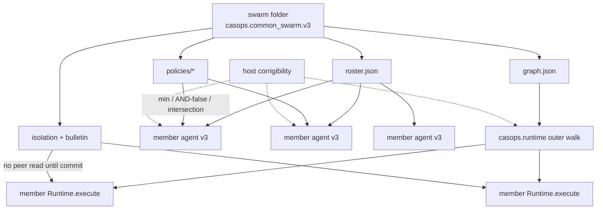
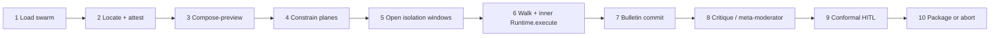

# `common_swarm_structure.v3.md`

> **Delivery note — read first.**
>
> 1. **This checkout is a live CASOPS host for members, not for swarm HTTP.** Package `casops` `0.1.0` still exposes FastAPI `/api/v3` on `127.0.0.1:18080` and Control UI on `127.0.0.1:15173`. Member family `casops.common_agent.v3` / schema `3.0` is live. A `swarms/` folder type, `swarm_spec.json` loader, and `/api/v3/swarms/...` routes remain **specified, not implemented**. v3 does not pretend those routes exist.
> 2. **No swarm runner was executed for this revision.** Therefore v3 does **not** report `MEASURED_LOCAL` swarm-run numbers. External paper deltas are labelled `MEASURED_EXTERNAL` and cannot gate a CASOPS release. Unqualified instruments remain `NOT_RUN` / `pass: false`.
> 3. **This is not a production-activation license.** It does not authorize T3 enablement, network grants, plugin execution on the public plane, L5 promotion, flipping `production_activation_requested`, self-generating production topologies, or treating an LLM as an unsupervised swarm orchestrator.
> 4. **v2 is superseded, not deleted.** v2 (`2026-09-03`, `CASOPS-FS-COMMON-SWARM-STRUCTURE-V2`) remains the live-host binding ancestor. v3 keeps the thesis — a swarm composes common agents; it does not replace them — and adds planes required for compatibility with `common_agent_structure` v3 / v3a plus research-backed composition controls.
> 5. **Citation honesty.** Abstracts and titles listed in §28 were retrieved on `2026-09-03` from arXiv or publisher pages. Numeric claims supported only by an abstract or vendor blog are `[A-abstract]` or `[C]` and remain release-blocked until a page/table location is recorded in `citation-audit.json`. Future-dated verification is forbidden.

---

**Document ID:** `CASOPS-FS-COMMON-SWARM-STRUCTURE-V3`  
**Date:** `2026-09-03`  
**Status:** Implementation specification — swarm folder and swarm HTTP routes specified, not live; member agents and visualization surfaces live; citation audit `BLOCKED` until `evals/reports/<run-id>/citation-audit.json` is committed  
**Supersedes:** `spec/common_swarm_structure.v2.md` (`CASOPS-FS-COMMON-SWARM-STRUCTURE-V2`, 2026-09-03)  
**Compatible member contract:** `casops.common_agent.v3` / schema `3.0` (v3a correction draft dated `2026-08-24` is the standalone member reference)  
**Host:** `common-agent-swarm-ops` (`casops` `0.1.0`)  
**Structure family:** `casops.common_swarm.v3`  
**Public HTTP plane:** FastAPI prefix `/api/v3` only  
**Control-plane bind:** `http://127.0.0.1:18080`  
**Control UI:** `http://127.0.0.1:15173` (`ui/`)  
**Compatibility:** v2 swarm JSON loads only through the §25 migration profile; v1 loads only after the v2 profile then §25  
**Research cutoff:** `2026-09-03`  
**Citation-audit status:** `BLOCKED`

A v3 common swarm remains **one self-contained folder and one `swarm_id`**. Every member is a **common-agent v3 folder**. The swarm names, wires, isolates, budgets, and (when implemented) walks those members. It does not own their SPEC, tools, credentials, persona, corrigibility invariants, or host LLM keys.

Domain logic stays in the pack. The host stays fail-closed. FastAPI `/api/v3` is the only public control plane. This is host-native composition, not Agent-to-Agent (A2A) transport as a second plane, not LangGraph, and not a second UI backend.

---

## Table of contents

1. Purpose, v3 changes, and defect register  
2. Research basis, evidence policy, and citation audit  
3. Live host facts this specification binds to  
4. Scope, actors, and non-goals  
5. Core principles  
6. Compatibility with the nine member planes  
7. Four maps: fleet, organization, execution, isolation  
8. Folder contract  
9. Membership — every node is a common-agent v3  
10. Roster and organization  
11. Graph, DNA, patterns, and topology classes  
12. Isolation, bulletin, delegation, and stigmergy  
13. Critique bus, conformal commit, and handoffs  
14. Skill, plugin, identity, memory, cache, context, and LLM policy  
15. Budgets, risk gates, interrupts, rollback, corrigibility, multi-agent risk  
16. Data models  
17. Runtime behaviour  
18. Operator and host APIs (`/api/v3`)  
19. Control UI mapping  
20. Honesty, safety, and fail-closed rules  
21. Error catalogue  
22. Validation specification, harness, and report  
23. Worked example (`video.spine`)  
24. Proposed template  
25. Migration from v2  
26. Traceability  
27. Open risks  
28. Research references  
29. Document control  

---

# 1. Purpose, v3 changes, and defect register

## 1.1 Purpose

Operators need a swarm that is as explicit as a common agent, that composes every first-class member plane, and that does not treat “more agents talking” as an automatic quality upgrade.

v3 preserves v2’s identity, membership, mutation, and three-map UI contracts while adding:

- member-plane composition (cache, context, compatibility, observability, plugins, memory, improvement, safety, corrigibility);
- gated isolation and a host-mediated bulletin so evidence gathering is not forced into early consensus;
- delegation briefs with condensed returns so the owner context window does not become the swarm’s only memory;
- topology **classes** that are declared and compiled, not prompted at every hop;
- critique that is isolated, budgeted, and committed through conformal / act-or-defer gates rather than homogeneous debate;
- a multi-agent risk taxonomy with cascade and collusion fixtures;
- the same statistical honesty the member v3a contract requires.

The central thesis remains:

> A swarm composes common agents. It does not replace them, does not grant them powers they do not already have, and does not treat unguided peer chat as a verifier.

## 1.2 Material changes from v2

| Domain | v2 | v3 |
|---|---|---|
| Structure family | `casops.common_swarm.v2` | `casops.common_swarm.v3` / schema `3.0` |
| Member planes | Membership + tools/plugins/memory/LLM constraints | Explicit compose of all nine member planes |
| Coordination | Graph + critique loop | Graph + isolation windows + bulletin + delegation briefs + stigmergic artifacts |
| Topology | Fixed `pattern` enum | Pattern plus `topology_class` plus optional **pinned codebook entry**; learned generators are research-only |
| Critique | Loop with lead/judge | Isolated critique + meta-moderator stop rule + conformal commit / escalate |
| Observability | Implied via members | Swarm evidence graph, outer trace, orchestration-quality scores |
| Risk | Risk gates + HITL + cascade code | Hammond et al. failure modes as first-class fixtures |
| Validation | 24 ACs, no powered protocol | Member-aligned power, NI/equivalence split, SwarmBench-style process-quality TARGET |
| Citations | Research cutoff only | Confidence markers and CIT-GATE |
| Errors | 7 proposed `SWM_*` | Those plus isolation, bulletin, conformal, topology, cascade codes |

What v3 does **not** change: one folder = one `swarm_id`; members are v3 agents; safety tightens; owner is a member; org ≠ graph; host stays domain-agnostic; no second control plane; this document alone does not mutate live pack trees.

## 1.3 v2 defect register closed in v3

| ID | v2 gap | v3 correction |
|---|---|---|
| D-SWM-16 | Swarm did not name how member cache T0–T3, context compaction, or compute controllers compose | §6, §14.6–14.7: min/AND/intersection; swarm cannot enable T3 |
| D-SWM-17 | Critique loop could be read as homogeneous debate | §13: isolation windows; unguided debate is `SWM_DEBATE_UNGUIDED` |
| D-SWM-18 | No model of early-consensus collapse during parallel search | §12 bulletin + `isolation_policy` |
| D-SWM-19 | Delegation was only graph edges | §12.3 `delegation_brief` + condensed return schema |
| D-SWM-20 | Topology generation literature treated as if the host should call an LLM orchestrator | Topology class is compiled IR; LLM-as-orchestrator is `E4` / research |
| D-SWM-21 | No multi-agent risk taxonomy beyond `SAF_CASCADE` | §15.6 |
| D-SWM-22 | Acceptance tests were specified but statistically underspecified | §22 copies member v3a power/NI rules at swarm grain |
| D-SWM-23 | No citation audit | §2, §28 |
| D-SWM-24 | Improvement plane absent at swarm grain | Swarm may enqueue member candidates only; cannot promote |
| D-SWM-25 | Observability of the *walk* was unspecified | Outer `root_trace_id`, node traces, orchestration-quality record |

v1 defects D-SWM-01–15 remain closed as in v2.

---

# 2. Research basis, evidence policy, and citation audit

## 2.1 Search provenance (this revision)

Searched on `2026-09-03` across arXiv (`cs.MA`, `cs.AI`, `cs.CL`), Semantic Scholar / ADS mirrors, publisher abstracts, and systems blogs that cite arXiv papers. Queries covered: agent swarm orchestration, multi-agent topology, gated isolation, delegation intelligence, multi-agent debate failure, conformal social choice, contract-centered agentic runtimes, graph workflow engines, multi-agent risk taxonomies.

No machine-readable `citation-audit.json` is attached. Titles and abstracts retrieved today are `[A-abstract]`. Page-level numeric verification is incomplete → release remains `BLOCKED` by CIT-GATE-001.

## 2.2 Evidence maturity

| Grade | Meaning | Swarm treatment |
|---|---|---|
| `E1` | Stable standard or peer-reviewed result with released evaluation | May inform a default only after local CASOPS gates |
| `E2` | Peer-reviewed but workload-dependent | Feature-gated; TARGET only |
| `E3` | Recent preprint or vendor systems paper | Experimental flag, fallback, kill switch |
| `E4` | Open-ended self-modification, unsupervised topology search, core self-rewrite | Research isolation; disabled on the public plane |

**E-RULE-01.** An E3 coordination feature (bulletin isolation, codebook replay, meta-moderator) must have a validated linear-pipeline fallback, an optimizer kill switch, a runtime budget, and telemetry.

**E-RULE-02.** External deltas are never additive, never labelled as CASOPS results, and cannot replace local validation.

**E-RULE-03.** Safety, audit, corrigibility, and mutation-header enforcement have no bypass kill switch.

## 2.3 Findings retained as architecture (not as CASOPS scores)

| Finding | Source | Architectural consequence | Grade |
|---|---|---|---|
| Separate evidence gathering from integration; restrict peer reads during search; commit only at structured boundaries | ArcticSwarm, arXiv:2609.01870 [A-abstract] | `isolation_policy` + `bulletin` + commitment phases | E3 |
| Orchestration quality is a first-class score besides accuracy/cost | SwarmBench, arXiv:2608.30661 [A-abstract] | `orchestration_quality` on the run artifact | E3 |
| Surviving topologies collapse to a small codebook; edge-count ≠ cheaper inference | Codebook Agent, arXiv:2609.02264 [A-abstract] | Pin a codebook entry; ban unbounded adjacency search on the serving path | E3 |
| Stigmergy via artifacts can outperform chat-only coordination | SwarmWorld, arXiv:2608.26081 [A-abstract] | Handoffs are first-class artifacts, not chat transcripts | E3 |
| Main-distributes / sub-executes with condensed, citation-grounded returns | SearchSwarm, arXiv:2606.09730 [A-abstract] | `delegation_brief` + return schema | E3 |
| Engine-orchestrated DAG beats prompted routing for reproducibility | GraphBit arXiv:2605.13848; GPTSwarm arXiv:2402.16823 [A-abstract] | `engine: casops.runtime` only | E2/E3 |
| Compile-once static graphs cut *orchestration* overhead; LLM time still dominates | GraphWorkflow systems claims [C] (no-op nodes) | Compile outer plan; do not advertise 62.5× as job-time gain | E3 |
| Homogeneous unguided debate can reduce accuracy and multiply tokens | Cost of Consensus, arXiv:2605.00914 [A-abstract] | Default critique is isolated + structured, not open debate | E2 |
| Consensus stopping commits wrong-unanimous answers; conformal layers intercept | Conformal Social Choice, arXiv:2604.07667 [A-abstract] | Act-or-escalate at terminals | E3 |
| Budgeted act-or-defer with local reliability bounds | arXiv:2606.29654 [A-abstract] | `commit_policy` | E3 |
| Multi-agent failure modes: miscoordination, conflict, collusion | Hammond et al., arXiv:2502.14143 [A-abstract] | Risk fixtures | E1/E2 |
| Skill / Harness / Scaffold / external data substrate | Contract-centered runtime, arXiv:2608.27086 [A-abstract] | Maps onto pack skill, `casops.runtime`, host scaffold, host memory | E3 (no measured result in that paper) |
| Fully automated system generation via PSO-style search | SwarmAgentic, arXiv:2506.15672 [A-abstract] | E4 — research only | E4 |
| Learned query-adaptive topologies (G-Designer, AFlow, CARD, DMoA) | multiple [A-abstract]/[C] | May propose codebook candidates offline; cannot rewrite live `graph.json` | E3/E4 |

## 2.4 Citation gates

**CIT-GATE-001.** Before merge to `main`, every `[A-abstract]`, `[C]`, `[K]` numeric claim used by a requirement must be resolved to identifier, title, authors, venue, date, page/table location, and digest.

**CIT-GATE-002.** Nothing dated after `2026-09-03` may be represented as completed verification.

Output path when an audit is run: `evals/reports/<run-id>/citation-audit.json`.

---

# 3. Live host facts this specification binds to

Measured against the v2 checkout notes dated `2026-09-03`. If a later tree drifts, regenerate claims from the tree; do not freeze a magic agent count in tests.

## 3.1 Process and ports

| Process | Bind | Notes |
|---|---|---|
| Control plane | `127.0.0.1:18080` | `casops.api.control:create_app_from_env` |
| Control UI (dev) | `127.0.0.1:15173` | Vite `strictPort: true` |
| Control UI (preview) | `127.0.0.1:4173` | CORS allowed |
| Internal services | `8081`–`8087` | Docker only; not browser-reachable |
| Start / stop | `scripts/start_all.ps1`, `scripts/stop_all.ps1` | Writes `var/casops-servers.json` |

`GET /health` body: `{ "status": "ok", "service": "control-plane" }`. Not in OpenAPI.

## 3.2 Mutation contract (already implemented)

Every `POST`, `PUT`, `PATCH`, `DELETE` under `/api/v3` requires `x-casops-actor`, `x-casops-reason`, `x-casops-expected-parent`, `x-casops-dry-run`. Missing any → `IMP_UNSIGNED` HTTP 409.

## 3.3 Actor allow-list (already implemented)

Deny-by-default. `approve_candidate` is `independent_approver` only. `agent_runtime`, `plugin`, and `peer_agent` cannot author swarm JSON, cannot approve, cannot write invariants, cannot change host or per-agent LLM.

## 3.4 Loaded members (already implemented)

This checkout, 2026-09-03: 114 `video.*`, 19 `specials.*`, 2 other (`casops.template.baseline_safe`, `common.health`) = **135** `agent_spec.json` folders. Template disk folder `_template_v3` public id `casops.template.baseline_safe`. Tests MUST scan folders, not assert `== 135`.

## 3.5 Visualization surfaces already implemented

`/` Agent Swarm, `/org-chat`, `/workflow`, `/workflow/sub`, `/agents/:id/*`, `/settings`. No `/swarms/:id` in `ui/src/App.tsx`.

## 3.6 What a swarm must not fight

- `production_activation_requested: false` as shipped  
- `allowed_tools: []`, `allowed_plugins: []`, `model_policy.network_access: false`  
- Memory `mode: none` on the template → `MEM_TRUST_TIER`  
- Cache T3 off  
- Validation default `verdict: NOT_RUN`, `pass: false`  
- Compose-preview `wrote_locks: false`  
- Plugins validate `executed: false`  
- Consolidate only enqueues on the serving path  

---

# 4. Scope, actors, and non-goals

## 4.1 In scope

- Folders declaring `structure_id: casops.common_swarm.v3` and `schema_version: "3.0"`.  
- Membership restricted to common-agent v3 folders the live host can locate.  
- Roster, organization, execution graph, isolation windows, bulletin, delegation briefs, critique/commit policy, budgets, risk gates, human interrupts, rollback.  
- Swarm-level **constraints** on every member plane.  
- Host REST routes for inspect, preview, and run on the existing FastAPI plane (contract; not live).  
- Control UI mapping plus a future swarm profile.  
- JSON Schema for `swarm_spec.json` and companion policy files.  
- Migration from v2.  
- Validation protocol and static report.

## 4.2 Out of scope

- Mutating live pack trees by this document alone.  
- Implementing `/api/v3/swarms` in this revision of the spec.  
- LangGraph, A2A as a second public plane, MCP servers as swarm-owned, credential vaults.  
- Calling internal ports `8081`–`8087` from the browser or from swarm JSON.  
- Granting production activation, network, T3, or plugin execution via swarm JSON.  
- A swarm-wide Chat that bypasses per-agent `runtime/chat`.  
- Treating Org Chat as a write surface.  
- Inventing `va_category` values.  
- Promoting L5 research isolation into the serving tree.  
- Storing provider API keys in swarm files.  
- Unsupervised topology search or SwarmAgentic-style from-scratch generation on the public plane.  
- Representing vendor no-op graph-engine speedups as job-completion gains.

## 4.3 Actors

Unchanged from v2 live enum. HTTP actor for critique messages remains `host_service` or `human_operator`. The wire actor is never `peer_agent`.

---

# 5. Core principles

| ID | Principle | Meaning |
|----|-----------|---------|
| S1 | One swarm identity | One folder = one `swarm_id`. Folder name MAY differ from `swarm_id`. |
| S2 | Members are common-agent v3 | Every roster and graph `agent_id` MUST locate to `casops.common_agent.v3` / `3.0`. |
| S3 | Swarm composes, agent owns | Wiring, isolation, bulletin, and commit policy live on the swarm. SPEC, prompts, rubrics, tools, plugins, persona, inheritance, corrigibility, memory policy live on the agent. |
| S4 | Safety tightens | Budget **min**; tools/plugins **intersection**; network, T3, production **AND-false**. |
| S5 | Owner is a member | `owner_agent_id` MUST be on the roster and MUST locate. |
| S6 | Critique is composition | Host-mediated, isolated, budgeted. Not parent mixins, not A2A, not Org Chat, not operator Chat. |
| S7 | Fail closed | Missing member, structure mismatch, unbounded cycle, budget breach, undeclared tool, unsigned mutation, isolation leak → abort. |
| S8 | Disclose overlays | Non-grounded running members listed on the run artifact. Named-person overlays without approval abort. |
| S9 | Maps share one roster | Fleet, Org, Workflow picture, Isolation window. A department label is not an `agent_id`. |
| S10 | Host stays domain-agnostic | No second control plane. No browser calls to `8081`–`8087`. |
| S11 | Mutation contract is host-owned | No fifth header. Dry-run still executes inner DAGs in-process. |
| S12 | Preview does not write locks | `wrote_locks: false`. |
| S13 | Eval honesty | `NOT_RUN` / `INDICATIVE` cannot pass a swarm. |
| S14 | Agent cannot approve the swarm | `agent_runtime` on approve or corrigibility write → `IMP_SELF_APPROVAL` / `IMP_CORRIGIBILITY`. |
| S15 | Engine orchestrates, models reason | The outer walk is compiled `casops.runtime` IR. An LLM may fill a **node**, not rewrite the live graph mid-run. |
| S16 | Isolate before integrate | Parallel search tasks MUST declare an isolation window. Peer reads during gathering are opt-in and logged. |
| S17 | Delegate with a brief | Sub-runs receive a typed brief and return a condensed, citation-grounded payload. Raw traces are not dumped into the owner context. |
| S18 | Artifacts over chat | Stigmergic handoffs are versioned artifacts with `parent_assets`. Chat is not the system of record. |
| S19 | Topology is pinned | Serving path executes a pinned `graph.json` or a pinned codebook entry. Generators propose offline. |
| S20 | Debate is not a verifier | Homogeneous unguided debate is illegal as a quality gate. Commit uses structured review + conformal / HITL policy. |
| S21 | Multi-agent risk is first-class | Miscoordination, conflict, collusion, and cascade have fixtures. |
| S22 | Optional coordination fails back | Bulletin, isolation, codebook replay, meta-moderator may kill-switch to the validated pipeline. Mandatory controls containment-stop. |
| S23 | Statistical honesty | Powered, paired, interval-estimated claims. External paper scores are not CASOPS scores. |
| S24 | Citation integrity | Unaudited numeric claims cannot support release. |
| S25 | Plane composition is explicit | Every member plane has a swarm constraint object. Silence is deny for grants and min for budgets. |

---

# 6. Compatibility with the nine member planes

Member v3 / v3a planes: execution, compatibility, observability, plugins, memory, improvement, safety, cache/context, corrigibility.



| Member plane | Swarm may | Swarm must not |
|---|---|---|
| Execution | Walk nodes; min budgets; cap visits | Replace member `runtime/execution.json` |
| Cache / context | Deny T3; cap shared context; require re-grounding checkpoints on long walks | Enable T3; share cache across tenant/agent/sensitivity |
| Compatibility | Require verified capabilities on nodes that need them | Bind `ASSERTED_UNVERIFIED`; pick a provider as a network grant |
| Observability | Emit outer trace + evidence graph + orchestration quality | Export reasoning-monitor contents; drop mandatory tail categories |
| Plugins | Intersect and keep `allow_execute: false` | Execute plugins on the public plane |
| Memory | Forbid writes; enqueue consolidate only | Promote trust; drain consolidate on serving path; cross-tenant query |
| Improvement | Enqueue per-member candidates | Promote, sign, or approve |
| Safety | Union taint; halt on cascade | Relax member termination |
| Corrigibility | Attest each running member | Rewrite invariants |

**FR-PLN-001.** Swarm compose-preview MUST call member compose-preview for every running node and attach `compose_hash` (64 hex) and `wrote_locks: false`.

**FR-PLN-002.** A member plane finding (`INH_*`, `SKL_*`, `IDN_*`, `GATE_*`, `MEM_*`, `PLG_*`, `PERF_*`, `IMP_CORRIGIBILITY`) aborts the swarm with that `agent_id` in operator logs only.

---

# 7. Four maps: fleet, organization, execution, isolation

v2 named three live UI maps. v3 adds the isolation map as a specified surface (not live).

| Map | Source of truth today | Source of truth after swarm routes exist |
|---|---|---|
| Fleet | `GET /api/v3/agents` | Intersection with `roster.json` when a swarm is selected |
| Org | `va_category` + pack prefix | Roster `department` MUST equal live `va_category` or empty |
| Execution picture | Pack SVG | `graph.json` MAY pin or generate an SVG; clicks still open Agent Profile/Chat |
| Execution | Per-agent `runtime/run` | Swarm `runtime/run` walks `graph.json` |
| Isolation | Not in UI | `isolation_policy.json` windows overlaid on the graph picture |

When `/api/v3/swarms` exists, Fleet/Org/Workflow become views over a named `swarm_id`. Until then they view the whole loaded pack.

---

# 8. Folder contract

## 8.1 Tree

```text
swarms/<folder>/
  README.md
  SWARM.md
  swarm_spec.json
  roster.json
  graph.json
  topology/
    codebook.json          # optional; pinned entries only
    selected_code.json     # optional; serving pin
  isolation/
    isolation_policy.json
    bulletin.schema.json
  delegation/
    brief.schema.json
    return.schema.json
  policies/
    skill_policy.json
    plugin_policy.json
    identity_policy.json
    interrupt_policy.json
    memory_policy.json
    llm_policy.json
    cache_policy.json
    context_policy.json
    observability_policy.json
    improvement_policy.json
    commit_policy.json
  safety/
    multi_agent_risk.json
  evals/
    regression/
    analysis_plan.json
    benchmarks.json
  sources/
    PROVENANCE.json
  docs/
    user_guide.md
```

`CASOPS_SWARMS_ROOT` (default `swarms/`) is the scan root.

Generated artifacts are not authoring files. Hand edits that drift from member hashes fail `INH_RESOLVED_DRIFT`.

## 8.2 Required vs optional

| Path | Required | Author |
|------|----------|--------|
| `README.md`, `SWARM.md` | Yes | Human. `SWARM.md` is untrusted as executable instructions |
| `swarm_spec.json`, `roster.json`, `graph.json` | Yes | Human / generator |
| `isolation/isolation_policy.json` | Yes (may set `mode: none` only for single-node pipeline) | Human |
| `policies/*` listed in §8.1 except codebook | Yes (deny/require may be empty) | Human |
| `policies/commit_policy.json` | Yes | Human |
| `safety/multi_agent_risk.json` | Yes | Human |
| `evals/analysis_plan.json` | Yes before any quality claim | Human |
| `sources/PROVENANCE.json` | Yes | Generator + review |
| `topology/*` | Optional | Human / offline generator |
| `docs/user_guide.md` | Optional | Human |

## 8.3 Locate

`locate_swarm_folder` is unchanged from v2: folder name first, then first child whose `swarm_id` matches. Else `INH_PARENT_MISSING`.

## 8.4 Illegal contents

- Copies of member `agents/<folder>/` trees.  
- Provider API keys, host keys, `.env` fragments.  
- `production_activation_requested: true`.  
- `network_access: true` as a swarm-level grant.  
- A `chat.json` that claims to replace per-agent Chat.  
- A topology generator checkpoint that the serving path would execute.  
- Learned adjacency matrices without a pinned codebook entry.

---

# 9. Membership — every node is a common-agent v3

Membership rules FR-MEM-001–008 from v2 remain normative.

Additions:

| ID | Requirement |
|----|-------------|
| FR-MEM-009 | Every running member MUST have a host corrigibility attestation `status: host_reference` before the outer walk. |
| FR-MEM-010 | Every running member whose node declares `tool_ids` or `plugin_ids` MUST have those ids in the member allow-list ∩ host register. Empty ∩ anything is empty. |
| FR-MEM-011 | A member with `max_refinement_count: 0` cannot participate in an iterating critique loop. The loop length is min(swarm, every running member, 3). |
| FR-MEM-012 | Cross-pack membership remains legal iff both folders locate as v3 on this host. |

---

# 10. Roster and organization

`roster.json` schema is unchanged except `schema` family `casops.common_swarm.v3`.

`department` MUST equal the member’s live `va_category` or be empty. Invented departments fail `SWM_DEPARTMENT_DRIFT`.

Org Chat algorithm remains the live `buildOrgChart` until a swarm is selected. After swarm routes exist, Org Chat MAY filter to the roster and remains read-only.

---

# 11. Graph, DNA, patterns, and topology classes

## 11.1 Execution graph

`engine` MUST be `casops.runtime`. Values `graph`, `langgraph`, `a2a`, `prompted_orchestrator` fail closed (`SWM_PATTERN_UNKNOWN` / `CMP_PROTOCOL_VERSION`).

Legal `pattern` values: `pipeline` | `supervisor` | `router` | `critique` | `map_reduce` | `pack_spine` | `delegate_star` | `isolated_search`.

Legal `topology_class` values:

| Class | Meaning | Default isolation |
|---|---|---|
| `static_pipeline` | Declared linear or DAG, compiled once | `none` unless search nodes exist |
| `delegate_star` | Owner delegates bounded briefs to workers | workers isolated from each other |
| `isolated_search` | Parallel gatherers + integrator | gatherers isolated until commit |
| `structured_critique` | Producer → isolated critics → judge | critics isolated from each other |
| `map_reduce` | Fan-out / join | shards isolated; `partial_ok` default false |
| `codebook_pin` | Serving graph is a pinned codebook entry | as declared on that entry |

Unknown class → `SWM_PATTERN_UNKNOWN`.

Caps remain 1–100 nodes; edge `max_traversals` 1–10.

**FR-GRF-010.** A serving graph MAY be selected from `topology/codebook.json` only if `selected_code` is pinned, hashed into compose, and the decoded adjacency equals `graph.json`. Live mutation of codebook → `SWM_TOPOLOGY_DRIFT`.

**FR-GRF-011.** Query-adaptive generators (G-Designer, CARD, Codebook Agent, DMoA, SwarmAgentic) MAY write **candidates** under `improvement/` of a research tree. They MUST NOT be invoked from `/api/v3/swarms/{id}/runtime/run`.

FR-GRF-001–009 from v2 remain normative.

## 11.2 Workflow SVG

Unchanged: clicks open `/agents/{id}/chat`. Clicks MUST NOT start a swarm run (AC-SWM-021).

## 11.3 Compile-once plan

When implemented, `GET /api/v3/swarms/{id}/runtime/plan` returns the compiled outer plan: generations, visit caps, isolation windows, commit gates. The plan is frozen for the `compose_hash`. This follows the systems observation that static compiled graphs have lower *orchestration* overhead than interpreter-style engines [C]; it does **not** claim a job-time speedup versus LangGraph on LLM nodes.

---

# 12. Isolation, bulletin, delegation, and stigmergy

## 12.1 Isolation policy

```json
{
  "schema_version": "3.0",
  "mode": "gated",
  "windows": [
    {
      "id": "gather",
      "node_ids": ["research_a", "research_b"],
      "peer_read": "deny",
      "bulletin_write": "findings_only",
      "commit_gate": "confidence_review"
    }
  ],
  "integrator_node_id": "plan",
  "early_consensus_guard": true
}
```

`mode`: `none` | `gated` | `strict`.

| ID | Requirement |
|----|-------------|
| FR-ISO-001 | During `peer_read: deny`, a member run MUST NOT receive another gatherer’s partial findings. Violation → `SWM_ISOLATION_LEAK`. |
| FR-ISO-002 | `mode: none` is legal only for `static_pipeline` with no parallel search nodes. |
| FR-ISO-003 | Isolation is host-mediated. Members cannot open a side channel via Chat, memory write, or plugin. |
| FR-ISO-004 | Kill switch `isolation_off` falls back to the validated pipeline and emits telemetry. It cannot disable safety or HITL. |

ArcticSwarm reports that gated isolation plus structured review improved BrowseComp-Plus from 74.5% / 78.8% to 82.6% on Qwen 3.5-27B in that paper’s setting [A-abstract]. That delta is `MEASURED_EXTERNAL` and is **not** a CASOPS gate.

## 12.2 Bulletin

The bulletin is a host object, not a member memory store and not Org Chat.

Published records: `finding_id`, `author_agent_id`, `phase`, `claim`, `evidence_refs[]`, `confidence` (0–1), `taint`, `commit_state` (`draft`|`reviewed`|`integrated`|`rejected`).

**FR-BUL-001.** Draft findings are invisible to peer gatherers when `peer_read: deny`.  
**FR-BUL-002.** Integrator reads only `reviewed` or `integrated` records.  
**FR-BUL-003.** Bulletin writes are not member `memory_writes` and do not bypass `MEM_TRUST_TIER`.  
**FR-BUL-004.** Bulletin contents inherit taint. Instruction authority is false.

## 12.3 Delegation brief

```json
{
  "brief_id": "br_01",
  "from_agent_id": "video.orchestrator",
  "to_agent_id": "video.webresearch",
  "objective": "Collect source constraints for scene 12",
  "must_cite": true,
  "return_schema": "delegation/return.schema.json",
  "max_tokens_return": 800,
  "forbidden": ["rewrite owner SPEC", "call undeclared tools"]
}
```

**FR-DEL-001.** Owner context receives the condensed return, not the worker trace.  
**FR-DEL-002.** Returns that lack required citations when `must_cite` is true fail `SWM_DELEGATION_UNGROUNDED`.  
**FR-DEL-003.** A worker MUST NOT widen its tool/plugin set because the brief mentioned a vendor name.

## 12.4 Stigmergic handoffs

Handoff artifacts are immutable versions with `parent_assets` forming an acyclic DAG. Copy-on-write. No silent clobber. `does_not_own` union still applies.

Cross-agent escalation that looks like a hijack → `SAF_CASCADE`.

---

# 13. Critique bus, conformal commit, and handoffs

## 13.1 Two live facts, one specified bus

Unchanged: live `critique_edges` are I/O lists; Org Chat is read-only; operator Chat is per-agent; swarm loop is not implemented.

## 13.2 Critique message

Normative fields unchanged from v2. Sender and receiver MUST be running member ids. Mixin ids illegal.

## 13.3 Isolated critique loop

```json
{
  "enabled": true,
  "max_iterations": 3,
  "lead_agent_id": "video.critic",
  "judge_agent_id": "video.judge",
  "critic_isolation": true,
  "homogeneous_debate": false
}
```

If `homogeneous_debate` is true → `SWM_DEBATE_UNGUIDED` at preview.

`max_iterations` = min(swarm, each running member `max_refinement_count`, 3). Live spine members with `max_refinement_count: 0` still do **not** iterate.

## 13.4 Commit policy (act-or-defer)

```json
{
  "schema_version": "3.0",
  "mode": "conformal_hitl",
  "reliability_threshold": 0.95,
  "wrong_action_budget": 0.05,
  "on_non_singleton": "escalate",
  "approval_authority": "independent_approver",
  "meta_moderator": {
    "enabled": true,
    "stop_on": ["no_gain_2_consecutive", "token_budget_80pct", "consensus_unanimous_unverified"]
  }
}
```

| ID | Requirement |
|----|-------------|
| FR-COM-001 | Terminal publish / irreversible nodes MUST interrupt when `on_non_singleton` is `escalate`. Missing interrupt → `SWM_HITL_REQUIRED`. |
| FR-COM-002 | Unanimous member agreement is not a verifier. Commit requires the commit policy plus, for irreversible work, `independent_approver`. |
| FR-COM-003 | Auto-approve by `agent_runtime` or `human_operator` → `IMP_SELF_APPROVAL`. |
| FR-COM-004 | Meta-moderator may only stop or escalate. It cannot grant tools, network, or production activation. |

External conformal and act-or-defer papers report intercepting wrong-consensus and controlling wrong-action budget in *their* benchmarks [A-abstract]. Those numbers are TARGET inspiration, not CASOPS measurements.

---

# 14. Skill, plugin, identity, memory, cache, context, and LLM policy

v2 skill / plugin / identity / memory / LLM rules remain. Additions:

## 14.6 Cache policy

```json
{
  "deny_tiers": ["T3"],
  "allow_shared_prefix": false,
  "cross_member_reuse": false
}
```

Swarm cannot enable T3. Cross-member cache reuse is default false. Violation → `PERF_CACHE_SCOPE`.

## 14.7 Context policy

```json
{
  "owner_reserved_tokens": 2048,
  "worker_return_cap": 800,
  "require_reground_every_n_nodes": 4,
  "compact_bulletin": true
}
```

Pinned non-compactable: safety charter, corrigibility, `does_not_own`, disclosure, output schema, deadline.

## 14.8 Observability policy

Outer trace on. Reasoning-monitor leak from any member aborts export (`OBS_COT_EXPORT`). Swarm evidence graph required for claim-bearing packaged artifacts.

## 14.9 Improvement policy

```json
{
  "allow_enqueue_member_candidates": true,
  "allow_promote": false,
  "allow_topology_search": false
}
```

`allow_promote` MUST be false on the public plane.

---

# 15. Budgets, risk gates, interrupts, rollback, corrigibility, multi-agent risk

## 15.1 Execution budget

v2 min-merge table remains. Additions:

| Field | Range | Merge |
|-------|-------|-------|
| `max_bulletin_items` | 0–200 | min |
| `max_delegation_depth` | 1–3 | min |
| `max_isolated_workers` | 1–16 | min |
| `max_debate_tokens` | 0–20000 | min; 0 if debate disabled |

Live template still `max_tool_requests: 0`, `max_model_calls: 2`, `max_job_ms: 15000`, `max_peer_hops: 0`.

Breach → `PERF_BUDGET_EXCEEDED` or `PERF_DEADLINE`.

## 15.2–15.5

Risk gates, human interrupts, rollback, corrigibility remain as v2, with commit policy layered on top.

## 15.6 Multi-agent risk taxonomy

From Hammond et al. [A-abstract], instantiated as CASOPS fixtures — not as a claim that the paper measured this host.

| Failure mode | Swarm fixture intent | Default action |
|---|---|---|
| Miscoordination | Two legal members produce incompatible artifacts with no handoff schema | Abort `SWM_MISCOORDINATION` |
| Conflict | Two principals / two briefs assert contradictory publish intents | HITL `SWM_HITL_REQUIRED` |
| Collusion | Members agree to skip a gate or hide a finding | `SAF_CASCADE` / `IMP_CORRIGIBILITY` |
| Information asymmetry | Isolated worker return omits required citation | `SWM_DELEGATION_UNGROUNDED` |
| Network effects / cascade | Privilege or taint hops past `max_peer_hops` | `SAF_CASCADE` |
| Destabilising dynamics | Critique oscillations with no meta-moderator stop | `PERF_BUDGET_EXCEEDED` |
| Emergent agency | Graph rewrite or tool grant from a member | `IMP_CORRIGIBILITY` |
| Multi-agent security | Side channel via bulletin instruction_authority | `SWM_ISOLATION_LEAK` |

`safety/multi_agent_risk.json` MUST list the fixture ids exercised before any production-shaped claim.

---

# 16. Data models

## 16.1 `swarm_spec.json`

```json
{
  "schema_version": "3.0",
  "structure_id": "casops.common_swarm.v3",
  "swarm_id": "video.spine",
  "status": "registered",
  "owner_agent_id": "video.orchestrator",
  "authorization_id": "video.local-spine",
  "engine": "casops.runtime",
  "pattern": "pack_spine",
  "topology_class": "static_pipeline",
  "execution_budget": {
    "max_node_visits": 8,
    "max_handoffs": 7,
    "max_wall_clock_seconds": 60,
    "max_tool_requests": 0,
    "max_model_calls": 8,
    "max_peer_hops": 0,
    "max_delegation_depth": 1,
    "max_isolated_workers": 2,
    "max_bulletin_items": 32,
    "max_debate_tokens": 0
  },
  "memory": { "reads": [], "writes": [] },
  "risk_gate_ids": ["video.local-safe"],
  "rollback": {
    "plan_id": "video.spine.rollback",
    "compensation_step_ids": ["package"]
  },
  "critique": {
    "enabled": true,
    "max_iterations": 3,
    "lead_agent_id": "video.critic",
    "judge_agent_id": "video.judge",
    "critic_isolation": true,
    "homogeneous_debate": false
  },
  "production_activation_requested": false,
  "t3_requested": false,
  "network_requested": false,
  "roster_ref": "roster.json",
  "graph_ref": "graph.json",
  "isolation_ref": "isolation/isolation_policy.json",
  "commit_ref": "policies/commit_policy.json",
  "does_not_own": [
    "Host credential storage",
    "Silent production activation",
    "Member SPEC rewrite",
    "Plugin execution on the public plane",
    "T3 enablement",
    "Corrigibility invariants",
    "A second control plane",
    "Unguided homogeneous debate as a verifier",
    "Online topology search",
    "Promotion of member improvement candidates"
  ]
}
```

`production_activation_requested` remains JSON `false` in the baseline_safe profile.

## 16.2 JSON Schema additions versus v2

Required additions: `topology_class`, `isolation_ref`, `commit_ref`. `structure_id` const `casops.common_swarm.v3`. `pattern` enum includes `delegate_star` and `isolated_search`.

When implemented: `schemas/swarm/swarm_spec.schema.json`.

## 16.3 Run artifact extras

v2 extras plus:

| Field | Notes |
|-------|--------|
| `topology_class` | Serving class |
| `codebook_id` | Null or pinned entry |
| `isolation_windows` | Executed windows |
| `bulletin_counts` | draft/reviewed/integrated/rejected |
| `delegation_briefs` | ids only in external artifact |
| `orchestration_quality` | process-quality record or `NOT_RUN` |
| `commit_decision` | `act` \| `escalate` \| `abort` |
| `early_consensus_blocked` | count |
| `debate_tokens` | must be 0 when debate disabled |
| `multi_agent_risk_fixtures` | ids run |

Still no invented green `status: "success"` on top of member `RunResult`.

---

# 17. Runtime behaviour

Specified order. Not live as a single route.



Dry-run honesty (D-SWM-15) stands: inner DAGs still execute in HostState.

**FR-RUN-001.** Isolation windows open before any parallel gatherer node.  
**FR-RUN-002.** Integrator cannot start until commit_gate records exist or the window times out into abort.  
**FR-RUN-003.** Compensation nodes cannot enable extra tools or plugins and cannot open isolation.

---

# 18. Operator and host APIs (`/api/v3`)

Companion paths. Same mutation contract. **Not implemented in this checkout.**

| Method | Path | Mutation? | Purpose |
|---|---|---|---|
| GET | `/api/v3/swarms` | no | List summaries |
| GET | `/api/v3/swarms/{swarm_id}/structure` | no | Folder, schema, roster, isolation summary |
| GET | `/api/v3/swarms/{swarm_id}/resolved` | no | Members, hashes, constraints, `io.merged: true` |
| GET | `/api/v3/swarms/{swarm_id}/roster` | no | Organization view |
| GET | `/api/v3/swarms/{swarm_id}/graph` | no | Nodes, edges, topology class |
| GET | `/api/v3/swarms/{swarm_id}/isolation` | no | Windows and bulletin schema |
| GET | `/api/v3/swarms/{swarm_id}/bulletin` | no | Reviewed+ records only |
| POST | `/api/v3/swarms/{swarm_id}/compose-preview` | yes | Per-member preview; `wrote_locks: false` |
| POST | `/api/v3/swarms/{swarm_id}/runtime/run` | yes | Outer walk |
| GET | `/api/v3/swarms/{swarm_id}/runtime/plan` | no | Compiled outer plan |
| GET | `/api/v3/traces/{trace_id}` | no | Existing |
| POST | `/api/v3/traces/{trace_id}/replay` | yes | Existing; no memory writes |
| GET | `/api/v3/agents/{agent_id}/structure` | no | Existing |

Forbidden: v1 `/api/v1/swarms`, swarm Chat, production-activation route, plugin execute route, topology-search route on the public plane.

Compose-preview response adds `isolation` and `commit_policy_hash` fields; `wrote_locks` remains JSON boolean `false`.

OpenAPI remains `/api/v3`-prefixed. `/health` and `/debug/*` stay excluded.

---

# 19. Control UI mapping

v2 table stands. Additions after HTTP exists:

| Route | Role |
|---|---|
| `/swarms/:swarmId` | Swarm profile: roster, graph, isolation overlay, bulletin (read), commit decision |
| `/swarms/:swarmId/bulletin` | Reviewed findings only |
| Query `?swarm=` on Fleet / Org | Filter to roster |

**Forbidden UI:** go-live, T3 switch, plugin execute, Org Chat as Chat, Workflow click as run, “auto-orchestrate with LLM”, “generate topology” on the serving tree.

---

# 20. Honesty, safety, and fail-closed rules

All v2 rules plus:

- Unguided homogeneous debate cannot be a quality gate.  
- Isolation leaks abort.  
- Codebook / generator output cannot silently replace `graph.json`.  
- External 62.5× / 82.6% / +261.8% figures are not CASOPS results.  
- GraphWorkflow no-op speedups must not be restated as LLM job speedups.  
- SwarmAgentic-style from-scratch generation is E4.  
- Dry-run still executes inner DAGs.  
- `NOT_RUN` is not a green pass.

---

# 21. Error catalogue

## 21.1 Prefer live codes

v2 mapping table remains. Implementers still MUST NOT return a `SWM_*` code the live catalogue does not own until a 12-field amendment lands.

## 21.2 Proposed swarm-specific codes (amendment required)

v2 proposed: `SWM_ROSTER_DUP`, `SWM_OWNER_ABSENT`, `SWM_GRAPH_EDGE`, `SWM_GATE_UNKNOWN`, `SWM_SKILL_REQUIRE`, `SWM_HITL_REQUIRED`, `SWM_PATTERN_UNKNOWN`.

v3 additions (same 12-field shape: high / never / Abort / external “The request was rejected by host policy.”):

| code | operator_message | http |
|---|---|---|
| `SWM_DEPARTMENT_DRIFT` | Roster department is not the member live va_category. | 409 |
| `SWM_ISOLATION_LEAK` | Peer read during a deny isolation window. | 409 |
| `SWM_BULLETIN_TAINT` | Bulletin record dropped taint or claimed instruction authority. | 409 |
| `SWM_DELEGATION_UNGROUNDED` | Worker return missing required citations or exceeded return cap. | 409 |
| `SWM_DEBATE_UNGUIDED` | Homogeneous debate enabled as a verifier. | 409 |
| `SWM_TOPOLOGY_DRIFT` | Serving graph does not match pinned codebook / compose hash. | 409 |
| `SWM_MISCOORDINATION` | Incompatible member artifacts without a legal handoff. | 409 |
| `SWM_COMMIT_UNCALIBRATED` | Terminal act without commit policy or HITL when required. | 409 |

Until amendment, map to the nearest live code (`INH_STRUCTURE_MISMATCH`, `SAF_CASCADE`, `IMP_CORRIGIBILITY`, `PERF_BUDGET_EXCEEDED`) and fail closed.

---

# 22. Validation specification, harness, and report

## 22.1 Honesty classes

Identical to member v3a: `MEASURED_LOCAL`, `MEASURED_EXTERNAL`, `STATIC_PASS`, `NOT_RUN`, `BLOCKED`.

## 22.2 What this revision delivered

Delivered: architecture, quantitative TARGET gates, fixture layout, statistical protocol, static report.

Not delivered: local swarm-runner numbers, production certification, a cleared citation audit.

## 22.3 Harness layout (specified)

```text
evals/
  analysis_plan.json
  benchmarks.json
  fixtures/
    swarm/{membership,cycle,isolation,bulletin,delegation,debate_unguided,commit,cascade,department,codebook_pin}/
    member-compose/
    safety/{indirect_injection,hijack,exfiltration,taint_laundering,collusion}/
  regression/
  reports/<iso8601>-<compose_hash>/
```

Until `/api/v3/swarms` exists, fixtures are specified tests.

## 22.4 Statistical protocol

Copied at swarm grain from member v3a §21.4:

- freeze list includes swarm hashes, isolation policy hash, commit policy hash, codebook pin;
- paired tasks across baseline v2-pipeline and candidate v3-isolated-search when a runner exists;
- prospective power; binary floor 400 paired tasks; p95 floor 300;
- superiority vs one-sided NI vs TOST-only equivalence, separated;
- underpowered result is not a pass.

## 22.5 TARGET gates (not observed)

Against a frozen v2 linear spine, once a runner exists, satisfy A or B:

| Gate | Requirement |
|---|---|
| A — efficiency | Swarm CPST improves ≥20% with task success NI within 2pp |
| B — quality | Task success improves ≥5pp with superiority CI excluding zero; CPST regress ≤10% unless approved |

Additional TARGETS inspired by literature, **not** claimed as local:

| Check | TARGET | Class |
|---|---|---|
| Isolation leak fixtures | 0 leaks | specified |
| Early-consensus guard trips logged | ≥1 on the planted-consensus fixture | specified |
| Delegation return over cap | 0 | specified |
| Homogeneous debate preview | always `SWM_DEBATE_UNGUIDED` | specified |
| Wrong-unanimous terminal without HITL | always abort / escalate | specified |
| Cascade / collusion fixtures | 100% halt | specified |
| `wrote_locks` | JSON `false` | specified |
| T3 / plugins executed / network | remain false | specified |
| Orchestration-quality record present | yes or explicit `NOT_RUN` | specified |
| ArcticSwarm-like gather/integrate split | feature exists; score not copied | `MEASURED_EXTERNAL` inspiration |
| SwarmBench process quality | instrument exists; score `NOT_RUN` | E3 |

## 22.6 Acceptance criteria

v2 AC-SWM-001–024 remain. Additions:

| ID | Criterion | Proof |
|----|-----------|-------|
| AC-SWM-025 | Isolation leak fixture aborts `SWM_ISOLATION_LEAK` or mapped 409 | fixture |
| AC-SWM-026 | `homogeneous_debate: true` fails preview | fixture |
| AC-SWM-027 | Worker return without required citations fails | fixture |
| AC-SWM-028 | Codebook / graph mismatch fails `SWM_TOPOLOGY_DRIFT` | fixture |
| AC-SWM-029 | Member plane error aborts swarm with member id in operator logs | fixture |
| AC-SWM-030 | Swarm cannot enable member T3 or plugins | preview |
| AC-SWM-031 | Analysis plan present before any quality claim | static |
| AC-SWM-032 | Citation audit artifact required before release | static |
| AC-SWM-033 | `topology_class: isolated_search` requires isolation windows | schema |
| AC-SWM-034 | Conformal / HITL required on irreversible terminals | fixture |

Until routes exist, AC-SWM-002–020 and 025–030 are specified tests. AC-SWM-021–023 remain live UI contracts.

## 22.7 Static validation report (this revision)

| Domain | Finding | Status |
|---|---|---|
| v2 live-host binding | Ports, mutation headers, 135-folder scan rule, three UI maps retained | `STATIC_PASS` |
| Member v3 plane compose | All nine planes have swarm constraints | `STATIC_PASS` |
| Isolation + bulletin | Specified with leak code | `STATIC_PASS` |
| Delegation briefs | Specified with return cap and citation rule | `STATIC_PASS` |
| Topology discipline | Pinned class / codebook; generators offline | `STATIC_PASS` |
| Debate honesty | Unguided debate rejected | `STATIC_PASS` |
| Commit / HITL | Conformal act-or-defer + independent_approver | `STATIC_PASS` |
| Multi-agent risk | Hammond modes instantiated as fixtures | `STATIC_PASS` |
| Error catalogue | v2 codes plus eight proposed | `STATIC_PASS` |
| Statistical protocol | Power / NI / TOST separated | `STATIC_PASS` |
| Date integrity | Dated 2026-09-03; cutoff same day | `STATIC_PASS` |
| Swarm HTTP implementation | Routes not in checkout | `NOT_RUN` |
| Local isolation / debate / conformal numbers | Runner not supplied | `NOT_RUN` |
| Citation page-level audit | Abstracts retrieved; locations incomplete | `BLOCKED` |
| Production certification | Requires implementation + audit + local gates | `BLOCKED` |

## 22.8 External evidence retained (not CASOPS)

| Pattern | Reported external result | Class |
|---|---|---|
| ArcticSwarm gated isolation + review | 82.6% BrowseComp-Plus Qwen 3.5-27B vs 78.8% / 74.5% / 70.6% | `MEASURED_EXTERNAL` E3 [A-abstract] |
| ArcticSwarm live-web | 73.6% GPT-5 vs 54.9% / 63.4% | `MEASURED_EXTERNAL` E3 [A-abstract] |
| Codebook Agent | 84.6 avg vs 83.0; 2.4 ms decode; 21.9–33.2% fewer tokens | `MEASURED_EXTERNAL` E3 [A-abstract] |
| SearchSwarm-30B-A3B | 68.1 BrowseComp / 73.3 BrowseComp-ZH at comparable scale | `MEASURED_EXTERNAL` E3 [A-abstract] |
| SwarmAgentic vs ADAS TravelPlanner | +261.8% relative (paper’s setting) | `MEASURED_EXTERNAL` E4 [A-abstract] |
| Cost of Consensus | 2.1–3.4× tokens; conformity up to 85.5% | `MEASURED_EXTERNAL` E2 [A-abstract] |
| Conformal Social Choice | 81.9% of wrong-consensus intercepted at α=0.05 | `MEASURED_EXTERNAL` E3 [A-abstract] |
| GraphWorkflow vs LangGraph | 7.0× geo-mean / 62.5× deep chain on **no-op** nodes | `MEASURED_EXTERNAL` E3 [C] — not job time |
| GraphWorkflow real LLM nodes | ~1.03× geo-mean, statistical parity | `MEASURED_EXTERNAL` E3 [C] |
| SWARM+ | 990 agents; ~1 s selection at 110; 97–98% latency cut vs prior SWARM | `MEASURED_EXTERNAL` E2 [A-abstract] |
| Contract-centered P1 | No completed experiment in the paper | architecture only [A-abstract] |

## 22.9 Specification-level improvement versus v2

These are coverage and control improvements, not runtime measurements.

| Domain | v2 | v3 | Improvement type |
|---|---|---|---|
| Member-plane coverage | 4 constraint files | 11 policy objects across 9 planes | completeness |
| Coordination | edges + critique | isolation, bulletin, delegation, stigmergy, commit | control surface |
| Debate risk | unspecified | explicit ban + literature-backed failure modes | safety |
| Topology | 6 patterns | classes + pinned codebook + generator quarantine | reproducibility |
| Validation | 24 ACs | 34 ACs + powered protocol + honesty classes | statistical honesty |
| Risk taxonomy | cascade code | 8 fixture families | safety |
| Citations | cutoff date | markers + gates | integrity |
| UI maps | 3 | 4 specified | observability |

## 22.10 Conclusion

| Item | Verdict |
|---|---|
| Specification completeness relative to v2 | PASS |
| Compatibility with common-agent v3 planes | PASS (specified) |
| Date integrity | PASS |
| Implementation of swarm HTTP | NOT RUN |
| Executed local validation | NOT RUN |
| Citation audit | BLOCKED |
| Specification status | DRAFT implementation spec |
| Deployment recommendation | NO-GO |

---

# 23. Worked example (`video.spine`)

**Swarm id:** `video.spine` (specified; folder not in this checkout)  
**Owner:** `video.orchestrator`  
**Topology class:** `static_pipeline` with optional `isolated_search` insert for `video.webresearch`  
**Members:** same nine live ids as v2 §20, with live `va_category` copied at authoring time.

Because every listed member has `max_refinement_count: 0`, critique does not iterate even if JSON says 3.

If `video.webresearch` is placed in an isolation window with a sibling search node, `peer_read: deny` until `confidence_review`. Integrator is `video.planner`.

Commit on `video.gatekeeper` / package remains HITL for publish.

Must not: invent a spine director; inherit screenwriter SPEC onto orchestrator; enable a vendor API because the graph named it; skip HITL; dump 114 video agents into budget-8; treat Org Chat as critique; turn on homogeneous debate “to improve quality”; copy ArcticSwarm’s 82.6% into the run artifact.

---

# 24. Proposed template

| Disk folder | Public id |
|---|---|
| `swarms/_template_v3/` | `casops.template.swarm_safe` |

Baseline: all grant flags false, empty tool/plugin lists, memory writes forbidden, `engine: casops.runtime`, `pattern: pipeline`, `topology_class: static_pipeline`, `isolation.mode: none`, owner `casops.template.baseline_safe`, single-node graph, `homogeneous_debate: false`, `allow_promote: false`.

Not in the checkout until an implementation task creates it.

---

# 25. Migration from v2

| v2 | v3 |
|---|---|
| `structure_id: casops.common_swarm.v2` | `casops.common_swarm.v3` |
| No isolation / commit / cache / context / observability / improvement policy files | Add with safe defaults |
| `pattern` only | Add `topology_class: static_pipeline` |
| Critique without isolation flags | `critic_isolation: true`, `homogeneous_debate: false` |
| 7 proposed `SWM_*` | plus 8; still catalogue-gated |
| No analysis plan required | Required before claims |
| No citation audit | CIT-GATE-001 |

A v2 folder MUST NOT load as v3 until a migrator writes the new required files. Fail closed (`CMP_SCHEMA_INCOMPATIBLE` or `INH_STRUCTURE_MISMATCH`). v1 still cannot load except through v2 then v3 migrators.

Defaults on migration:

```text
isolation.mode                 = none if single-node else gated
critique.homogeneous_debate    = false
critique.critic_isolation      = true
cache.deny_tiers               = [T3]
improvement.allow_promote      = false
topology_class                 = static_pipeline
commit.mode                    = conformal_hitl on irreversible patterns else hitl
```

---

# 26. Traceability

| Need | FR / section | AC | Live evidence |
|------|--------------|----|---------|
| Swarm folder | §8 | AC-SWM-001 | specified |
| Members are v3 | FR-MEM-* | AC-SWM-002, 003, 019 | locate + 135 folders |
| Nine-plane compose | §6 | AC-SWM-029, 030 | member plane live |
| Isolation | FR-ISO-* | AC-SWM-025 | specified |
| Delegation | FR-DEL-* | AC-SWM-027 | specified |
| Topology pin | FR-GRF-010 | AC-SWM-028 | specified |
| Debate ban | §13 | AC-SWM-026 | specified |
| Commit / HITL | FR-COM-* | AC-SWM-010, 034 | specified |
| Three/four maps | §7 | AC-SWM-021–022 | Fleet, Org, Workflow live |
| Mutation | §3.2, §18 | AC-SWM-009, 014 | live middleware |
| REST | §18 | AC-SWM-020, 024 | companion contract |
| Corrigibility | §15 | — | live attestation |
| Statistics | §22.4 | AC-SWM-031 | specified |
| Citations | §2 | AC-SWM-032 | blocked pending artifact |
| Migration | §25 | — | fail closed |

---

# 27. Open risks

| Risk | Mitigation |
|---|---|
| Authors dump all 114 `video.*` agents into one spine | Caps; subset roster; dry-run |
| Authors treat isolation as optional on parallel search | FR-ISO-002; preview fail |
| Operators re-enable homogeneous debate expecting free quality | AC-SWM-026; literature §2.3 |
| Codebook / generator silently rewires production | FR-GRF-011; `SWM_TOPOLOGY_DRIFT` |
| Bulletin becomes a side-channel instruction bus | taint; `instruction_authority: false` |
| Delegation summaries drop critical constraints | return schema; citation rule; context preservation |
| External speedups quoted as CASOPS job-time wins | §22.8 GraphWorkflow caveat |
| Conformal layer over-escalates and looks like a product failure | declare automation vs safety operating point |
| Citation abstract-only numbers leak into release notes | CIT-GATE-001 |
| Magic test `== 135` | Assert folder scan |
| Implementing run before compose-preview | Gate: preview + `wrote_locks: false` first |
| Multi-principal conflicting briefs | conflict fixture + HITL |

---

# 28. Research references

Markers: `[A-abstract]` retrieved `2026-09-03` from arXiv/publisher abstract pages; `[C]` carried from systems blogs or secondary tables; `[K]` engineering knowledge without a dedicated paper page.

All non-page-audited numeric claims are blocked by §22.7 from supporting a release.

## 28.1 Swarm and isolation

- Yoon et al., *ArcticSwarm: Deferring Early Consensus in Long-Horizon Multi-Agent Research*, arXiv:2609.01870, 1 Sep 2026. [A-abstract]
- Gao et al., *SwarmBench: Can Large Language Models Act as Agent Swarm Orchestrators?*, arXiv:2608.30661, 31 Aug 2026. [A-abstract]
- *Codebook Agent: Amortized Topology Design for LLM Multi-Agent Systems*, arXiv:2609.02264, 2 Sep 2026. [A-abstract]
- *SwarmWorld: Stigmergic technological evolution in societies of language-model agents*, arXiv:2608.26081, 26 Aug 2026. [A-abstract]
- *SwarmAgentic: Towards Fully Automated Agentic System Generation via Swarm Intelligence*, arXiv:2506.15672, 18 Jun 2025. [A-abstract]
- *SearchSwarm: Towards Delegation Intelligence in Agentic LLMs for Long-Horizon Deep Research*, arXiv:2606.09730, 8 Jun 2026 (v2 9 Aug 2026). [A-abstract]
- Thareja et al., *SWARM+: Scalable and Resilient Multi-Agent Consensus for Decentralized Data-Aware Workload Management*, arXiv:2603.19431. [A-abstract]
- *SwarmSys: Decentralized Swarm-Inspired Agents for Scalable and Adaptive Reasoning*, arXiv:2510.10047. [A-abstract]

## 28.2 Graphs, topology, engines

- Zhuge et al., *Language Agents as Optimizable Graphs* (GPTSwarm), arXiv:2402.16823, ICML 2024. [A-abstract]
- Qian et al., *Scaling Large Language Model-Based Multi-Agent Collaboration* (MacNet), ICLR 2025. [A-abstract]
- Zhang et al., *G-Designer: Architecting Multi-agent Communication Topologies via Graph Neural Networks*, arXiv:2410.11782. [A-abstract]
- *MASFactory*, arXiv:2603.06007. [A-abstract]
- *GraphBit*, arXiv:2605.13848. [A-abstract]
- *Improving the Efficiency of Language Agent Teams with Adaptive Task Graphs* (LATTE), arXiv:2605.06320. [A-abstract]
- *Focus Is All You Need: AGAO*, arXiv:2607.23678. [A-abstract]
- *AdaptOrch*, arXiv:2602.16873. [A-abstract]
- Wu et al., *CARD*, ICLR 2026, arXiv:2603.01089. [A-abstract]
- *Differentiable Mixture-of-Agents (DMoA)*, arXiv:2605.15706. [A-abstract]
- GraphWorkflow systems claims and no-op vs LLM-node caveat, Swarms research note / GraphWorkflow-Paper benchmarks, Aug 2026. [C]

## 28.3 Debate, commit, risk, contracts

- *The Cost of Consensus*, arXiv:2605.00914. [A-abstract]
- *Talk Isn’t Always Cheap: Understanding Failure Modes in Multi-Agent Debate*, arXiv:2509.05396. [A-abstract]
- *From Debate to Decision: Conformal Social Choice*, arXiv:2604.07667. [A-abstract]
- *Budgeted Act-or-Defer Multi-Agent LLM Deliberation*, arXiv:2606.29654. [A-abstract]
- *Meta-Moderator* multi-agent debate moderation, arXiv:2608.23029. [A-abstract]
- Hammond et al., *Multi-Agent Risks from Advanced AI*, arXiv:2502.14143, 19 Feb 2025. [A-abstract]
- Liu et al., *A Contract-Centered Architecture for Scalable and Manageable Agentic Runtimes*, arXiv:2608.27086, 27 Aug 2026. [A-abstract]
- *AgensFlow*, arXiv:2605.27466. [A-abstract]

## 28.4 Member-contract alignment

Normative member text is `common_agent_structure` v3 / v3a (`CASOPS-FS-COMMON-AGENT-STRUCTURE-V3A`, 2026-08-24). Swarm v3 MUST NOT weaken that contract.

---

# 29. Document control

| Item | Value |
|---|---|
| Owner | Host architecture (CASOPS) |
| Document | `spec/common_swarm_structure.v3.md` |
| Supersedes | `spec/common_swarm_structure.v2.md` |
| Member contract | `casops.common_agent.v3` / schema `3.0` |
| Host package | `casops` `0.1.0` |
| Public plane | `/api/v3` on `:18080` |
| Control UI | `ui/` on `:15173` |
| Implements swarm HTTP in this checkout? | **No** — specified |
| Live visualization maps? | **Yes** — Fleet, Org Chat, Workflow |
| Isolation / bulletin / conformal commit live? | **No** |
| Production activation? | **No** |
| Network grant? | **No** |
| T3 enable? | **No** |
| Plugin execute on public plane? | **No** |
| A2A as second plane? | **No** |
| LangGraph? | **No** |
| LLM-as-live-orchestrator? | **No** |
| Online topology search? | **No** |
| Homogeneous debate as verifier? | **No** |
| Citation audit | Release-blocking |
| Deployment recommendation | NO-GO until §22 gates and CIT-GATE-001 pass |

---

## Final delivery statement

**Delivered:** a standalone v3 swarm specification that keeps v2’s live-host honesty, composes the common-agent v3 nine planes, and integrates 2025–2026 swarm research as *controls* (isolation, bulletin, delegation, pinned topology, conformal commit, multi-agent risk) rather than as copied leaderboard scores.

**Not delivered:** a swarm HTTP implementation, fabricated local run numbers, a falsely cleared citation audit, or production certification.

**Required next actions:**

1. implement `swarms/` scan + `/api/v3/swarms` compose-preview with `wrote_locks: false`;  
2. implement isolation + bulletin before outer `runtime/run`;  
3. amend `errors/catalogue.json` with 12-field `SWM_*` rows;  
4. execute CIT-GATE-001 into `citation-audit.json`;  
5. freeze a powered v2-pipeline baseline and run §22.5 only after the runner exists;  
6. keep this document `DRAFT` / NO-GO until citation and local gates clear.

**End of specification.**
