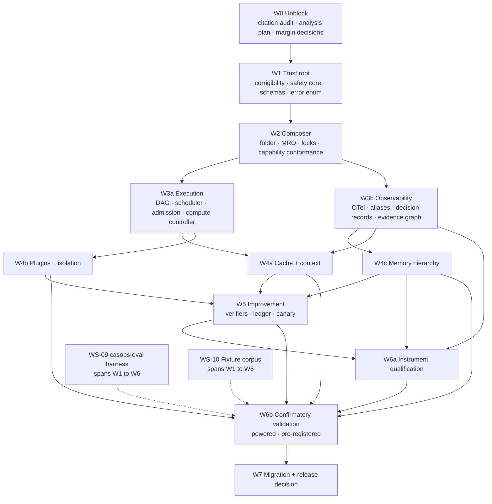

>
> **Document ID:** `CASOPS-IP-COMMON-AGENT-STRUCTURE-V3A-001`
> **Date:** `2026-08-24`
> **Status:** Draft plan — awaiting sign-off on the eleven open decisions in §15
> **Implements:** `common_agent_structure.v3a.md` (`casops.common_agent.v3`, schema `3.0`)
> **Plan horizon:** Release decision, not post-release operation

---

## Table of contents

1. Executive summary
2. Plan-time verification findings
3. Six blocking inconsistencies in the specification's gates
4. Program architecture and critical path
5. Workstream catalogue
6. Wave plans with entry and exit gates
7. Instrument qualification program
8. Statistical engineering plan
9. Fixture and corpus build-out
10. Build-versus-adopt decisions
11. Host repository and service topology
12. Environments and compute budget
13. Team, roles, and sizing
14. Schedule and milestones
15. Open decisions requiring sign-off
16. Plan-execution risk register
17. Traceability matrix
18. Release checklist and definition of done
19. Change control

---

# 1. Executive summary

## 1.1 What the specification leaves to be done

v3a is specification-complete and deployment-blocked. Its §21.7 static report resolves to `STATIC_PASS` on seventeen specification domains, `NOT_RUN` on seven implementation domains, and `BLOCKED` on two release items. The program in this plan closes the `NOT_RUN` and `BLOCKED` rows and nothing else. It does not extend the architecture.

Two blockers gate release, and they have radically different shapes:

| Blocker | Nature | Effort | Critical path |
|---|---|---|---|
| `CIT-GATE-001` / `CIT-GATE-002` | Desk research and audit tooling | ~3 person-weeks | Short, front-loaded, cheap to clear |
| Local validation of §21.5 | Full host implementation plus powered measurement | ~11–14 person-years | Dominates the entire schedule |

The asymmetry matters for sequencing. The citation audit should clear in Wave 0 because it is cheap and because leaving it open lets unaudited claims leak into design rationale for a year. The local validation blocker cannot clear until every plane exists, every measurement instrument is itself qualified, and confirmatory runs at powered sample sizes complete.

## 1.2 Shape of the program

Eight waves, sequenced by trust dependency rather than by specification section order:

```
W0  Unblock  ──► W1  Trust root ──► W2  Composer + capability ──► W3  Execution + observability
                                                                          │
                        ┌─────────────────────────────────────────────────┤
                        ▼                                                 ▼
                   W4  Cache/context, plugins, memory              W5  Improvement
                        └─────────────────┬───────────────────────────────┘
                                          ▼
                              W6  Instrument qualification + confirmatory validation
                                          ▼
                              W7  Migration + release decision
```

The ordering inverts the document in one important way. v3a presents corrigibility as §15, two-thirds through, but §17.1 step 2 requires invariant attestation *before executable resolution*. Corrigibility is therefore Wave 1, ahead of the composer, ahead of execution, ahead of everything. Nothing in this system may run before the host can prove the invariant digest matches a reference the agent cannot reach.

## 1.3 Headline findings

Six gates in §21.5 cannot be satisfied as written. Details in §3; summary here:

| # | Finding | Consequence if unaddressed |
|---|---|---|
| F1 | Gate A's 1pp non-inferiority margin requires ~10,500 paired tasks, 26× the stated 400 floor | Every efficiency-track release is permanently underpowered, and §21.4.3 forbids calling that a pass |
| F2 | Gate B's 5pp superiority requires ~630 paired tasks, above the 400 floor | Quality-track releases fail their own power requirement |
| F3 | The 400-task floor is internally calibrated to a ~5pp effect, not to the margins the gates actually use | The floor gives false assurance across four gate families |
| F4 | Five gates depend on measurement instruments whose own accuracy is never qualified | `RCA@1 ≥85%`, `unsupported-claim ≤1%`, reward-hacking detectors, monitor verdicts, and claim extraction all gate on unvalidated instruments |
| F5 | "Promotion-induced regression ≤2% over ≥20 promotions" cannot be evaluated before 20 promotions exist | A post-release operational SLO is miscategorized as a pre-release gate |
| F6 | §22.2 step 16 (enable one optional feature at a time, run its gates) multiplies confirmatory cost by the number of optional features | Validation compute grows ~8–10×, and schedule with it |

F1 through F3 are all instances of the same root cause: `DEF-006` was correctly diagnosed — fixed `n` does not guarantee power — but the fix replaced one fixed number with a floor that is still fixed, and the floors were never reconciled against the margins in §21.5.1. The plan's answer is to make the analysis plan authoritative over the floors and to renegotiate three margins before Wave 0 exits.

F4 is the most consequential finding for build order, and it is not a specification defect so much as a specification gap. v3a is rigorous about the statistical validity of comparisons but silent on the metrological validity of the instruments producing the numbers. A claim-grounding verifier with unknown precision cannot certify a ≤1% unsupported-claim rate. §7 adds an instrument qualification program to close this.

## 1.4 Sizing

| Dimension | Planning estimate | Confidence |
|---|---|---|
| Calendar to release decision | 46–54 weeks | Medium |
| Peak team | 16–19 FTE | Medium |
| Total effort | 11–14 person-years | Low–medium |
| Confirmatory validation compute | 180k–450k model calls per full suite pass | Low |
| Full suite passes budgeted | 6 (2 dry, 3 iteration, 1 confirmatory) | Medium |

Estimates assume the margin renegotiation in §15 `DEC-03` succeeds. If the 1pp margin is retained, add 10–14 weeks and roughly triple validation compute.

---

# 2. Plan-time verification findings

Plan preparation resolved the four load-bearing disputed identifiers. This is a pre-audit, not the audit: it does not produce `citation-audit.json`, does not carry reviewer attestation, and does not discharge `CIT-GATE-001`. It exists to size Wave 0 and to correct two defect entries that would otherwise misdirect design.

| v3a entry | Resolution | Marker change | Action for Wave 0 |
|---|---|---|---|
| `arXiv:2608.14624` — *Learning Agent Execution for KV-Cache Management in Agentic Serving* | Resolves. Title matches v3a §25.1 exactly. Submitted 16 Jul 2026. Nine authors incl. Junchen Jiang, Liting Hu | `[D]` → candidate `[A]` | Close `DEF-002`. Record that the erroneous element was v2's "CacheScout" label and month, both already removed |
| `arXiv:2608.17528` — *Agent Lightning v1.0: Towards Harnessed Agentic RL* | Resolves. Microsoft/Fudan/Zhejiang/Edinburgh, submitted 18 Aug 2026. Paper text carries 41.8% → 56.4% on SWE-bench Verified, +14.6 absolute, Qwen3.5-9B, 6K SWE-smith samples | `[D]`/withdrawn → candidate `[A]` with constraint | Restore the citation. Re-enter the numeric claim **only** in §21.8 as `MEASURED_EXTERNAL`, E3. Do not restore it to any requirement rationale |
| `arXiv:2508.03680` — *Agent Lightning: Train ANY AI Agents with Reinforcement Learning* | Resolves, and is cited *by* 2608.17528 as prior work | `[C]` → candidate `[A]` | Record that v2 conflated two distinct papers. This is the actual root cause of `DEF-003` |
| GenAI semantic conventions stability | External commentary as of 2026 reports no stable `gen_ai.*` attributes | Corroborates `DEF-001` | Strengthens the §9.4 alias layer from defensive to necessary. Raise `casops.*` aliasing from "protective" to "load-bearing" in design docs |

Two secondary observations worth carrying into design:

**The Agent Lightning result contains its own counter-evidence.** Coverage of the release notes 56.4% on SWE-bench Verified against roughly 2.5% on the Remote Labor Index. That gap is a live illustration of why v3a §12.11 forbids satisfying a memory gate with a public benchmark score alone, and why §21.5.5 mandates domain golden tasks. The plan should cite this contrast in the evaluation design rationale — it is the cleanest available argument for the contamination and golden-task requirements.

**Execution/training separation survives independent of the citation.** v3a §13.8 requires that gradient updates not execute in the serving process. `DEF-003` withdrew the numeric support but retained the control "on operational grounds." That retention was correct and is now additionally supported: Agent Lightning v1.0's stated design point is training *through* the production harness while leaving agent code untouched, which is the same separation expressed from the training side.

### Wave 0 residual

Remaining unresolved at plan time: five memory surveys, two self-evolving-agent surveys, two serving papers (`2605.27744`, `2607.20495`), the MCP revision list including the `2026-07-28` pin, and the full `[C]` and `[K]` inventories — roughly 55 entries. At the observed resolution rate of four entries per hour including transcription into audit records, Wave 0's audit is 2.5–3 person-weeks including reviewer sign-off. This is the cheapest blocker in the program and should not be allowed to slip.

---

# 3. Six blocking inconsistencies in the specification's gates

Each item states the defect, the arithmetic, and the required decision. All six must be dispositioned in Wave 0. None require architectural change.

## 3.1 F1 — Gate A's non-inferiority margin is unsatisfiable at the stated floor

§21.5.1 Gate A requires "task success is non-inferior within 1pp." §21.4.3 sets the binary floor at 400 paired tasks and requires 90% power for release-critical gates.

For paired binary non-inferiority on a risk difference, with `p_d` the discordant-pair probability:

```
n_pairs  ≈  (z₁₋α + z₁₋β)² · p_d / δ²
```

At α = 0.025 one-sided, power = 0.90, `p_d` = 0.10, δ = 0.01:

```
n  ≈  (1.960 + 1.282)² × 0.10 / 0.0001  ≈  10.51 × 0.10 / 0.0001  ≈  10,508 pairs
```

The floor is 400. The requirement is ~10,500. The gap is 26×, and §21.4.3's closing sentence — "an underpowered result is not a pass, even if its point estimate exceeds the threshold" — converts this from a sizing nuisance into a permanent release blocker for the entire efficiency track.

Sensitivity:

| δ (NI margin) | `p_d` = 0.05 | `p_d` = 0.10 | `p_d` = 0.15 |
|---:|---:|---:|---:|
| 1pp | 5,254 | 10,508 | 15,762 |
| 2pp | 1,314 | 2,627 | 3,941 |
| 3pp | 584 | 1,167 | 1,751 |
| 5pp | 211 | 420 | 631 |

**Required decision (`DEC-03`).** Choose one: widen Gate A's margin to 3pp (~1,167 pairs, tractable); retain 1pp and budget ~10,500 paired tasks with the schedule and compute consequences; or split into a powered 3pp gate plus a 1pp monitoring metric explicitly labelled indicative. The plan's default assumption is 3pp.

## 3.2 F2 — Gate B's superiority requirement also exceeds the floor

Gate B requires "task success improves ≥5pp with superiority CI excluding zero." Paired superiority at δ = 0.05, α = 0.025 one-sided, power 0.90, `p_d` = 0.15 gives ~631 pairs. The floor is 400. Gate B is underpowered by ~1.6× at its own stated effect size whenever discordance exceeds ~0.095.

**Required decision.** Raise the binary floor to 650, or make the analysis plan's computed `n` strictly authoritative and demote the floor to a sanity minimum. The plan recommends the latter, which also fixes F3.

## 3.3 F3 — The 400 floor is calibrated to a margin no gate uses

Reading the table in §3.1 backwards: 400 pairs at `p_d` = 0.10 corresponds to a detectable δ of ~5.1pp. The floor was evidently calibrated to a 5pp effect. But the gates that consume it use 1pp (Gate A quality preservation), 3pp (context rot), 1pp (stopping-rule success preservation), and 2pp (staleness). Only Gate B's 5pp matches.

This is the residue of `DEF-006`. The diagnosis was right and the remedy was half-applied.

**Required change.** In `evals/analysis_plan.json`, floors become advisory lower bounds; `n_final = powered_n` computed per gate from that gate's own margin, with a hard error if `powered_n < floor`. The harness must refuse to emit a `pass` verdict when `n_observed < n_required`, and must emit `IMP_STAT_UNDERPOWERED` instead. This is one of the first behaviours to build in `casops-eval`, because it is what prevents the whole class of error.

## 3.4 F4 — Five gates depend on unqualified measurement instruments

v3a rigorously governs comparisons but never validates the instruments producing the measurements:

| Gate | Instrument | Unstated dependency |
|---|---|---|
| `unsupported_claim_rate ≤1%` (§21.5.3) | Claim extractor + `constraint_grounding_v2` | Extractor recall determines the denominator; verifier precision determines the numerator. Both unknown |
| `RCA@1 ≥85%` (§21.5.3) | Failure classifier | Requires labelled single-fault ground truth; label quality is the ceiling on measurable accuracy |
| Reward-hacking detectors (§13.6, §21.5.6) | Six detectors | A detector with unknown false-negative rate cannot support "passes all detectors" |
| Reasoning-monitor verdicts (§10.3) | Monitor model | Verdicts may block execution (FR-OBS-105); a miscalibrated monitor silently degrades availability |
| `MPR ≥95%` (§21.5.5) | Poisoning-success oracle | Requires an operational definition of "successful poisoning" independent of the detector under test |

A gate is only as trustworthy as its instrument. Certifying ≤1% unsupported claims with an extractor of unmeasured recall is measurement theatre.

**Required addition.** §7 defines an instrument qualification program: every gate-bearing instrument gets its own labelled qualification set, reported precision/recall or calibration, and a qualification threshold that must clear *before* the instrument may gate. Instruments are versioned in the compose lock alongside models and tokenizers. This is net-new scope of roughly 1.5 person-years and it sits on the critical path into Wave 6.

## 3.5 F5 — One improvement gate is not a pre-release gate

§21.5.6: "Promotion-induced regression rate must be at most 2% over a rolling window of at least 20 promotions." At release there have been zero promotions. The metric is undefined, and 2% of 20 is 0.4 — the gate is effectively "zero regressions in 20 promotions," measurable only after roughly a year of operation.

**Required change.** Reclassify as post-release operational SLO `SLO-IMP-01`, with an explicit release-time substitute: rollback RTO verified on ≥5 synthetic promotions in the canary simulator, plus zero successful self-promotions across the negative fixture suite. Move it out of §21.5.6's release list in the v3b editorial pass.

## 3.6 F6 — Sequential feature enablement multiplies confirmatory cost

§22.2 step 16–17: "Enable one optional v3 feature at a time. Run its gates." Optional features number at least ten: T0/T1/T2/T3 cache tiers, compaction, adaptive compute, speculation, learned routing, consolidation, paged memory hierarchy. Running powered gates per feature multiplies confirmatory cost by ~10.

**Required change.** Two-tier evaluation, formalized in §8.4. A *screening* tier (n = 100–150, explicitly labelled `INDICATIVE`, never admissible to a release report, structurally barred by the harness from emitting `pass`) governs per-feature enablement during migration. A *confirmatory* tier (powered, pre-registered, group-sequential where applicable) runs on release candidates only. The harness must make the two physically distinguishable in the report schema so that `VAL_PLAN_DRIFT`-style substitution cannot occur by accident.

---

# 4. Program architecture and critical path

## 4.1 Dependency graph



## 4.2 Critical path

The longest chain is:

```
W0 analysis plan (3w)
  → W1 corrigibility attestation mechanism (5w)
    → W2 composer + capability conformance (8w)
      → W3b observability + evidence graph (10w)
        → W4c memory hierarchy + deletion probes (12w)
          → W6a instrument qualification (8w)
            → W6b confirmatory validation (7w)
              → W7 release decision (3w)
                                        ≈ 56 weeks serial
```

Overlap between W3b/W4c and between W6a/W6b compresses this to 46–54 weeks. Three items sit on the critical path and deserve disproportionate attention:

1. **Corrigibility attestation** (W1). Everything blocks on it because §17.1 puts it at step 2. It is also architecturally subtle — see `DEC-01`.
2. **Memory deletion verification** (W4c). `DCR = 100%` by post-deletion probe across eight derived paths is the single most demanding correctness requirement in the specification.
3. **Instrument qualification** (W6a). Net-new scope from F4, and it gates the confirmatory run rather than running alongside it.

## 4.3 Deliberately excluded from this program

| Item | v3a status | Plan disposition |
|---|---|---|
| L5 core self-modification | Research-only (§13.9) | Out of scope. No environment provisioned |
| T3 approximate semantic cache | Off by default (§8.2) | Build the tier interface and the false-reuse harness; leave disabled. Do not gate release on it |
| L4 model-adapter training | Separate trainer (§13.1) | Interface and trajectory export only. No trainer in scope |
| Second public control plane | Prohibited (§1.3) | All operator surface extends the existing FastAPI plane under `/api/v3/` |
| Batch-invariant kernels | Capability-gated (§21.4.5) | Build the probe. Do not commit to achieving it. Token-level replay stays out of scope unless the probe passes |

---

# 5. Workstream catalogue

Thirteen workstreams. Each has a single accountable owner, explicit FR coverage, and exit criteria phrased as verifiable artifacts.

| WS | Name | Owner | FR / § coverage | Primary exit artifact |
|---|---|---|---|---|
| WS-00 | Program, change control, plan integrity | Program lead | §19, `CIT-GATE-002` | Signed decision log; no future-dated artifacts |
| WS-01 | Citation audit and evidence governance | Research auditor | §2, §25, `CIT-GATE-001/002` | `citation-audit.json`, zero non-`[A]` markers |
| WS-02 | Corrigibility and trust root | Security architect | §15, INV-01–12, FR-COR-001–006 | Host-owned invariant service + 12 negative fixtures |
| WS-03 | Safety plane | Safety engineering lead | §14, FR-SAF-001–012 | Taint engine, termination guards, incident pipeline |
| WS-04 | Composer, inheritance, locks | Platform lead | §5, §6, §17.1, FR-INH-301 | `compose.lock.json` generator, MRO resolver |
| WS-05 | Compatibility and capability verification | Integrations lead | §9, FR-CMP-001–121 | `compatibility-matrix.lock.json`, conformance runner |
| WS-06 | Execution plane | Runtime lead | §7, FR-PERF-001–110 | DAG compiler, scheduler, admission, compute controller |
| WS-07 | Cache and context lifecycle | Runtime lead | §8, FR-CACHE-001–009, FR-CTX-001–007 | Tiered cache, compaction with preservation verifier |
| WS-08 | Observability and provenance | Observability lead | §10, FR-OBS-101–115 | OTel pipeline, `casops.*` alias map, evidence graph |
| WS-09 | Validation harness `casops-eval` | Eval engineering lead | §21.3, §21.4 | CLI, report schema, statistics engine |
| WS-10 | Fixture and corpus build-out | QA lead | §21.3, §9 of this plan | ~40 fixture families, 12 negative invariants |
| WS-11 | Plugins, isolation, supply chain | Security architect | §11, FR-PLG-001–118 | I0–I3 runtimes, SBOM/provenance pipeline |
| WS-12 | Memory | Memory lead | §12, FR-MEM-101–120 | Paged hierarchy, trust tiers, deletion probes |
| WS-13 | Improvement plane | ML systems lead | §13, FR-IMP-101–111 | Candidate pipeline, verifiers, immutable ledger |

Instrument qualification (§7) is jointly owned by WS-08, WS-12, WS-13 and coordinated by WS-09, because each instrument belongs to the plane that produces it but all must satisfy one qualification standard.

---

# 6. Wave plans with entry and exit gates

## Wave 0 — Unblock (weeks 1–4)

**Objective.** Clear the cheap blocker, fix the arithmetic, and freeze the measurement contract before any code is written.

| WP | Work | Owner | Exit criterion |
|---|---|---|---|
| WP-001 | Resolve all ~55 residual references against live sources | WS-01 | `citation-audit.json` committed; every entry `accepted` or entry deleted |
| WP-002 | Close `DEF-002`; restore `DEF-003` citation with `MEASURED_EXTERNAL` constraint | WS-01 | Defect register updated; numeric claim confined to §21.8 |
| WP-003 | Delete unresolvable references and re-justify or remove dependent requirements | WS-01 | No requirement rests solely on a deleted reference |
| WP-004 | Compute prospective power for every inferential gate | WS-09 | Power table with assumptions, method, and sensitivity per gate |
| WP-005 | Disposition F1–F6; renegotiate three margins | WS-00 + WS-09 | Signed decisions `DEC-02`…`DEC-05` |
| WP-006 | Author `evals/analysis_plan.json` v1 and pre-register | WS-09 | Plan digest recorded; estimands declared per gate |
| WP-007 | Select group-sequential design for canary monitoring | WS-09 | Looks, spacing, alpha-spending function fixed |
| WP-008 | Establish plan-integrity controls | WS-00 | CI check rejecting any artifact dated after audit date |

**Exit gate G0.** Citation audit accepted; analysis plan pre-registered with computed `n` per gate; F1–F6 dispositioned in writing. No implementation work starts before G0, because analysis-plan drift after run start invalidates runs under `VAL_PLAN_DRIFT`, and building measurement code against an unfrozen plan guarantees rework.

## Wave 1 — Trust root (weeks 4–12)

**Objective.** Make corrigibility unreachable by construction, not by policy, before any executable path exists.

| WP | Work | Owner | Exit criterion |
|---|---|---|---|
| WP-101 | Design and build host-owned invariant service | WS-02 | Invariants outside every agent-writable capability; `DEC-01` resolved |
| WP-102 | Attestation protocol: digest comparison at compose step 2 | WS-02 | Mismatch → containment stop, no degraded mode (FR-COR-003) |
| WP-103 | Negative fixtures for INV-01…INV-12 | WS-02 + WS-10 | 12 fixtures, each aborting correctly; untested invariant treated as broken (FR-COR-006) |
| WP-104 | Containment-stop primitive distinct from kill switch | WS-02 + WS-03 | Two switch classes cannot be confused at the API level |
| WP-105 | Taint model and propagation engine | WS-03 | Taint survives transform, summary, compaction, consolidation (FR-SAF-002) |
| WP-106 | Termination and excessive-agency guards | WS-03 | All caps enforced; trips return bounded failure, never truncated success |
| WP-107 | Consolidated error-code enum from §20 | WS-04 | Single generated source of truth; schema-validated; no ad-hoc codes |
| WP-108 | JSON Schemas for all §18 data models | WS-04 | `agent_spec`, memory record, evidence graph, decision record, manifest |
| WP-109 | Shutdown/cancellation honoured at node boundaries | WS-02 | Terminates plugin invocations enforceably (FR-COR-004) |

**Exit gate G1.** All twelve invariant negative fixtures abort correctly. Attestation mismatch produces containment stop with zero bypass paths. Error enum generated and consumed by at least one caller.

Design note on WP-107: §20 is the specification's newest section and its ~110 codes are referenced from a dozen other sections. Generating the enum from a single machine-readable source, and failing CI on any code used but undeclared, is cheap now and very expensive to retrofit once nine planes reference codes by string literal.

## Wave 2 — Composer, locks, capability verification (weeks 10–20)

**Objective.** Reproducible composition and verified-not-asserted capability binding.

| WP | Work | Owner | Exit criterion |
|---|---|---|---|
| WP-201 | Folder contract validator per §5.1/§5.2 | WS-04 | Required-file matrix enforced; disabled modes valid |
| WP-202 | MRO resolver: 8 parents, depth 3, diamond collapse, cycle fail-closed | WS-04 | Deterministic order; `INH_*` codes emitted correctly |
| WP-203 | Merge engine: tightening-only safety, minima for budgets, never-inherit set | WS-04 | All §6.3 surfaces provably non-inheriting |
| WP-204 | Fixture monotonicity enforcement with signed-waiver path | WS-04 | `INH_FIXTURE_REMOVAL` on unwaived removal |
| WP-205 | `compose_hash` and all five lock generators | WS-04 | Any input change produces new hash; locks reproducible |
| WP-206 | Capability conformance runner | WS-05 | Every capability resolves `VERIFIED`/`REFUTED`/`ASSERTED_UNVERIFIED` |
| WP-207 | Tokenizer and chat-template digest pinning | WS-05 | Drift detected 100%; triggers re-conformance |
| WP-208 | JSON-Schema profile negotiation | WS-05 | Unsupported construct fails compose (`CMP_JSON_SCHEMA_PROFILE`) |
| WP-209 | Capability-drift detection and route quarantine | WS-05 | Previously verified failure → `CMP_CAPABILITY_DRIFT` |
| WP-210 | Batch-invariance probe | WS-05 | Returns verified/unverified; gates replay claims |
| WP-211 | Deterministic test adapter + 3 real adapter profiles | WS-05 | Four profiles pass mandatory contract tests |

**Exit gate G2.** No production binding to an unverified capability. Compose lock reproducible across machines. Injected capability, tokenizer, and template drift each detected 100%.

## Wave 3 — Execution and observability (weeks 18–32)

Two parallel tracks sharing a spine.

### W3a Execution (WS-06)

| WP | Work | Exit criterion |
|---|---|---|
| WP-301 | `casops.execution_dag.v2` IR + compiler | Fifteen node kinds; cycle detection; typed edges |
| WP-302 | Side-effect safety analysis | Unordered side-effecting nodes never parallelized (FR-PERF-003) |
| WP-303 | Deadline-aware scheduler on goodput objective | Deadline + cancellation token propagate to every node |
| WP-304 | SLO admission control | Queue or shed with reason code; no global degradation |
| WP-305 | Compute controller with marginal-gain stopping | Gain, cost, threshold, rule version logged per decision |
| WP-306 | Model router with reproducible decision records | Feature vector, candidates, scores, rule version recorded |
| WP-307 | Speculation with guard + compensation | No side effect commits pre-guard; abandoned speculation compensates |
| WP-308 | Optimizer kill switches, fixture-tested | 100% return to validated baseline semantics |
| WP-309 | Metrics: CPST, goodput, CPE, CRR, TTFO, refinement yield | Computed per run; unsampled counters |

### W3b Observability (WS-08)

| WP | Work | Exit criterion |
|---|---|---|
| WP-321 | OTel pipeline with pinned `schema_url` | `semconv.lock.json` generated; change raises `CMP_SEMCONV_VERSION` |
| WP-322 | `casops.*` stable alias layer | 100% alias coverage for gate-bearing fields; gates bind to aliases only |
| WP-323 | Decision-record emission | All §10.2 fields; no raw CoT |
| WP-324 | Append-only hash-chained event store | Chain verifiable; tamper detectable |
| WP-325 | Tail sampling with mandatory retention | Mandatory categories survive induced budget exhaustion |
| WP-326 | Content-capture levels with redaction | `metadata_only` default; redaction fixtures pass 100% |
| WP-327 | Claim extractor + evidence graph emission | Graph for every claim-bearing artifact |
| WP-328 | Reasoning monitor, internal-only | Zero leak to export, artifact, memory, peer, prompt, telemetry payload |
| WP-329 | Failure classifier for RCA | Versioned taxonomy; single-fault attribution |
| WP-330 | Replay and counterfactual replay | Observation-level equivalence; no memory write, no production artifact |
| WP-331 | Bounded encrypted local spool | Exporter failure tolerated; dual failure → containment stop |

**Exit gate G3.** Exactly one root trace per run; ≥99.9% valid span relationships; zero CoT export; zero monitor leak; evidence graph emitted for every claim-bearing artifact. Note that the *rates* (`RCA@1`, `unsupported_claim_rate`) are not gated here — they gate in W6 after their instruments qualify in W6a.

## Wave 4 — Cache/context, plugins, memory (weeks 28–46)

Three tracks, independently ownable, all default-off or minimum-tier at entry.

### W4a Cache and context (WS-07)

| WP | Work | Exit criterion |
|---|---|---|
| WP-401 | Full-scope cache key discipline | Key includes all eleven §8.3 components |
| WP-402 | T0/T1/T2 tiers with budgets and eviction | No silent staleness on eviction |
| WP-403 | Invalidate-before-read on all seven triggers | Dependency invalidated before next read |
| WP-404 | Scope-violation detection: abort + purge | Zero violations; `PERF_CACHE_SCOPE` |
| WP-405 | Cache-on/off equivalence harness | TOST-ready; margin from analysis plan |
| WP-406 | T3 interface + false-reuse harness, disabled | Harness sized for ≤0.5% upper bound (~600 trials) |
| WP-407 | Deletion propagation into all tiers | Memory tombstone reaches every cache tier (FR-CACHE-009) |
| WP-411 | Segment budgets with pinned invariants | Charter, corrigibility, `does_not_own`, disclosure, schema, deadline non-compactable |
| WP-412 | Compaction with preservation verifier | Failure escalates or stops; never silently proceeds |
| WP-413 | Offload with retrievable reference | No mid-run destruction |
| WP-414 | Re-grounding checkpoints | Configured cadence on long-horizon runs |
| WP-415 | Isolated sub-agent spawn for oversized subtasks | Narrow brief; no unbounded parent context |

### W4b Plugins (WS-11)

| WP | Work | Exit criterion |
|---|---|---|
| WP-421 | I0 in-process, first-party read-only | Tier assignment enforced |
| WP-422 | I1 WASM capability sandbox | ≤1 ms median, ≤3% p95 overhead |
| WP-423 | I2 process + namespace/seccomp, no ambient network | ≤5% p95 |
| WP-424 | I3 microVM + allow-listed egress proxy | ≤15% p95 |
| WP-425 | Object-capability handles: unforgeable, revocable, expiring | Forgery and unauthorized delegation denied 100% |
| WP-426 | Supply chain: SBOM, provenance, scan, signature | Any missing element fails closed |
| WP-427 | ABI semver + contract tests | Incompatibility fails load |
| WP-428 | Manifest validation without code execution | Proven by fixture (`PLG_MANIFEST_INVALID`) |
| WP-429 | Hot swap: drain + shadow validate | Regressing replacement rejected, prior version retained |
| WP-430 | Thirteen-step lifecycle end to end | Zero core-source change for tool/modality/evaluator install |

### W4c Memory (WS-12)

| WP | Work | Exit criterion |
|---|---|---|
| WP-441 | Seven typed stores | Engineering taxonomy; no biological-equivalence claim |
| WP-442 | H0–H3 paged hierarchy with residency budgets | H1 p95 ≤150 ms, H2 p95 ≤2 s |
| WP-443 | Page-in/out telemetry and cost attribution | Trigger, token cost, latency, tier |
| WP-444 | Non-evictable pinned invariants in H0 | Fixture-proven |
| WP-445 | Bitemporal records with supersession | Valid and transaction time distinct; no silent overwrite |
| WP-446 | Trust tiers T0–T4 with pre-injection filtering | T3 never factual support, never overrides T0/T1 |
| WP-447 | Hybrid retrieval: lexical + dense + graph + temporal | Latest valid version + material conflicts returned |
| WP-448 | Conflict-aware abstention | Irreconcilable conflict → abstain (`MEM_CONFLICT`) |
| WP-449 | Poisoning screen and quarantine | No poison reaches T0/T1 |
| WP-450 | Offline consolidation with capacity isolation | Never consumes serving reservation; trust ≤ lowest input |
| WP-451 | Tombstone propagation across eight paths | Records, indexes, caches, summaries, embeddings, graph edges, consolidation output, derived artifacts |
| WP-452 | Post-deletion probes on all retrieval paths | Lexical, dense, graph, cache all verified absent |
| WP-453 | Weight-level limitation recording | Deletion records limitation; flags retraining review (FR-MEM-120) |
| WP-454 | Legal-hold exclusion, auditable | Excluded from decay/deletion |

**Exit gate G4.** Zero cache-scope violations. Zero cross-tenant retrieval. All isolation-tier overheads within budget. Deletion verified complete across all eight derived paths. Every plane's kill switch or containment stop fixture-tested.

## Wave 5 — Improvement (weeks 40–52)

| WP | Work | Owner | Exit criterion |
|---|---|---|---|
| WP-501 | Failure attribution to seventeen cause codes | WS-13 | "Task failed" never sufficient |
| WP-502 | Candidate pipeline, ten types, propose-only | WS-13 | All §13.5 fields; no promotion path from agent identity |
| WP-503 | Verifier registry + independence attestation | WS-13 | Objective without verifier rejected (`IMP_VERIFIER_MISSING`) |
| WP-504 | Six reward-hacking detectors | WS-13 | Golden-task degradation rejects regardless of target gain |
| WP-505 | Cryptographic held-out isolation | WS-13 | Leakage detected (`IMP_HOLDOUT_LEAK`) |
| WP-506 | Failure-to-fixture ratchet | WS-13 + WS-10 | Fixture created before fix promotion; union-monotonic |
| WP-507 | Group-sequential canary controller | WS-13 + WS-09 | Pre-registered boundaries; naive peeking impossible |
| WP-508 | Immutable hash-chained ledger | WS-13 | Promotion-boundary entries unrewritable by agent |
| WP-509 | Signed rollback with tested RTO | WS-13 | Rollback absent → deployment blocked |
| WP-510 | Trajectory export to out-of-process trainer | WS-13 | No gradient update in serving process |

**Exit gate G5.** Zero successful self-promotions across the negative suite. Every promotion path requires independent human approval, signature, and complete ledger entry. Rollback RTO verified on ≥5 synthetic promotions (the F5 substitute).

## Wave 6 — Instrument qualification and confirmatory validation (weeks 46–56)

### W6a Instrument qualification (weeks 46–52)

Detailed in §7. Exit: every gate-bearing instrument has a published qualification report meeting its threshold. Any instrument that fails qualification has its dependent gate suspended and escalated, not silently reported.

### W6b Confirmatory validation (weeks 52–56)

| WP | Work | Exit criterion |
|---|---|---|
| WP-601 | Freeze the powered v2 baseline | All twenty §21.4.1 freeze-list items recorded |
| WP-602 | Dry-run full suite twice | Harness stability; no plan drift |
| WP-603 | Execute confirmatory suite at powered `n`, paired, interleaved | Cold/warm cache reported separately; zero undocumented exclusions |
| WP-604 | Statistics: McNemar, paired bootstrap, one-sided NI, TOST, exact binomial, Holm | Effect sizes and intervals on every gate |
| WP-605 | Compile `report.json` + `statistics.json` | Every gate reported; no post-hoc subset selection |

**Exit gate G6.** Every §21.5 gate reported with interval estimate and power attainment. No gate passes on an underpowered result. No favourable subset selected after observation.

## Wave 7 — Migration and release decision (weeks 54–58)

| WP | Work | Exit criterion |
|---|---|---|
| WP-701 | Execute twenty §22.2 migration steps on a reference v2 agent | Migration report recorded |
| WP-702 | v2/v3 golden-envelope comparison | No unauthorized tool, network, identity, permission, or activation change |
| WP-703 | Sequential feature enablement via screening tier | Each feature's screening gates pass before next enablement |
| WP-704 | Assemble release dossier | §18 checklist complete |
| WP-705 | Independent human release review | GO / NO-GO recorded with reasons |

**Exit gate G7.** All mandatory gates pass; citation audit accepted; release recommendation recorded. v3a remains `DRAFT` until both blockers clear, per its own §26.

---

# 7. Instrument qualification program

This section is net-new relative to v3a and exists to close F4. It is the plan's most substantive addition.

## 7.1 Principle

> A gate threshold is meaningless unless the instrument measuring it has known error characteristics at that threshold.

An extractor that finds 80% of claims cannot certify a 1% unsupported-claim rate, because the 20% it misses are exactly where unsupported claims hide. Instruments must be qualified before they gate, and their qualification must be versioned in the compose lock alongside models, tokenizers, and templates.

## 7.2 Instrument register

| ID | Instrument | Gates it serves | Qualification set | Threshold to gate |
|---|---|---|---|---|
| `INS-01` | Claim extractor | `unsupported_claim_rate ≤1%` | 500 human-annotated artifacts, dual-annotated | Recall ≥0.95, precision ≥0.90 on claim spans; inter-annotator κ ≥0.75 |
| `INS-02` | `constraint_grounding_v2` verifier | Evidence-graph support verdicts | 800 claim–evidence pairs, balanced | Precision ≥0.95 on `unsupported`; recall ≥0.90 |
| `INS-03` | Failure classifier | `RCA@1 ≥85%` | 400 injected single-fault runs across all 17 cause codes | Label accuracy ≥0.90 against injection ground truth |
| `INS-04` | Reward-hacking detectors ×6 | §21.5.6 promotion gate | 200 positive + 400 negative per detector | Per-detector recall ≥0.90, FPR ≤0.05 |
| `INS-05` | Reasoning monitor | Execution blocking (FR-OBS-105) | 600 labelled trajectories | Calibration ECE ≤0.05; FPR ≤0.02 at operating point |
| `INS-06` | Poisoning-success oracle | `MPR ≥95%` | 300 attack outcomes, adjudicated | Adjudication agreement ≥0.95; oracle independent of detector under test |
| `INS-07` | Preservation verifier (compaction) | `CTX_PRESERVATION`, context-rot gate | 300 compaction events with known invariant sets | Recall ≥0.99 on invariant loss |
| `INS-08` | Cache equivalence verifier | `CACHE_EQUIVALENCE`, T3 false reuse | 600 paired cached/uncached executions | False-equivalence rate ≤0.002 |

## 7.3 Rules

| ID | Rule |
|---|---|
| `IQ-01` | An unqualified instrument may report but may not gate. Its dependent gate reports `NOT_RUN`, never `pass`. |
| `IQ-02` | Instrument versions are pinned in `compose.lock.json`. A version change requalifies. |
| `IQ-03` | Qualification sets are held-out from all improvement and are cryptographically isolated under FR-IMP-105. |
| `IQ-04` | An instrument may not be qualified using data it or its family generated. |
| `IQ-05` | Where an instrument is a model judge, `FR-IMP-102` independence applies to qualification as well as to use. |
| `IQ-06` | Qualification reports are committed to `evals/reports/<run-id>/instruments.json` and referenced by every gate they serve. |
| `IQ-07` | Instrument error propagates into gate reporting: a gate served by an instrument with recall `r` reports its threshold comparison with the instrument's measured error stated alongside. |

`IQ-07` is the point of the whole section. A report reading "unsupported-claim rate 0.7%, instrument recall 0.95 ⇒ adjusted upper bound 1.5%" is honest. A report reading "0.7%, pass" is not, and the specification's own P28 statistical-honesty principle requires the former.

## 7.4 Cost

Roughly 3,300 annotated items across eight instruments, dual-annotated where κ is required. At 6–10 items/hour with adjudication, ~550 annotator-hours plus ~0.9 person-years of engineering for qualification harnesses. Total ~1.5 person-years. This is why F4 is a schedule finding and not just a correctness finding.

---

# 8. Statistical engineering plan

## 8.1 Authority order

1. `evals/analysis_plan.json` — authoritative for every gate's estimand, margin, α, power, and required `n`
2. §21.4.3 floors — advisory minima only, per F3's resolution
3. Harness behaviour — refuses `pass` when `n_observed < n_required`, emits `IMP_STAT_UNDERPOWERED`

## 8.2 Procedures by claim type

| Claim type | Procedure | Reported |
|---|---|---|
| Superiority, binary paired | McNemar exact or paired risk-difference | One-sided p, effect size, CI |
| Superiority, continuous/skewed | Paired bootstrap or permutation | Effect size, CI |
| Non-inferiority | One-sided NI at declared margin, α = 0.025 default | Confidence bound vs margin |
| Equivalence | TOST, both bounds material only | 90% CI at α = 0.05 per one-sided test |
| Zero-tolerance | Exact binomial (Clopper–Pearson) | Observed count + one-sided upper bound |
| Canary | Group-sequential, pre-registered boundaries | Alpha spent per look |
| Family-wide superiority | Holm | Adjusted p-values |

Two discipline points carried from §21.4.4: "not statistically different" is never evidence of non-inferiority, and zero observed events is never proof of zero population risk. The harness must render both as structural impossibilities — the report schema should have no field in which a null result can be recorded as an NI pass.

## 8.3 Zero-tolerance sizing

For 0 observed events in `n` trials, the 95% one-sided upper bound is `1 − 0.05^(1/n)`, approximately `3/n`:

| Gate | Target upper bound | Minimum `n` at 0 events |
|---|---:|---:|
| Indirect injection ≤2% | 0.020 | 149 |
| T3 false reuse ≤0.5% | 0.005 | 598 |
| MPR ≥95% (≤5% success) | 0.050 | 59 |
| Update / selective forgetting ≥97% | 0.030 | 99 |
| DCR ≥99% claim | 0.010 | 299 |
| Staleness ≤2% | 0.020 | 149 |

Where the gate's declared suite is smaller than the minimum, the plan's disposition is to expand the suite, not to relax the interval. Injection suites at AgentDojo scale comfortably exceed 149.

## 8.4 Two-tier evaluation (F6 resolution)

| Tier | `n` | Label | Admissible to release report | Purpose |
|---|---:|---|---|---|
| Screening | 100–150 | `INDICATIVE` | **No** — structurally barred | Per-feature enablement, iteration, regression triage |
| Confirmatory | Powered per analysis plan | `MEASURED_LOCAL` | Yes | Release gates |

Enforcement, in the harness rather than in process discipline: the two tiers write to different report schemas; the screening schema has no `pass` enum value; the release dossier assembler rejects any screening artifact. Relying on reviewer vigilance here would eventually fail.

## 8.5 Worked power table (planning estimates)

Formula `n ≈ (z₁₋α + z₁₋β)² · p_d / δ²`, α = 0.025 one-sided, power 0.90, `p_d` as stated. These are plan-time estimates to be superseded by WP-004.

| Gate | δ | `p_d` | `n` per arm | vs floor |
|---|---:|---:|---:|---|
| Gate A quality NI @1pp | 0.01 | 0.10 | 10,508 | 26× over |
| Gate A quality NI @3pp (recommended) | 0.03 | 0.10 | 1,167 | 2.9× over |
| Gate B success superiority @5pp | 0.05 | 0.15 | 631 | 1.6× over |
| Context rot NI @3pp | 0.03 | 0.10 | 1,167 | 2.9× over |
| Stopping-rule success NI @1pp | 0.01 | 0.10 | 10,508 | 26× over |
| Staleness @2pp | 0.02 | 0.08 | 2,102 | 5.3× over |

Every row exceeds the 400 floor. Three exceed it by more than an order of magnitude. `DEC-03` must address the two 1pp margins together — they share the same arithmetic and the same fix.

---

# 9. Fixture and corpus build-out

## 9.1 Inventory

§21.3 implies roughly forty fixture families. Sizing by family, with the driver stated:

| Family | Fixtures | Sizing driver |
|---|---:|---|
| `perf/parallel_tool` | 12 | Three-tool concurrency bound |
| `perf/cache_equivalence` | 600 paired | TOST margin |
| `perf/context_rot` | 1,167 paired | 3pp NI |
| `perf/kill_switch` | 1 per optimizer (~10) | 100% baseline return |
| `compat/*` | 7 families, ~180 total | Four adapter profiles × contract tests |
| `obs/fault_injection` | 400 | `INS-03` qualification + `RCA@1` |
| `obs/redaction` | 80 | Secret classes × content levels |
| `obs/replay` | 120 | Observation-level equivalence ≥95% |
| `obs/sampling` | 20 | Budget-exhaustion retention |
| `obs/evidence_graph` | 500 | `INS-01`/`INS-02` qualification |
| `plugins/*` | 5 families, ~140 | Four tiers × permission/supply-chain/ABI |
| `memory/*` | 6 families, ~1,400 | Powered rates + deletion probes |
| `improve/*` | 4 families, ~800 | Detector qualification + canary sim |
| `safety/indirect_injection` | ≥149 | Exact-binomial upper bound |
| `safety/hijack`, `exfiltration`, `termination`, `taint_laundering` | ~260 | Zero-tolerance coverage |
| `corrigibility/inv01..12` | 12 | One negative fixture per invariant |
| `regression/` | Grows monotonically | Failure-to-fixture ratchet |

Total at release: ~5,800 fixtures, of which ~3,300 double as instrument qualification data.

## 9.2 Domain golden tasks

§21.5.5 forbids satisfying the memory gate on public benchmark score alone and mandates contamination checks plus domain golden tasks. The Agent Lightning benchmark-versus-labour gap noted in §2 is the argument for this requirement, and it should be cited in the corpus design rationale.

| WP | Work | Exit |
|---|---|---|
| WP-901 | Build 400 domain golden memory tasks | Independent of any public set |
| WP-902 | Contamination check against public memory benchmarks | Overlap quantified and reported |
| WP-903 | Bind memory gate to golden-set confirmation | Public score alone cannot pass |

## 9.3 Rules

| ID | Rule |
|---|---|
| `FX-01` | Fixtures are union-monotonic. Removal requires a signed, expiring waiver with a compensating control. |
| `FX-02` | Every confirmed attributable failure becomes a fixture before its fix promotes. |
| `FX-03` | Rotation is host-controlled; agents and candidate generators have no access to held-out or rotation state. |
| `FX-04` | "Known flaky" is never an exemption. A flaky fixture is a defect in the fixture or the system, triaged as such. |

---

# 10. Build-versus-adopt decisions

| Capability | Decision | Selection | Rationale |
|---|---|---|---|
| Paged KV attention, radix prefix cache | Adopt | vLLM / SGLang | E1 external evidence; reimplementation is unjustifiable |
| Telemetry transport, semconv | Adopt | OTel SDK + Collector | §9.4 mandates OTel core |
| `casops.*` alias layer | **Build** | In-house | No external component can own CASOPS gate stability, and external GenAI attributes are unstable |
| I1 sandbox | Adopt | Wasmtime + component model | Capability-based by construction |
| I2 sandbox | Adopt | Namespaces + seccomp-bpf | Standard, auditable |
| I3 sandbox | Adopt | Firecracker microVM + egress proxy | Untrusted/adversarial threat model |
| SBOM | Adopt | CycloneDX or SPDX | FR-PLG-109 |
| Build provenance | Adopt | SLSA + Sigstore/cosign | FR-PLG-110/112 |
| Tool protocol | Adopt | MCP SDK, revision pinned | FR-CMP-112 |
| Peer protocol | Adopt | A2A, normalized to CASOPS envelope | §9.6 |
| Event format | Adopt | CloudEvents JSON | §21.5.2 |
| Trace propagation | Adopt | W3C Trace Context | 100% continuity gate |
| Vector + graph memory | Adopt | Vector store + Kùzu/Neo4j | Temporal traversal (FR-MEM-108) |
| Bitemporal record layer | **Build** | In-house | Valid/transaction-time supersession with tombstone fan-out to eight paths has no drop-in |
| Deletion probes | **Build** | In-house | Path-specific to this architecture |
| Statistics engine | Adopt + wrap | statsmodels, exact binomial, `gsDesign`/`rpact` for group-sequential | Do not hand-roll inference |
| `casops-eval` CLI | **Build** | In-house | §21.3 contract is specific |
| Corrigibility invariant service | **Build** | In-house | Trust root; must not depend on third-party availability |
| Claim extractor / grounding verifier | **Build** | In-house, qualified per §7 | Gate-bearing instrument |

Six build decisions, all of them either the trust root, the measurement instruments, or the alias layer that insulates CASOPS from external churn. That is the right place to spend in-house effort; everything else is adoption.

---

# 11. Host repository and service topology

The agent folder contract in §5.1 describes *agent* layout. The host implementation is separate:

```text
casops-host/
  libs/
    casops-schema/          # §18 models, §20 error enum (generated)
    casops-compose/         # WS-04
    casops-capability/      # WS-05
    casops-dag/             # WS-06
    casops-cache/           # WS-07
    casops-context/         # WS-07
    casops-telemetry/       # WS-08 incl. casops.* alias map
    casops-evidence/        # WS-08 claim graph
    casops-memory/          # WS-12
    casops-plugin-runtime/  # WS-11, one crate per tier
    casops-safety/          # WS-03
    casops-stats/           # WS-09
  services/
    corrigibility-invariant-service/   # WS-02, separate ownership + deploy
    compose-service/
    runtime-service/
    memory-service/
    consolidation-worker/              # isolated capacity (FR-MEM-115)
    trainer-bridge/                    # out-of-process only (§13.8)
    control-plane/                     # extends existing FastAPI under /api/v3
  tools/
    casops-eval/            # WS-09 CLI
    casops-cite-audit/      # WS-01 tooling
  fixtures/                 # WS-10, mirrors evals/ layout
  docs/
    threat-model.md
    alias-map.md
    decision-log.md
```

Three topology constraints are normative, not stylistic:

1. **The corrigibility service deploys separately, with separate ownership and separate credentials.** FR-COR-001 requires enforcement by "separate ownership, storage, and capability absence — not policy checks alone." Co-deploying it with the runtime defeats the requirement no matter what the code says.
2. **The consolidation worker has its own capacity pool.** FR-MEM-115 forbids consuming serving reservations.
3. **The trainer bridge exports trajectories and never receives a gradient path into serving.** §13.8.

---

# 12. Environments and compute budget

## 12.1 Environments

| Env | Purpose | Network | Production credentials |
|---|---|---|---|
| `dev` | Development | Restricted | None |
| `conformance` | Capability verification, contract tests | Allow-listed | None |
| `eval` | Screening + confirmatory validation | Allow-listed | None |
| `sandbox` | Candidate evaluation (L2/L3) | Simulated or disabled | None |
| `canary` | ≤5% traffic, group-sequential | Production-scoped | Scoped, audited |
| `prod` | Human-gated activation only | Scoped | Scoped |

No L5 environment is provisioned. `sandbox` never holds production credentials (§13.9).

## 12.2 Compute estimate for confirmatory validation

Under the recommended margins (`DEC-03` → 3pp):

| Suite | Paired tasks | Arms | Model calls/task | Model calls |
|---|---:|---:|---:|---:|
| Perf (Gate A/B) | 1,167 | 2 | 4 | 9,336 |
| Context rot | 1,167 | 2 | 4 | 9,336 |
| Cache equivalence | 600 | 2 | 3 | 3,600 |
| Memory rates | 1,400 | 2 | 5 | 14,000 |
| Improvement gates | 800 | 2 | 6 | 9,600 |
| Safety suites | 410 | 1 | 4 | 1,640 |
| Compat + obs + plugins | ~440 | 1 | 2 | 880 |
| Instrument qualification | 3,300 | 1 | 2 | 6,600 |
| **Per full pass** | | | | **~55,000** |

Budget six passes (two dry, three iteration, one confirmatory) plus screening runs during migration: **~180k–450k model calls**, the range driven by retry rates and by how many features need screening re-runs. If the 1pp margin is retained, the perf and stopping-rule rows grow ~9× and the total roughly triples.

Wall-clock, not cost, is the binding constraint. At 40 s/task and 50-way concurrency, a confirmatory pass is ~14 hours; the six-pass programme is ~4 days of continuous eval capacity, which must be reserved rather than borrowed from development.

---

# 13. Team, roles, and sizing

| Role | FTE | Waves | Primary WS |
|---|---:|---|---|
| Program lead | 1.0 | W0–W7 | WS-00 |
| Security architect | 1.5 | W1, W4b | WS-02, WS-11 |
| Safety engineering lead | 1.0 | W1–W6 | WS-03 |
| Platform lead (composer) | 1.5 | W1–W3 | WS-04 |
| Integrations lead | 1.5 | W2–W3 | WS-05 |
| Runtime lead | 2.0 | W3–W4 | WS-06, WS-07 |
| Observability lead | 2.0 | W3–W6 | WS-08 |
| Memory lead | 2.0 | W4–W6 | WS-12 |
| ML systems lead | 1.5 | W5–W6 | WS-13 |
| Eval engineering lead | 1.5 | W0–W6 | WS-09 |
| Statistician | 0.5 | W0, W6 | WS-09 |
| QA lead | 1.5 | W1–W6 | WS-10 |
| Research auditor | 0.5 | W0 | WS-01 |
| Annotators (contract) | 1.5 | W4–W6 | §7 |
| SRE | 1.0 | W3–W7 | Environments |
| **Peak** | **~19** | W4–W6 | |

Sequencing note: the statistician is needed at 0.5 FTE in weeks 1–4 and again in weeks 52–56, not continuously. Front-loading that engagement is what produces the F1–F3 findings before rather than after a year of building.

---

# 14. Schedule and milestones

Assumes `DEC-03` resolves to 3pp margins and the team in §13 is staffed from week 1.

| Milestone | Week | Gate | Blocking dependency |
|---|---:|---|---|
| M0 Citation audit accepted | 4 | G0 | WP-001…003 |
| M1 Analysis plan pre-registered | 4 | G0 | WP-004…007 |
| M2 Trust root complete | 12 | G1 | 12 negative fixtures pass |
| M3 Composer + capability verification | 20 | G2 | Reproducible locks |
| M4 Execution + observability | 32 | G3 | Root trace, evidence graph |
| M5 Cache/context, plugins, memory | 46 | G4 | Deletion verified, tiers within budget |
| M6 Improvement plane | 52 | G5 | Zero self-promotions |
| M7 Instruments qualified | 52 | G6a | All 8 instrument reports |
| M8 Confirmatory validation complete | 56 | G6b | Powered results, all gates reported |
| M9 Release decision | 58 | G7 | Dossier + independent review |

**Critical path:** G0 → corrigibility → composer → observability → memory → instrument qualification → confirmatory validation → decision.

**Schedule risks with quantified impact:**

| Risk | Impact | Trigger |
|---|---:|---|
| 1pp margin retained | +10–14 weeks | `DEC-03` |
| Instrument fails qualification, needs redesign | +4–8 weeks | M7 |
| Deletion probes reveal an unenumerated derived path | +3–6 weeks | M5 |
| Capability refutation on a required capability | +2–5 weeks | M3 |
| GenAI semconv change mid-programme | +1–2 weeks | Any |

The last row is the one the alias layer exists to bound. Without WP-322 it would be open-ended.

---

# 15. Open decisions requiring sign-off

All eleven must be dispositioned in Wave 0. Each has a default so the programme is not blocked by indecision.

| ID | Decision | Default recommendation |
|---|---|---|
| `DEC-01` | Corrigibility invariant mechanism: read-only mount, separate signed service, or hardware-rooted attestation | Separate service with signed reference; mount alone is too easy to subvert in container escape |
| `DEC-02` | Analysis plan authoritative over floors | Yes. Floors become advisory (F3) |
| `DEC-03` | Gate A and stopping-rule NI margins: 1pp or 3pp | 3pp, with 1pp retained as an indicative monitoring metric (F1) |
| `DEC-04` | Binary floor: raise to 650 or demote to sanity minimum | Demote; `DEC-02` makes it redundant (F2) |
| `DEC-05` | Reclassify promotion-regression gate as post-release SLO | Yes, with rollback-RTO substitute (F5) |
| `DEC-06` | Adopt instrument qualification program | Yes. Gates are not credible without it (F4) |
| `DEC-07` | Two-tier evaluation with harness-enforced separation | Yes (F6) |
| `DEC-08` | Restore Agent Lightning citation and numeric claim | Restore citation; confine numeric claim to §21.8 `MEASURED_EXTERNAL` |
| `DEC-09` | MCP revision to pin, plus the N−1 supported revision | Pin latest audited revision; support one prior (FR-CMP-113) |
| `DEC-10` | Pursue batch-invariant kernels | No. Build the probe; leave token-level replay out of scope |
| `DEC-11` | T3 semantic cache in v1 | No. Build interface and harness, ship disabled |

---

# 16. Plan-execution risk register

Distinct from v3a §24, which covers system risks. These are risks to delivering the programme.

| Risk | Likelihood | Impact | Mitigation |
|---|---|---|---|
| Underpowered results reported as passes | High | Critical | Harness structurally cannot emit `pass` below required `n` (§8.1) |
| Screening results leak into release dossier | High | Critical | Separate schemas; assembler rejects screening artifacts (§8.4) |
| Instruments gate before qualification | High | Critical | `IQ-01`; dependent gate reports `NOT_RUN` |
| Citation audit deferred "until later" | Medium | High | Wave 0 exit gate; no implementation before G0 |
| Corrigibility co-deployed with runtime for convenience | Medium | Critical | Separate ownership, credentials, deploy pipeline; architecture review |
| Error codes drift from §20 | High | Medium | Generated enum; CI fails on undeclared code |
| Kill switch and containment stop conflated in code | Medium | High | Distinct API types; `DEF-007` regression fixture |
| Analysis plan edited after run start | Medium | Critical | Plan digest recorded pre-run; `VAL_PLAN_DRIFT` invalidates |
| Future-dated artifacts reintroduced | Low | High | CI date check (WP-008); `CIT-GATE-002` |
| Optional feature becomes load-bearing by drift | Medium | High | Kill-switch fixture per optimizer every release |
| Fixture suite declared flaky to unblock release | Medium | High | `FX-04`; flake is a defect, triaged not exempted |
| Eval capacity borrowed for development | High | Medium | Reserved capacity; §12.2 |
| Memory deletion path discovered late | Medium | High | Enumerate all eight paths in W4c design review, before implementation |
| Scope creep into L5 or T3 | Medium | Medium | §4.3 exclusion list; change control §19 |

The first three share a pattern: each is a case where honest process depends on someone remembering to be honest. Each mitigation replaces vigilance with structure. That substitution is the single most valuable thing this plan does, and it mirrors v3a's own move from policy-based to construction-based corrigibility.

---

# 17. Traceability matrix

| v3a section | FR / ID range | Workstream | Wave | Release gate |
|---|---|---|---|---|
| §2, §25 | `CIT-GATE-001/002`, P29 | WS-01 | W0 | §21.6 |
| §3 | P1–P30 | All | All | Cross-cutting |
| §4 | Plane boundaries | WS-04 | W2 | §21.7 architecture |
| §5 | Folder contract | WS-04 | W2 | Compose preview |
| §6 | Merge rules, FR-INH-301 | WS-04 | W2 | Compose preview |
| §7 | FR-PERF-001–110 | WS-06 | W3a | §21.5.1 |
| §8 | FR-CACHE-001–009, FR-CTX-001–007 | WS-07 | W4a | §21.5.1 |
| §9 | FR-CMP-001–121 | WS-05 | W2 | §21.5.2 |
| §10 | FR-OBS-101–115 | WS-08 | W3b | §21.5.3 |
| §11 | FR-PLG-001–118 | WS-11 | W4b | §21.5.4 |
| §12 | FR-MEM-101–120 | WS-12 | W4c | §21.5.5 |
| §13 | FR-IMP-101–111 | WS-13 | W5 | §21.5.6 |
| §14 | FR-SAF-001–012 | WS-03 | W1 | §21.5.7 |
| §15 | INV-01–12, FR-COR-001–006 | WS-02 | W1 | §21.5.7 |
| §16 | FR-SKL-001–010, FR-IDN-001–012 | WS-04 | W2 | Compose preview |
| §17 | Compose + run algorithm | WS-04, WS-06 | W2–W3 | Golden envelope |
| §18 | Data models | WS-04 | W1 | Schema validation |
| §19 | Operator APIs | WS-04 | W2–W5 | API contract tests |
| §20 | ~110 error codes | WS-04 | W1 | Error-code schema validation |
| §21 | Harness + statistics | WS-09, WS-10 | W0, W6 | §21.4 power check |
| §22 | Migration | WS-04 | W7 | Migration report |
| §24 | System risks | All | All | Per-risk mitigation |
| **New** | **Instrument qualification `INS-01…08`** | **WS-08/12/13** | **W6a** | **§7.2 thresholds** |

---

# 18. Release checklist and definition of done

Release requires every row `YES`. Any `NO` is a NO-GO. This mirrors v3a §26 with the plan's additions marked.

| # | Item | Source |
|---:|---|---|
| 1 | `citation-audit.json` committed; zero `[D]`, `[C]`, `[K]` markers | §21.6 |
| 2 | No future-dated verification anywhere in the dossier | `CIT-GATE-002` |
| 3 | Analysis plan pre-registered, unchanged since run start | §21.4 |
| 4 | Every inferential gate meets computed power; zero underpowered passes | §21.4.3 |
| 5 | **All eight instruments qualified; error propagated into gate reporting** | §7 (new) |
| 6 | Gate A or Gate B satisfied with interval estimates | §21.5.1 |
| 7 | All compatibility gates 100% where stated | §21.5.2 |
| 8 | Observability gates met; zero CoT export; zero monitor leak | §21.5.3 |
| 9 | All four isolation tiers within overhead budget; supply chain fails closed | §21.5.4 |
| 10 | Memory gates met; DCR 100% by probe; MPR ≥95%; zero cross-tenant | §21.5.5 |
| 11 | Improvement gates met; zero successful self-promotions | §21.5.6 |
| 12 | All §14.4 safety gates pass with exact binomial bounds | §21.5.7 |
| 13 | INV-01…12 negative fixtures abort correctly; 100% attestation coverage | §21.5.7 |
| 14 | Optimizer kill switches 100% return to baseline | §21.5.1 |
| 15 | Mandatory-control failure always containment-stops; zero bypass | §21.5.7 |
| 16 | Migration report complete; golden-envelope comparison clean | §22 |
| 17 | Rollback RTO verified on ≥5 synthetic promotions | F5 substitute |
| 18 | **No screening-tier artifact present in the dossier** | §8.4 (new) |
| 19 | Independent human release review recorded | §19 |

Until every row is `YES`, v3a stays `DRAFT` and the deployment recommendation stays `NO-GO`, exactly as its §26 requires.

---

# 19. Change control

| Rule | Statement |
|---|---|
| `CC-01` | Changes to this plan require the program lead plus the affected workstream owner. |
| `CC-02` | Changes to `evals/analysis_plan.json` after any confirmatory run starts invalidate that run (`VAL_PLAN_DRIFT`). |
| `CC-03` | Changes to gate thresholds, margins, or power targets require the statistician plus an independent reviewer, and are recorded in the decision log. |
| `CC-04` | Changes to v3a itself are out of scope for this plan. Findings F1–F6 are submitted as a v3b editorial change request, not applied unilaterally. |
| `CC-05` | No artifact may carry a date later than its creation date. CI-enforced. |
| `CC-06` | Adding scope from §4.3's exclusion list requires program-lead approval and a schedule re-baseline. |

---

## Final statement

**Delivered:** a wave-sequenced implementation plan covering all thirteen workstreams, ~150 work packages, eight exit gates, an instrument qualification program that closes a genuine gap in the specification's measurement chain, quantified power arithmetic exposing three internally unsatisfiable gates, a two-tier evaluation design resolving the migration cost multiplier, build-versus-adopt decisions, environment and compute budgets, staffing, a 58-week schedule with an identified critical path, eleven decisions requiring sign-off, and a release checklist.

**Not delivered:** any `MEASURED_LOCAL` result, any modification to v3a, a cleared citation audit, or production certification. The plan's own status is `DRAFT` pending the §15 decisions.

**Immediate next actions, in order:**

1. Convene the §15 decision review. `DEC-03` is the highest-leverage item in the programme — it moves the schedule by 10–14 weeks and validation compute by ~3×.
2. Start WS-01's citation audit immediately. It is 2.5–3 person-weeks, blocks release, and needs no other work to proceed.
3. Commission WP-004's power calculations against the renegotiated margins before any implementation begins.
4. Submit F1–F6 as a v3b editorial change request under `CC-04`.

**End of implementation plan.**

---
Learn more:
1. [\[2608.14624\] Learning Agent Execution for KV-Cache Management in Agentic Serving](https://arxiv.org/abs/2608.14624)
2. [\[2602.14624\] Interwoven SDP in Primal-Dual Proximal Splitting Methods for Adjustable Robust Convex Optimisation with SOS-Convex Polynomial Constraints](https://arxiv.org/abs/2602.14624)
3. [Reward-Driven Clarification for Software Engineering Tasks](https://arxiv.org/abs/2604.14624)
4. [Complex Variables](https://arxiv.org/list/math.CV/recent)
5. [Astrophysics](https://arxiv.org/list/astro-ph/new)
6. [\[2608.17528\] Agent Lightning v1.0](https://arxiv.org/abs/2608.17528)
7. [1The overall framework of Agent Lightning v1.0.](https://arxiv.org/html/2608.17528v1)
8. [Microsoft introduces Agent Lightning v1.0, a framework for training AI agents without breaking their production setup](https://cryptobriefing.com/microsoft-agent-lightning-agentic-rl/)
9. [Decomposing Microsoft's Agent Lightning v1.0](https://www.ainvest.com/news/agent-isn-model-decomposing-microsoft-agent-lightning-v1-0-2608/)
10. [Does SWE-Bench-Verified Test Agent Ability or Model Memory?](https://arxiv.org/html/2512.10218v1)