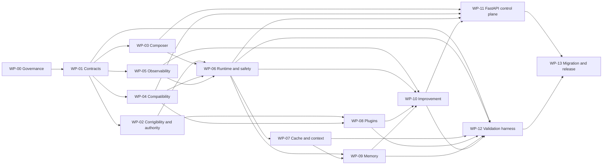

# CASOPS Common Agent Structure v3a — Implementation Plan

**Output file:** `implementation_plan.md`

> **Planning status:** All work described in this document is `PLANNED`. No implementation, citation audit, local benchmark, or production certification is represented as complete.

---

## 1. Document control

| Item | Value |
|---|---|
| Document ID | `CASOPS-PLAN-COMMON-AGENT-STRUCTURE-V3A` |
| Date | `2026-08-24` |
| Status | Draft implementation plan |
| Source attachment | `common_agent_structure.md` |
| Source internal title | `common_agent_structure.v3a.md` |
| Source document ID | `CASOPS-FS-COMMON-AGENT-STRUCTURE-V3A` |
| Target structure | `casops.common_agent.v3` |
| Target schema | `3.0` |
| Target host | `common-agent-swarm-ops` |
| Public control plane | Existing FastAPI control plane only |
| Implementation status | `NOT_STARTED` |
| Citation-audit status | `BLOCKED` |
| Deployment recommendation | `NO-GO` until all release gates pass |

The attachment filename and its internal title differ. At kickoff, the source must be assigned one canonical repository path and content digest. This plan treats the supplied content as the authoritative v3a specification.

If citation verification occurs after **August 24, 2026**, the source specification must be revised with a later audit date rather than backdating the audit or representing later verification as completed under the existing cutoff.

---

## 2. Objective

Implement a production-capable host and toolchain for the v3a common-agent structure while preserving these invariants:

1. One agent folder corresponds to one `agent_id`.
2. Safety and corrigibility are mandatory and non-bypassable.
3. Tools, executable plugins, credentials, approvals, and permissions never inherit.
4. Production behavior binds only to verified capabilities.
5. Optional optimizers fail back to validated baseline behavior.
6. Mandatory-control failures invoke containment stop.
7. Persistent memory remains scoped, typed, taint-aware, versioned, and deletable.
8. Self-improvement generates candidates but cannot approve or promote them.
9. Every material output and decision has operational provenance.
10. Production claims are supported by powered, pre-registered local validation.
11. Release remains blocked until the citation audit and local validation complete.

---

## 3. Implementation outcomes

The program must deliver the following artifacts.

### 3.1 Host implementation

- Folder and schema validator.
- Fail-closed composer and inheritance resolver.
- Host-owned corrigibility-invariant service or immutable mount.
- Safety, taint, termination, and incident services.
- Capability assertion, conformance, and drift-detection framework.
- Typed execution DAG runtime.
- Admission controller, scheduler, router, compute controller, and validators.
- Cache and context-lifecycle managers.
- Plugin registry, supply-chain validation, sandboxing, and capability handles.
- Typed persistent-memory framework.
- Observability, evidence graph, replay, sampling, and RCA framework.
- Propose-only improvement framework with immutable ledger.
- Existing FastAPI `/api/v3/...` control-plane implementation.

### 3.2 Development and operational tooling

- `casops-compose` or equivalent internal compose entry point.
- `casops-eval` matching the specification’s CLI contract.
- Schema generation and compatibility tooling.
- Migration tooling for v2 and chained v1 agents.
- Citation-audit tooling.
- Agent-folder scaffolding and reference examples.
- CI/CD gates, dashboards, runbooks, and release checklists.

### 3.3 Validation artifacts

- Machine-readable requirements ledger.
- Full fixture inventory.
- Frozen v2 baseline.
- Powered analysis plan.
- Raw result rows and statistical report.
- Capability conformance matrix.
- Citation audit.
- Migration report.
- Corrigibility attestation.
- Signed release and rollback artifacts.

---

## 4. Scope boundaries

### 4.1 In scope

- All normative requirements, invariants, APIs, errors, gates, and data models in the source specification.
- Reference implementations for required interfaces.
- Disabled configurations for optional features.
- At least one deterministic local adapter suitable for CI.
- Production integration points for model, tool, protocol, telemetry, memory, plugin, and artifact backends.
- Validation of all enabled production capabilities.

### 4.2 Out of scope

- Granting production activation through this plan.
- Supplying third-party model endpoints or credentials.
- Fabricating benchmark results.
- Restoring withdrawn numeric research claims.
- Allowing unrestricted network access.
- Exporting private chain-of-thought.
- Allowing an agent to modify permissions, gates, telemetry controls, safety, termination, or corrigibility.
- Implementing L5 self-rewriting as a normal production feature.
- Claiming model-weight unlearning from memory-store deletion.

---

## 5. Assumptions and planning constraints

1. No runnable repository or host implementation accompanied the source.
2. The repository bootstrap and existing-host inventory are therefore part of Phase 0.
3. The source fixes FastAPI as the only public control plane.
4. Production dependencies will be pinned before release.
5. A v2 implementation and representative v2 agent folders must be supplied before migration and baseline work can complete.
6. External protocol versions and research claims remain citation-blocked until audited.
7. Schedule estimates are relative to implementation kickoff.
8. A three-squad implementation model is assumed for planning. A smaller team will extend the critical path.
9. All agent-visible authority will be represented by narrow capabilities rather than ambient credentials.
10. The safe baseline must be usable with:
    - local deterministic model behavior;
    - no persistent memory;
    - no executable plugins;
    - fixed compute;
    - T0 cache only;
    - mandatory safety, corrigibility, and audit controls.

---

## 6. Delivery strategy

Implementation will follow four profiles.

| Profile | Purpose | Default features |
|---|---|---|
| `baseline_safe` | First secure vertical slice and universal fallback | Deterministic adapter, fixed compute, T0 cache, no persistent memory, no plugins, improvement disabled |
| `production_candidate` | Full production-capable host | Verified adapters, T0–T2 cache, context lifecycle, governed memory, sandboxed plugins, propose-only improvement |
| `experimental` | Features requiring additional evidence or local gates | T3 semantic cache, learned routing, adaptive refinement, advanced consolidation, L4 trainer artifacts |
| `research_only` | Isolated research | L5 core self-modification; no production credentials or activation path |

No optional profile may weaken `baseline_safe`. Every optional component must return to baseline semantics through a tested optimizer kill switch.

---

## 7. Target implementation architecture

| Component | Responsibility | Trust boundary |
|---|---|---|
| Schema registry | Own JSON Schemas and generated models | Reject unknown or incompatible structures |
| Agent registry | Resolve agent IDs and folder locations | Read-only source registration |
| Composer | Resolve MRO, merge legal surfaces, run checks, create locks | No unverified extension execution |
| Corrigibility authority | Store and attest immutable invariants | Host-owned and agent-unwritable |
| Authorization broker | Issue narrow, expiring capability handles | No ambient authority |
| Safety engine | Taint, injection, hijack, exfiltration, and effect controls | Mandatory and non-bypassable |
| Capability service | Assertions, conformance, status, and drift | Production binds only to `VERIFIED` |
| Runtime coordinator | Run lifecycle, deadlines, budgets, and artifact sealing | Cannot modify source definitions |
| DAG scheduler | Dependency execution, concurrency, cancellation, compensation | Side-effect ordering enforced |
| Router and compute controller | Route and compute allocation | Decisions logged and bounded |
| Cache manager | Scoped T0–T3 cache lifecycle | No cross-boundary reuse |
| Context manager | Segmentation, compaction, offload, and re-grounding | Pinned invariants cannot be compacted |
| Plugin manager | Manifest, integrity, isolation, lifecycle | No code execution during validation |
| Memory service | Typed stores, retrieval, trust, deletion, and consolidation | Tenant and subject isolation |
| Observability service | Traces, decisions, evidence, sampling, replay, RCA | Append-only audit path |
| Improvement controller | Candidate creation, evaluation, canary, rollback | Cannot approve or promote |
| Evaluation harness | Fixtures, power, execution, statistics, reports | Analysis plan frozen before runs |
| FastAPI control plane | Operator and host APIs | Actor-aware authorization and auditing |

### 7.1 Persistent state

The implementation must separate:

- source agent folders;
- generated immutable locks;
- content-addressed artifacts;
- operational run metadata;
- append-only audit and improvement ledgers;
- telemetry and encrypted local spool;
- cache entries;
- memory records and derived-dependency indexes;
- held-out evaluation data;
- host-owned approvals and signatures;
- host-owned corrigibility invariants.

No agent-writable store may contain the authoritative version of permissions, safety policy, termination policy, gate thresholds, held-out data, approvals, or invariant definitions.

---

## 8. Proposed repository layout

```text
common-agent-swarm-ops/
  pyproject.toml
  README.md

  src/casops/
    api/
    auth/
    contracts/
    schemas/
    errors/
    registry/
    compose/
    corrigibility/
    capabilities/
    protocols/
    runtime/
    scheduling/
    routing/
    cache/
    context/
    safety/
    observability/
    evidence/
    plugins/
    memory/
    improvement/
    artifacts/
    migration/
    eval/
    citation_audit/
    cli/

  schemas/
    agent/
    runtime/
    protocols/
    observability/
    plugins/
    memory/
    improvement/
    safety/
    corrigibility/
    eval/
    reports/

  requirements/
    requirements.yaml
    traceability.yaml
    waivers/
    generated/

  errors/
    catalogue.json

  agents/
    _template_v3/
    fixtures/

  evals/
    analysis_plan.schema.json
    fixtures/
    regression/
    reports/

  tests/
    unit/
    property/
    contract/
    integration/
    security/
    fault_injection/
    performance/
    migration/
    end_to_end/

  docs/
    architecture/
    adr/
    operator/
    developer/
    security/
    runbooks/
    migration/
    citation/

  deploy/
    dev/
    integration/
    staging/
    production/
    research/

  generated/
```

The source-defined `agents/<pack.agent-id>/` folder contract remains unchanged. The layout above is for the host implementation.

---

## 9. Requirements and change control

### 9.1 Requirements ledger

Create `requirements/requirements.yaml` containing every:

- principle `P1–P30`;
- functional requirement;
- corrigibility invariant;
- citation gate;
- API route;
- validation gate;
- error code;
- migration requirement;
- mandatory field or algorithm step without an explicit requirement ID.

Minimum fields:

```yaml
requirement_id: FR-PERF-001
source_section: "7.3"
summary: "Compile explicit dependencies before execution"
priority: P0
implementation_component: runtime.dag
owner: runtime-team
implementation_tickets:
  - CASOPS-RT-014
test_ids:
  - TEST-PERF-001
status: planned
release_blocking: true
```

### 9.2 Automated completeness checks

CI must fail when:

- a normative requirement has no implementation owner;
- a requirement has no test or static-verification method;
- an error code is missing from the machine-readable catalogue;
- an API route is missing from generated OpenAPI;
- a schema or lock changes without a version or migration review;
- generated traceability differs from committed traceability;
- a source requirement is marked complete without evidence.

### 9.3 Change policy

- The specification remains normative.
- The plan may clarify sequencing but cannot weaken a requirement.
- Requirement removal or relaxation requires a source-specification revision.
- Safety, regression-fixture, and invariant waivers must be signed, expiring, and auditable.
- Source, plan, analysis-plan, and baseline digests must be recorded before validation.

---

## 10. Delivery phases and milestones

The initial critical-path estimate is **32–36 elapsed weeks** with three parallel engineering squads and independent security/statistical review. It must be recalibrated after Phase 0.

| Phase | Relative period | Milestone | Exit condition |
|---|---:|---|---|
| 0 | Weeks 0–2 | M0 — Program ready | Canonical source, requirements ledger, ADR backlog, repository skeleton |
| 1 | Weeks 2–6 | M1 — Contracts ready | Schemas, models, error registry, validation framework |
| 2 | Weeks 4–10 | M2 — Secure compose preview | Composer, skills, identity, invariants, static preview |
| 3 | Weeks 7–14 | M3 — Safe vertical slice | Deterministic end-to-end run with safety, audit, and cancellation |
| 4 | Weeks 10–20 | M4 — Interoperability ready | Capability verification, protocol adapters, drift detection, API |
| 5 | Weeks 14–26 | M5 — Plane-complete staging build | Cache/context, plugins, memory, observability, improvement proposal path |
| 6 | Weeks 20–32 | M6 — Validation and migration ready | Full harness, powered v2 baseline, migration reports |
| 7 | Weeks 30–36 | M7 — Release candidate | All local gates and citation gates pass; signed human approval |

These are planned milestones, not claims of completion.

### 10.1 Dependency graph



---

# 11. Work packages

## WP-00 — Program bootstrap and governance

**Owner:** Architecture lead  
**Dependencies:** None  
**Priority:** P0

### Tasks

1. Assign the source a canonical repository path and SHA-256 digest.
2. Record the attachment/internal-title discrepancy.
3. Generate the requirements ledger and initial traceability matrix.
4. Inventory any existing v1/v2 host code, folders, APIs, tests, and baselines.
5. Establish branch protection, review requirements, signing policy, and release roles.
6. Create the architecture decision record backlog.
7. Complete an implementation-level threat model and data-classification review.
8. Identify independent security, statistical, citation, and release approvers.
9. Establish the risk register and weekly gate review.
10. Define artifact retention and legal-hold ownership.

### Required ADRs

- Runtime language and package boundaries.
- Canonical JSON serialization and digest generation.
- Operational, audit, artifact, and memory storage.
- Signature and key-management model.
- Plugin I1–I3 sandbox technologies.
- Authentication and capability-handle model.
- Scheduler and cancellation architecture.
- Telemetry collector and encrypted spool.
- Memory indexing and deletion architecture.
- Statistical implementation and independent verification.
- Model/tool/protocol adapter lifecycle.

### Deliverables

- Canonical source and digest.
- Repository skeleton.
- `requirements/requirements.yaml`.
- `requirements/traceability.yaml`.
- Initial ADRs and risk register.
- Responsibility matrix.
- Updated program estimate.

### Exit criteria

- Every source requirement is represented in the ledger.
- No P0 ownership gaps remain.
- All trust boundaries have an assigned owner.
- No implementation begins against an unidentified source revision.

---

## WP-01 — Contracts, schemas, errors, and immutable artifacts

**Owner:** Platform/contracts team  
**Dependencies:** WP-00  
**Priority:** P0

### Tasks

1. Implement schemas for every required agent-folder file.
2. Implement schemas for:
   - execution DAGs;
   - peer messages and events;
   - capability assertions and results;
   - decision records;
   - evidence graphs;
   - plugin manifests;
   - memory records;
   - improvement candidates;
   - incidents;
   - validation reports;
   - citation-audit entries.
3. Generate strongly typed models from the schemas.
4. Implement structural and cross-file semantic validation.
5. Implement schema-major rejection and controlled minor compatibility.
6. Implement canonical serialization, atomic lock writing, and digest verification.
7. Convert §20 into `errors/catalogue.json`.
8. Generate error enums, API mappings, telemetry labels, and documentation.
9. Implement an agent-folder scaffold for the minimal safe profile.
10. Implement schema migration registration and drift detection.
11. Add property and fuzz tests for malformed, oversized, recursive, and unknown input.

### Error catalogue fields

Each error entry must include:

- code;
- category;
- severity;
- retryability;
- default action;
- containment requirement;
- incident requirement;
- operator-visible message;
- redacted external message;
- HTTP mapping;
- telemetry event;
- test fixture.

### Deliverables

- Versioned schema package.
- Generated model package.
- Folder validator.
- Error registry and documentation.
- Canonical lock/artifact library.
- Minimal v3 agent template.

### Exit criteria

- Every required source file has a schema.
- Every §20 error code is machine-readable and tested.
- Unknown inherited surfaces fail with `INH_SURFACE_UNKNOWN`.
- Invalid major schema versions fail closed.
- Lock serialization is deterministic across repeated runs.
- Generated files cannot be edited without CI detecting drift.

---

## WP-02 — Corrigibility, authorization, and control ownership

**Owner:** Security/platform team  
**Dependencies:** WP-01  
**Priority:** P0

### Tasks

1. Store authoritative corrigibility invariants outside every agent-writable capability.
2. Expose the logical agent-folder path as a read-only reference or mount.
3. Implement compose-time invariant attestation against a host-held digest.
4. Implement runtime re-attestation at run start and before production effects.
5. Define actor classes:
   - human operator;
   - independent approver;
   - host service;
   - agent runtime;
   - plugin;
   - peer agent.
6. Implement deny-by-default authorization for every actor class.
7. Implement narrow, unforgeable, revocable, expiring capability handles.
8. Implement handle revocation at node completion and run cancellation.
9. Implement host-owned shutdown, cancellation, and deadline propagation.
10. Implement the control-switch registry:
    - optimizer kill switch;
    - route quarantine;
    - containment stop;
    - operator shutdown.
11. Ensure mandatory controls have no bypass switch.
12. Implement immutable approval and signature records.
13. Add INV-01 through INV-12 negative fixtures.
14. Add tamper tests for invariant files, approvals, fixtures, gates, and telemetry settings.

### Deliverables

- Corrigibility authority.
- Attestation service and schema.
- Capability-handle broker.
- Control-switch service.
- Negative-invariant fixture suite.
- Operator shutdown and cancellation service.

### Exit criteria

- All twelve invariant fixtures abort correctly.
- An agent cannot reach a writable permission, approval, gate, or invariant interface.
- Invariant mismatch always invokes containment stop.
- Cancellation terminates host tasks and plugin invocations.
- No configuration path can disable mandatory safety, audit, or corrigibility.

---

## WP-03 — Composer, inheritance, skills, and identity

**Owner:** Platform/composition team  
**Dependencies:** WP-01, WP-02  
**Priority:** P0

### Tasks

1. Implement agent registration and parent-folder resolution.
2. Implement parent legality checks.
3. Implement exact MRO rules:
   - child first;
   - parent priority then `agent_id`;
   - depth-first traversal;
   - diamonds collapsed;
   - each parent once.
4. Enforce parent and depth limits.
5. Implement cycle, self-parent, missing-parent, and structure-mismatch detection.
6. Implement all merge rules and non-inherited surfaces.
7. Implement tightening-only safety inheritance.
8. Implement numeric budget minima and false-wins security booleans.
9. Implement fixture union-monotonicity and signed waiver handling.
10. Implement skill resolution using the specified enable-AND expression.
11. Remove disabled skills from every downstream surface.
12. Implement identity modes and disclosure enforcement.
13. Enforce named-person approval and real-license prohibitions.
14. Validate plugin manifests without executing plugin code.
15. Invoke capability verification before production binding.
16. Generate all source-required lock fields and `compose_hash`.
17. Implement transactional compose: no partial lock set becomes executable.
18. Implement `/compose-preview` output with findings, errors, and prospective locks.
19. Run preview, safety, and negative-invariant fixtures before execution.

### Deliverables

- Fail-closed composer.
- MRO and merge engine.
- Skill and identity resolvers.
- Fixture-waiver validator.
- Compose preview.
- Complete lock-generation service.

### Exit criteria

- All inheritance, skill, and identity errors map to §20 codes.
- Tools, credentials, capabilities, approvals, and memory records never inherit.
- Child mission remains primary.
- Disabled skills are absent from prompts, cache keys, memory, evidence, and traces.
- Named-person overlays cannot run without approval.
- Repeated compose against unchanged inputs produces the same `compose_hash`.

---

## WP-04 — Compatibility, capability verification, and protocols

**Owner:** Compatibility/integration team  
**Dependencies:** WP-01, WP-03  
**Priority:** P0

### Tasks

1. Define typed implementations for all canonical adapters.
2. Implement capability assertions and three-state capability status.
3. Implement the conformance fixture runner.
4. Permit production binding only for `VERIFIED`.
5. Bind verification to endpoint, model, adapter, tokenizer, template, protocol, and material configuration digests.
6. Implement capability drift detection and automatic route quarantine.
7. Pin tokenizer and chat-template digests.
8. Define and enforce the supported JSON-Schema profile.
9. Verify determinism, seed handling, cancellation, structured output, and context-length claims.
10. Implement model profiles plus a deterministic test adapter.
11. Implement MCP revision negotiation as configuration-driven behavior.
12. Implement A2A normalization into the CASOPS envelope.
13. Implement CloudEvents schema validation and W3C trace-context propagation.
14. Preserve trace, deadline, identity, authorization, and taint across bridges.
15. Implement non-transitive peer authorization, hop caps, cycle guards, and shared budgets.
16. Implement the pinned external telemetry schema and stable `casops.*` aliases.
17. Bind all operational gates to `casops.*` attributes.
18. Re-run conformance when any locked compatibility input changes.

### Deliverables

- Adapter SDK.
- Capability assertion and result schemas.
- Conformance runner.
- Compatibility matrix lock.
- Drift/quarantine service.
- Protocol adapters.
- Semconv alias registry.

### Exit criteria

- No asserted-unverified capability can bind in production.
- Injected capability, tokenizer, and template drift is detected.
- Unknown major protocol versions fail closed.
- Discovered tools remain unreachable without authorization.
- Peer bridges preserve taint, deadline, trace, and authorization.
- Gate-bearing telemetry has complete stable-alias coverage.

---

## WP-05 — Observability, evidence, audit, replay, and RCA

**Owner:** Observability/SRE team  
**Dependencies:** WP-01, WP-02  
**Priority:** P0

### Tasks

1. Implement the root run trace and required child spans.
2. Implement all required telemetry events and mandatory attributes.
3. Build the stable `casops.*` telemetry facade.
4. Implement structured decision records without requiring hidden reasoning.
5. Implement append-only, hash-chained operational audit records.
6. Implement tail-based sampling and mandatory-retention categories.
7. Implement unsampled aggregate counters.
8. Implement encrypted bounded local spooling.
9. Invoke containment behavior when mandatory audit becomes unavailable.
10. Implement metadata-only, redacted, encrypted-full, and disabled capture modes.
11. Implement secret and PII redaction fixtures.
12. Implement claim extraction and evidence-graph construction.
13. Resolve support to source, versioned memory, tool observation, derivation, or unsupported.
14. Propagate taint from evidence to claims.
15. Block prohibited unsupported-claim paths.
16. Implement the internal reasoning-monitor channel:
    - inaccessible to agents;
    - encrypted;
    - short retention;
    - verdict-only telemetry.
17. Implement deterministic and observation-level replay modes.
18. Implement counterfactual dry replay without memory writes or publication.
19. Implement fault classification and automated RCA.
20. Calculate trace cost and enforce capture-degradation order.

### Deliverables

- Telemetry SDK and exporter.
- Local encrypted spool.
- Decision-record service.
- Evidence-graph service.
- Tail sampler.
- Replay and RCA services.
- Reasoning-monitor isolation mechanism.

### Exit criteria

- Every run has exactly one root trace.
- Mandatory events cannot be sampled out.
- No raw chain-of-thought or reasoning-monitor content enters external outputs.
- Claim-bearing artifacts without a valid graph are blocked.
- Exporter and spool failure invokes the required containment behavior.
- Replay reports its applicable equivalence level rather than overclaiming determinism.

---

## WP-06 — Execution runtime and safety plane

**Owner:** Runtime and security teams  
**Dependencies:** WP-02 through WP-05  
**Priority:** P0

### 11.6.1 Baseline runtime

1. Implement admission decisions using deadline, budget, risk, and capacity.
2. Implement queueing and bounded load shedding.
3. Implement the `casops.execution_dag.v2` parser and compiler.
4. Validate node dependencies, types, timeouts, retries, side effects, and capabilities.
5. Reject DAG cycles and unsafe side-effect parallelism.
6. Implement run-wide deadline and cancellation propagation.
7. Implement independent model, tool, memory, plugin, and peer concurrency limits.
8. Execute read-only and idempotent independent nodes concurrently.
9. Implement deterministic validators and the mandatory safety gate.
10. Seal output artifacts with complete metadata.
11. Record every required per-run field.
12. Implement validated baseline fallback behavior.

### 11.6.2 Advanced scheduling and compute

1. Implement critical-path-aware scheduling.
2. Calculate CPE, goodput, CPST, CRR, TTFO, and refinement yield.
3. Implement route selection with declared objective functions.
4. Log route features, candidates, scores, and rule version.
5. Implement fixed and adaptive compute modes.
6. Implement marginal-gain stopping decisions.
7. Implement bounded refinement.
8. Implement guarded speculative nodes and compensating actions.
9. Implement independent optimizer kill switches.
10. Record accelerator utilization only when supplied by the backend.

### 11.6.3 Safety controls

1. Define the taint model for operator, user, tool, retrieval, peer, and memory inputs.
2. Propagate taint through transforms, summaries, compaction, and consolidation.
3. Enforce `instruction_authority:false` for tainted content.
4. Gate external effects through allow-lists, deterministic validation, or human confirmation.
5. Scan outbound content for secrets and PII.
6. Enforce hard time, cost, call, hop, refinement, and plan-expansion limits.
7. Detect progress-free loops and peer cycles.
8. Return explicit bounded failures for guard trips.
9. Generate incident records and permanent fixtures.
10. Implement injection, hijack, exfiltration, taint-laundering, and cascade tests.

### Deliverables

- Runtime coordinator.
- DAG compiler and scheduler.
- Admission and budget controller.
- Router and compute controller.
- Safety and termination engine.
- Artifact sealer.
- Runtime metrics package.

### Exit criteria

- A deterministic safe-profile agent runs end to end.
- Unsafe side-effect ordering cannot execute.
- Every node honors cancellation and deadlines.
- Optional-optimizer failure returns to validated baseline behavior.
- Mandatory-control failure never returns to an unprotected path.
- All safety and termination fixtures generate expected error and incident records.

---

## WP-07 — Cache and context lifecycle

**Owner:** Runtime/performance team  
**Dependencies:** WP-04 through WP-06  
**Priority:** P1, with T0 required for the baseline

### Tasks

1. Implement exact-scope T0 key generation.
2. Add T1 rendered-fragment and T2 pure-node caches.
3. Include all required model, policy, template, capability, tenant, subject, sensitivity, and approval inputs.
4. Implement dependency indexing and invalidate-before-read behavior.
5. Implement scoped purge and memory-deletion propagation.
6. Record hits, misses, invalidations, evictions, and scope rejections.
7. Implement cache budgets and eviction policies.
8. Implement cache-disabled semantic fallback.
9. Keep T3 disabled until an equivalence verifier and false-reuse gate pass.
10. Implement segmented context budgets.
11. Pin safety, corrigibility, ownership, disclosure, output schema, and deadline segments.
12. Implement compaction nodes and preservation verification.
13. Offload full compacted content to retrievable artifact references.
14. Implement re-grounding checkpoints.
15. Implement narrowly briefed isolated sub-agent contexts.
16. Implement context-rot, cache-equivalence, scope-isolation, and kill-switch fixtures.

### Deliverables

- Cache manager and adapters.
- Invalidation dependency graph.
- Context allocator.
- Compaction and preservation framework.
- Re-grounding service.
- Cache/context metrics.

### Exit criteria

- Cross-tenant, subject, sensitivity, agent, and approval reuse is impossible.
- Policy and memory changes invalidate affected entries before use.
- Cache-on and cache-off execution satisfy the declared equivalence gate.
- Pinned context cannot be compacted or evicted.
- Failed preservation verification escalates or stops.
- T3 remains unavailable until its dedicated gate passes.

---

## WP-08 — Plugin architecture and sandboxing

**Owner:** Security/extensibility team  
**Dependencies:** WP-02, WP-04, WP-06  
**Priority:** P1

### Tasks

1. Implement registry and manifest schemas for all plugin kinds.
2. Validate manifests without loading or executing code.
3. Verify digest, signature, SBOM, build provenance, scan result, ABI, and compatibility.
4. Resolve dependency graphs and reject cycles.
5. Implement threat-model-based isolation assignment.
6. Implement:
   - I0 trusted in-process restrictions;
   - I1 capability-based WASM;
   - I2 isolated process with no ambient network;
   - I3 microVM with allow-listed egress.
7. Integrate narrow capability handles.
8. Block capability enumeration, forgery, and unauthorized delegation.
9. Enforce CPU, memory, wall-time, and output limits.
10. Taint plugin output until validation passes.
11. Implement discover, validate, instantiate, health-check, register, lock, quiesce, update, and removal states.
12. Implement hot-swap draining and shadow validation.
13. Build reference tool, modality, and evaluator plugins.
14. Measure tier overhead using the prescribed gates.
15. Add supply-chain, permission-denial, handle-forgery, ABI, and hot-swap fixtures.

### Deliverables

- Plugin SDK and registry.
- Supply-chain verifier.
- I0–I3 runtime integrations.
- Capability-handle integration.
- Lifecycle and hot-swap manager.
- Reference plugins.

### Exit criteria

- Production plugins cannot load without all required integrity evidence.
- No plugin obtains undeclared authority.
- Network-capable untrusted code runs only at I3.
- Plugin removal leaves no unresolved capability.
- A failing replacement leaves the prior approved version active.
- Isolation overhead satisfies the relevant release gate.

---

## WP-09 — Long-term memory

**Owner:** Data/memory team  
**Dependencies:** WP-05 through WP-07  
**Priority:** P1

### Tasks

1. Implement typed stores for working, episodic, semantic, procedural, resource, profile/core, and evidence-vault records.
2. Implement bitemporal versioning and immutable source provenance.
3. Implement H0–H3 residency and paging budgets.
4. Preserve retrievable references on page-out.
5. Implement trust tiers T0–T4 and taint propagation.
6. Prevent T3 inference from serving as factual support.
7. Implement candidate extraction, redaction, poisoning screening, deduplication, and conflict detection.
8. Implement lexical, dense, graph, and temporal adapter interfaces.
9. Apply scope and trust filtering before context injection.
10. Implement conflict-aware abstention.
11. Record retrieval token cost and utility attribution.
12. Implement offline consolidation with separate capacity.
13. Prevent consolidated outputs from exceeding their lowest input trust.
14. Implement version supersession without silent overwrite.
15. Build a derived-dependency index covering:
    - indexes;
    - embeddings;
    - summaries;
    - graph edges;
    - cache entries;
    - consolidated records;
    - flagged artifacts.
16. Implement tombstone propagation.
17. Implement lexical, dense, graph, and cache deletion probes.
18. Implement legal-hold exclusions and audit.
19. Record model-weight influence limitations and retraining-review flags.
20. Implement TCE, staleness, MPR, DCR, and unsupported-memory metrics.

### Deliverables

- Memory service and adapter SDK.
- Reference scoped backend.
- Retrieval planner.
- Trust and poisoning controls.
- Consolidation jobs.
- Dependency and deletion service.
- Memory evaluation suite.

### Exit criteria

- No cross-tenant or cross-subject retrieval occurs.
- Every durable record has provenance, scope, time, trust, sensitivity, and retention.
- Conflicting authoritative records cause abstention or escalation.
- Deletion probes verify all configured retrieval paths.
- Poisoned content cannot reach T0 or T1.
- Weight-level limitations are disclosed rather than misrepresented as deletion success.

---

## WP-10 — Autonomous improvement and promotion controls

**Owner:** Improvement/evaluation team  
**Dependencies:** WP-05, WP-06, WP-08, WP-09  
**Priority:** P1

### Tasks

1. Implement improvement levels L0–L5 and writable-surface enforcement.
2. Default production agents to disabled or propose-only mode.
3. Implement failure classification and specific cause attribution.
4. Reject objectives without an independent verifier.
5. Implement all candidate types and required metadata.
6. Reject candidates touching forbidden scopes at generation time.
7. Store exact diffs and parent versions.
8. Implement verifier registry and independence checks.
9. Isolate held-out datasets cryptographically and operationally.
10. Implement sandbox evaluation across functional, quality, safety, performance, compatibility, observability, regression, and reward-integrity suites.
11. Implement all reward-hacking detectors.
12. Create regression fixtures from confirmed attributable failures.
13. Enforce union-monotonic regression suites.
14. Implement the immutable hash-chained improvement ledger.
15. Implement shadow and group-sequential canary states.
16. Require a non-agent human identity for approval.
17. Implement signing, deployment, monitoring, rollback, and archival.
18. Implement out-of-process trajectory export and signed adapter import.
19. Keep L5 isolated from production credentials and writable repositories.

### Candidate state model

```text
CREATED
  -> VALIDATED
  -> SANDBOXED
  -> EVALUATED
  -> SHADOW
  -> CANARY
  -> HUMAN_APPROVED
  -> SIGNED
  -> DEPLOYED
  -> MONITORED
  -> ROLLED_BACK | ARCHIVED
```

Any failed mandatory gate moves the candidate to `REJECTED` or `ARCHIVED`.

### Deliverables

- Candidate service.
- Verifier registry.
- Evaluation orchestrator.
- Reward-integrity detectors.
- Regression-fixture service.
- Improvement ledger.
- Canary and rollback controller.

### Exit criteria

- There is no successful self-approval or self-promotion path.
- Forbidden-scope candidates are rejected before sandbox execution.
- Held-out data is inaccessible to candidate generators.
- Full regression and safety suites are mandatory.
- Every deployment has a tested rollback artifact.
- Promotion-boundary ledger entries cannot be rewritten.

---

## WP-11 — FastAPI operator and host APIs

**Owner:** API/platform team  
**Dependencies:** WP-03 through WP-10  
**Priority:** P0 for baseline routes, P1 for advanced routes

### Tasks

1. Implement every route listed in source §19 under `/api/v3`.
2. Preserve existing v2 routes where required.
3. Implement actor-aware authentication and authorization.
4. Require reason and expected parent version for mutations.
5. Return a dry-run response before production-affecting mutations.
6. Append all mutations to immutable audit.
7. Deny agent identities access to approval, signing, invariant, gate, permission, and activation operations.
8. Implement idempotency and optimistic concurrency.
9. Implement pagination and filtering for traces, incidents, candidates, plugins, and ledgers.
10. Generate OpenAPI from the same contract models used by the host.
11. Map all failures through the consolidated error catalogue.
12. Add endpoint-level redaction and data-scope controls.
13. Add contract and security tests for every route.

### Route groups

- Structure, resolved state, and compose preview.
- Runtime plan, context budget, cache, and protocols.
- Capability matrix and verification.
- Plugin validation and inventory.
- Memory query, candidate write, consolidation, deletion, and verification.
- Trace, replay, RCA, and evidence graph.
- Safety incidents and red-team execution.
- Improvement candidates, evaluation, approval, rollback, and ledger.
- Regression inventory, corrigibility attestation, and validation report.

### Exit criteria

- Generated OpenAPI contains every required route.
- Every mutation records actor, reason, parent version, and audit entry.
- No agent identity can mutate host-controlled surfaces.
- Public functionality is exposed only through the existing FastAPI plane.
- API errors use stable catalogue codes rather than untyped exceptions.

---

## WP-12 — Evaluation harness, statistics, and citation audit

**Owner:** Evaluation team with independent statistical reviewer  
**Dependencies:** Begins after WP-01; completes after all feature work  
**Priority:** P0

### 11.12.1 Harness implementation

1. Implement the prescribed `evals/` directory structure.
2. Implement the `casops-eval run` CLI contract.
3. Validate the analysis plan before execution.
4. Record and freeze every §21.4.1 comparison input.
5. Reject plan changes after run start.
6. Execute identical blocked task sets across arms.
7. Randomize paired interleaving.
8. Report cold and warm cache separately.
9. Retain all raw rows.
10. Count timeouts and errors as failures unless the estimand explicitly says otherwise.
11. Exit non-zero on any blocking gate.
12. Generate `report.json`, `statistics.json`, raw data, and citation audit.

### 11.12.2 Statistical engine

Implement independently reviewed methods for:

- prospective power calculation;
- paired binary discordance assumptions;
- percentile and skewed-metric resampling;
- paired risk-difference analysis;
- McNemar testing;
- superiority testing;
- one-sided non-inferiority;
- TOST equivalence;
- confidence intervals;
- exact binomial safety bounds;
- multiplicity control;
- blinded sample-size re-estimation;
- group-sequential canary boundaries.

The engine must reject an underpowered result even when its point estimate meets a threshold.

### 11.12.3 Fixture suites

Implement all specified suites:

- performance and parallel-tool execution;
- cache equivalence and scope;
- context rot and compaction preservation;
- optimizer kill switches and mandatory containment;
- model profiles and capability drift;
- MCP, A2A, CloudEvents, trace-context, and semconv behavior;
- redaction, replay, sampling, evidence graph, and fault injection;
- plugin installation, permissions, isolation, supply chain, and ABI;
- memory retrieval, update, forgetting, poisoning, deletion, and TCE;
- holdout isolation, reward hacking, canary simulation, and rollback;
- indirect injection, hijacking, exfiltration, termination, and taint laundering;
- INV-01 through INV-12 negative tests.

### 11.12.4 Citation audit

1. Normalize all `[D]`, `[C]`, and `[K]` references into a reference registry.
2. Resolve identifier, title, authors, venue, date, and source.
3. Locate support for every numeric claim.
4. Record auditor identity, verification time, and source digest where available.
5. Delete unresolvable references.
6. Withdraw unsupported numeric claims.
7. Require independent engineering justification for retained requirements that lose their cited support.
8. Commit `citation-audit.json`.
9. Require zero unresolved non-`[A]` markers for release.
10. Do not backdate verification. If verification occurs after August 24, 2026, revise the specification’s audit date.

### Deliverables

- `casops-eval`.
- Statistical analysis library.
- Full fixture repository.
- Validation report generator.
- Citation registry and audit tool.
- Frozen baseline tooling.

### Exit criteria

- All §21 report fields and honesty classes are supported.
- The harness detects plan and freeze drift.
- Synthetic statistical fixtures produce reviewed expected results.
- Every release gate is machine-evaluable or explicitly human-gated.
- Citation audit contains no unresolved `[D]`, `[C]`, or `[K]` entries.
- No external result is represented as a local CASOPS result.

---

## WP-13 — Migration, documentation, operations, and release

**Owner:** Release/SRE team  
**Dependencies:** WP-11, WP-12  
**Priority:** P0

### Tasks

1. Implement a v2 inventory and compatibility scanner.
2. Implement v2-to-v3 structural migration.
3. Support v1 through the approved v2 profile.
4. Apply the exact migration defaults from source §22.
5. Install host-owned safety, termination, and corrigibility controls unconditionally.
6. Re-verify every existing capability.
7. Treat refuted capabilities as latent defects.
8. Pin model, protocol, adapter, tokenizer, template, and telemetry inputs.
9. Assign plugin isolation and collect supply-chain artifacts.
10. Seed regression fixtures from known failures.
11. Generate migrated locks and golden-envelope comparisons.
12. Validate that down-conversion cannot remove safety, provenance, or corrigibility.
13. Freeze the powered v2 baseline.
14. Enable optional v3 features one at a time.
15. Produce per-agent migration reports.
16. Implement rollback to the prior signed version.
17. Publish operator, developer, security, migration, and API documentation.
18. Produce all required runbooks.
19. Conduct staging, shadow, and canary exercises.
20. Assemble the final signed release packet.

### Required runbooks

- Containment stop.
- Operator shutdown and stuck-plugin termination.
- Capability-drift quarantine.
- Cache-scope violation and purge.
- Audit exporter/spool outage.
- Plugin compromise and key revocation.
- Memory poisoning.
- Incomplete deletion or unlearning probe.
- External-effect safety incident.
- Candidate rollback.
- Regression-fixture waiver review.
- Citation mismatch or unsupported claim.
- v2 migration rollback.

### Exit criteria

- Every migrated agent has a report and rollback path.
- Golden-envelope comparison passes.
- Safety, provenance, and corrigibility cannot disappear during conversion.
- The frozen v2 baseline is powered and reproducible at the applicable level.
- Operators complete shutdown, quarantine, purge, deletion, and rollback exercises.
- Final release packet satisfies Section 18 of this plan.

---

# 12. Cross-cutting implementation rules

## 12.1 Fail-closed behavior

Unknown schema, capability, inherited surface, permission, plugin, protocol, trust state, or approval must reject execution.

The only allowed recovery classes are:

- validated baseline fallback for an optional optimizer;
- route quarantine;
- bounded user-visible failure;
- operator escalation;
- containment stop.

Fail-open behavior is prohibited.

## 12.2 Artifact integrity

- Use canonical serialization before digesting structured artifacts.
- Write locks atomically through temporary files and atomic replacement.
- Record parent, source, schema, configuration, and dependency digests.
- Verify locks before every run.
- Reject runtime drift from the active lock.
- Hash-chain audit, incident, and improvement-ledger entries.
- Keep approval signatures and signing keys outside agent-writable storage.

## 12.3 Data isolation

Every cache, memory, artifact, trace-content, and plugin capability operation must enforce:

- `agent_id`;
- tenant;
- subject;
- user;
- sensitivity;
- approval epoch;
- trust and taint;
- retention and legal hold.

## 12.4 Feature switches

The switch registry must identify:

- owning host component;
- feature scope;
- actor authorized to change it;
- baseline behavior;
- reason;
- activation and expiry;
- test fixture;
- telemetry event.

There must be no switch that bypasses safety, permissions, mandatory audit, termination, or corrigibility.

## 12.5 Chain-of-thought handling

- Raw chain-of-thought is not part of the implementation contract.
- Decision records contain observable inputs, actions, constraints, codes, and outcomes.
- The optional reasoning monitor is physically and logically isolated.
- Only structured monitor verdicts may affect execution or telemetry.
- Monitor verdicts cannot support factual output claims.

---

# 13. Test strategy

## 13.1 Test layers

| Layer | Purpose |
|---|---|
| Unit | Pure merge, validation, keying, policy, and state-transition logic |
| Property | MRO, budget minima, fixture monotonicity, key isolation, digest stability |
| Contract | Adapter, plugin ABI, protocol, schema, and API conformance |
| Integration | Composer-to-runtime and plane-to-plane behavior |
| Security | Permission, taint, injection, exfiltration, sandbox, and tamper tests |
| Fault injection | Exporter loss, cache staleness, route drift, plugin failure, memory residue |
| Performance | Latency, goodput, CPE, CPST, cache reuse, and sandbox overhead |
| Statistical | Power, tests, intervals, multiplicity, and sequential boundaries |
| Migration | v1/v2 conversion, golden envelopes, and rollback |
| End-to-end | Full agent run, evidence graph, memory, safety, and artifact sealing |

## 13.2 Minimum engineering quality gates

These are implementation quality gates in addition to the source release gates:

- Critical trust-boundary modules require branch-focused test coverage.
- Every fail-closed path has a negative test.
- Every error code has at least one triggering fixture.
- Every mutation API has authorization, concurrency, and audit tests.
- Every optimizer has enabled, disabled, failure, and fallback tests.
- Every mandatory control has unavailability and tamper tests.
- Every schema change has backward-compatibility review.
- Every security-sensitive dependency change triggers sandbox and supply-chain tests.

## 13.3 Reference deterministic adapter

Build a deterministic adapter capable of:

- fixed model responses;
- structured-output fixtures;
- tool call simulation;
- streaming simulation;
- cancellation;
- timeout injection;
- capability assertion and refutation;
- tokenizer/template drift simulation;
- batch-invariance on/off behavior.

This adapter is the mandatory foundation for CI and replay tests.

---

# 14. CI/CD plan

## 14.1 Pull-request pipeline

1. Format, lint, type, and dependency checks.
2. Schema compilation and generated-file drift.
3. Requirements and traceability completeness.
4. Error-catalogue completeness.
5. Unit and property tests.
6. Contract tests.
7. Deterministic integration suite.
8. Security and invariant negative fixtures.
9. Supply-chain checks.
10. Evaluation-harness smoke tests.
11. Documentation and OpenAPI drift.
12. Artifact generation without production signing.

## 14.2 Main-branch pipeline

- Full deterministic suite.
- Protocol and adapter conformance.
- Sandbox and permission tests.
- Memory deletion and poisoning tests.
- Replay, evidence, redaction, and sampling tests.
- Migration fixtures.
- Performance smoke tests.
- Signed non-production artifacts.

## 14.3 Release-candidate pipeline

- Frozen analysis plan.
- Powered baseline and candidate runs.
- Full regression and safety suites.
- Full plugin supply-chain verification.
- All capability conformance.
- Citation audit.
- Staging shadow and canary.
- Rollback exercise.
- Independent security, statistical, and human approval.
- Signed release package.

Production deployment must remain a separate, explicit human operation.

---

# 15. Environment plan

| Environment | Network | Credentials | Data | Permitted behavior |
|---|---|---|---|---|
| Local development | Off by default | Synthetic | Synthetic fixtures | No production effects |
| CI | Off except approved fixture services | Ephemeral | Synthetic | Deterministic testing |
| Integration | Allow-listed | Non-production | Sanitized | Adapter and protocol tests |
| Staging | Allow-listed | Staging only | Approved test corpus | Full shadow/canary simulation |
| Production | Explicitly allow-listed | Host vault | Scoped production data | Signed approved agents only |
| Research | Isolated | No production credentials | Separate datasets | L4/L5 research only |

Held-out datasets, signing keys, approval stores, and corrigibility invariants must use separate access controls from development and runtime services.

---

# 16. Operational readiness

## 16.1 Dashboards

Provide dashboards for:

- admission and shedding;
- success and failure codes;
- p50, p95, and applicable p99 job time;
- goodput, CPST, CPE, CRR, and TTFO;
- route distribution and capability drift;
- cache scope rejection and invalidation;
- context compaction and preservation failures;
- plugin isolation, limits, and crashes;
- memory trust, poisoning, staleness, and deletion;
- evidence-graph and unsupported-claim rates;
- safety incidents and termination guards;
- audit spool utilization;
- improvement candidates, canaries, and rollbacks;
- corrigibility attestation.

## 16.2 Alerts

Immediate alerts are required for:

- invariant mismatch;
- attempted self-approval or forbidden mutation;
- secret or PII exfiltration attempt;
- unapproved external effect;
- cache boundary violation;
- capability drift on an active route;
- audit exporter and spool unavailability;
- mandatory-retention loss;
- plugin handle forgery;
- memory poisoning reaching a trusted path;
- failed deletion probe;
- ledger integrity failure;
- failed rollback;
- safety or termination fixture regression.

## 16.3 Backup and recovery

- Back up source folders, locks, approvals, ledgers, incidents, and evidence vaults.
- Keep cache disposable.
- Back up memory according to sensitivity, retention, and legal-hold policy.
- Test restoration without resurrecting deleted records.
- Verify restored locks and ledgers before serving.
- Document recovery-time and recovery-point targets.
- Exercise key rotation and signature revocation.

---

# 17. Staffing and governance

## 17.1 Recommended roles

| Role | Primary responsibility |
|---|---|
| Architecture lead | Source interpretation, ADRs, plane boundaries |
| Program/release manager | Milestones, risks, release packet |
| Contracts/platform engineers | Schemas, composer, locks, errors |
| Runtime engineers | DAG, scheduler, router, compute, cache/context |
| Security engineers | Corrigibility, safety, authorization, sandboxes |
| Compatibility engineers | Adapters, protocols, capabilities |
| Data/memory engineers | Memory stores, retrieval, deletion |
| Observability/SRE engineers | Traces, audit, replay, dashboards |
| Evaluation engineers | Harness, fixtures, baseline, reports |
| Statistical reviewer | Power, tests, intervals, canary design |
| API engineers | FastAPI control plane |
| QA/security testing | Adversarial and fault-injection testing |
| Citation reviewers | Independent source verification |
| Human approver | Candidate and production approval |

A recommended working team is approximately 10–14 engineers and reviewers, with role overlap where independence is not required.

## 17.2 Required independence

The following must not be solely approved by the implementation owner:

- statistical analysis plan;
- citation audit;
- plugin isolation downgrade;
- security waiver;
- regression-fixture removal;
- improvement-candidate promotion;
- production activation.

---

# 18. Release gates

## Gate G0 — Source and governance

- Canonical source and digest committed.
- Requirement ledger complete.
- No unresolved P0 ADR prevents implementation.
- Citation-date handling approved.

## Gate G1 — Static conformance

- All schemas and folder rules implemented.
- Error catalogue complete.
- Composer and lock generation deterministic.
- Skills, identity, and inheritance tests pass.
- Corrigibility attestation passes.

## Gate G2 — Safe vertical slice

- Deterministic end-to-end execution works.
- Safety, cancellation, audit, evidence, and artifact sealing work.
- Mandatory-control failure containment-stops.
- Optimizer fallback returns to baseline.

## Gate G3 — Feature completeness

- Compatibility, observability, plugin, memory, cache/context, improvement, and APIs implemented.
- All production capabilities are verified.
- All plane-specific negative and fault-injection tests pass.

## Gate G4 — Validation readiness

- `casops-eval` complete.
- Analysis-plan freeze enforced.
- Statistical methods independently reviewed.
- Full fixture inventory implemented.
- v2 baseline available and powered.

## Gate G5 — Migration readiness

- v1/v2 migration works.
- Golden-envelope comparison passes.
- Rollback is tested.
- No safety, provenance, or corrigibility field disappears.

## Gate G6 — Release candidate

All source §21 gates pass, including:

- performance and success gates;
- compatibility gates;
- observability gates;
- plugin and isolation gates;
- memory gates;
- improvement gates;
- safety and corrigibility gates;
- citation audit;
- powered statistical review;
- full regression suite;
- independent human approval;
- signed release and rollback artifacts.

Failure of any blocking gate results in `NO-GO`.

---

# 19. Definition of done

## 19.1 Task definition of done

A task is complete only when it has:

- linked source requirement IDs;
- reviewed implementation;
- positive and negative tests;
- stable error behavior;
- telemetry;
- security and data-scope review where applicable;
- operator/developer documentation;
- no unresolved high-severity defects.

## 19.2 Work-package definition of done

A work package is complete only when:

- all linked requirements are implemented or explicitly blocked;
- all linked fixtures pass;
- traceability is generated and committed;
- failure and rollback behavior is tested;
- its API, schemas, events, and errors are documented;
- operational ownership is assigned.

## 19.3 Program definition of done

The implementation program is complete only when:

1. Every normative source requirement is traceable to implementation and evidence.
2. Every §20 error is implemented and tested.
3. Every §19 API route is implemented and secured.
4. All local validation is `MEASURED_LOCAL`.
5. No required result remains `NOT_RUN`.
6. No release item remains `BLOCKED`.
7. Citation markers are fully resolved.
8. The powered v2 comparison passes the selected release path.
9. Safety and corrigibility gates pass without waivers that weaken invariants.
10. Migration and rollback are demonstrated.
11. The release is signed by independent authorized humans.
12. Production activation remains an explicit post-release human action.

---

# 20. Key implementation risks

| Risk | Mitigation | Trigger |
|---|---|---|
| No repository or baseline is available | Phase 0 inventory and estimate reset | Missing code at kickoff |
| Source filename/title ambiguity | Canonical path and digest | More than one candidate source |
| Citation audit occurs after source cutoff | Publish a later specification revision | Audit timestamp after August 24, 2026 |
| Host-owned invariants become writable | Separate storage and capability absence | Any runtime write path |
| Complexity delays the secure baseline | Deliver `baseline_safe` first | Advanced work blocks M3 |
| Protocol or telemetry revisions drift | Version pinning, aliases, conformance | Digest or version change |
| Plugin sandbox underperforms | Tier-specific profiling and fallback | Overhead exceeds gate |
| Cache invalidation is incomplete | Dependency index and purge fixtures | Stale-read detection |
| Memory deletion leaves derivatives | Derived-dependency graph and probes | Any post-delete retrieval |
| Statistical run is underpowered | Prospective power and re-estimation | Insufficient paired sample |
| Candidate overfits the verifier | Independent verifiers and reward-hack detectors | Metric/golden-task divergence |
| Audit outage loses mandatory events | Encrypted spool and containment | Exporter and spool failure |
| Migration silently weakens policy | Golden-envelope and negative comparison | Missing mandatory field |
| Team lacks independent approvers | Assign reviewers in Phase 0 | Approval-role conflict |
| External source fails citation audit | Remove claim or document independent justification | Citation mismatch |

---

# 21. Initial execution backlog

The first ten business days after approved kickoff should complete:

1. Commit the canonical source file and digest.
2. Generate the initial requirements ledger.
3. Create the repository and package skeleton.
4. Convert the consolidated error catalogue into structured data.
5. Create the first schemas for `agent_spec.json`, inheritance, skills, identity, safety, and corrigibility.
6. Build the minimal `baseline_safe` agent fixture.
7. Prototype host-owned invariant storage and attestation.
8. Define actor classes and the deny-by-default authorization matrix.
9. Establish the deterministic test-adapter contract.
10. Create the `casops-eval` CLI skeleton and analysis-plan schema.
11. Open all required ADRs.
12. Inventory v1/v2 artifacts and record migration blockers.
13. Assign independent statistical, security, citation, and release reviewers.
14. Re-estimate milestones from the discovered implementation state.

---

# 22. Source-to-work-package traceability

| Source section | Primary work package |
|---|---|
| §1 Purpose and defects | WP-00, WP-13 |
| §2 Evidence and citation audit | WP-12 |
| §3 Core principles | All work packages |
| §4 Normative architecture | WP-00, WP-02, WP-06 |
| §5 Folder contract | WP-01 |
| §6 Composition and inheritance | WP-03 |
| §7 Performance execution | WP-06 |
| §8 Cache and context lifecycle | WP-07 |
| §9 Compatibility and protocols | WP-04 |
| §10 Observability and provenance | WP-05 |
| §11 Plugins | WP-08 |
| §12 Memory | WP-09 |
| §13 Improvement | WP-10 |
| §14 Safety | WP-02, WP-06 |
| §15 Corrigibility | WP-02 |
| §16 Skills and identity | WP-03 |
| §17 Compose and runtime algorithms | WP-03, WP-06 |
| §18 Data models | WP-01 |
| §19 APIs | WP-11 |
| §20 Error catalogue | WP-01 and owning planes |
| §21 Validation | WP-12 |
| §22 Migration | WP-13 |
| §23 Traceability | WP-00, WP-12 |
| §24 Open risks | WP-00 and owning planes |
| §25 References | WP-12 |
| §26 Document control | WP-00, WP-13 |

---

## Final planning statement

This plan implements the supplied v3a specification through a contract-first, controls-first sequence. The first executable milestone is a secure deterministic baseline with mandatory safety, corrigibility, provenance, and cancellation. Advanced cache, memory, plugin, routing, and improvement features are then added behind independently testable controls.

The implementation must remain `NO-GO` for production until:

- the citation audit is accepted;
- a powered v2 baseline is frozen;
- every applicable local validation gate passes;
- migration and rollback are demonstrated;
- independent humans approve and sign the release.