# CASOPS Control UI — Functional Specification v1

| Item | Value |
|---|---|
| Document | `spec/ui.v1.md` |
| Title | CASOPS Control UI functional specification |
| Version | `ui.v1` |
| Date | 2026-08-31 |
| Host API | Public FastAPI plane `/api/v3` (`casops.api.control`, schema 3.0) |
| Style source | `spec/common-style.html` |
| UI source root | `ui/` (mandatory — see §1) |
| Spec | `common_agent_structure.md` (`CASOPS-FS-COMMON-AGENT-STRUCTURE-V3A`) |
| Operator guide | `user_guide.v1.md` |
| Status | `DRAFT` — UI not implemented |

This document specifies a browser UI that lets an **operator** completely manage every CASOPS agent the host can load, **only** through the public control-plane API. It is not a chat wrapper and not a second control plane.

---

## 1. Source and style (normative)

### 1.1 All UI source lives in `ui/`

**Every file that implements this UI MUST be saved under the repository `ui/` folder.** That includes application code, stylesheets extracted or adapted from the style guide, static assets, tests for the UI, and UI build config.

| Path | Role |
|---|---|
| `ui/` | **Sole** source tree for the Control UI |
| `ui/README.md` | How to install, run, and point the UI at a control plane |
| `ui/src/` | Application source (pages, components, API client, state) |
| `ui/public/` | Static assets that are not generated |
| `ui/tests/` | UI unit/contract tests |
| `spec/common-style.html` | **App style.** Read-only design system. Do not duplicate a second visual language. |
| `spec/ui.v1.md` | This specification (not UI source) |
| `spec/svg/` | Screen wireframes for this spec (not UI application source) |

Forbidden:

- UI application source in `src/casops/`, `services/`, `agents/`, or repo root
- A second design system, dark-theme-only shell, or ad-hoc color palette that contradicts `spec/common-style.html`
- Calling internal service ports (`8081`–`8087`) from the browser. The UI talks to the **public** plane only.

The host library stays in `src/casops/`. The UI is glass over `/api/v3`, the same way Hermes dashboards sit on a gateway and OpenClaw Control UI sits on a gateway — it does not become the engine.

### 1.2 App style is `spec/common-style.html`

The Control UI **MUST** use `spec/common-style.html` as the app style. That file is the CASOPS design system (v2.1): light theme, Inter/system-ui, stone surfaces, indigo “common” accent, status pills that combine **text + dot + color**.

Implementers copy tokens and component recipes from that file into `ui/` (for example `ui/src/styles/` and `ui/src/components/`). They do not restyle the product as a generic dashboard.

#### Tokens (from `spec/common-style.html`)

| Token | Class / value | Use |
|---|---|---|
| Base BG | `bg-white` `#ffffff` | Page canvas |
| Surface | `bg-stone-50` `#fafaf9` | Section wells, table chrome |
| Elevated | `bg-stone-100` | Disabled, stale |
| Border | `border-stone-200` `#e7e5e4` | Cards, nav, inputs |
| Primary text / CTA | `text-stone-900` / `bg-stone-900` `#1c1917` | Body titles, primary buttons |
| Secondary text | `text-stone-500` `#78716c` | Meta, timestamps |
| Common accent | `indigo-600` `#4f46e5` + `indigo-50` | Host-owned, verified, compose hash |
| Pattern / router | `violet-600` | DAG / MRO |
| Custom fork | `amber-500` | Operator-local agent vs template |
| Success / live | `emerald-500` | Run ok, attestation ok |
| Error / failed | `red-500` / `red-600` | `CasopsError`, containment |
| Font | `Inter, system-ui, sans-serif` | All UI chrome |
| Mono | `font-mono` | `agent_id`, `compose_hash`, `trace_id`, error codes |

#### Status pills (mandatory)

Never color alone. Use the `STATUS_CFG` set from the style file:

`live`, `running`, `queued`, `self_refine`, `delayed`, `reconnecting`, `degraded`, `failed`, `recovery`, `complete`, `unavailable`, `stale`, `cancelled`.

Map host facts:

| Host fact | Pill |
|---|---|
| `GET /health` ok and last `/api/v3` success < 5s | `live` |
| Runtime run in flight | `running` |
| Consolidate `queued: true` | `queued` |
| Improvement candidate evaluated, not approved | `self_refine` |
| Last success 30s–5m | `delayed` |
| Fetch retry | `reconnecting` |
| HTTP 5xx or `containment_required` | `degraded` / `recovery` |
| `containment_stop` set or `IMP_CORRIGIBILITY` | `failed` + recovery banner |
| `baseline_safe` run finished, `containment_stop: null` | `complete` |
| Control plane unreachable | `unavailable` |
| Projection older than 5m | `stale` — disable mutations |
| Operator cancelled | `cancelled` |

Stale projection: primary mutation buttons disabled (`Stale — Refresh First` ghost/disabled pattern from the style file).

#### Components to reuse as recipes

From `spec/common-style.html`, the UI ships equivalents of:

- Sticky top nav (`h-14`, `border-b border-stone-200`, `bg-white/95 backdrop-blur-md`)
- Indigo 7×7 rounded mark + wordmark **caso**
- `StatusPill`, `CommonBadge` (schema 3.0, compose hash prefix)
- Registry **agent cards** (white, `rounded-2xl`, indigo icon well, 3-stat grid)
- Fleet **swarm cards** (status + compact meta)
- Canvas **graph nodes** (indigo solid = host-composed; amber dashed = local/unverified)
- Primary CTA: `rounded-full bg-stone-900 text-white`
- Host/common CTA: `rounded-full bg-indigo-600 text-white`
- Destructive: `rounded-full bg-red-600 text-white`
- Outlined secondary: `border-stone-200 bg-white`
- Cards: `bg-white rounded-2xl border border-stone-200 hover:shadow-md`

Layout: `max-w-6xl` for marketing-style pages; **ops shell** uses full width with a left nav (still the same tokens). Mobile: stack nav, one-column cards.

---

## 2. Product intent

### 2.1 Job to be done

An operator can, without CLI or raw curl:

1. See every agent the host can load.
2. Inspect structure, composition, capabilities, protocols, cache, memory, plugins, safety, improvement, validation, and corrigibility.
3. Compose-preview and run `baseline_safe`.
4. Inspect traces, replay (including counterfactual), root-cause, and evidence graphs.
5. Query / write-candidate / delete / verify memory with tenant+subject, and enqueue consolidation.
6. Validate plugins without executing them.
7. Evaluate / approve / rollback improvement candidates under the mutation contract.
8. See eval honesty (`NOT_RUN`, `INDICATIVE`, `MEASURED_LOCAL`) without mistaking it for a production pass.

### 2.2 What this UI is not

- Not a Hermes-style embedded TUI chat or xterm session. CASOPS `baseline_safe` has no streaming chat API.
- Not an OpenClaw “ask the agent to build widgets” board. Widgets would be agent-authored UI; CASOPS forbids the agent from owning the control plane.
- Not a second public API. No UI-only backend that mutates agent folders behind `/api/v3`.
- Not a production-activation console. `production_activation_requested` stays false; the UI never offers “go live”.

### 2.3 Research: Hermes, OpenClaw, and what we take

Reviewed:

- **Hermes Agent web dashboard / Control Interface** — Status, Chat, Config, Sessions, Agents (profile CRUD + per-agent dashboard / memory / skills / cron), Office swarm monitor, Usage, MCP, password gate. Form-driven config instead of YAML. Auto-refresh status.
- **Hermes Studio** — crews, approvals, memory graph, skills, cron. Explicitly “not a chat wrapper”.
- **OpenClaw Control UI** — Overview, Channels, Sessions, Cron, Chat, Skills, Config, Debug, Logs. Agent hierarchy. Dashboard/chat split for widgets.
- **OpenClaw Command Center / Mission Control** — fleet graph, agent drawer (identity, tools, files), kanban tasks, spend, human-in-the-loop approvals, audit.

**Adopt**

| Pattern | From | CASOPS use |
|---|---|---|
| Fleet home + agent switcher | Hermes, OpenClaw | Agent list → agent workspace |
| Per-agent tabbed workspace | Hermes agent detail | Structure, compose, run, memory, plugins, safety, improvement, eval |
| Mutation / approval as first-class UI | Hermes Studio, OpenClaw | Header strip: actor, reason, parent, dry-run |
| Memory browser with scope | Hermes Memory tab | Tenant + subject required; empty other-tenant is success |
| Live vs stale honesty | `common-style.html` + OpenClaw overview | Status pills, disable stale mutations |
| Trace / session inspector | OpenClaw sessions, Hermes sessions | Trace, replay, evidence |
| Kanban for governed work | OpenClaw / Hermes Office | Improvement candidates: proposed → evaluated → approved / rejected / rolled back |
| Local-only default | Hermes dashboard on localhost | UI defaults to `http://127.0.0.1:8080` |

**Reject**

| Pattern | Why |
|---|---|
| Chat-as-the-product | No chat completions API on `/api/v3` |
| YAML/config.yaml editors for 150 fields | Agent contract is a **folder**; compose-preview is the merge UI |
| Agent-built dashboard widgets | Agent must not own chrome or gates |
| Channel/Telegram/Discord binding | Not in CASOPS v3 public plane |
| Cron job manager | No cron API on `/api/v3` |
| Token spend analytics as a primary nav | No usage meter API; do not invent cost charts |
| Dark-only admin skins | Style guide is light stone/indigo |

---

## 3. Host API the UI consumes

### 3.1 Public plane

Base URL (operator-configurable, default `http://127.0.0.1:8080`).

All mutating calls (`POST`, `PUT`, `PATCH`, `DELETE`) under `/api/v3` **MUST** send:

| Header | UI control | Notes |
|---|---|---|
| `x-casops-actor` | Actor select | `human_operator` \| `independent_approver` \| `host_service`. Never default `agent_runtime`. |
| `x-casops-reason` | Required text | Placeholder: “why this change” |
| `x-casops-expected-parent` | Text, default `none` | |
| `x-casops-dry-run` | Toggle, default **on** | `true` / `false` |

GET does not send the contract. If any mutation header is missing, the host returns non-200 `IMP_UNSIGNED`. The UI surfaces that as a blocking toast and does not retry silently.

`agent_runtime` on approve → `IMP_SELF_APPROVAL`. The UI must not offer that actor on Approve.

### 3.2 Route catalog (every spec §19 path has a screen)

`{id}` = selected `agent_id`. `{tid}` = `root_trace_id`. `{aid}` = artifact id. `{mid}` = memory id. `{cid}` = candidate id.

| Method | Path | UI surface |
|---|---|---|
| GET | `/health` | Shell connection pill (not a v3 resource; still used) |
| GET | `/api/v3/agents/{id}/structure` | Fleet card + Structure tab |
| GET | `/api/v3/agents/{id}/resolved` | Structure / Compose “resolved” panel |
| POST | `/api/v3/agents/{id}/compose-preview` | Compose tab primary action |
| GET | `/api/v3/agents/{id}/runtime/plan` | Run tab DAG |
| GET | `/api/v3/agents/{id}/runtime/capabilities` | Capabilities tab |
| GET | `/api/v3/agents/{id}/capabilities/matrix` | Capabilities tab |
| POST | `/api/v3/agents/{id}/capabilities/verify` | Capabilities “Verify” |
| GET | `/api/v3/agents/{id}/runtime/context-budget` | Run tab / Context |
| GET | `/api/v3/agents/{id}/cache/stats` | Cache panel |
| POST | `/api/v3/agents/{id}/cache/invalidate` | Cache “Invalidate” |
| GET | `/api/v3/agents/{id}/protocols` | Protocols tab |
| GET | `/api/v3/agents/{id}/plugins` | Plugins tab |
| POST | `/api/v3/agents/{id}/plugins/validate` | Plugins “Validate without exec” |
| GET | `/api/v3/agents/{id}/memory/policy` | Memory tab header |
| GET | `/api/v3/agents/{id}/memory/hierarchy` | Memory tab |
| POST | `/api/v3/agents/{id}/memory/query` | Memory search |
| POST | `/api/v3/agents/{id}/memory/write-candidate` | Memory write (disabled if policy `none`) |
| POST | `/api/v3/agents/{id}/memory/consolidate` | Memory “Enqueue consolidate” |
| DELETE | `/api/v3/agents/{id}/memory/{mid}` | Memory delete |
| POST | `/api/v3/agents/{id}/memory/{mid}/verify-deletion` | Memory verify |
| GET | `/api/v3/traces/{tid}` | Trace inspector |
| POST | `/api/v3/traces/{tid}/replay` | Replay |
| POST | `/api/v3/traces/{tid}/replay?counterfactual=` | Counterfactual replay |
| GET | `/api/v3/traces/{tid}/root-cause` | Root-cause panel |
| GET | `/api/v3/artifacts/{aid}/evidence-graph` | Evidence panel |
| GET | `/api/v3/agents/{id}/safety/incidents` | Safety tab |
| POST | `/api/v3/agents/{id}/safety/redteam` | Safety “Run red-team fixture” |
| GET | `/api/v3/agents/{id}/improvement/candidates` | Improvement board |
| POST | `/api/v3/agents/{id}/improvement/candidates/{cid}/evaluate` | Evaluate |
| POST | `/api/v3/agents/{id}/improvement/candidates/{cid}/approve` | Approve (`independent_approver` or `host_service` only) |
| POST | `/api/v3/agents/{id}/improvement/rollback/{version}` | Rollback |
| GET | `/api/v3/agents/{id}/improvement/ledger` | Ledger table |
| GET | `/api/v3/agents/{id}/regression/suite` | Eval / regression |
| GET | `/api/v3/agents/{id}/corrigibility/attestation` | Attestation banner on every agent page |
| GET | `/api/v3/agents/{id}/validation/report` | Validation tab |
| POST | `/api/v3/agents/{id}/runtime/run` | Run tab primary action |

Query parameters the UI must expose (not bury):

| Call | Params |
|---|---|
| memory query | `tenant`, `subject` (and optional `text` if the client sends it) |
| memory write-candidate | `tenant`, `subject`, `text` |
| memory delete / verify-deletion | `tenant`, `subject` **required** |
| replay | optional `counterfactual` |

### 3.3 Discovery gap (must be explicit)

Today’s OpenAPI **does not** include `GET /api/v3/agents` (list). Complete fleet management still needs a list of `agent_id`s.

**UI-v1 required companion** (host addition, public plane only):

```text
GET /api/v3/agents
```

Response (illustrative):

```json
{
  "agents": [
    {
      "agent_id": "casops.template.baseline_safe",
      "folder": "agents/_template_v3",
      "structure_id": "casops.common_agent.v3",
      "schema_version": "3.0",
      "role": "BaselineSafeTemplate"
    }
  ]
}
```

Until that route exists, the UI **Settings → Known agents** lets the operator paste IDs. The UI then probes `GET …/structure` per ID. Empty list is an empty state, not fake agents.

The UI MUST NOT scan the operator’s disk from the browser.

### 3.4 Error envelope

```json
{
  "error": {
    "code": "IMP_UNSIGNED",
    "message": "The request was rejected by host policy.",
    "containment_required": false
  }
}
```

UI: toast + inline banner. If `containment_required: true`, full-width **Recovery** bar (`STATUS_CFG.recovery`), mutations other than “Reload attestation” disabled.

Show `error.code` in `font-mono`. Never show only a generic “Request failed”.

---

## 4. Information architecture

```text
Shell
├── Connection (base URL, health pill, actor strip)
├── Fleet                    /                    GET list or known IDs + /structure
└── Agent workspace          /agents/:agentId
    ├── Overview             attestation, structure summary, last run
    ├── Structure            /structure, /resolved
    ├── Compose              POST /compose-preview
    ├── Run                  /runtime/plan, POST /runtime/run, context-budget, cache
    ├── Trace                /traces/{id}, replay, root-cause, evidence-graph
    ├── Capabilities         /capabilities/matrix, POST verify, /runtime/capabilities
    ├── Protocols            GET /protocols
    ├── Memory               policy, hierarchy, query, write, delete, verify, consolidate
    ├── Plugins              GET /plugins, POST validate
    ├── Cache                GET stats, POST invalidate
    ├── Safety               incidents, POST redteam
    ├── Improvement          candidates, evaluate, approve, rollback, ledger
    ├── Validation           /validation/report, /regression/suite
    └── Corrigibility        /corrigibility/attestation
Settings                     /settings               base URL, actor defaults, known agent IDs
```

Deep links are shareable. Example: `/agents/casops.template.baseline_safe/run`.

---

## 5. Shell

### 5.1 Frame

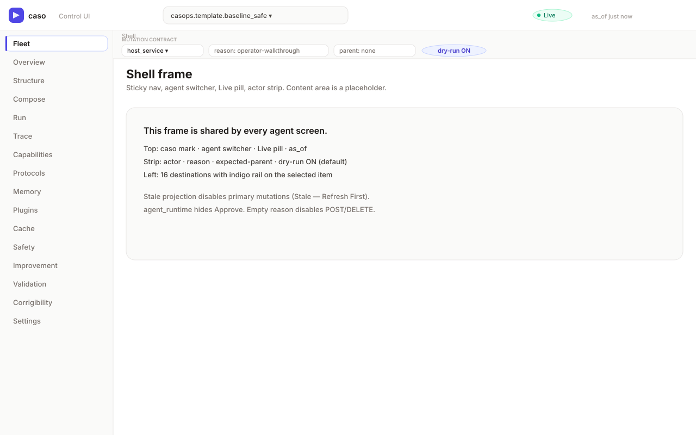

```
┌─────────────────────────────────────────────────────────────────┐
│ [mark] caso   Fleet   ·  agent switcher ▾   [Live]  [Actor strip]│  sticky h-14
├────────────┬────────────────────────────────────────────────────┤
│ Fleet      │  Breadcrumb: Fleet / {agent_id} / Run              │
│ Overview   │                                                    │
│ Structure  │  Page title (text-2xl)     [primary actions]       │
│ Compose    │                                                    │
│ Run        │  Content (cards, tables, DAG)                      │
│ Trace      │                                                    │
│ …          │                                                    │
│ Settings   │                                                    │
└────────────┴────────────────────────────────────────────────────┘
```

- Left nav: stone-50 well, 14px labels, indigo mark on the selected item.
- Agent switcher in the top bar (Hermes profile switcher): current `agent_id` mono, search, jump.
- Connection pill: `Live` / `Unavailable` / `Reconnecting` from `/health` + last v3 result.
- **Actor strip** (always visible on mutation pages): actor `<select>`, reason `<input>`, expected-parent `<input>`, dry-run `<toggle>` default ON. A lock icon when dry-run is on.

### 5.2 Actor strip rules

- Stored in session (not localStorage for actor if the machine is shared; Settings may opt-in).
- Dry-run ON: primary buttons labeled **Preview** / **Run (dry-run)** even when the host still executes some POSTs (compose-preview writes no locks regardless).
- Switching actor to `agent_runtime` hides Approve and shows a red note: “Agent identities cannot approve.”
- Reason empty → mutation buttons disabled in the UI (fail closed before the network).

### 5.3 Global empty / error

| State | UI |
|---|---|
| No control plane | `unavailable` card: “Start uvicorn on :8080” + Settings link |
| No agents | Empty fleet: “Add a known agent_id or implement GET /api/v3/agents” |
| `INH_PARENT_MISSING` | “Unknown agent_id” on the workspace |
| Containment | Recovery banner; attestation panel forced open |

---

## 6. Screens

Each screen lists **purpose**, **layout**, **API**, **states**, **actions**. Primary buttons use stone-900 or indigo-600 per §1.2.

Wireframes live in `spec/svg/` and use tokens from `spec/common-style.html`.

| Screen | Figure |
|---|---|
| Shell | `spec/svg/00-shell.svg` |
| Fleet | `spec/svg/01-fleet.svg` |
| Overview | `spec/svg/02-overview.svg` |
| Structure | `spec/svg/03-structure.svg` |
| Compose | `spec/svg/04-compose.svg` |
| Run | `spec/svg/05-run.svg` |
| Trace | `spec/svg/06-trace.svg` |
| Capabilities | `spec/svg/07-capabilities.svg` |
| Protocols | `spec/svg/08-protocols.svg` |
| Memory | `spec/svg/09-memory.svg` |
| Plugins | `spec/svg/10-plugins.svg` |
| Cache | `spec/svg/11-cache.svg` |
| Safety | `spec/svg/12-safety.svg` |
| Improvement | `spec/svg/13-improvement.svg` |
| Validation | `spec/svg/14-validation.svg` |
| Corrigibility | `spec/svg/15-corrigibility.svg` |
| Settings | `spec/svg/16-settings.svg` |

### 6.1 Fleet (`/`)

**Purpose.** Single pane of all agents (OpenClaw overview + Hermes Home, without chat/cron).

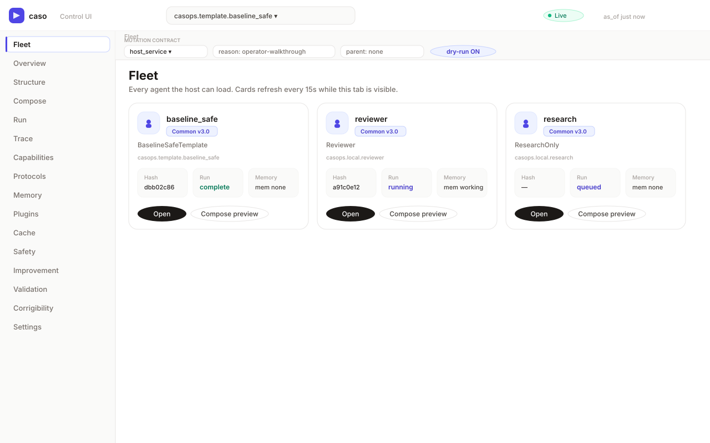

**Layout.** Page title “Fleet”. Grid of **registry agent cards**:

- Bot icon in indigo well
- `agent_id` (semibold) + `CommonBadge` schema 3.0
- Role / folder (secondary text)
- Stats: last compose_hash prefix (mono), last run status pill, memory mode
- CTA: **Open** (stone-900). Secondary: **Compose preview** (outlined)

**API.** `GET /api/v3/agents` if present; else known IDs × `GET …/structure`. Optionally `GET …/corrigibility/attestation` and `GET …/memory/policy` for card meta (parallel, tolerate failure).

**Refresh.** Every 15s while the tab is visible; pause when stale/hidden.

### 6.2 Agent overview (`/agents/:id`)

**Purpose.** Attestation + “can I run this?”

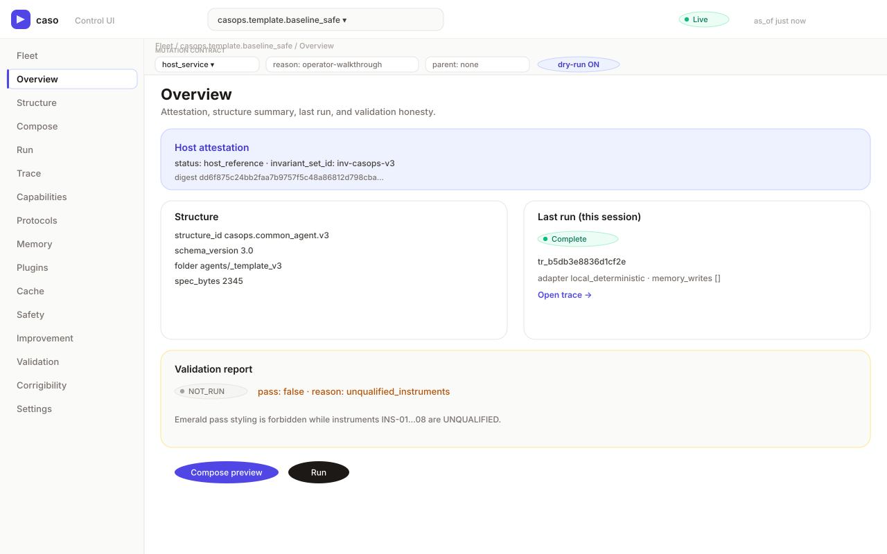

**Layout.**

1. Recovery/attestation card (indigo border if ok, red if containment).
2. Structure summary: `structure_id`, `schema_version`, folder path, spec bytes.
3. Last run snapshot if the client cached a `root_trace_id` this session.
4. Validation honesty: `GET …/validation/report` — if `pass: false` / `NOT_RUN`, emerald **must not** be used. Use `stale` or `unavailable` pill plus the `reason` string.

**API.** `GET …/structure`, `GET …/corrigibility/attestation`, `GET …/validation/report`.

**Actions.** **Compose preview**, **Run** (both jump to those tabs with actor strip filled).

### 6.3 Structure (`/agents/:id/structure`)

**Purpose.** Folder contract vs resolved composition.

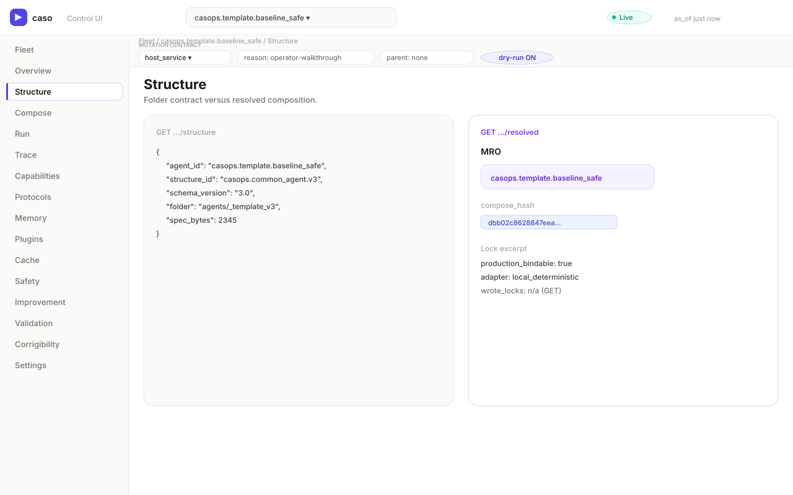

**Layout.** Two columns (stack on mobile):

- Left: raw structure JSON (read-only, mono, stone-50 well).
- Right: resolved MRO list (violet), `compose_hash`, lock excerpt.

**API.** `GET …/structure`, `GET …/resolved`.

### 6.4 Compose (`/agents/:id/compose`)

**Purpose.** Prospective lock. **Never** implies files were written.

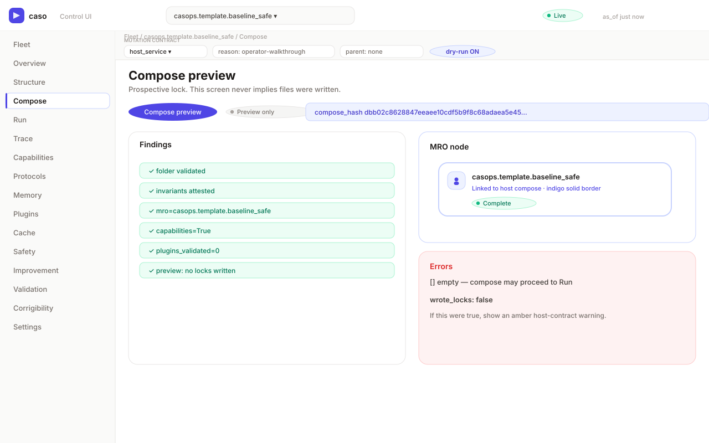

**Layout.**

- Findings as a checklist (emerald check / red X).
- `compose_hash` in `CommonBadge` / mono.
- `wrote_locks` MUST render as a badge: `false` → outlined stone “Preview only”; if ever `true`, amber warning (host bug relative to v1 contract).
- Errors list in red-50 card.
- Optional DAG of MRO (canvas node recipe, indigo solid).

**API.** `POST …/compose-preview` (mutation headers).

**Action.** Primary **Compose preview**. Disable when actor strip invalid or projection stale.

### 6.5 Run (`/agents/:id/run`)

**Purpose.** Execute `baseline_safe` and show the DAG.

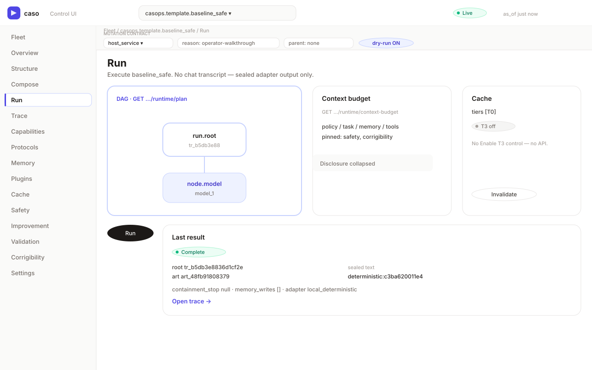

**Layout.**

- DAG from `GET …/runtime/plan` (canvas nodes; model node indigo).
- Context budget JSON in a disclosure (`GET …/runtime/context-budget`).
- Cache stats (`GET …/cache/stats`): tiers, `t3_enabled` (if false, stone badge “T3 off”).
- **Invalidate cache** outlined button → `POST …/cache/invalidate`.
- Primary **Run** → `POST …/runtime/run`.
- Result card: `root_trace_id`, `artifact.id`, `containment_stop`, `memory_writes`, `adapter`, `cancelled`. Link **Open trace**.

**Honesty.** Template has no streaming tokens. Do not draw a fake chat transcript. Show the sealed `text`/`digest` from the run JSON only.

### 6.6 Trace (`/agents/:id/traces/:tid` and `/traces/:tid`)

**Purpose.** Inspect, replay, counterfactual, evidence (OpenClaw session detail, without chat).

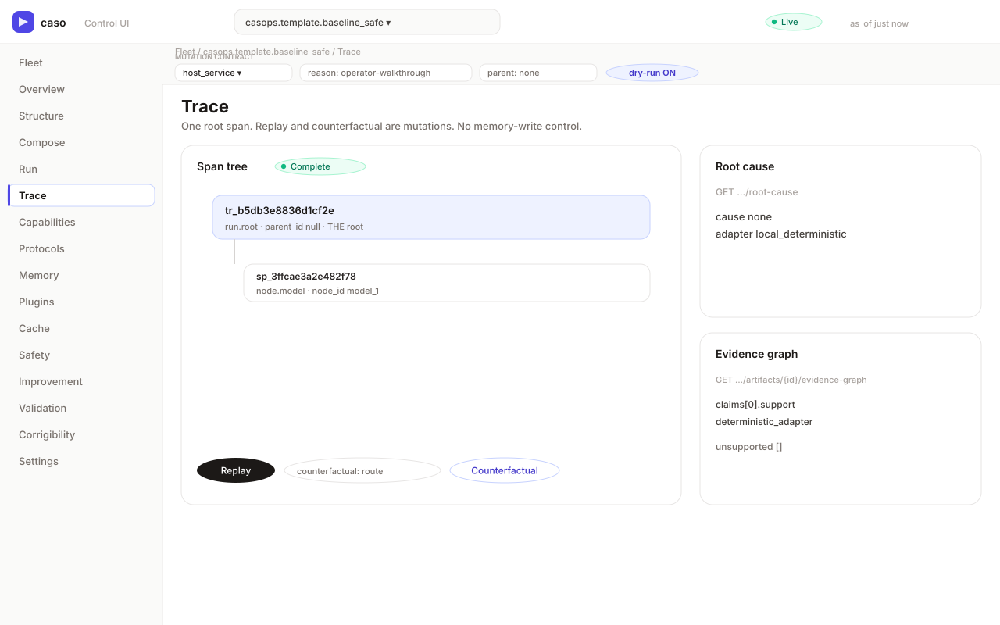

**Layout.**

- Span tree (one root). Root pill `complete` / `failed`.
- Replay: **Replay** (`POST …/replay`), **Counterfactual** opens a field for `counterfactual=` then POST.
- Root-cause panel: `GET …/root-cause`.
- Evidence: `GET …/artifacts/{aid}/evidence-graph` when artifact id is known (from run result or evidence payload).

**API.** As in §3.2. Replay is a mutation (headers required). Counterfactual must not offer a “write memory” control.

### 6.7 Capabilities (`/agents/:id/capabilities`)

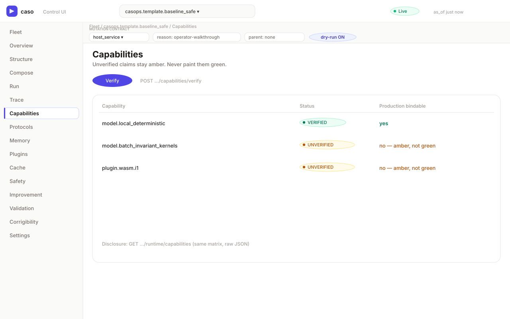

**Layout.** Matrix table: capability, status (`VERIFIED` → emerald badge). **Verify** → `POST …/capabilities/verify`. Also show `GET …/runtime/capabilities` in a disclosure.

Unverified production-bindable claims: amber, not green.

### 6.8 Protocols (`/agents/:id/protocols`)

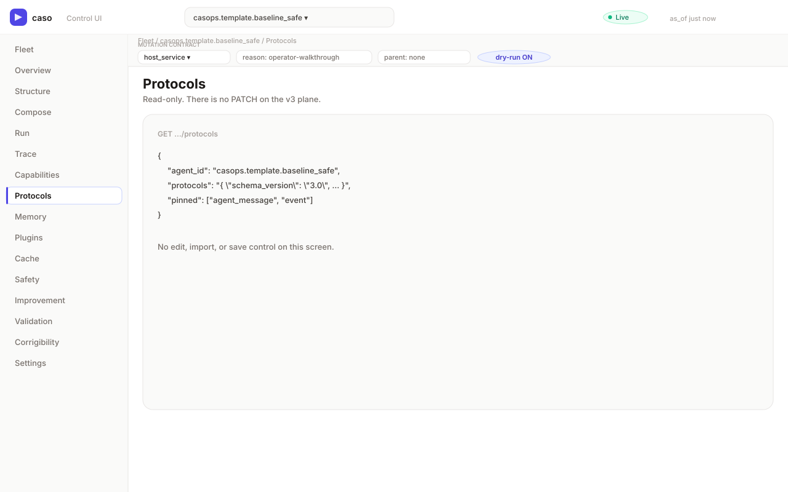

Read-only JSON from `GET …/protocols`. Mono well. No edit (no PATCH in v3).

### 6.9 Memory (`/agents/:id/memory`)

**Purpose.** Scoped memory ops (Hermes Memory tab, with CASOPS isolation).

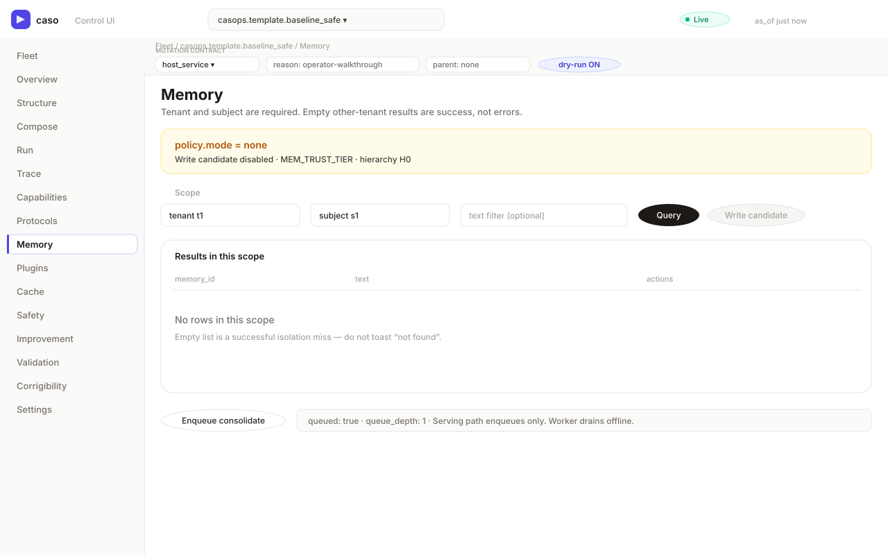

**Layout.**

- Policy + hierarchy header. If `mode` is `none` / `disabled`, **Write candidate** is disabled with tooltip `MEM_TRUST_TIER`.
- Scope bar: **tenant** and **subject** inputs (required). Persist last pair per agent in session.
- Search: `POST …/query?tenant=&subject=` (optional text).
- Results table: `memory_id`, text excerpt. Actions: **Delete**, **Verify deletion**.
- Delete/verify send the same tenant+subject. Wrong scope → banner `MEM_SCOPE`, do not toast “not found”.
- Cross-tenant query returning `[]` is a **successful empty** state (“No rows in this scope”), not an error.
- **Enqueue consolidate** → `POST …/consolidate`. Show `queued` and `queue_depth`. Copy: “Serving path enqueues only. The consolidation worker drains offline.”

### 6.10 Plugins (`/agents/:id/plugins`)

**Purpose.** Validate without exec.

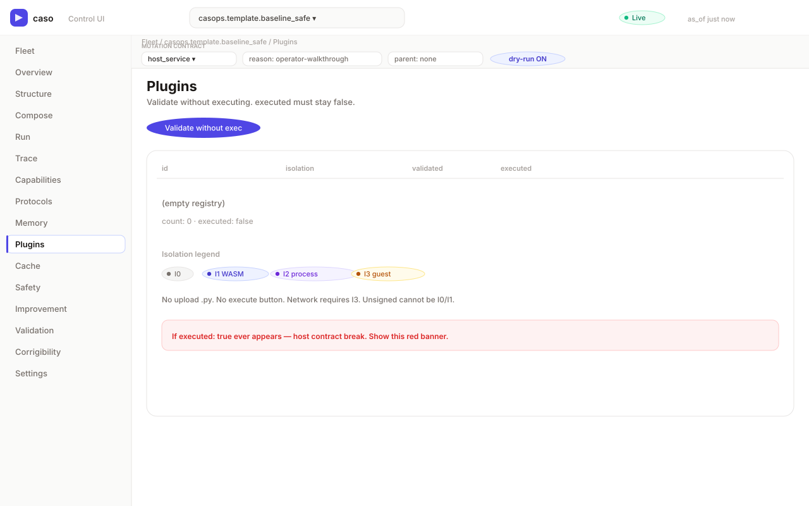

**Layout.** Table of plugins (`id`, isolation, `validated`, `executed` must display `false`). **Validate** → `POST …/plugins/validate`.

If `executed: true` ever appears, red banner (host contract break).

Isolation badges: I0 stone, I1 indigo, I2 violet, I3 amber. Tooltip: I3 needs sandbox; network requires I3; unsigned cannot be I0/I1.

No “upload .py plugin” control. No execute button in v1 (no execute route on the public plane except as part of a run DAG).

### 6.11 Cache (`/agents/:id/cache`)

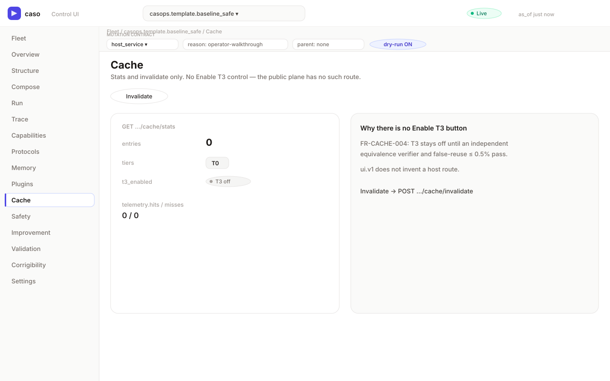

May be a panel on Run or its own tab. Stats JSON + **Invalidate**. If `t3_enabled` is false, do not show a fake “Enable T3” that has no `/api/v3` route.

### 6.12 Safety (`/agents/:id/safety`)

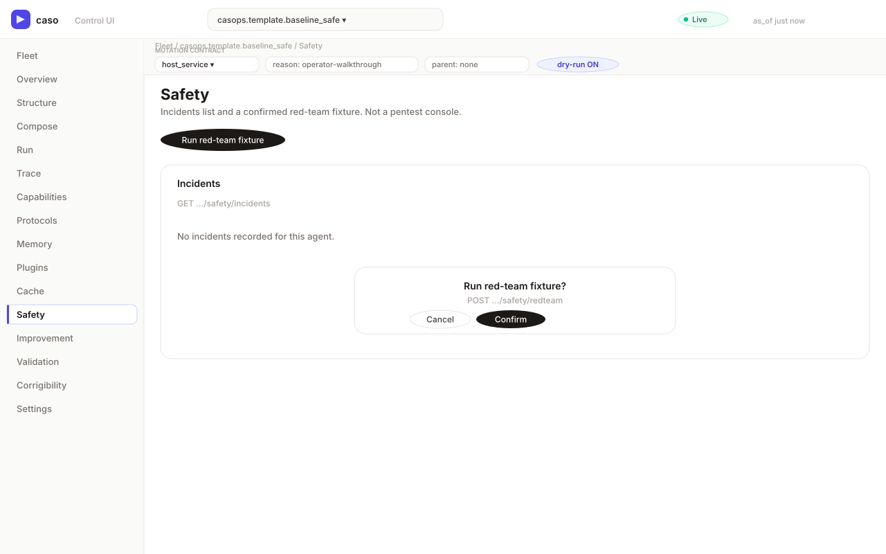

Incident list. **Run red-team fixture** → `POST …/redteam`. Confirm dialog (outlined cancel, stone-900 confirm).

### 6.13 Improvement (`/agents/:id/improvement`)

**Purpose.** OpenClaw-style human-in-the-loop, Hermes-style approvals — mapped to candidates/ledger.

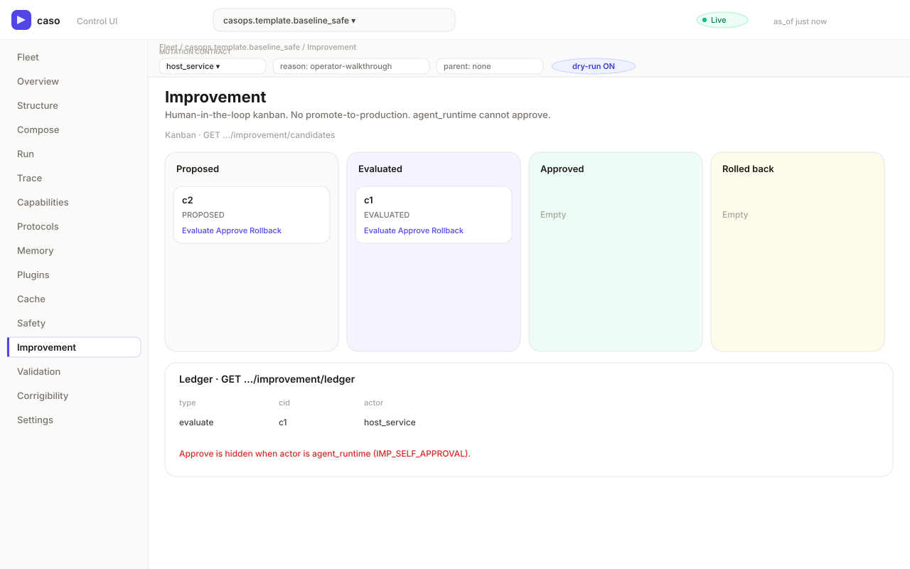

**Layout.** Kanban (stone-50 board):

| Column | Candidate `state` |
|---|---|
| Proposed | missing / `PROPOSED` |
| Evaluated | `EVALUATED` |
| Approved | `HUMAN_APPROVED` |
| Rolled back | after rollback action |

Cards: `id`, agent_id, state. Actions on the card:

- **Evaluate** → `POST …/candidates/{cid}/evaluate`
- **Approve** → only if actor is `independent_approver` or `host_service`; confirm modal restates actor + reason
- **Rollback** → version field + `POST …/rollback/{version}`

Ledger table below: `GET …/ledger`.

No “promote to production” button.

### 6.14 Validation (`/agents/:id/validation`)

**Purpose.** Honesty-first eval (IQ-01).

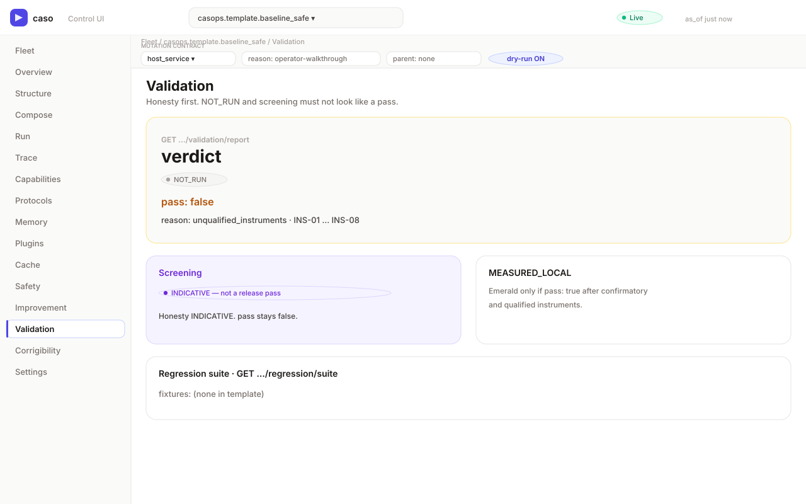

**Layout.**

- Report from `GET …/validation/report`.
- If `verdict` is `NOT_RUN` or `pass` is false: large stone/amber panel, **not** a green check. Show `reason` and instrument list.
- `INDICATIVE` screening: violet pill “Screening — not a release pass”.
- `MEASURED_LOCAL`: emerald only if `pass: true`.
- Regression suite names: `GET …/regression/suite`.

Do not embed `casops-eval` CLI. Optional: link to `user_guide.v1.md` §13.

### 6.15 Corrigibility (`/agents/:id/corrigibility`)

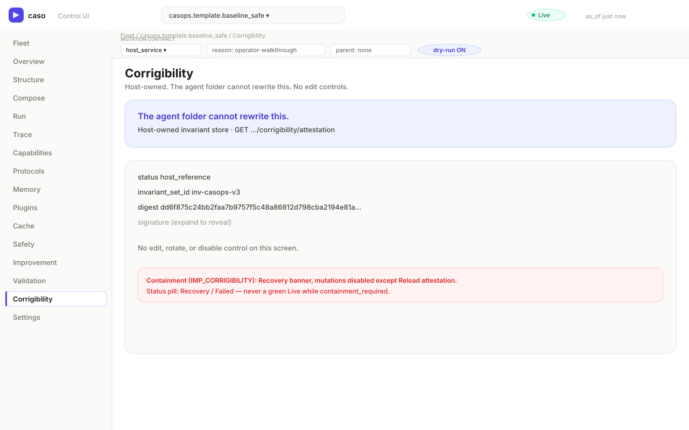

Attestation JSON: digest, signature, status, invariant_set_id. Mono. Host-owned callout: “The agent folder cannot rewrite this.” No edit controls.

### 6.16 Settings (`/settings`)

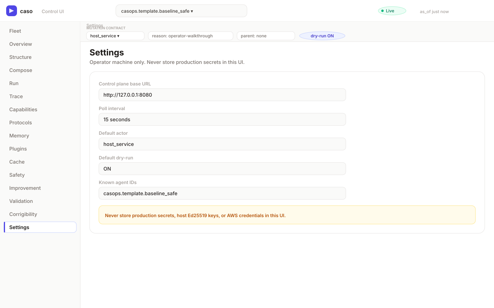

- Control plane base URL
- Poll interval
- Default actor / dry-run
- Known agent IDs (until list API exists)
- “Never store production secrets in this UI” note

---

## 7. Cross-cutting behavior

### 7.1 Client

- TypeScript SPA is preferred (matches Hermes web). Bundle from `ui/`.
- One API module: `ui/src/api/v3.ts` — injects mutation headers on POST/DELETE.
- No raw `fetch` from random components without that module.
- Timeouts: 30s default; run/compose 120s.

### 7.2 Freshness

- `as_of` timestamp on every loaded panel (style file: `text-sm text-stone-500`).
- After a mutation, re-GET the panels that mutation affects (do not trust the POST body alone when a GET exists).
- SSE is **not** in v3. Do not fake a live token stream. Polling is honest.

### 7.3 Dry-run

Default ON. Compose-preview already writes no locks. Run still executes the deterministic adapter; the UI label must not say “no side effects” for Run. Memory delete in dry-run: if the host still tombstones, the UI must show the real result (do not hide `tombstoned: true`).

### 7.4 Accessibility

- Status never color-only (style system).
- Buttons have visible focus rings.
- Actor strip fields are labelled.
- Keyboard: skip to main, agent switcher typeahead.
- Contrast: stone-900 on white; do not use indigo-50 text on white for primary copy.

### 7.5 Responsive

- `< md`: left nav becomes a top drawer; actor strip stacks; cards one column (style file `grid-cols-1 sm:grid-cols-2 lg:grid-cols-3`).

### 7.6 Security

- UI is an operator tool on localhost by default.
- Do not put host Ed25519 keys in the browser.
- Do not display full signatures as copy-paste secrets in screenshots; allow expand-to-reveal.
- CSP: prefer same-origin API; no random third-party analytics.

---

## 8. Coverage matrix (complete management)

A UI implementation is **complete for v1** only if every row is true.

| Capability | Screen | API | Done when |
|---|---|---|---|
| List / open agents | Fleet | list companion or known IDs + structure | Operator can open every loaded agent |
| See folder contract | Structure | GET structure, resolved | MRO + hashes visible |
| Compose without writing locks | Compose | POST compose-preview | `wrote_locks` shown false |
| Run baseline_safe | Run | POST runtime/run | One root trace displayed |
| Inspect / replay traces | Trace | GET/POST traces, evidence | Counterfactual query exposed |
| Capabilities | Capabilities | GET matrix, POST verify | Unverified not green |
| Protocols | Protocols | GET protocols | Read-only |
| Memory lifecycle | Memory | query/write/delete/verify/consolidate | Scope required; policy `none` disables write |
| Plugins validate | Plugins | GET plugins, POST validate | `executed: false` shown |
| Cache | Cache / Run | GET stats, POST invalidate | T3-off visible |
| Safety | Safety | GET incidents, POST redteam | Confirm before redteam |
| Improvement | Improvement | candidates/evaluate/approve/rollback/ledger | agent_runtime cannot approve |
| Validation honesty | Validation | GET report, regression | NOT_RUN not rendered as pass |
| Corrigibility | Overview + tab | GET attestation | Containment banner |
| Mutation contract | Shell | headers | Unsigned POST never looks successful |
| Style | all | — | `spec/common-style.html` tokens only |
| Source | all | — | files under `ui/` only |

---

## 9. Implementation notes for `ui/`

Suggested tree (normative location, informative names):

```text
ui/
  README.md
  package.json                 # or equivalent; UI build lives here
  src/
    main.tsx
    styles/
      tokens.css               # extracted from spec/common-style.html
    components/
      StatusPill.tsx
      CommonBadge.tsx
      ActorStrip.tsx
      AgentCard.tsx
      RecoveryBanner.tsx
    api/
      v3.ts                    # all /api/v3 calls
      types.ts
    pages/
      Fleet.tsx
      AgentOverview.tsx
      ...
    shell/
      AppShell.tsx
  tests/
    api-contract.test.ts       # every SPEC_V3 path has a client function
    mutation-headers.test.ts
```

Build output may be `ui/dist/` (generated, not hand-edited).

Python host does not serve the UI in v1 unless a later change adds a static mount. Running the UI is documented in `ui/README.md` (dev server + `VITE_CASOPS_BASE=http://127.0.0.1:8080` or equivalent).

---

## 10. Out of scope for ui.v1

- Chat / completions / streaming tokens
- Creating agent folders on disk from the browser (no create-agent API)
- Editing `agent_spec.json` files in place (no PATCH folder API)
- Enabling T3 without a host route
- L5 promote-to-production
- Firecracker console
- Citation auditor UI (CLI remains `casops-citation`; optional later)
- Instrument qualification UI (no public qualify route on §19)
- Dark theme
- Multiplayer / SSO (localhost operator)

---

## 11. Acceptance

ui.v1 is accepted when:

1. All UI source is under `ui/`.
2. Visual language matches `spec/common-style.html` (light stone, indigo common, status pills with text+dot+color).
3. Every §3.2 route is reachable from a labelled control (no dead API).
4. Mutation headers are impossible to omit from the client module.
5. `NOT_RUN` / screening cannot be styled as a green pass.
6. Template walkthrough from `user_guide.v1.md` §§6–11 can be performed entirely in the UI.

**End of `spec/ui.v1.md`.**
