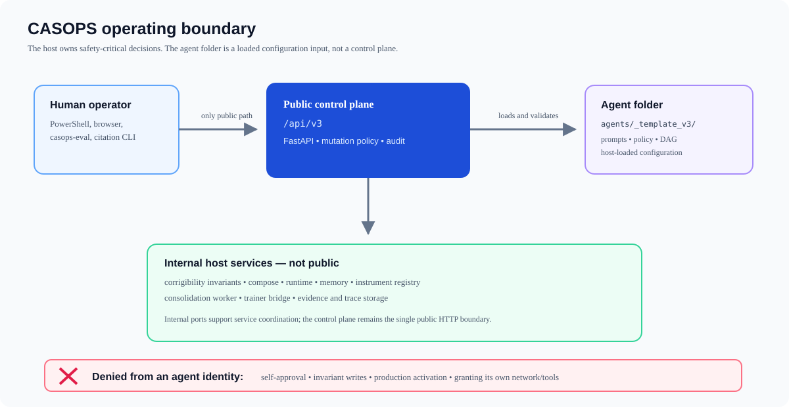
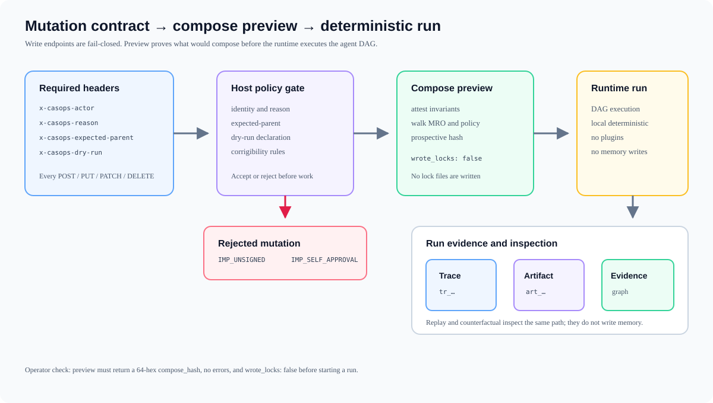
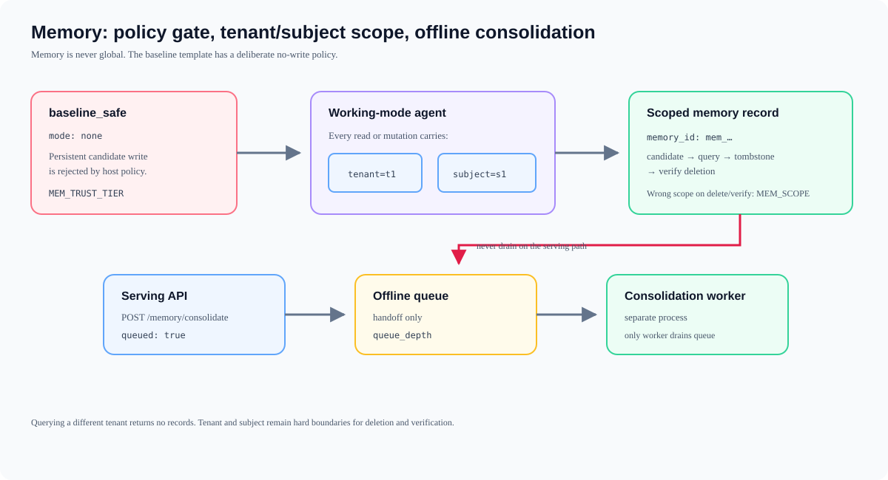
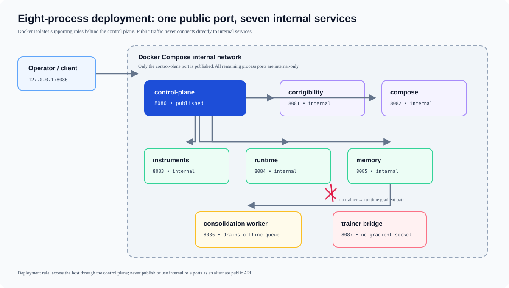

# CASOPS user guide v1

Step-by-step operator guide for the CASOPS host in this repository.

This is the host that **runs** agents. The first agent you can use is the template `casops.template.baseline_safe` in `agents/_template_v3/`.

| Item | Value |
|---|---|
| Structure | `casops.common_agent.v3` / schema `3.0` |
| Public HTTP | `/api/v3` only (FastAPI) |
| Template agent | `casops.template.baseline_safe` |
| First profile | `baseline_safe` (local deterministic model, no memory writes, no plugins) |
| Spec | `common_agent_structure.md` |
| Status | `implementation_status.md` |

**This host is not production-certified.** Do not turn on production activation, do not grant network/tools from an agent identity, and do not treat eval `NOT_RUN` as a pass.

---

## 0. What you are operating

Two layers:

1. **Host** (`src/casops/`, `services/`) — invariants, compose, runtime, memory, eval, isolation. You operate this.
2. **Agent folder** (`agents/_template_v3/`) — prompts, policy JSON, DAG. The host loads this. The agent **cannot** approve itself, write invariants, or turn on production.

You talk to the host through:

- the **control plane** HTTP API (`/api/v3`)
- two CLIs: `casops-eval`, `casops-citation`
- optional **internal** service ports (not public)

The only public plane is the control plane.



---

## 1. Prerequisites

- Windows, PowerShell (this guide uses PowerShell)
- Python **3.12 or newer** (`python --version`)
- Git is optional
- Docker is optional (only for the eight-process compose file)
- Network is required only for the citation auditor (arXiv / docs sites)

Check Python:

```powershell
python --version
```

Work from the repo root:

```powershell
cd C:\Project\common-agent-structure
```

---

## 2. Install the host

Create a venv (recommended):

```powershell
python -m venv .venv
.\.venv\Scripts\Activate.ps1
python -m pip install -U pip
```

Install the library plus test and API extras (FastAPI, uvicorn, pytest, wasmtime):

```powershell
python -m pip install -e ".[dev,api]"
```

Confirm the package imports:

```powershell
$env:PYTHONPATH = "src"
python -c "import casops; print(casops.__version__)"
```

You should see `0.1.0`.

---

## 3. Prove the host works (do this first)

From the repo root:

```powershell
$env:PYTHONPATH = "src"
python -m pytest tests -q
```

Expect exit code **0** and a full green suite.

If this fails, stop. Do not start HTTP services against a broken install.

---

## 4. Start the control plane (the way you use the agent)

The control plane is the public API. It loads agent folders from `agents/`.

```powershell
cd C:\Project\common-agent-structure
$env:PYTHONPATH = "src"
$env:CASOPS_AGENTS_ROOT = "agents"
python -m uvicorn casops.api.control:create_app_from_env --factory --host 127.0.0.1 --port 8080
```

Leave that window open. In a **second** PowerShell:

```powershell
curl.exe http://127.0.0.1:8080/health
```

Expect:

```json
{"status":"ok","service":"control-plane"}
```

OpenAPI (browser or curl):

```text
http://127.0.0.1:8080/openapi.json
http://127.0.0.1:8080/docs
```

Public paths are only under `/api/v3`. `/health` exists but is not part of the public v3 contract.

Stop the server later with `Ctrl+C`.

---

## 5. Learn the mutation contract (required for every write)

Every **POST / PUT / PATCH / DELETE** under `/api/v3` needs four headers. Missing any of them is **not** HTTP 200 (`IMP_UNSIGNED`).

| Header | Example | Meaning |
|---|---|---|
| `x-casops-actor` | `host_service` | Who is acting. Allowed values: `human_operator`, `independent_approver`, `host_service`, `agent_runtime`, `plugin`, `peer_agent` |
| `x-casops-reason` | `operator-walkthrough` | Why |
| `x-casops-expected-parent` | `none` | Expected parent version (`none` for the first walkthrough) |
| `x-casops-dry-run` | `true` | Dry-run flag (still required; use `true` until you mean it) |

PowerShell helper you can reuse for the rest of this guide:

```powershell
$base = "http://127.0.0.1:8080"
$agent = "casops.template.baseline_safe"
$H = @{
  "x-casops-actor"           = "host_service"
  "x-casops-reason"          = "operator-walkthrough"
  "x-casops-expected-parent" = "none"
  "x-casops-dry-run"         = "true"
}
```

**GET** requests do not need those headers.

**Never** set `x-casops-actor` to `agent_runtime` for approve or invariant writes. That is `IMP_SELF_APPROVAL`.

---

## 6. Inspect the template agent

The folder is `agents/_template_v3/`. The **id** you pass on the URL is `casops.template.baseline_safe` (from `agent_spec.json`), not the folder name.

### 6.1 Structure

```powershell
Invoke-RestMethod "$base/api/v3/agents/$agent/structure" | ConvertTo-Json -Depth 6
```

You should see `structure_id` = `casops.common_agent.v3` and `schema_version` = `3.0`.

### 6.2 Resolved composition

```powershell
Invoke-RestMethod "$base/api/v3/agents/$agent/resolved" | ConvertTo-Json -Depth 8
```

### 6.3 Corrigibility attestation (host-owned)

```powershell
Invoke-RestMethod "$base/api/v3/agents/$agent/corrigibility/attestation" | ConvertTo-Json -Depth 6
```

The host owns invariants. The agent folder cannot rewrite them.

### 6.4 Capabilities

```powershell
Invoke-RestMethod "$base/api/v3/agents/$agent/capabilities/matrix" | ConvertTo-Json -Depth 8
Invoke-RestMethod -Method POST -Headers $H "$base/api/v3/agents/$agent/capabilities/verify" | ConvertTo-Json -Depth 8
```

The template binds `model.local_deterministic`.

---

## 7. Compose-preview (always before a run)

Compose-preview attests invariants, walks MRO, merges policy, and returns a **prospective lock**. It must **not** write lock files.



```powershell
Invoke-RestMethod -Method POST -Headers $H "$base/api/v3/agents/$agent/compose-preview" | ConvertTo-Json -Depth 12
```

Check:

- HTTP 200
- `compose_hash` is 64 hex characters
- `wrote_locks` is `false`
- `errors` is empty
- `findings` mentions folder validated and invariants attested

If you omit the four headers:

```powershell
curl.exe -i -X POST "$base/api/v3/agents/$agent/compose-preview"
```

Expect a non-200 body with `IMP_UNSIGNED`.

---

## 8. Run the agent (`baseline_safe`)

This executes the DAG in `agents/_template_v3/runtime/execution.json` with the **local deterministic adapter**. No external LLM. No plugins. No memory writes.

```powershell
$run = Invoke-RestMethod -Method POST -Headers $H "$base/api/v3/agents/$agent/runtime/run"
$run | ConvertTo-Json -Depth 10
```

Record:

- `root_trace_id` (starts with `tr_`)
- `artifact.id` (starts with `art_`)
- `containment_stop` should be `null`
- `memory_writes` should be `[]`
- `adapter` should be `local_deterministic`
- the trace should have **one root span** (`parent_id` = `null`)

Fetch the trace and artifact:

```powershell
$tid = $run.root_trace_id
$aid = $run.artifact.id
Invoke-RestMethod "$base/api/v3/traces/$tid" | ConvertTo-Json -Depth 10
Invoke-RestMethod -Method POST -Headers $H "$base/api/v3/traces/${tid}/replay" | ConvertTo-Json -Depth 8
Invoke-RestMethod -Method POST -Headers $H "$base/api/v3/traces/${tid}/replay?counterfactual=route" | ConvertTo-Json -Depth 8
Invoke-RestMethod "$base/api/v3/traces/$tid/root-cause" | ConvertTo-Json
Invoke-RestMethod "$base/api/v3/artifacts/$aid/evidence-graph" | ConvertTo-Json -Depth 8
```

Replay must not write memory. Counterfactual is the **same path** with `?counterfactual=`.

Runtime plan / context / cache (read-only except invalidate):

```powershell
Invoke-RestMethod "$base/api/v3/agents/$agent/runtime/plan"
Invoke-RestMethod "$base/api/v3/agents/$agent/runtime/context-budget"
Invoke-RestMethod "$base/api/v3/agents/$agent/cache/stats" | ConvertTo-Json -Depth 6
Invoke-RestMethod -Method POST -Headers $H "$base/api/v3/agents/$agent/cache/invalidate" | ConvertTo-Json
```

Template cache is **T0 only**. T3 exists in the host but stays **off** until an independent equivalence verifier and false-reuse harness (≤ 0.5%) pass. Do not treat T3 as on.

---

## 9. Memory (template forbids writes)

The template policy is `mode: none` — persistent memory writes are forbidden (`MEM_TRUST_TIER`).



Read policy:

```powershell
Invoke-RestMethod "$base/api/v3/agents/$agent/memory/policy"
Invoke-RestMethod "$base/api/v3/agents/$agent/memory/hierarchy"
```

A write on this agent **should fail**:

```powershell
try {
  Invoke-RestMethod -Method POST -Headers $H `
    "$base/api/v3/agents/$agent/memory/write-candidate?tenant=t1&subject=s1&text=hello"
} catch {
  $_.ErrorDetails.Message
}
```

Query is scoped by `tenant` + `subject`. Other tenants are not returned (they are not an error on query; you get an empty list). Delete/verify of another tenant’s id is `MEM_SCOPE`.

If you later use an agent whose `memory/policy.json` allows `working` mode:

```powershell
# 1) write
$w = Invoke-RestMethod -Method POST -Headers $H `
  "$base/api/v3/agents/<other-id>/memory/write-candidate?tenant=t1&subject=s1&text=secret"
# 2) query (same tenant+subject)
Invoke-RestMethod -Method POST -Headers $H `
  "$base/api/v3/agents/<other-id>/memory/query?tenant=t1&subject=s1"
# 3) delete (tenant+subject required)
Invoke-RestMethod -Method DELETE -Headers $H `
  "$base/api/v3/agents/<other-id>/memory/$($w.memory_id)?tenant=t1&subject=s1"
# 4) verify deletion
Invoke-RestMethod -Method POST -Headers $H `
  "$base/api/v3/agents/<other-id>/memory/$($w.memory_id)/verify-deletion?tenant=t1&subject=s1"
```

**Consolidate** only **enqueues**. It does not drain on the serving path:

```powershell
Invoke-RestMethod -Method POST -Headers $H "$base/api/v3/agents/$agent/memory/consolidate"
```

Expect `queued: true` and a `queue_depth`. The consolidation **worker** is a separate process (see §16).

---

## 10. Plugins (validate without executing)

The template registry is empty. Validation must not import or run plugin code.

```powershell
Invoke-RestMethod "$base/api/v3/agents/$agent/plugins" | ConvertTo-Json -Depth 6
Invoke-RestMethod -Method POST -Headers $H "$base/api/v3/agents/$agent/plugins/validate" | ConvertTo-Json -Depth 6
```

Rules you must follow if you add a plugin later:

| Rule | What happens |
|---|---|
| Manifest path with `..` or absolute path | `PLG_MANIFEST_INVALID` |
| I1/I2/I3 are real sandboxes | no silent downgrade |
| Third-party / unsigned | cannot run below **I2** |
| `permissions.network: true` | **I3 only** |
| I1 | Wasmtime, no WASI filesystem/network |
| I2 | separate process, no ambient network, no production secrets in env |
| I3 | isolated guest: no host FS; egress only through an allow-listed proxy |

Do not put `.py` / `.dll` / `.exe` behind a `manifest` pointer that the validator would read as code.

---

## 11. Safety, improvement, validation

```powershell
Invoke-RestMethod "$base/api/v3/agents/$agent/safety/incidents" | ConvertTo-Json -Depth 6
Invoke-RestMethod -Method POST -Headers $H "$base/api/v3/agents/$agent/safety/redteam" | ConvertTo-Json
Invoke-RestMethod "$base/api/v3/agents/$agent/improvement/candidates" | ConvertTo-Json -Depth 6
Invoke-RestMethod "$base/api/v3/agents/$agent/improvement/ledger" | ConvertTo-Json -Depth 6
Invoke-RestMethod "$base/api/v3/agents/$agent/regression/suite" | ConvertTo-Json
Invoke-RestMethod "$base/api/v3/agents/$agent/validation/report" | ConvertTo-Json -Depth 8
```

Template improvement policy is **disabled**. Candidates may be proposed; only `independent_approver` (not `agent_runtime`) can approve:

```powershell
# this must fail
$bad = $H.Clone()
$bad["x-casops-actor"] = "agent_runtime"
try {
  Invoke-RestMethod -Method POST -Headers $bad `
    "$base/api/v3/agents/$agent/improvement/candidates/c1/approve"
} catch { $_.ErrorDetails.Message }
```

Expect `IMP_SELF_APPROVAL`.

Validation report with default instruments:

- `verdict`: `NOT_RUN`
- `pass`: `false`
- `reason`: `unqualified_instruments`

That is correct. Do not treat it as a green release.

---

## 12. Full `/api/v3` map (what you can call)

Replace `{id}` with `casops.template.baseline_safe`. POST/DELETE need the four headers.

| Method | Path | Typical use |
|---|---|---|
| GET | `/api/v3/agents/{id}/structure` | Folder + schema |
| GET | `/api/v3/agents/{id}/resolved` | Composed view |
| POST | `/api/v3/agents/{id}/compose-preview` | Prospective lock, no writes |
| GET | `/api/v3/agents/{id}/runtime/plan` | DAG JSON |
| GET | `/api/v3/agents/{id}/runtime/capabilities` | Verified capabilities |
| GET | `/api/v3/agents/{id}/capabilities/matrix` | Same matrix |
| POST | `/api/v3/agents/{id}/capabilities/verify` | Re-verify |
| GET | `/api/v3/agents/{id}/runtime/context-budget` | Context policy |
| GET | `/api/v3/agents/{id}/cache/stats` | Tiers / hits |
| POST | `/api/v3/agents/{id}/cache/invalidate` | Purge |
| GET | `/api/v3/agents/{id}/protocols` | Protocol pin |
| GET | `/api/v3/agents/{id}/plugins` | Registry validate |
| POST | `/api/v3/agents/{id}/plugins/validate` | Validate without exec |
| GET | `/api/v3/agents/{id}/memory/policy` | Memory mode |
| GET | `/api/v3/agents/{id}/memory/hierarchy` | Hierarchy |
| POST | `/api/v3/agents/{id}/memory/query?tenant=&subject=` | Scoped query |
| POST | `/api/v3/agents/{id}/memory/write-candidate?tenant=&subject=&text=` | Candidate write |
| POST | `/api/v3/agents/{id}/memory/consolidate` | Enqueue only |
| DELETE | `/api/v3/agents/{id}/memory/{memory_id}?tenant=&subject=` | Tombstone |
| POST | `/api/v3/agents/{id}/memory/{memory_id}/verify-deletion?tenant=&subject=` | Deletion probe |
| GET | `/api/v3/traces/{trace_id}` | Trace |
| POST | `/api/v3/traces/{trace_id}/replay` | Replay |
| POST | `/api/v3/traces/{trace_id}/replay?counterfactual=` | Counterfactual |
| GET | `/api/v3/traces/{trace_id}/root-cause` | RCA stub |
| GET | `/api/v3/artifacts/{id}/evidence-graph` | Evidence |
| GET | `/api/v3/agents/{id}/safety/incidents` | Incidents |
| POST | `/api/v3/agents/{id}/safety/redteam` | Red-team fixture |
| GET | `/api/v3/agents/{id}/improvement/candidates` | Candidates |
| POST | `/api/v3/agents/{id}/improvement/candidates/{cid}/evaluate` | Evaluate |
| POST | `/api/v3/agents/{id}/improvement/candidates/{cid}/approve` | Human/host approve |
| POST | `/api/v3/agents/{id}/improvement/rollback/{version}` | Rollback |
| GET | `/api/v3/agents/{id}/improvement/ledger` | Ledger |
| GET | `/api/v3/agents/{id}/regression/suite` | Fixtures |
| GET | `/api/v3/agents/{id}/corrigibility/attestation` | Host attestation |
| GET | `/api/v3/agents/{id}/validation/report` | Eval report |
| POST | `/api/v3/agents/{id}/runtime/run` | Execute `baseline_safe` |

Also: `GET /health` (not a v3 resource).

---

## 13. CLIs (eval and citation)

Keep `PYTHONPATH=src` if you did not install the console scripts on PATH.

### 13.1 Status (default — should not pass)

```powershell
$env:PYTHONPATH = "src"
python -m casops.eval
# or: casops-eval
```

Exit code **2**. JSON includes `pass: false` and `unqualified_instruments`.

### 13.2 Screening (never a release pass)

```powershell
python -m casops.eval run --tier screening --agent casops.template.baseline_safe
```

`honesty` / verdict is `INDICATIVE`. `pass` stays `false`.

### 13.3 Confirmatory (powered, still blocked if instruments are unqualified)

```powershell
python -m casops.eval run --tier confirmatory --agent casops.template.baseline_safe --citation docs/citation/citation-audit.json --out evals/reports/local/report.json
```

This runs the **deterministic adapter** at powered `n` (binary floor 400). It is `MEASURED_LOCAL` for that adapter only. If instruments are still `UNQUALIFIED`, the harness still reports `NOT_RUN` / `pass: false`.

Do not change the analysis plan after a confirmatory start (`VAL_PLAN_DRIFT`).

### 13.4 Citation audit

Needs network. Writes:

- `evals/reports/citation-audit/citation-audit.json`
- `docs/citation/citation-audit.json`

```powershell
python -m casops.citation --verified-by your-id
# or: casops-citation
```

Exit **0** only if `cleared=true`. Knowledge-only entries with no live source are **deleted**, not silently marked `[A]`. The Agent Lightning v1.0 SWE-bench numbers are `MEASURED_EXTERNAL` and must not be used as a host requirement.

---

## 14. Copy the template into your own agent

Do **not** edit the template in place if you want a second agent. Copy the folder:

```powershell
Copy-Item -Recurse agents\_template_v3 agents\my_agent
```

Then in `agents/my_agent/agent_spec.json` set a **new** `agent_id`, for example `casops.local.my_agent`. Restart the control plane (it reads folders at process start).

Call APIs with the **new id**:

```text
/api/v3/agents/casops.local.my_agent/structure
```

Keep, unless you have a host change-control process:

- `production_activation_requested`: `false`
- `allowed_tools` / `allowed_plugins`: `[]`
- `model_policy.network_access`: `false`
- memory `mode`: `none` until you really want writes
- improvement `mode`: `disabled` or propose-only
- do not grant I1–I3 plugins until you understand §10

The host will still refuse: silent production activation, agent self-approval, invariant writes from the agent, tools/plugins inherited from parents.

---

## 15. L5 research isolation (not a normal feature)

L5 (core source rewrite) is **research-only**. There is **no** production HTTP path that promotes L5 into the serving agent.

Use it only from Python, in a separate directory, with **no** production keys in the process environment:

```python
from pathlib import Path
from casops.auth.actors import ActorClass
from casops.corrigibility.signing import HostSigner
from casops.improvement.l5 import ResearchIsolation

root = Path(r"C:\temp\casops-research")
box = ResearchIsolation(
    root=root,
    signer=HostSigner.generate(),
    approved_repos=(root / "writable",),
    production_root=Path(r"C:\Project\common-agent-structure"),
)
# agent_runtime is denied
record = box.mutate("notes.txt", b"draft", actor=ActorClass.independent_approver)
box.rollback(record, actor=ActorClass.independent_approver)
# this always fails:
# box.promote_to_production(actor=ActorClass.independent_approver)
```

If `AWS_*`, `CASOPS_HOST_KEY`, or `OPENAI_API_KEY` are in a production-profile environment, L5 must not see them.

---

## 16. Optional: eight-process Docker deploy

Public traffic binds **only** to control-plane port **8080**. Other services are internal.



From the repo root (Docker Desktop running):

```powershell
docker compose -f deploy/dev/docker-compose.yml up --build
```

Then:

```powershell
curl.exe http://127.0.0.1:8080/health
```

Internal roles (not published as the public plane):

| Service | Typical internal port |
|---|---|
| control-plane | 8080 (published) |
| corrigibility-invariant-service | 8081 |
| compose-service | 8082 |
| instrument-registry-service | 8083 |
| runtime-service | 8084 |
| memory-service | 8085 |
| consolidation-worker | 8086 |
| trainer-bridge | 8087 |

Trainer-bridge has **no** gradient socket into runtime. Consolidation-worker is the only place the offline queue is drained.

---

## 17. Errors you will actually see

Catalogue: `errors/catalogue.json` (93 codes). HTTP body shape:

```json
{
  "error": {
    "code": "IMP_UNSIGNED",
    "message": "The request was rejected by host policy.",
    "containment_required": false
  }
}
```

| Code | When |
|---|---|
| `IMP_UNSIGNED` | Missing mutation headers |
| `IMP_SELF_APPROVAL` | `agent_runtime` tries to approve |
| `INH_PARENT_MISSING` | Unknown `agent_id` |
| `MEM_TRUST_TIER` | Memory write while policy is `none` |
| `MEM_SCOPE` | Delete/verify with the wrong tenant/subject |
| `PLG_MANIFEST_INVALID` | Path escape or bad manifest |
| `PLG_ISOLATION_TIER` | Tier too weak / sandbox missing |
| `IMP_CORRIGIBILITY` | Invariant mismatch / tamper (containment) |
| `CIT_UNVERIFIED` | Eval/release blocked on citation |
| `VAL_PLAN_DRIFT` | Analysis plan changed after confirmatory start |
| `IMP_STAT_UNDERPOWERED` | Confirmatory `n` too small |
| `CACHE_SEMANTIC_REUSE` | T3 false-reuse too high or T3 used while disabled |
| `PERF_CACHE_SCOPE` | Cache crossed tenant/agent/subject |

---

## 18. Suggested first-day checklist

Do these in order. Do not skip 3 or 7.

1. Install `.[dev,api]` (§2)
2. `python -m pytest tests -q` green (§3)
3. Start uvicorn control plane (§4)
4. `GET /health` and `GET /api/v3/agents/casops.template.baseline_safe/structure` (§6)
5. Set the four mutation headers (§5)
6. `POST …/compose-preview` — hash present, `wrote_locks: false` (§7)
7. `POST …/runtime/run` — one root trace, no memory writes (§8)
8. Fetch the trace and evidence graph (§8)
9. Confirm memory write on the template fails (§9)
10. `python -m casops.eval` → `NOT_RUN` / `pass: false` (§13)
11. Read `implementation_status.md` so you do not confuse “host implemented” with “production certified”

---

## 19. What you must not do

- Do not call anything except `/api/v3` as the public control plane
- Do not use `agent_runtime` as the actor for approve / invariant writes
- Do not treat screening or `NOT_RUN` as a release pass
- Do not enable T3 because “the code exists”
- Do not run I3 plugins without an isolated sandbox root
- Do not put production credentials in an L5 research process
- Do not inherit tools, plugins, or network from parent folders
- Do not backdate citation audits
- Do not represent Agent Lightning SWE-bench numbers as CASOPS local results
- Do not set `production_activation_requested` to true as a walkthrough step

---

## 20. Where to read next

| File | Why |
|---|---|
| `implementation_status.md` | What is shipped vs not certified |
| `common_agent_structure.md` | Normative spec |
| `implementation_plan.md` | Why the eight services exist |
| `agents/_template_v3/` | The folder the host actually loads |
| `errors/catalogue.json` | Error codes |
| `docs/adr/` | Defaults (isolation, handles, cache) |
| `deploy/dev/docker-compose.yml` | Process isolation for deploy |

End of user guide v1.
